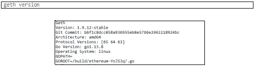
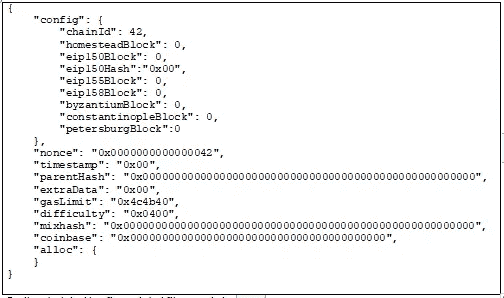
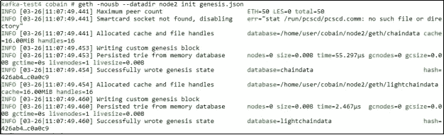
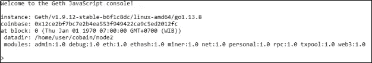

# 以太网(上)

> 原文：<https://medium.com/coinmonks/ethereum-network-part-1-4dcebec6850c?source=collection_archive---------5----------------------->

## **以太坊节点**

thereum 是一个基于区块链技术的分散式开源软件。分散的意思是以太坊运行在一个由分布在几个地方的节点集合组成的网络上。以太坊可以看做是几层的集合，其中第一层是以太坊区块链，第二层是 solidity 智能合约，第三层是 [DApps](https://blog.coincodecap.com/what-are-dapps-an-ultimate-guide/) 。

[以太坊网络或以太坊区块链](https://blog.coincodecap.com/tag/ethereum/)是分布式节点的集合。每个节点具有确认交易的存在并将交易记录在排列成链的块中的功能。要使服务器/机器属于以太网上的一个节点，它需要在机器上有一个 CLI(命令行界面)客户端。本例中使用的 CLI 客户端是 Geth (Go Ethereum)，这是一个基于 Go 语言的软件，具有社区认可的规范，可以在 Ethereum 网络上运行节点。

# 节点创建

节点在以太网中有着重要的作用。制作节点是通过 Geth 完成的，要安装 Geth，请在 linux 命令提示符窗口中运行以下命令。

```
sudo add-apt-repository -y ppa:ethereum/ethereum
sudo apt-get update
sudo apt-get install -y ethereum
```



Check Geth Version

以太坊区块链是一个基于交易的状态机。要在以太坊做链条，需要创世块。Genesis 块是通过初始化使用 genesis.json 配置创建的，该配置控制链的创建方式。Block genesis 在链中称为 block 0。

要创建一个单独的区块链网络(私有区块链),需要拥有两个主要组件，即:

**网络 ID**

**创世纪文件**

想要加入区块链的其他节点/客户端需要具有相同的文件起源和网络 ID。



genesis.json

以下是 genesis.json 文件的配置描述:

***配置*** :有一个链 ID 配置，显示链的 ID，必须是唯一的。

***Nonce*** : 64 位 hash，与 mixHash 一起使用，证明在挖掘过程中进行了多次计算。

***时间戳*** :块开始时的 Unix 时间值。

***括号*** :父块头的 Hash。父散列起源文件的值为 0x00，但是在有高级块之后，父散列是 parentHeader、nonce 和 mixHash 的组合。

***ExtraData*** :与块相关的额外数据。

***【gas limit】***:每笔大宗交易可使用的气值限额。

***难度*** :应用于验证一个方块的难度级别。难度越高，就越难找到 nonce，因此块验证的时间就越长。

***MixHash*** : 256 位 Hash，与 nonce 一起使用，证明在挖掘过程中进行了多次计算。

*:160 位地址，为挖掘后将得到以太的账户*

**:定义已有账户和余额(预定义钱包)**

**接下来，我们将使用以下命令启动链创建**

```
**geth -nousb --datadir node2 init genesis.json**
```

****

**Chain initiation**

**要进入控制台节点，请运行以下命令**

```
**geth -nousb --datadir node2 --networkid 42 console**
```

****

**Console node geth**

**下一部分将描述以太坊账户的创建、挖掘过程、互连节点和交易。**

> **[直接在您的收件箱中获得最佳软件交易](https://coincodecap.com/?utm_source=coinmonks)**

**[](https://coincodecap.com/?utm_source=coinmonks)****[](https://coincodecap.com)**