# 以太网(下)

> 原文：<https://medium.com/coinmonks/ethereum-network-part2-225dc66fb1b0?source=collection_archive---------1----------------------->

## 帐户、挖掘和交易

你可以在这里阅读第一部分。

# 账户

在[以太坊网络](https://blog.coincodecap.com/tag/ethereum/)上有两种类型的账户，即外部拥有账户(EOA)和智能合约账户。在这一部分，我们将集中讨论 EOA。为了能够进行事务处理，我们需要一个连接到节点的 EOA。帐户可以在初始化 geth 之前创建，也可以在 geth 控制台中创建。在创建链之前，通过在 genesis 文件中的 alloc 中输入公共帐户的地址并初始化帐户余额，可以在控制台节点上直接使用开始时创建的帐户。一个节点可以连接到多个帐户。

通过 geth 命令创建帐户

```
geth --datadir node2 account new
```

Datadir 是一个目录选项，您将使用它来保存链中的数据。如果您没有定义目录，默认情况下它会保存在您的根目录下。

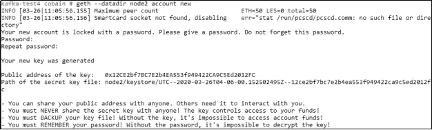

Output when creating account

通过 geth 控制台创建帐户

```
personal.newAccount()
```

创建帐户时，会要求您输入密码/释义。Paraphrase 用于加密服务器上的私钥帐户。解密私钥时也使用释义。帐户的公共地址和加密的私有密钥将存储在元掩码文件中，该文件是在定义的数据库中自动创建的。

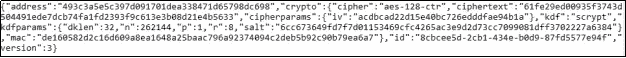

Metamask of account

进行交易时，控制台上的用户需要通过使用以下命令解锁帐户来获得帐户访问权限

```
personal.unlockAccount(eth.accounts[0],<paraphrase>,<time>)
```

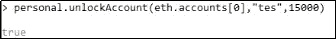

Unlocking account

要进行交易，账户需要有余额。帐户上存储的余额可以在开始时初始化，也可以通过挖掘获得。你每做一次挖矿，一个账号就可以得到一个乙醚，当你想做交易的时候就可以用了。

可以使用以下命令检查帐户余额

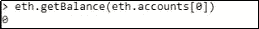

Balance account check

# 采矿

挖掘是记录由充当挖掘者的账户执行的交易的过程。矿工记录的交易将被视为有效。挖掘也可以看作是一个节点运行其资源记录块的过程。矿工将获得“乙醚”形式的奖励，这些奖励将被添加到注册为 coinbase 的帐户余额中。默认情况下，eth.coinbase = eth.accounts [0]。

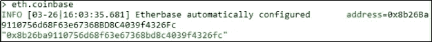

Coinbase

要开始挖掘过程，请运行以下命令

```
miner.start()
```

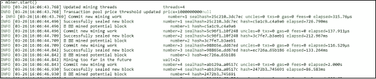

Mining process

使用此命令停止挖掘过程

```
miner.stop()
```

您还可以使用此命令检查挖掘状态

```
eth.mining()
```

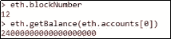

Account balance after mining process

采矿过程完成后，矿工将获得乙醚作为奖励。在 12 个记录块中，矿工得到 24 个以太。这意味着每个块值 2 乙醚。

# 交易

我们进入主要部分，交易。交易可以在同一个节点或不同的机器上用两个不同的账户完成。在这一部分，我们将首先尝试同一节点中两个帐户之间的交易。

首先，您必须在您的节点中使用命令创建另一个帐户。然后检查您的节点中是否有两个帐户。

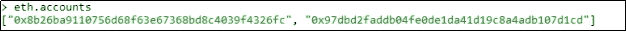

Account list checking

在进行交易之前，您必须使用之前输入的释义解锁发送方帐户，此外，必须确保发送方帐户有足够的余额来发送乙醚并支付处理交易所需的汽油费用。

使用此命令发送事务

```
eth.sendTransaction({ from: eth.accounts[0], to: eth.accounts[1], value: web3.toWei(1,"ether"), gas:0xEEE00 , data: "0x00"})
```

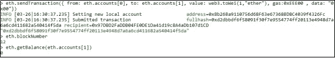

Sending transaction

正如你在上面看到的，交易已经完成。我们可以使用事务散列来检查事务细节。

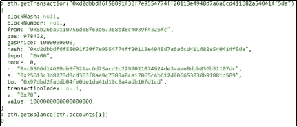

Transaction details

然而*块哈希*和*块号*仍然为空。发生这种情况的原因是，该事务还没有被验证(矿工还没有作出记录)，因此它可以作为待定事务被接受。我们还可以使用这个命令看到挂起的事务，就像这样。

```
txpool.content.pending
```

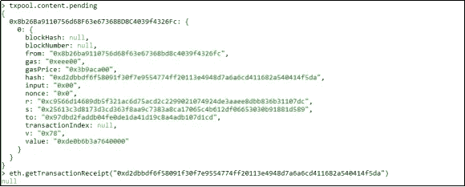

Pending transaction

我们需要首先挖掘它，以便记录块中的事务。

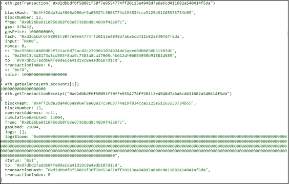

Transaction detail after mining

我们终于成功创建了自己的以太坊网络，创建账号，在账号之间发送交易，在一条链上做块记录。在下一部分中，我们将进一步学习不同机器上的两个节点之间的交互。继续学习！！

[](https://coincodecap.com)

> [在您的收件箱中直接获得最佳软件交易](https://coincodecap.com/?utm_source=coinmonks)

[](https://coincodecap.com/?utm_source=coinmonks)