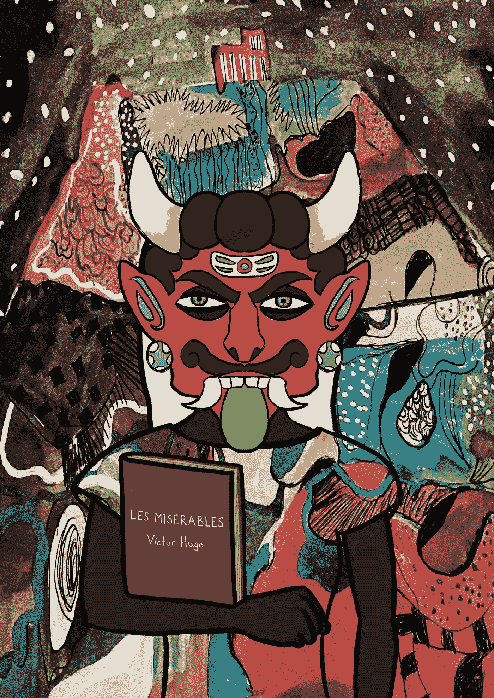
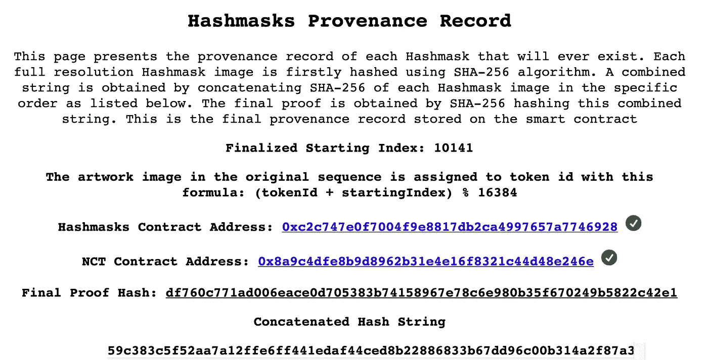

# 以太坊 NFT 令牌到资产的映射是离线的，没人关心

> 原文：<https://medium.com/coinmonks/ethereum-nft-token-to-asset-mappings-are-off-chain-and-nobody-cares-4aff301382b0?source=collection_archive---------0----------------------->

## NFT 艺术的完整性正被项目设计者击败，他们留下了关键的符号→资产映射链外

Example of a [NFT](https://opensea.io/assets/0xc2c747e0f7004f9e8817db2ca4997657a7746928/13378) from a popular collection called [Hashmasks](http://thehashmasks.com)

继大规模分散金融(DeFi)浪潮之后，区块链以太坊上的不可替代代币(NFT)正在引领下一波创新浪潮。NFTs 的典型用例是将数字资产的所有权映射到链上唯一令牌的持有。以 NFT 为代表的资产不一定需要数字化，尽管这比以实物资产为代表更合适。在区块链上表示数字资产是很自然的，因为组成数字文件的位可以被散列为文件的更短表示，这在链上存储更便宜。

以太坊上第一个 NFT 类型的项目是*。其背后的机制相当简单——一个 100x100 网格的独特的密码朋克图像被缝合在一起，形成一个更大的图像，然后被散列并存储在区块链上。密码朋克项目发行了 10，000 个代表每个密码朋克的独特代币。这些代币最初是免费赠送的，但现在被用来交换以太；有些价值超过 100 万美元。*

*快进 3.5 年后，Hashmasks 出现了，这是一个颠覆了 Cryptopunks 的高度创新的项目。在 Hashmasks 项目中，艺术作品的生成更加注重细节，超过 70 名艺术家参与了高度迭代的过程，生成了 16，384 件独特的数字艺术作品。每个 Hashmask 都有一组独特的明确特征，有些比其他的更罕见。除了显性的，隐性的特质让一些面具更加稀有。散列表由 NFT 表示，遵循 ERC-721 标准。此外，Hashmasks 项目引入了名称更改令牌(NCTs)，它可以累积久而久之，并赋予艺术品所有者更改作品名称的权利，从而允许他们添加点睛之笔。*

*发行工作于今年 1 月 28 日启动，并立即获得成功，随之产生了一批忠实的追随者。在令牌分发期间，NFT 的购买者知道每个 NFT 最终都会映射到 IPFS 上托管的 Hashmask 图像，但当时他们不知道是哪一个。一旦所有的 NFT 被分发，NFT →图像映射就显现出来了。广泛的媒体报道随之而来，使区块链收藏品重新成为人们关注的焦点。接下来是 Twitter 趋势、Discord 服务器、图像分析、数十个网站、隐藏特征搜索、新兴模式、价格发现，以及围绕该项目发展的一种文化。*

# *【Hashmasks 所有权和 token →图像映射是如何工作的？*

*Hashmasks 团队生成了 16，384 张图片中每一张的哈希，并为每张图片分配了一个从 0 到 16，383 的索引。接下来，图像哈希按照它们的索引顺序连接在一起，并全部哈希在一起，以生成一个*出处记录*，正如该团队在这里解释的。出处记录不变地存储在 Hashmasks 以太坊契约中。在令牌分发阶段，令牌仍未映射到这些映像。*

**

*Provenance record definition as seen [here](https://www.thehashmasks.com/provenance.html)*

## ***记号是如何映射到图像上的？***

*在令牌分发结束后，在契约内随机生成所谓的 *startingIndex* 。 *startingIndex* 的目的是确定原始序列中 index = *startingIndex* 的图像将对应于 *tokenId* = 0 的令牌。然后，0 之后的每个后续 tokenId 映射到原始序列中的下一个图像( *mod* 16，384，以便循环回到“起始图像”之前排序的图像)。*

# ***那么，这个提法有什么问题呢？***

*乍一看，这个定义似乎是合理的，安全的，不可改变的，它显然为观众和市场提供了足够的信心，正如目前正在交易的一些稀有作品的广泛采用和数十万美元的价格标签所证明的那样。*

## ***那么，问题出在哪里？***

*我认为这个定义是不完整的，因为它依赖于外链信息，导致非功能性交易与它们想要代表所有权的艺术品分离。这违背了分散数字艺术所有权的本质。*

## *怎么会这样？*

*好了，我们先来看看能证明什么*，揭示了什么不能。可以证明，只有原始顺序的图像序列才能生成出处记录散列。对单个图像中的顺序或单个位的任何修改都会将出处记录更改为完全不同的内容。我们还能证明什么？我们还知道 *startingIndex* 是由智能合约随机生成的。我们只知道这些。换句话说，不可否认的是，没有足够的链上、不可变的信息将特定的令牌映射到特定的图像。此外，在 Hashmasks 网站上，实现预期映射的指令是离线的。这意味着，从理论上讲，如果 Hashmasks 网站上的映射定义发生变化，那么 token → image 映射也可能发生变化，Hashmask 所有者将不再拥有他们认为拥有的 Hashmask。**

## *定义的这种改变会改变所有权的例子有哪些？*

1.  *Hashmasks 网站定义可以完全忽略 *startingIndex* ，并且简单地定义每个 NFT 映射到索引等于其原始序列(即由出处记录表示的序列)中的 *tokenId* 的图像。这种情况相当于让 NFT 发行版对所购买的艺术品不视而不见。*
2.  *Hashmasks 网站定义可以将 *startingIndex* 在链外映射公式中的使用方式改为:**(starting index-token id)% 16384**。这就像在原始序列*中索引等于 *startingIndex* 的图像周围翻转所有权。**

## *Hashmasks 团队做了哪些不同的事情？*

*我想到了两个简单的解决方案，仍然可以让代币发行无视艺术品所有权，这显然是该项目的目标之一。*

1.  *一旦令牌分发结束并且随机选择了 *startingIndex* ，就可以根据预期的映射公式对图像散列重新排序:**(token id+starting index)% 16384**。则合同出处记录将被设置为该最终顺序中的图像散列的散列。在这个定义下，艺术品所有权将被清楚地定义，因为每个 *tokenId* 将对应于出处记录中索引等于 *tokenId* 的图像。*
2.  *一个更直接、更优雅的解决方案是按照最初的意图随机生成 *startingIndex* ，但也提供一个契约方法，该方法将 *tokenId* 作为输入，并输出对应于该令牌的作品图像哈希，从而将令牌完美地耦合到链上的图像。*

*这两种解决方案都增加了项目的费用，因为第一种解决方案需要在合同中计算 16，384 个散列，或者在合同存储中存储 16，384 个先前计算的散列；第二种解决方案也需要在合同存储中存储 16，384 个映像哈希。我认为这些开销与 Hashmasks 团队决定将映射定义脱离链的原因有关。这一决定令人惊讶，因为对于一个在代币分发过程中产生超过 1400 万美元收入的项目来说，这笔费用本来是微不足道的。团队可能不想在项目失败的情况下投入这么大的前期成本。*

*另一个值得尝试的更便宜的想法是在契约中存储出处记录，就像 Hashmasks 团队所做的那样，但是一旦令牌分发完成，就随机分配 tokenId。*

# *结论*

*Hashmasks 团队做了一项伟大、漂亮和细致的工作，设计了一个有足够创新成分的项目，让 NFT 艺术重新成为人们关注的焦点，希望能留下来。整个收藏目前的估价(仅仅考虑到[地板面具的价值](https://www.coingecko.com/en/coins/nftx-hashmasks-index))超过 5000 万美元。尽管有上述缺点，我实际上还是拥有一些散列表。*

*然而，我认为社区必须达成共识，即当前的艺术品所有权模式存在关键的逻辑差距，行业应该从中吸取教训，以免重复错误，从而保持分散艺术的完整性。*

*我不相信 Hashmasks 团队会改变他们网站的所有权定义，但这不是重点——他们甚至不应该改变。建立在以太坊上的所有基础设施的目标是避免需要信任，即使信任是可以的。*