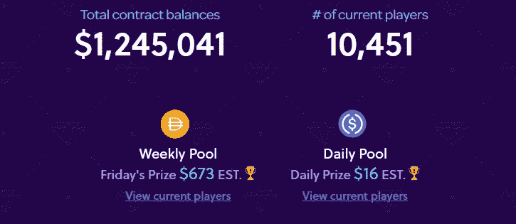

# 以太坊无损失彩票系统:DeFi 民主化储蓄价格，使其更加透明

> 原文：<https://medium.com/coinmonks/ethereum-no-loss-lottery-system-defi-democratize-saving-prices-and-make-them-more-transparent-286c51f3fc7b?source=collection_archive---------1----------------------->

Photo by [Dylan Nolte](https://unsplash.com/@dylan_nolte) on [Unsplash](https://unsplash.com/)

在加密和区块链领域，时间变化很快。过去几年，许多人(包括我自己)都在谈论区块链实施的附加值和革命性的商业模式。市场上实现的项目很少，也没有多少人使用它们。

到目前为止，许多项目已经从概念验证阶段转移到以太坊主网上。虽然 DeFi 也独立于 it，但它促进了这种采用，并在市场上带来了许多革命性的新应用程序，打破了它们的链外对等物。这吸引了大量经常使用这些应用程序的用户。

其中一个项目是 PoolTogehter，它得到了 ConsenSys 等知名加密公司的支持。他们发明了一种“加密彩票”,根据节约价格的原则，参与者可以在不损失“彩票”价值的情况下赢得头奖。

## 那么什么是节约价格呢？

一般来说，节约价格的概念与区块链技术本身无关，但区块链将带来附加值，你将在本文后面看到。节约价格的一个著名例子是英国 2200 万人持有的溢价债券。债券的工作原理如下:它们产生利息，并且偶然选择一个或多个这种债券的持有者来赢得所有债券累积的利息。每张债券就像一张彩票，所以你持有的债券越多，中奖的机会就越大。与普通彩票的不同之处在于，头奖是基于累积的利息，而不是基于票面价值。

> 所以，如果你参与了，但没有被选为赢家，这是大多数情况下，你仍然保持你的债券的价值。

这被称为节省价格，因为你在彩票发行过程中节省了你的钱。当你幸运地被选为赢家时，你会得到一笔奖金。因此，与传统的储蓄账户相反，在传统的储蓄账户中，您的余额将获得固定的利率，储蓄价格的利率为零，但您可以在降低风险的情况下赢得高于一年累计利息的价格，因为您只能赢得而不能失去您的初始投资。

**以太坊上的区块链另类**

PoolTogether 背后的团队接受了这个想法，并在以太坊平台上创建了区块链替代方案。原理与溢价债券相同，但有几个优点。PoolTogether 目前提供两种类型的池每周池和每日池，每个人只要有一个钱包，至少有一个 Dai，就可以参加。

> *代币是一种稳定的货币，与美元挂钩，所以每枚代币的价值为一美元。*

每个存放在池中的代币代表一张“彩票”。当您存入 Dai 时，PoolTogether 协议会将其转移到 Compound。金融，一个流行的 DeFi 应用。论复合。资金被借给其他支付利息的用户。根据您将资金存入哪个资金池，一天或一周内产生的所有复利利息将被随机分配给资金池中的参与者。而其他人可以取回他们的 Dai，并可以参与下一个池或撤回它。

Current stats from PoolTogether from 02.09.2020

## 那么，与溢价债券等类似的储蓄价格相比，在以太坊推出它有什么优势呢？

首先，按照加密的精神，每个人都可以一起加入池中，除了拥有互联网连接和至少包含一个 Dai 的钱包之外，没有任何进入障碍。另一方面，溢价债券受到地理位置的限制，不能被全球所有人购买。此外，参与的财务障碍较低。虽然溢价债券的最低购买价格是 25 美元，但 PoolTogether 的最低购买价格是 1 美元，这样可以让更多人参与进来。

第二，和大多数彩票一样，一部分价格归管理彩票的机构所有，比如 NS&I 发行溢价债券。另一方面，PoolTogether 不分享产生的利息。该项目得到了几家风险投资公司的支持。即使在后期阶段，团队会从项目融资中获得一部分利益，但份额会更小。这是可能的，因为该协议是由智能合约自动化的。

最后，用 PoolTogether 挑选赢家是透明和随机的。尽管我认为溢价债券也是如此，但仍然存在人为因素，而且并非所有过程都与公众共享。PoolTogetehr 遵循区块链透明的理念，平台代码是开源的，这意味着智能合同的代码是公开的，社区可以提出修改。通过生成随机数来选择获胜者的脚本可以在 [GitHub](https://github.com/pooltogether/pooltogether-winner-simulator) 上访问，每个人都可以检查它是否是真正的随机选择。

## 关于 DeFi，这告诉了我们什么？

Source: [https://blockspaper.com/en/article/531](https://blockspaper.com/en/article/531)

除了与传统模式相比的附加值，PoolTogether 是 DeFi 的一个很好的例子，因为它展示了一个主要的价值主张:**应用程序的互操作性**。PoolTogether 应用程序连接到另一个应用程序。由于以太坊的性质，金融以自动化、透明和安全的方式使用其服务。

DeFi 通常被称为“金钱乐高”。因为很容易通过智能合同将不同的 DeFi 应用程序(如乐高积木)链接在一起。这为创造革命性的商业模式提供了机会，这在以前是不可想象的。开放参与壁垒，摧毁传统金融体系的孤岛和低效，这是 DeFi 的本质。

# 请注意:

虽然 DeFi 应用程序是革命性的、非常有前途的，但总的来说也是池中的新技术，即使经过专家审核，也可能在代码中包含错误。投资这种应用程序总是涉及高风险，应该只投资自己愿意损失的部分。我与 PoolTogether 团队没有任何关系，也没有使用过该平台。

## 另外，阅读

*   最好的[密码交易机器人](/coinmonks/crypto-trading-bot-c2ffce8acb2a)
*   [密码本交易平台](/coinmonks/top-10-crypto-copy-trading-platforms-for-beginners-d0c37c7d698c)
*   最好的[加密税务软件](/coinmonks/best-crypto-tax-tool-for-my-money-72d4b430816b)
*   [最佳加密交易平台](/coinmonks/the-best-crypto-trading-platforms-in-2020-the-definitive-guide-updated-c72f8b874555)
*   最佳[加密贷款平台](/coinmonks/top-5-crypto-lending-platforms-in-2020-that-you-need-to-know-a1b675cec3fa)
*   [最佳区块链分析工具](https://bitquery.io/blog/best-blockchain-analysis-tools-and-software)
*   [加密套利](/coinmonks/crypto-arbitrage-guide-how-to-make-money-as-a-beginner-62bfe5c868f6)指南:新手如何赚钱
*   最佳[加密制图工具](/coinmonks/what-are-the-best-charting-platforms-for-cryptocurrency-trading-85aade584d80)
*   [莱杰 vs 特雷佐](/coinmonks/ledger-vs-trezor-best-hardware-wallet-to-secure-cryptocurrency-22c7a3fd391e)
*   了解比特币最好的[书籍有哪些？](/coinmonks/what-are-the-best-books-to-learn-bitcoin-409aeb9aff4b)
*   [3 商业评论](/coinmonks/3commas-review-an-excellent-crypto-trading-bot-2020-1313a58bec92)
*   [AAX 交易所评论](/coinmonks/aax-exchange-review-2021-67c5ea09330c) |推荐代码、交易费用、利弊
*   [Deribit 审查](/coinmonks/deribit-review-options-fees-apis-and-testnet-2ca16c4bbdb2) |选项、费用、API 和 Testnet
*   [FTX 密码交易所评论](/coinmonks/ftx-crypto-exchange-review-53664ac1198f)
*   [n 零审核](/coinmonks/ngrave-zero-review-c465cf8307fc)
*   [逐位交换审查](/coinmonks/bybit-exchange-review-dbd570019b71)
*   [3Commas vs Cryptohopper](/coinmonks/cryptohopper-vs-3commas-vs-shrimpy-a2c16095b8fe)
*   最好的比特币[硬件钱包](/coinmonks/the-best-cryptocurrency-hardware-wallets-of-2020-e28b1c124069?source=friends_link&sk=324dd9ff8556ab578d71e7ad7658ad7c)
*   最佳 [monero 钱包](https://blog.coincodecap.com/best-monero-wallets)
*   [莱杰 nano s vs x](https://blog.coincodecap.com/ledger-nano-s-vs-x)
*   [bits gap vs 3 commas vs quad ency](https://blog.coincodecap.com/bitsgap-3commas-quadency)
*   [莱杰纳米 S vs 特雷佐 one vs 特雷佐 T vs 莱杰纳米 X](https://blog.coincodecap.com/ledger-nano-s-vs-trezor-one-ledger-nano-x-trezor-t)
*   [block fi vs Celsius](/coinmonks/blockfi-vs-celsius-vs-hodlnaut-8a1cc8c26630)vs Hodlnaut
*   [bits gap review](/coinmonks/bitsgap-review-a-crypto-trading-bot-that-makes-easy-money-a5d88a336df2)——一个轻松赚钱的加密交易机器人
*   为专业人士设计的加密交易机器人
*   [PrimeXBT 审查](/coinmonks/primexbt-review-88e0815be858) |杠杆交易、费用和交易
*   [埃利帕尔泰坦评论](/coinmonks/ellipal-titan-review-85e9071dd029)
*   [赛克斯石评论](https://blog.coincodecap.com/secux-stone-hardware-wallet-review)
*   [BlockFi 评论](/coinmonks/blockfi-review-53096053c097) |赚取高达 8.6%的加密利息