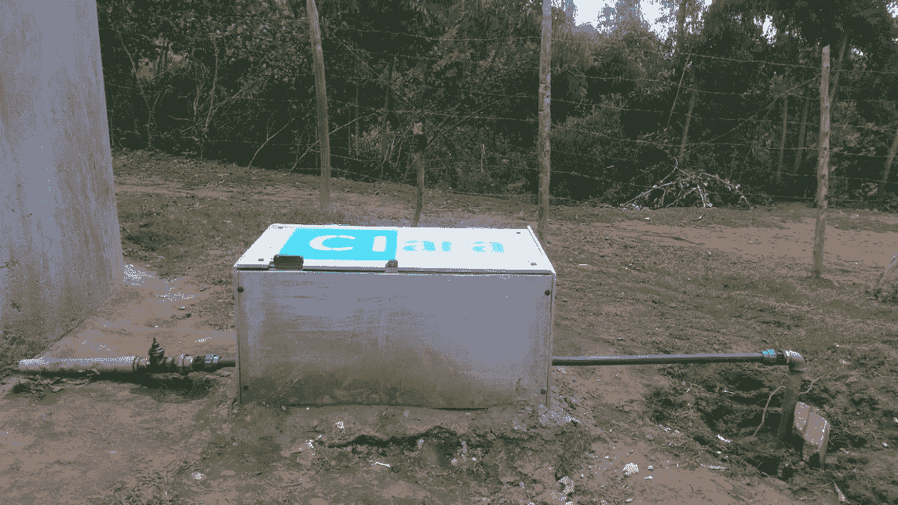
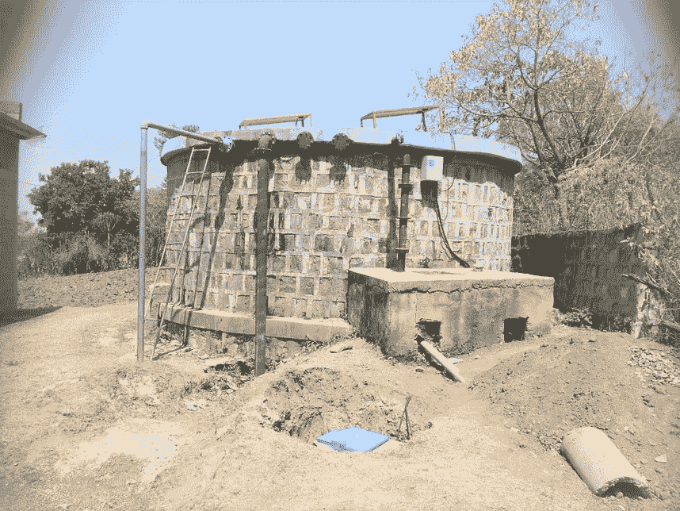
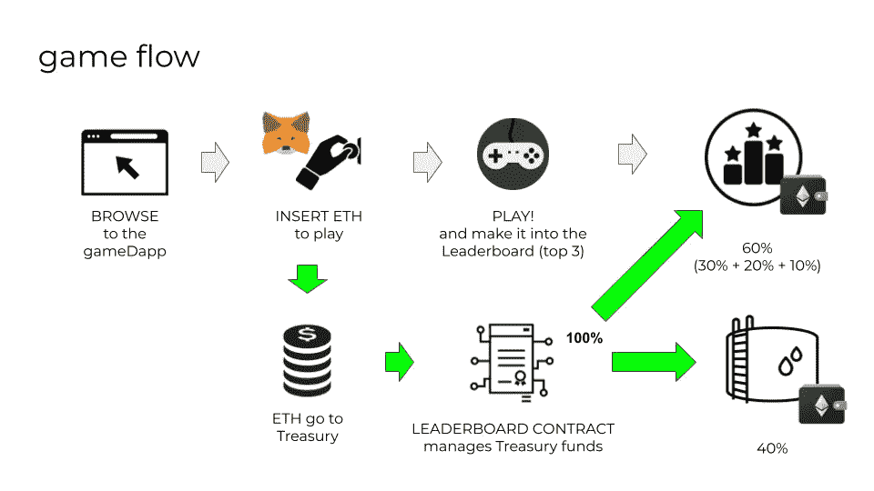
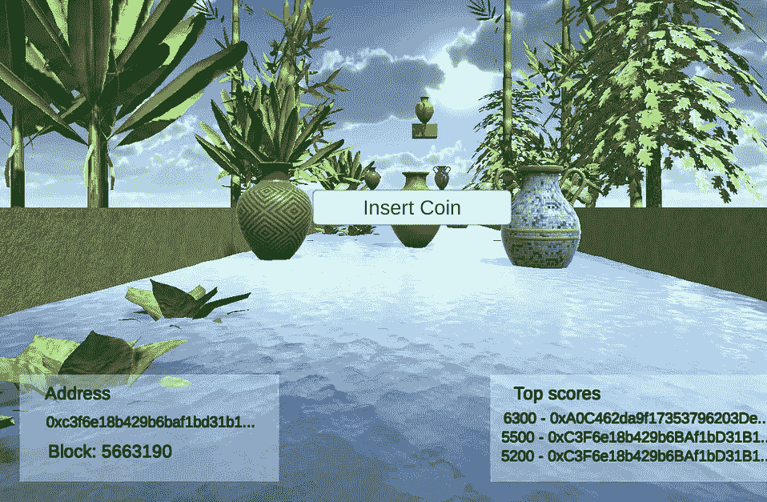
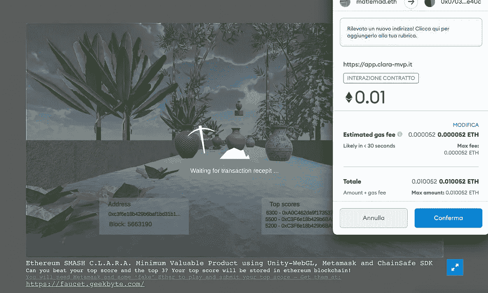
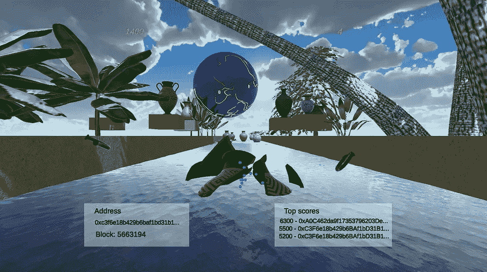
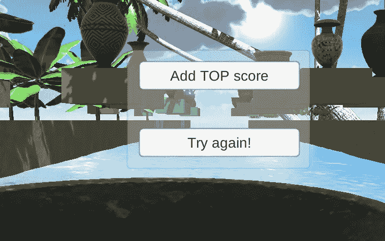
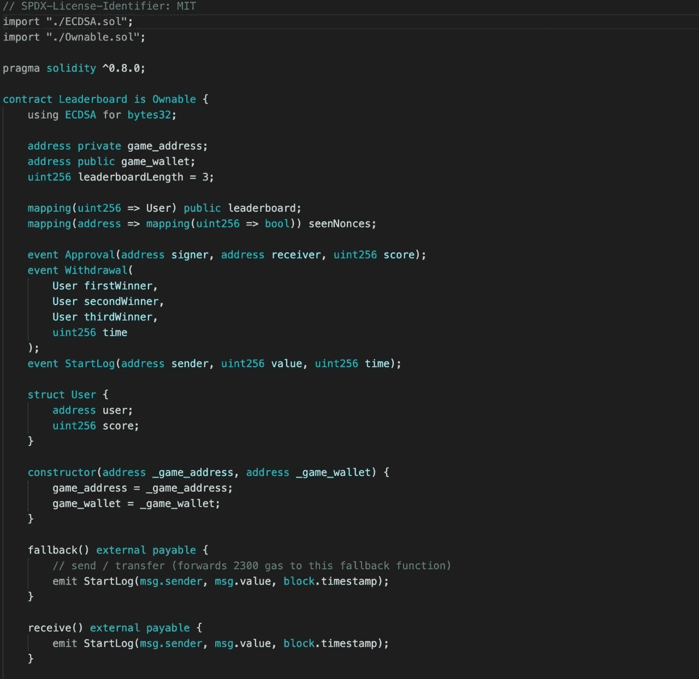
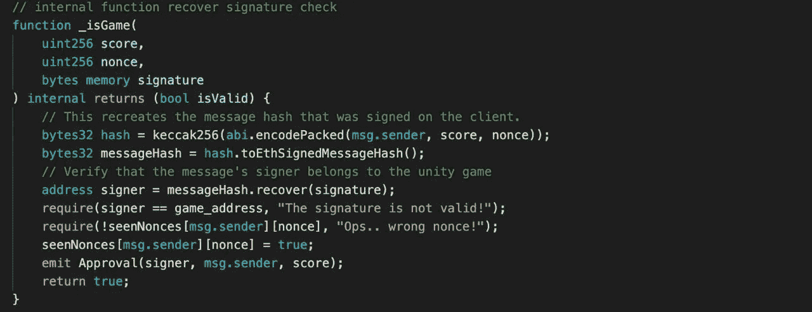

# 以太坊驱动的公共物品无限游戏:演示

> 原文：<https://medium.com/coinmonks/ethereum-powered-infinite-gaming-for-public-goods-a-proof-of-concept-35514f7dc6af?source=collection_archive---------8----------------------->

> 我认识到，在许多方面，信息就像一种公共物品，正是这种认识使我清楚地认识到，只要信息是内生的，私人市场就不可能提供有效的资源配置。
> 
> —约瑟夫·斯蒂格利茨

我最近有机会与克拉拉合作，这是一个为生活在埃塞俄比亚农村的社区创新水净化的合作项目。CLARA 最初是由多纳托·帕特里西设计和启动的，他是一名意大利工程师，住在哈瓦萨(位于首都亚的斯亚贝巴西南 200 公里处)，后来在瑞士-埃塞俄比亚财团的帮助下得以发展，该财团由 [SUPSI](https://www.supsi.ch/home.html) 、 [SAED 非政府组织](http://saedetiopia.org/)、[哈瓦萨大学](https://hu.edu.et/)和[天线基金会](https://www.antenna.ch/en/)组成。

# 背景

在人道主义背景下和发展中国家，大多数水务机构、国际组织和非政府组织提供清洁但不安全的水。目前，水是从安全的水源供应的，如果不是绝对必要，在到达最终用户之前通常不经过处理或消毒。这造成了水被大肠杆菌再次污染的风险，因为水被供应到社区的喷泉中，并且是用不干净的垃圾桶取来的。与其他非洲国家一样，埃塞俄比亚从印度和中国进口 HTH(次氯酸钙)消毒粉。这意味着供应链长、成本高，并且在储存时可能会消耗高温水中的氯含量。

**克拉拉**是一种即插即用技术，它用仅使用盐和太阳能生产的次氯酸钠对流经管道的水进行自动消毒，市场价格为 HTH。对于农村地区和人道主义援助环境中的水消毒，这是一个可持续、创新、模块化和易于交付的解决方案。控制板检测水的流量，并每 20 升(jerry-can 体积)注入适量的消毒剂溶液，以达到所需的浓度(在输送点为 0.5 毫克/升的游离余氯)。与此同时，由于安装了远程监控系统，非政府组织、人道主义援助机构和供水设施可以通过规划维护和向捐助者报告关键绩效指标和成功成就来确保标准运作。

CLARA 的第一个试点项目安装在 Abella，这是一个哈瓦萨地区(埃塞俄比亚)周围有 1000 人的农村社区，目前正在为整个社区提供安全饮用水。2021 年 3 月，另一个农村社区安装了一个更大的系统。克拉拉现在利用太阳能为居住在该地区的大约 10，400 人提供消毒水。家庭层面的大肠杆菌再污染百分比从 75%下降到 0。

# 克拉拉的以太坊游戏

组件老化是发展中国家合作技术部署中的一个主要问题。CLARA devices 的维护不应依赖于捐赠或基于赠款的资金，也不应仅依赖于非常驻项目人员的干预。

概念验证是使用以太坊技术构建的，它为设备维护提供了一个游戏化的解决方案，同时为资助社区提供了经济激励。

我们选择创建一个在线无止境跑步游戏，并将其与 Goerli Testnet(以太坊)上的排行榜合同相连接。为了开始游戏，玩家必须“投入硬币”。玩家玩游戏，当游戏结束时，他们有可能在排行榜合同上添加他们的最高分数和以太坊地址。

Game sequence from ‘Insert Coin’ to ‘Add TOP score’

合同中的特定功能不会在排行榜上写那些已经发送 ETH 但没有游戏地址签名的收据的地址。

每次合同所有者调用 CLARA 维护资金时，都会执行一个功能，按如下方式分割资金:

40%给合同所有者(用于 CLARA devices 的维护)
30%排行榜第一位
20%排行榜第二位
10%排行榜第三位

这种潜在的无限游戏的结构，以及被动收入的前景，代表了一种激励，应该保证持续的现金流。此外，智能合同在不同的游戏方案上高度可重用，以使合作项目在延长的时间框架上完全可持续。

目前，排行榜合同是公开的，并在 Goerli testnet 上有效，允许访问游戏，之前支付 goETH 0.01。
排行榜契约是用 Solidity 写的，而游戏和它的浏览器通信依赖于用 C#(游戏的核心)和 JavaScript 写的行为。Web 浏览器只能执行 JS 代码，因此需要在游戏的内部功能之间建立一个桥梁，这个桥梁必须与 Web3 通信。

开发中用到的其他技术:
-[Unity Engine](https://unity.com/)
-[meta mask](https://metamask.io/)
-[Chainsafe SDK](https://github.com/ChainSafe/web3.unity)(观察并通知注册表中的状态变化)
- [Truffle e Ganache](https://www.trufflesuite.com/)

## [**→ >试试 CLARA DAPP**](https://app.clara-mvp.it/) (确保你的浏览器上有 [Metamask](https://metamask.io/) ，切换到 Goerli testnet 并且[至少有 0.03 ETH](https://faucet.geekbyte.com/) ) **

[→ **留下你的反馈**](https://docs.google.com/forms/d/e/1FAIpQLSeWuKD7lQIFfRR0_WUrVRciLPWiHtG41L3_B9KdRvGCV72Wug/viewform) (先玩游戏👆)
→ [**看回购，随意投稿**](https://github.com/gorlitzer/leaderboard-sc-truffle)
(我们做了测试，但建议总是有帮助的)
[→ **加入关于 TG**](https://t.me/joinchat/vRIZzd6jvj83Mzky) 的讨论

与[多纳托·帕特里西](https://github.com/DodoPat)和[格里策](https://github.com/gorlitzer)合著