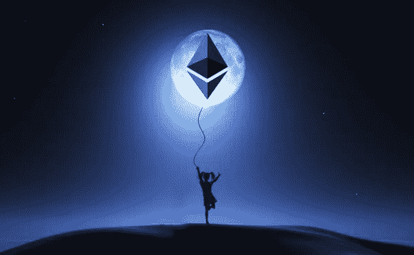

# 以太坊价格预测:7 月份以太坊市场展望

> 原文：<https://medium.com/coinmonks/ethereum-price-forecast-what-to-expect-with-eth-in-july-7d0a2f6d7f00?source=collection_archive---------4----------------------->

## 以太坊价格还在卖家手里？

首先，我们感兴趣的是 ETH 对 BTC 的表现。毕竟，后者被认为是波动性最小的加密货币。当然，这里的“不太易挥发”仍然意味着非常易挥发。毕竟，我们在加密货币领域。