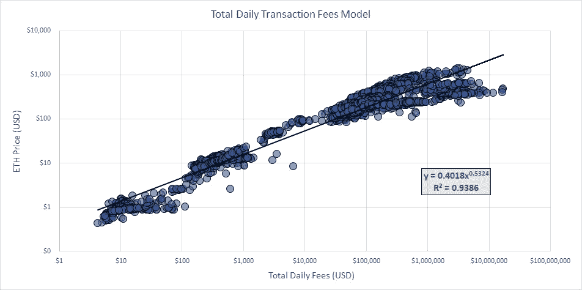

# 使用每日总费用的以太坊价格模型

> 原文：<https://medium.com/coinmonks/ethereum-price-model-using-total-daily-fees-992b2123f4e?source=collection_archive---------2----------------------->

## 关注[推特](https://twitter.com/cjosephwhite)

# **简介**

受 PlanB 的存量到流量回归模型[1]的启发，我利用网络的日总费用开发了一个以太坊的回归模型。

比特币的基本论点是，它是一种价值储存手段，类似于黄金，因此存量与流量的比率是分析比特币价值的有用基础。我相信以太坊的根本论点是，它是一个结算层，是一个能够托管经济和非经济的去中心化应用的交易网络。由于以太坊是一个结算层，使用网络上处理的每日总费用来分析以太坊网络的价值是有用的。

# **每日费用回归模型**

下面是根据 2015 年 8 月以来以太坊网络上处理的每日费用对以太价格的回归模型。

Charts made with Excel and CoinMetrics Data Source: [https://coinmetrics.io/community-network-data/](https://coinmetrics.io/community-network-data/)

可以看出，该模型在大约五年的时间范围内(2015 年 8 月至 2020 年 12 月)产生了约 94%的高 R 平方。这代表了统计上显著的关系。

我注意到有三组主要的每日费用与以太坊的三个价格区间相关。与 PlanB 的阶段模型[2]相似，我将这三个时期概括为阶段，其每日费用和平均价格如下:

*   第一阶段(2015 年 8 月至 2015 年 9 月):每日费用约 20 美元，平均价格约 1 美元
*   第二阶段(2016 年 5 月至 2017 年 2 月):每日费用约 500 美元，平均价格约 11 美元
*   第三阶段(2017 年 12 月至 2020 年 12 月):每日费用约 50 万美元，平均价格约 330 美元

每日费用由两部分组成；每日交易计数和每笔交易的平均费用。这两个部分相乘等于每日总费用。我决定将这两个组件分开，分别进行分析，以评估是否可以使用这两个组件的输入来创建模型。

# **每日交易计数**

为了检查每日事务计数，我在每秒事务(TPS)级别评估了事务。下面是以太坊网络每秒交易的时间序列图:

Charts made with Excel and CoinMetrics Data Source: [https://coinmetrics.io/community-network-data/](https://coinmetrics.io/community-network-data/)

每秒事务处理的三个阶段以及相应的平均 TPS 概述如下:

*   第一阶段:0.05 TPS
*   第二阶段:0.5 TPS
*   第三阶段:8.9 TPS

# 每笔交易的平均费用

在回顾每笔交易的平均费用时，我使用了与 TPS 图表相同时间段的每笔交易的平均费用:

Charts made with Excel and CoinMetrics Data Source: [https://coinmetrics.io/community-network-data/](https://coinmetrics.io/community-network-data/)

每笔交易平均费用的三个阶段概述如下:

*   第一阶段:每笔交易 0.004 美元
*   第二阶段:每笔交易 0.01 美元
*   第三阶段:每笔交易 0.7 美元

# 根据每日交易费用对价格建模

我已经确定了三个阶段的最大、最小和平均每秒交易量，并确定了这些特定日期的相应交易费。在下表中，有三个主要部分；最大值、最小值和平均值，其中我确定了每个阶段的 TPS 和交易费。例如:0.81 是在第二阶段的时间段内以太坊网络上确定的最大 TPS，在该日期对应的交易费为 0.014 美元。那一天的总费用是 962 美元，回归模型预测价格是 15.6 美元。

我已经概述了第四个阶段，我相信一旦 ETH 2.0 部署完成，TPS 的最大能力将会增加，第四个阶段就会到来[3]。为了简单起见，我为第四阶段概述了三个场景；从第三阶段开始，TPS 和交易费用分别增加了 10 倍和 15 倍的 5X。

Charts made with Excel and CoinMetrics Data Source: [https://coinmetrics.io/community-network-data/](https://coinmetrics.io/community-network-data/) Model price is calculated using the regression formula outlined in the beginning of Y = 0.4018X^.5324

对于“最大”、“最小”和“平均”，该模型似乎与每个实例中观察到的实际价格有很高的相关性。

例如:在第三阶段观察到的最低 TPS 是 4.41，交易费是 0.1 美元。这导致该模型计算出第三阶段的最低价格为 99.8 美元，在此阶段的最低价格为 82.8 美元。

使用第四阶段(5X)作为基础案例似乎有些保守，因为这意味着第四阶段的最高 TPS 为 81.4 美元，交易费为 20.6 美元，因此最高模拟价格约为 8，880 美元。

下表概述了第二阶段和第三阶段 TPS 和交易费用的历史增长百分比:

Charts made with Excel and CoinMetrics Data Source: [https://coinmetrics.io/community-network-data/](https://coinmetrics.io/community-network-data/)

# **使用四个阶段的价格模型**

对四个阶段应用最大 TPS 和交易费(对第四阶段使用 5X ),为我们提供了下图:

Inspired by Plan B’s Phase Model [2]

根据实际价格对四个阶段(作为保守措施的 5X 情景)进行建模，产生了一个类似于 PlanB 的比特币股票流向模型[1]的模型，但使用以太坊网络上的每日交易费:

Charts made with Excel and CoinMetrics Data Source: [https://coinmetrics.io/community-network-data/](https://coinmetrics.io/community-network-data/)

第四阶段(5x)场景意味着最高价格约为 8，880 美元，最低价格约为 554 美元，平均价格约为 2，515 美元。

# **根据实际价格跟踪模型价格**

使用回归公式对比每日总费用和实际价格，我们可以看到模型价格目前显示为~$1.2K ETH，实际价格为~$750。

红色表示实际价格远低于模型价格，蓝色表示实际价格高于模型价格。ETH 值是每周值，模型价格是 30 天的滚动平均值。

Charts made with Python and CoinMetrics Data Source: [https://coinmetrics.io/community-network-data/](https://coinmetrics.io/community-network-data/)

基于百分比评估实际价格是低于还是高于模型价格为我们提供了下图。有趣的是注意到过度/(不足)差异的对称性:

Charts made with Python and CoinMetrics Data Source: [https://coinmetrics.io/community-network-data/](https://coinmetrics.io/community-network-data/)

# **结论**

以太坊具有成为创新的经济和非经济分散化应用的结算层的高价值主张。作为由使用网络所需的交易组成的网络，历史每日交易费用为我们提供了对乙醚历史价格的洞察。

该模型显示了每日交易费用和以太网价格之间的高度相关性，因此，网络每秒交易量和未来每笔交易平均费用的任何增加似乎都与以太网网络估值的增加相关。

该模型预测下一阶段保守的最高价格约为 8，880 美元，这将在每秒交易量从当前第三阶段的平均 8.9 TPS 大幅增加时发生。ETH 2.0 的推出提供了更高的每秒交易量[3]，这可能是更高的网络使用率和更高的以太网价格的催化剂。

**在推特上关注:**【https://twitter.com/cjosephwhite】T2

***免责声明:*** *本文表达的观点并非投资建议，仅供参考。*

# **参考文献**

[1][https://medium . com/@ 100 trillion USD/modeling-bit coins-value-with-risacity-91 fa 0 fc 03 e 25](/@100trillionUSD/modeling-bitcoins-value-with-scarcity-91fa0fc03e25)—PlanB，2019

[2][https://medium . com/@ 100 trillion USD/bit coin-stock-to-flow-cross-asset-model-50d 260 feed 12](/@100trillionUSD/bitcoin-stock-to-flow-cross-asset-model-50d260feed12)—PlanB，2020

[3][https://daily hodl . com/2020/07/01/vitalik-buter in-says-ether eum-will-scale-to-100000-transactions-per-second/](https://dailyhodl.com/2020/07/01/vitalik-buterin-says-ethereum-will-scale-to-100000-transactions-per-second/)

## 另外，阅读

*   [学习以太坊和 Web3 开发](http://blog.coincodecap.com/go/learn)
*   最好的[密码交易机器人](/coinmonks/crypto-trading-bot-c2ffce8acb2a)
*   [3 商业评论](/coinmonks/3commas-review-an-excellent-crypto-trading-bot-2020-1313a58bec92)
*   [Pionex 审查](/coinmonks/pionex-review-exchange-with-crypto-trading-bot-1e459d0191ea)
*   [AAX 交易所评论](/coinmonks/aax-exchange-review-2021-67c5ea09330c) |推荐代码、交易费用、利弊
*   [Deribit 审查](/coinmonks/deribit-review-options-fees-apis-and-testnet-2ca16c4bbdb2) |选项、费用、API 和 Testnet
*   [FTX 密码交易所评论](/coinmonks/ftx-crypto-exchange-review-53664ac1198f)
*   [n 零审核](/coinmonks/ngrave-zero-review-c465cf8307fc)
*   [Bybit 交换评论](/coinmonks/bybit-exchange-review-dbd570019b71)
*   [3Commas vs Cryptohopper](/coinmonks/3commas-vs-pionex-vs-cryptohopper-best-crypto-bot-6a98d2baa203)
*   最好的比特币[硬件钱包](/coinmonks/the-best-cryptocurrency-hardware-wallets-of-2020-e28b1c124069?source=friends_link&sk=324dd9ff8556ab578d71e7ad7658ad7c)
*   [密码本交易平台](/coinmonks/top-10-crypto-copy-trading-platforms-for-beginners-d0c37c7d698c)
*   最佳 [monero 钱包](https://blog.coincodecap.com/best-monero-wallets)
*   [莱杰 nano s vs x](https://blog.coincodecap.com/ledger-nano-s-vs-x)
*   [bits gap vs 3 commas vs quad ency](https://blog.coincodecap.com/bitsgap-3commas-quadency)
*   最好的[加密税务软件](/coinmonks/best-crypto-tax-tool-for-my-money-72d4b430816b)
*   [最佳加密交易平台](/coinmonks/the-best-crypto-trading-platforms-in-2020-the-definitive-guide-updated-c72f8b874555)
*   最佳[加密贷款平台](/coinmonks/top-5-crypto-lending-platforms-in-2020-that-you-need-to-know-a1b675cec3fa)
*   [莱杰纳米 S vs 特雷佐 one vs 特雷佐 T vs 莱杰纳米 X](https://blog.coincodecap.com/ledger-nano-s-vs-trezor-one-ledger-nano-x-trezor-t)
*   [block fi vs Celsius](/coinmonks/blockfi-vs-celsius-vs-hodlnaut-8a1cc8c26630)vs Hodlnaut
*   Bitsgap 评论——一个轻松赚钱的加密交易机器人
*   为专业人士设计的加密交易机器人
*   [共同追踪审查](/coinmonks/cointracking-review-a-reliable-cryptocurrency-tax-software-5114e3eb5737)
*   [优霍德勒评论](/coinmonks/youhodler-4-easy-ways-to-make-money-98969b9689f2)
*   [埃利帕尔泰坦评论](/coinmonks/ellipal-titan-review-85e9071dd029)
*   [赛克斯·斯通评论](https://blog.coincodecap.com/secux-stone-hardware-wallet-review)
*   [BlockFi 审查](/coinmonks/blockfi-review-53096053c097) |赚取高达 8.6%的加密利息
*   [Coinrule 评论](https://blog.coincodecap.com/coinrule-review-a-perfect-trading-bot)
*   [最佳区块链分析工具](https://bitquery.io/blog/best-blockchain-analysis-tools-and-software)
*   [加密套利](/coinmonks/crypto-arbitrage-guide-how-to-make-money-as-a-beginner-62bfe5c868f6)指南:新手如何赚钱
*   最佳[加密制图工具](/coinmonks/what-are-the-best-charting-platforms-for-cryptocurrency-trading-85aade584d80)
*   了解比特币最好的[书籍有哪些？](/coinmonks/what-are-the-best-books-to-learn-bitcoin-409aeb9aff4b)

> [直接在您的收件箱中获得最佳软件交易](/coinmonks/newsletters/coinmonks)

