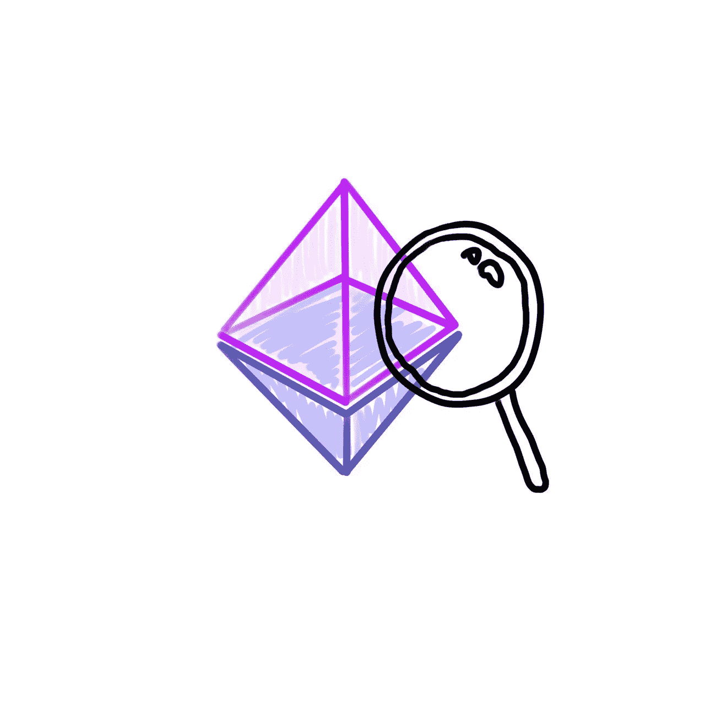

# 以太坊原语#1.2

> 原文：<https://medium.com/coinmonks/ethereum-primitives-1-2-e7ce0fa0a84c?source=collection_archive---------2----------------------->

## 以太坊区块链的组件(重点关注修改后的 Merkle Patricia Trie)

Ethereum

# 学会如何学习

首先，我在第一篇文章中遗漏了一些东西

## 为什么？

以太坊是人类生活的改变者。我们深入学习它是有意义的