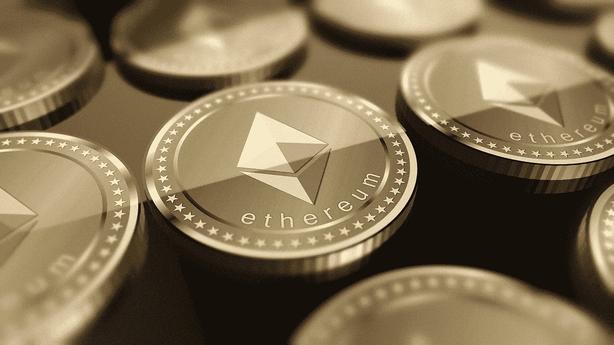

# 适用于初学者的以太坊赌注证明(PoS)

> 原文：<https://medium.com/coinmonks/ethereum-proof-of-stake-pos-for-beginners-a285448d0833?source=collection_archive---------6----------------------->

photo credit: [pixabay](https://pixabay.com/illustrations/ethereum-currency-trading-3660218/)

共识是区块链技术的核心。在 PayPal 和 Mastercard 等传统数字支付系统中，有一个中央机构来确保相同的钱不会被花两次。但在像区块链这样的分布式系统中，网络中的自治节点或计算机一起工作，以避免重复支出，并使用共识机制来确保完整性和安全性。

区块链网络中的节点必须采取一致的策略，同意一个真理源。这些策略是共识机制，包括工作证明(PoW)、利益证明(PoS)、历史证明(PoH)等等。

工作证明机制是最古老的，与比特币一起引入，后来被以太坊和其他加密货币采用。特佐斯和卡多纳·区块链使用利益一致的证明，而索拉纳使用历史和利益的证明。然而，这些机制是相关的。

良好的工作证明知识将有助于您理解其他共识方案。本文将描述[工作机制](/@ibrahimayuba393/bitcoin-mining-explained-da93b46204f6)的证明，它的弱点，以及利害关系证明如何解决这些问题。请继续阅读。

## **工作证明共识机制**

工作证明是最流行的共识机制。最初[于 1992 年](https://www.bitcoinsuisse.com/fundamentals/what-is-proof-of-work)提出，旨在防止网络中的拒绝服务攻击和垃圾邮件。这种机制因中本聪在 2008 年发布比特币白皮书而闻名。从那以后，战俘事务处帮助设计了强大的区块链，包括比特币和以太坊。

区块链由相互关联的多层交易组成。为确保区块链的安全，添加这些图层既耗时又费钱。PoW 中的主要参与者是能源、矿工和节点。

节点是网络中的计算机，拥有整个区块链的副本，并确认网络上进行的交易。矿工是特殊的节点，他们竞争解决复杂的数学方程式或密码难题。第一个解决它的矿工添加包含所有当前事务的下一个块。

为了解决这些复杂的难题，矿工将需要高计算能力，这需要消耗大量的电力。这些成本还加上安装采矿钻机所需硬件的初始成本。但是，矿商们因为回报而准备投资。任何赢得区块的矿工都可以获得网络本地加密货币形式的奖励。

工作证明使网络能够抵御攻击，因为恶意挖掘者将需要网络总计算能力的 50%以上来破坏它。实际上，考虑到构成网络一半的采矿电力和电力的数量，攻击比特币网络是不可能的。如果检测到恶意节点，就会将其从网络中清除。

## **比特币工作证明的挑战**

维护比特币工作证明系统需要大量的计算资源和电力。这些问题只对一部分矿工有利——那些在寒冷地区拥有廉价电力和矿池的矿工。

由于不需要购买冷却硬件，在用得起电的寒冷地区，矿工可以用多余的资金购买更多的硬件。与此同时，矿池——一群矿工结合他们的计算能力并分享奖励——可以轻松赢得区块。这导致了两个主要问题——首先是集中化和进入壁垒。

除了由于大量使用电而导致的环境问题之外，专用集成电路(ASIC)芯片最终会被损坏，并作为电子废物被处理掉。

此外，可扩展性——网络一次处理大量数据的能力——是比特币力量的一个问题。比特币目前的块大小是 1 MB，这意味着一旦这个存储空间满了，交易就必须再等 10 分钟才能加入网络。

为了用 PoW 解决这些各种各样的问题，2011 年提出了利害关系证明共识协议，并于 2012 年首次在对等网络上实施。

## **利益相关者共识机制证明**

不像在 PoW 协议中，矿工不解决任何数学方程以在 PoS 中添加块。因此，不是在工作证明中挖掘，而是在利害关系证明中添加块的过程更通常地被称为铸造或锻造，节点被称为验证器。

作为对挖掘者所需计算能力的交换，验证者必须拥有网络的本地令牌，并利用它来提议和验证块。这些赌注代币保存在智能合约中，在特定时间内不可兑现。它们充当所有权和网络成功利益的加密证据。

加密货币验证者的赌注越多，他们被选中的可能性就越大，奖励也就越高。理论上，如果一个验证者拥有网络中所有标记的 7%,那么该节点可以验证或建议 7%的块。

对于要添加的块，系统随机选择一个节点来提议块。一旦被选中，其他验证者将会认可他们已经看到了这个块。提议者和批准者都获得激励网络内费用。

除了随机化和更高的赌注之外，验证者已经押上其令牌的周期长度和一致性也增加了被选择提出阻塞的几率。

该算法旨在阻止集中化和恶意行为者。如果一个节点提交了一个错误的数据历史，它的标记令牌将被解散，并被踢出网络。在比特币战局中，恶意参与者只会被逐出网络。与 PoS 对违约者的处罚相比，这就像是焚烧采矿设备一样。

利害关系一致性机制的优点之一是，与工作协议的证明相比，它会导致更多的节点加入网络。与需要专用硬件的 PoW 不同，仅需要一定数量的本地令牌和具有可靠互联网连接的设备来加入 PoS 网络。

对于以太坊，至少需要 32 以太(在撰写本文时为 137，962.56 美元)才能成为网络上的验证者。这对新手来说太多了。然而，就像有采矿池一样，也有赌注池，许多个人将他们的代币结合在一起，并从池中积累的奖励中获得一定比例的奖励。你可以从任何数量开始。

PoS 机制本身不能获得可伸缩性。它采用分片技术，而不会危及安全性。在这个过程中，区块链被分成许多链或碎片，能够并行处理块。

如果在比特币 PoW 中使用分片，那么分片可能会受到较低计算能力的影响，这意味着安全性较低。但是在 PoS 中，验证器已经被知道了，因为它们的地址都附有保证金，这意味着它们很容易被发现。

在以太坊中，区块链将被分成 64 个链，从每个碎片中随机选择至少 4 个节点参与提出和证明一个块。结合了分片和 PoS，以太坊 PoS 的安全性受到损害的几率接近于零。

## **以太坊赌注证明**

虽然以太坊仍然使用工作证明机制，但预计将在 2022 年的某个时候完全迁移到股权证明。这个迁移计划在三个主要阶段执行——信标链、合并和分片链。

第一次升级，信标链，发生在 2020 年 12 月 1 日。它将赌注引入了以太坊区块链。可以把它想象成一个与主网络并行运行的碎片。

10 月 27 日，牛郎星更新发布，这是第二阶段合并前的最后一次升级。在第二阶段，将统一主网络和信标链。这个阶段——预计在 2022 年发生——将标志着以太坊工作证明的终结。

最后的改造，碎片链，将使网络分裂成 64 个碎片。这个阶段将允许任何拥有 32 Ether 的人使用手机、电脑或其他设备成为验证者。这将促进去中心化，因为由于硬件的独立性，更多的节点现在可以加入网络。

此外，据以太坊基金会称，硬件独立将削减 99.95%的能耗。同时，它将是可扩展的，因为 64 个碎片或链将并行运行，增加了一次可以添加到块中的数据量，并将速度提高到每秒 100，000 个事务。由于这些原因，PoS 被认为是区块链技术的未来。

## **比特币能变成股权证明吗？**

由于从 PoW 过渡到 PoS 所涉及的技术挑战，人们一直在争论比特币最终是否会采用股权证明协议。如果这种情况发生，对于已经投入大量精力和资金开采加密货币的矿工来说，这将是一个坏消息。这是否会发生，只有未来能告诉我们。

> 加入 Coinmonks [电报频道](https://t.me/coincodecap)和 [Youtube 频道](https://www.youtube.com/c/coinmonks/videos)了解加密交易和投资

## 另外，阅读

*   [美国最佳加密交易机器人](https://blog.coincodecap.com/crypto-trading-bots-in-the-us) | [不断回顾](https://blog.coincodecap.com/changelly-review)
*   [在印度利用加密套利赚取被动收入](https://blog.coincodecap.com/crypto-arbitrage-in-india)
*   [霍比审核](https://blog.coincodecap.com/huobi-review) | [OKEx 保证金交易](https://blog.coincodecap.com/okex-margin-trading) | [期货交易](https://blog.coincodecap.com/futures-trading)
*   [麻雀交换评论](https://blog.coincodecap.com/sparrow-exchange-review) | [纳什交换评论](https://blog.coincodecap.com/nash-exchange-review)
*   最好的[加密税务软件](/coinmonks/best-crypto-tax-tool-for-my-money-72d4b430816b) | [硬币追踪评论](/coinmonks/cointracking-review-a-reliable-cryptocurrency-tax-software-5114e3eb5737)
*   [Stackedinvest 评论](https://blog.coincodecap.com/stackedinvest-review) | [北海巨妖评论](/coinmonks/kraken-review-6165fc1056ac) | [bitFlyer 评论](https://blog.coincodecap.com/bitflyer-review)
*   最佳[加密借贷平台](/coinmonks/top-5-crypto-lending-platforms-in-2020-that-you-need-to-know-a1b675cec3fa) | [杠杆令牌](/coinmonks/leveraged-token-3f5257808b22)
*   最佳[加密制图工具](/coinmonks/what-are-the-best-charting-platforms-for-cryptocurrency-trading-85aade584d80) | [最佳加密交易所](/coinmonks/crypto-exchange-dd2f9d6f3769)
*   [比斯勒评论](https://blog.coincodecap.com/bitsler-review)|[WazirX vs coin switch vs coin dcx](https://blog.coincodecap.com/wazirx-vs-coinswitch-vs-coindcx)