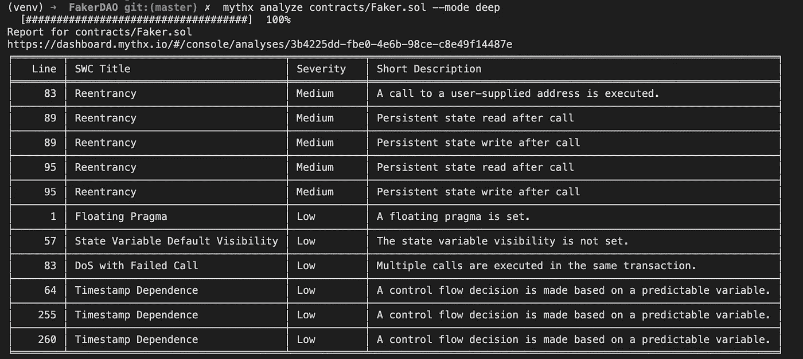

# 以太坊安全分析工具:介绍与比较

> 原文：<https://medium.com/coinmonks/ethereum-security-analysis-tools-an-introduction-and-comparison-1096194e64d5?source=collection_archive---------2----------------------->

## MythX vs Slither vs Securify

The three tools we’ll look at in this article

安保很难。当用户的钱岌岌可危时，这就更难了。幸运的是，以太坊生态系统在过去几年中已经成熟，现在有各种高质量的工具可以扫描你的以太坊智能合约，寻找安全漏洞。(剧透:它们都无法取代一次真正的审计)。

在本文中，我们将介绍三种更加流行的安全分析工具——Slither、MythX 和 Securify——并逐一完成以下步骤，以便您可以看到它们之间的比较:

1.  设置过程
2.  运行扫描
3.  结果分析

正如我们将在上一节中讨论的，这些工具并不完全是 1:1 的比较，结果应该有所保留。还要注意，本文中的所有工具都将在 macOS Catalina 上运行，因此步骤和命令可能会因您的操作系统而异。本文将假设您有使用 Python 3、Git 和 Solidity 的经验。

# 工具介绍

让我们从每个工具的高级概述开始。据我所知，这些工具都不支持 Vyper，它们都要求你使用 Solidity。

## 滑行

[Slither](https://github.com/crytic/slither) 由安全组织 [Trail of Bits](https://www.trailofbits.com/) 开发，将 Slither 描述为“一个用 Python 3 编写的可靠性静态分析框架。它运行一套漏洞检测器，打印关于合同细节的可视信息，并提供一个 API 来轻松编写定制分析。Slither 使开发人员能够找到漏洞，增强他们对代码的理解，并快速构建定制分析的原型。”

Slither 还附带了一些其他有用的工具，比如一个[展平器](https://github.com/crytic/slither/wiki/Contract-Flattening)，能够[检测与各种 ERC(比如 ERC20 和 ERC721)的一致性](https://github.com/crytic/slither/wiki/ERC-Conformance)，以及[使用](https://github.com/crytic/slither/wiki/Upgradeability-Checks) [delegatecall 代理模式](https://blog.trailofbits.com/2018/09/05/contract-upgrade-anti-patterns/)为可升级的合同检查合同。

Bits team 团队也写了一些关于这个工具的博客，你可以在这里找到和。

## 神话

MythX——ConsenSys 的一个项目——可以“自动扫描以太坊和其他位于 EVM 的区块链智能合约中的安全漏洞。MythX 全面的分析技术—包括静态分析、动态分析和符号执行—可以准确地检测安全漏洞，以提供深入的分析报告。MythX 拥有一个由世界级集成合作伙伴组成的充满活力的生态系统，可以提高开发人员的工作效率，可以在项目生命周期的所有阶段使用它。我们的安全专家团队致力于研究和改进我们用于强化您代码的工具和技术。”

MythX 团队有他们自己的博客，可以在这里[找到](https://blog.mythx.io/)，以及相关资源和工具的精选列表[。同样值得注意的是，MythX 是一个完整的安全服务，而不仅仅是一个扫描工具。](https://github.com/b-mueller/awesome-mythx-smart-contract-security-tools)

## 安全化

我们要看的最后一个工具是由 [ChainSecurity](https://chainsecurity.com/) 开发的 [Securify](https://github.com/eth-sri/securify2) 。Securify 支持 [38](https://github.com/eth-sri/securify2#supported-vulnerabilities) 漏洞，实现新颖的上下文敏感静态分析，只能分析 Solidity 0 . 5 . 8 以上版本编写的契约。

注意，我们在这里看到的是 Securify v2.0，它是最初的 Securify 的继承者。

# 设置过程

我们假设你已经有一个项目可以使用了，但是如果没有的话，可以随意克隆一下 [FakerDAO](https://github.com/scopelift/fakerdao) 项目。对于本文来说，这是一个很好的项目，因为它相当简单，因为部署后使用的惟一契约是`contracts`文件夹中的`Faker.sol`。

## 滑行

Slither 只是 Trail of Bits 的以太坊安全工具套件中的一个工具，所以如果你对其余的感兴趣，你可以在这里查看。这意味着有两种方法安装 Slither:

1.  通过`docker pull trailofbits/eth-security-toolbox`使用 Docker 安装全套工具
2.  使用 Python 只安装 Slither

这两种方法都很好，但是我们稍后会使用 Python，所以我们在这里使用方法 2。*注意:本文的早期版本错误地指出 eth-security-toolbox 的大小是 15GB。我的机器上有一个旧版本，因此出现了错误。感谢* [*丹圭多*](https://twitter.com/dguido) *以及 Bits 团队的踪迹指出这一点。*

在项目文件夹中，使用`python3 -m venv venv`创建 Python 虚拟环境，并使用`source ./venv/bin/activate`激活它。我们现在可以通过运行`pip install slither-analyzer`来安装 Slither。(确保将`venv`添加到您的`.gitignore`文件中)。

你完了！Slither 现在已经可以使用了，但是我们将推迟使用它，直到我们安装了其余的工具。

## 神话

回想一下，MythX 不仅仅是一个扫描工具，所以设置要复杂一些。首先，你需要创建一个账户，方法是进入 MythX 网站并点击注册。

现在让我们生成我们的 API 密匙，并把它保存在一个名为`.env` 的文件中，文件内容为`export MYTHX_API_KEY=yourApiKey`。确保使用准确的名称，因为 MythX 将查找具有该名称的变量。请确保该文件不会提交给存储库。

您将看到运行 MythX 有几个选项——一个 VSCode 插件、一个 Truffle 插件、一个 Remix 插件和一个命令行客户端。我们将尽量保持工具无关性，因此，在我们的 Python 虚拟环境仍然活跃的情况下，让我们用`pip install mythx-cli`安装命令行客户端。

这比 Slither 要复杂一点，因为我们需要创建一个帐户并获得一个 API 密匙，但仍然非常简单。你很快就会明白为什么我们需要创建一个帐户。

## 安全化

这可以用 Python 手动安装，但这个过程相当复杂，我无法用这种方法让 Securify 运行。相反，我们将使用 [Docker](https://www.docker.com/) 来安装这个工具。如果你从未使用过 Docker，它可以让你创建或安装所谓的*容器*,这些容器可以在任何机器上运行，而不考虑包括所有依赖项在内的操作系统。如果你不知道如何使用 Docker，没关系——只要按照这些[安装说明](https://mattsolomon.dev/docker)操作，稍后你就可以简单地运行指定的命令。

在项目根中，用`git clone https://github.com/eth-sri/securify2.git`克隆存储库，然后将`cd`克隆到该目录中，并用`sudo docker build -t securify .`构建 Docker 容器(不要忘记句点)。

一旦完成，我们就完成了所有工具的安装，并可以开始运行一些扫描。

# 运行扫描

好了，现在是有趣的时候了。让我们学习如何运行每个工具，然后我们将比较结果。确保`cd`先回到项目根。

## 滑行

如果我们想在项目的每个合同上运行 Slither，就像运行`slither .`一样简单。我们只需要在一个文件上运行它，所以我们将运行`slither path/to/contract.sol`，在我们的例子中它变成了`slither contracts/Faker.sol`。

如果您正在使用 FakerDAO 示例，您可能注意到的第一件事就是不支持`@`样式导入。所以您需要将 import 语句从`import “@openzeppelin/contracts-ethereum-package/contracts/math/SafeMath.sol”;`改为更明确的`import “node_modules/@openzeppelin/contracts-ethereum-package/contracts/math/SafeMath.sol”;`。

现在尝试再次运行该命令，您将很快得到打印到终端的结果！显示了各种*检测器*的结果，其中检测器只是一类缺陷/漏洞。Slither 支持的检测器的完整列表可以在这里找到[。](https://github.com/crytic/slither#detectors)

现在，您应该可以看到按严重性进行颜色编码的结果，首先打印高严重性检测器，然后是中严重性和低严重性输出。

它们按检测机类型分类，因此在一部分结果后，您会看到以`Reference:`开头的一行，其中包含一个文档链接，您可以从中了解有关该特定检测机的更多信息。而这还差不多！您可以在下面看到一个输出示例。在通读了每条消息和相应的文档之后，您应该能够更好地确定需要对代码进行哪些更改。

Sample output when running Slither

Slither 还配备了各种各样的[打印机](https://github.com/crytic/slither/wiki/Printer-documentation)，可以打印不同的合同信息。例如，调用图可以用`call-graph`打印机打印，继承关系可以用`inheritance`或`inheritance-graph`打印机打印，函数 id 可以用`function-id`打印机轻松获得。打印机不会直接指出安全问题，而是给你额外的工具来帮助检查，并确保代码的结构符合预期。

例如，我们可以使用`slither contracts/Faker.sol — print call-graph`获得契约的调用图。这将为每个合约创建一个`.dot`文件，查看它将显示一个调用图，如下所示:

Sample call-graph output from Slither

同样值得注意的是，Trail of Bits 提供了一个名为 [Crytic](https://crytic.io/) 的付费产品，它允许访问额外的检测器、GitHub 集成等等。我没有使用过这个工具，所以无法对它进行评论，但它似乎在范围上类似于 MythX 平台，从某种意义上说，它是一个完整的服务，而不仅仅是一个扫描工具。如果没有 Crytic，您将需要手动控制任何想要保存和以后参考的扫描结果的版本。

## 神话

MythX 提供了不同的[计划](https://mythx.io/plans/)，每一个都开启了不同深度的分析。付费计划提供 7 天免费试用，因此我们将利用这一点来看看这里的三个计划。

回想一下，我们之前配置了一个环境变量，所以首先运行`source .env`来设置它。现在我们可以运行`mythx analyze`来分析每个 Solidity 文件，但是这里我们将使用`mythx analyze contracts/Faker.sol`来分析一个文件。(您还可以指定一些其他选项，您可以在此处阅读[。第一次运行时，编译依赖项会花费相当多的时间，所以请耐心等待！后续运行会更快。](https://mythx-cli.readthedocs.io/en/latest/usage.html)

就像 Slither 一样，`@`样式的导入也不被支持，所以确保修改导入路径来明确列出`node_modules`文件夹。完成后，您将看到如下所示的输出。请注意，默认情况下，该命令将以快速扫描模式运行 MythX 很快我们将看到标准和深度扫描模式。

Sample output from the MythX Free plan, Quick scan

注意警告，免费版本声明它不能检测所有的漏洞类型。但是，我找不到一个页面，其中包含了每种计划类型中可以检测到和不能检测到的漏洞的列表。虽然从文档中不能完全清楚，但我的理解是，MythX 层提供了对如下功能的访问:

*   免费计划→仅快速扫描
*   开发者计划→快速扫描+标准扫描
*   专业计划→快速扫描+标准扫描+深度扫描

升级到开发版并重新运行后，您会看到警告被删除，因为它是相同的扫描类型，没有发现其他漏洞。

Sample output from the MythX Developer Plan, Quick Scan

我们刚刚运行了快速扫描，现在让我们运行标准和深度扫描。这些模式分别需要 5 分钟、30 分钟和 90 分钟。要运行标准扫描，使用`--mode`标志，例如`mythx analyze contracts/Faker.sol --mode standard`。

以下是标准扫描和深度扫描的结果。

Sample output from the MythX Developer Plan, Standard Scan

Sample output from the MythX Professional Plan, Deep Scan

对于我们在这里使用的 FakerDAO 合同，快速扫描几乎是即时的，标准扫描大约需要 20 分钟，深度扫描大约需要 45 分钟。我们可以看到，越来越多的层实际上发现了更多的潜在漏洞。在下一节中，我们将更详细地比较这些结果。

回想一下，MythX 不仅仅是一个扫描工具。在上面的图片中，您会注意到一个包含报告的仪表板的 URL。您创建的 API 键与您的 MythX 帐户相关联，因此您可以在任何地方登录并获得所有分析的历史记录。这包括运行的日期和时间、测试的源文件以及发现的漏洞。下面是您可以在仪表板中找到的三个不同的页面，显示了我们上面运行的标准扫描。

MythX Dashboard “View Analyses” page

High-level overview of a given scan

Details page for a given scan

## 安全化

最后一个工具。Securify 目前仅支持平面合同，这意味着我们的`import`语句不受支持。因此，要使用 Securify，您必须手动将导入替换为完整的 Solidity 文件。有一些削平工具可以帮你做到这一点，比如 [solpp](https://github.com/merklejerk/solpp) 、[松露削平器](https://github.com/nomiclabs/truffle-flattener)、[坚固性削平器](https://github.com/BlockCatIO/solidity-flattener)，还有一个叫做[坚固性削平器](https://github.com/poanetwork/solidity-flattener)，甚至还有一个上面提到的[附带的滑动器](https://github.com/crytic/slither/wiki/Contract-Flattening)。

一旦你完成了这些，你就可以用`sudo docker run -it -v <full/path/to/contracts>:/share securify /share/<contract.sol>`进行分析了。在我们的例子中，因为我们只想运行`Faker.sol`契约，所以我们将使用`sudo docker run -it -v $(pwd)/contracts:/share securify /share/Faker.sol`。

如果您不熟悉 Docker，以下是该命令的简要概述:

*   `sudo docker run`:以管理员身份运行 docker 容器(我不知道为什么它需要管理员权限)
*   `-it`:将容器作为交互进程运行(这允许您在 Docker 容器中的终端上输入命令)
*   `-v $(pwd)/contracts:/share`:与 Docker 容器的`/share`目录共享我们的本地`contracts`目录，由完整的文件路径`$(pwd)/contracts`指定。Securify 工具存在于容器中，因此它允许容器读取我们的本地合同文件。
*   `securify /share/Faker.sol`:在 Docker 容器中运行以执行分析的命令

现在我们等待分析运行，您应该会看到类似下图的内容。这里的输出有点混乱，因为颜色似乎与严重性不对应——注意黄色消息是如何分为中、高的，而红色消息是信息、中、高和关键。此外，请注意最上面的两条消息都是中等级别的`Missing input validation`，但是它们以不同的颜色显示。阅读这里的输出时要小心，以免误解任何内容。

Securify v2 output

Additional Securify v2 output from the same run

# 结果分析

在得出结果之前，我们应该注意，这篇文章还远远不够全面，还有很多可以扩展的地方，例如:

*   这些工具并不完全是公平的一对一比较。例如，MythX 将运行一个[静态分析](https://en.wikipedia.org/wiki/Static_program_analysis)，一个[符号分析器](https://en.wikipedia.org/wiki/Symbolic_execution)，以及一个[模糊器](https://en.wikipedia.org/wiki/Fuzzing)。另一方面，Slither 只是一个静态分析工具，相关的符号分析器和模糊器被分解成单独的工具，分别称为[蝎狮](https://github.com/trailofbits/manticore)和[鼹鼠](https://github.com/trailofbits/echidna)。
*   我们没有深入探究 Slither 的打印机，也没有涉及它的 API。
*   我们没有涉及到由 Bits Trail 提供的[其他工具](https://github.com/crytic/eth-security-toolbox)，比如它的模糊测试器[鼹鼠](https://github.com/trailofbits/echidna)或者符号分析器[蝎狮](https://github.com/trailofbits/manticore)。
*   我们没有查看每个工具提供的全套服务，例如 CI/CD 集成、GitHub 集成或支持。
*   我们没有考虑产品的成本。

好了，现在我们准备比较结果了！

我们将使用 [SWC 注册中心](https://swcregistry.io/)——智能合同缺陷分类注册中心——进行对比。这包含一个潜在契约弱点和漏洞的列表，以及每个弱点、漏洞的解释、参考和测试用例。

下表列出了每次扫描的结果。关于此表的几点注意事项:

*   为了清楚起见，隐藏了没有被任何工具发现的 SWC
*   不是每个工具都直接映射到这个注册表，所以有括号解释工具描述的具体问题。
*   带星号的 SWC id 是我添加的，因为我在 SWC 注册表中找不到与工具输出匹配的 id。这些“新”SWC id 的名称是从工具输出中提取的。
*   我没有根据合同手动验证每份报告的有效性和准确性，所以请对此表持保留意见。
*   不要认为计数最高的那个就是最好的。

事不宜迟，下面是结果！

Summary of results

那么我们能从这里带走什么呢？我想到了一些想法:

*   没有一种安全工具能够彻底到取代审计！如果你还记得一件事，那就是这个。
*   没有一个单一的安全工具能囊括一切:只有 Slither 提到了严格的不平等，只有 MythX 提到了时间戳依赖性，只有 Securify 提到了输入净化和未初始化的状态变量。
*   即使工具捕捉到相同的漏洞类别，它们也会捕捉到不同的实例和频率。

还值得注意的是，Securify 的输出特别奇怪，包含一些误报。除了上面提到的令人困惑的颜色编码之外，一些输出不太有意义，并且没有提供 URL 来查找更多信息。例如，`Uninitialized State Variable`消息没有检测到那些变量在构造函数中被初始化。同样，不清楚对`Unrestricted write to storage`的担忧是什么，以及它在寻找什么检查作为补救措施。

像这样的安全扫描工具在合同开发过程中肯定有它们的位置，并且应该总是被使用。使用多种工具而不是只依赖一种工具似乎是捕捉潜在 bug 的最佳方法，但是没有一种工具或工具组合可以取代全面的审计。

如果您必须在没有审计的情况下部署到 mainnet，请在您的网站和代码中添加警告，并考虑限制您的合同持有的最大资金金额。

祝你好运！

*免责声明:本文是 MythX 团队资助的 git coin*[*bounty*](https://gitcoin.co/issue/EtherDotBlue/MythX/4/4147)*的一部分，目的是为了对上述工具进行客观的比较。*

> [直接在您的收件箱中获得最佳软件交易](https://coincodecap.com/?utm_source=coinmonks)

