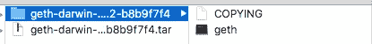
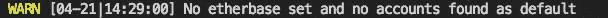
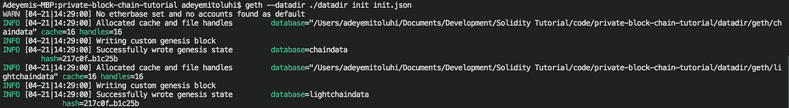
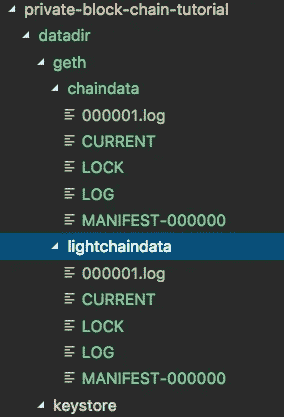
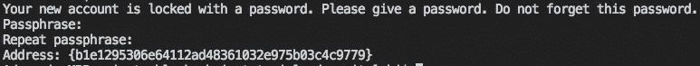
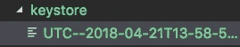
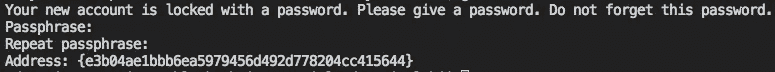
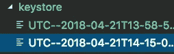
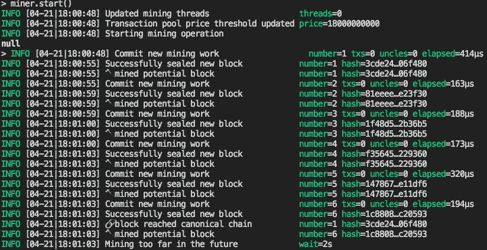
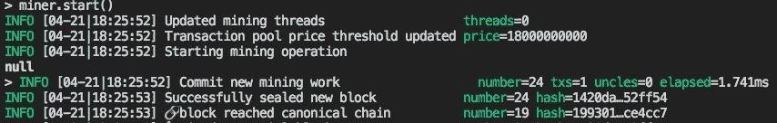

# 以太坊:建立私有区块链

> 原文：<https://medium.com/coinmonks/ethereum-setting-up-a-private-blockchain-67bbb96cf4f1?source=collection_archive---------0----------------------->

# 环境设置

1.  为本练习创建一个工作文件夹/目录。它将用于保存二进制文件和配置文件。
2.  访问 [Go Ethereum (geth)](https://geth.ethereum.org/downloads/) 网站，下载适用于您的操作系统的二进制文件。(在您阅读本文时，版本可能已经更改)。


Geth Website showing supported operating systems

3.解压并复制 geth 二进制文件到你的工作文件夹



geth 二进制文件是[以太坊](https://blog.coincodecap.com/tag/ethereum/)的运行时，要运行它，你需要通过配置文件给出一些信息。我将在下一步中详细介绍配置文件。

要运行专用网络，您需要向 geth 提供创建初始块所需的一些基本信息

让我们研究一下配置文件

**配置**:这是主区块链配置，它有以下属性

**chainId** :链标识符，必须是整数。它还用于防止[重放攻击](https://www.youtube.com/watch?v=Ar97HbWLijU)。在本教程中，我将不再赘述重放附加。

还有许多其他属性，如 **homesteadBlock** 和 **eip155Block** 可以添加到配置中，但是它们只/大部分与主网络相关，所以我们现在忽略它们。[此](https://ethereum.stackexchange.com/questions/15682/the-meaning-specification-of-config-in-genesis-json/15687)链接提供了更多详细信息。

**alloc** :用于将 ETH 分配给地址，即预基金账户。

**coinbase** :也叫 etherbase，是默认的主账户。如果没有设置这个值，您将会得到一个警告，但是现在可以安全地忽略它，您可以在以后设置它。



难度:这决定了开采一个区块的难度。对于私有区块链，最好将其设置为较低的数字，以确保快速挖掘块，这最终会转化为更快的事务。

**extraData** :屏蔽多余数据，如果没有提供，默认为客户端版本。

**gasLimit** :这规定了每个区块可以使用的最大气体量。该值越高，一个块中可以容纳的事务就越多。

**mixHash** :与新的专用网络无关，设置为 0

**括号**:与新的专用网络无关，设置为 0

# 让我们点燃它

geth 需要两个主要参数，一个存储链数据的文件夹(即本地数据库)和一个初始化文件。

```
geth **--datadir** ./datadir **init** init.json
```

输出应该类似于下面的屏幕截图



Initialisation console output

您还应该注意到在您的工作文件夹下创建了一个 datadir 文件夹，它的内容应该类似于下面的截图



Local Blockchain Folder

在这一点上，你有一个私人[以太坊区块链](https://blog.coincodecap.com/tag/ethereum/)运行。现在好戏开始了。你需要做的第一件事就是在区块链上创建一个账户。

# 创建帐户

创建帐户有两种方法，通过 geth 命令或使用 geth 控制台。我们稍后将使用 geth 控制台。

要使用 geth 命令创建帐户，请运行

```
geth **--datadir** ./datadir **account** new
```

系统将提示您输入密码。记下密码，你以后会用到它。创建后，新帐户的地址将打印在控制台中，如下所示。



New Account Console Dialogue

更重要的是，您会注意到 keystore 文件夹中的一个文件，其中包含私钥和其他关于所创建帐户的信息。



New Account File

它为每个新创建的帐户创建一个文件。如果再次运行 create account 命令，您会注意到 keystore 文件夹中有一个新文件。



需要注意的一件重要的事情是，帐户是离线生成的，并且网络上没有人知道地址/帐户，直到它们被包括在网络上的交易中。

因此，为了让网络知道这些地址，我们需要将它们包含在一个事务中，并将该事务包含到一个块中。让我们通过运行这个命令来启动 geth 控制台。

```
geth --**datadir** ./datadir **console**
```

控制台有许多库，您可以使用它们与区块链进行交互。我们将使用的第一个库是 *eth* 。

以下是 eth 库提供的功能的子集。在你的主机上试试吧。

```
**eth.accounts** // returns the list of accounts on this blockchain**eth.getBalance(eth.accounts[0])** // returns the balance of the  first account. **eth.blockNumber** // returns the current block number. 0 for a new blockchain
```

如果你查看你已经创建的账户余额，你会注意到它们的余额都是 0，但是要在以太坊区块链上做任何有趣的事情，你需要以太。所以我们去采矿吧。

# 采矿

要采矿，您将使用矿工库。开始采矿运行

```
miner.start(1) // 1 means run one mining thread
```

您的控制台输出应该类似于



停止采矿运行

```
miner.stop()
```

开采成功后，开采出来的乙醚去了哪里？默认情况下，它被分配给在区块链上创建的第一个帐户。此外，作为挖掘过程的一部分，将会创建新的块并将其添加到区块链中(大部分是空的，因为您尚未发送任何事务)。如果您检查第一个地址**eth . get balance(eth . accounts[0])**和当前块号 **eth.blockNumber** 的帐户余额，您会注意到它们都不再是 0。

# 发送以太网

如果您只创建了一个帐户，则创建第二个帐户。运行**eth . get balance(*address*’)**确认该账户余额，然后发送一些乙醚使用

```
*eth.sendTransaction({from:”address”, to:”address”, value: web3.toWei(amount, "ether")})**e.g. eth.sendTransaction({from:eth.accounts[0], to:eth.accounts[1], value: web3.toWei(4, "ether")})*
```

如果您尝试运行该示例，将会得到一个身份验证错误。在你从账户转账之前，出于明显的原因，你需要先解锁账户。在这种情况下，要解锁发件人帐户，我们将使用个人库。运行下面的命令

```
personal.unlockAccount(eth.accounts[0], "password")
```

如果帐户成功解锁，则应该返回 true。尝试再次发送乙醚并检查两个帐户的余额。

```
*eth.sendTransaction({from:eth.accounts[0], to:eth.accounts[1], value: web3.toWei(4, "ether")})*
```

最后一个命令应该返回事务的散列。在我的例子中，它返回了"**0x f 94 ECE 7d 159 bcc 750862 b 92396 e0d 98 c 537593 BFA 2 ECB 3 a 21 EC 49 b 0d 439592 EB**"。

你会认为**eth . get balance(eth . accounts[1])**是 4，对吗？它将返回 0，因为交易还没有被添加到区块链中。

此外，如果您检查发送者的余额，您会注意到也没有改变。为了使该交易生效，即账户余额反映新值，需要将该交易添加到一个块中，并将该块添加到区块链中，即开采。所以，让我的。

运行 **miner.start()** ，然后运行 **miner.stop()**

如果查看控制台输出，您会注意到挖掘的第一个块有一个事务。如果您检查发送方和接收方的余额，它们应该都显示预期值。



您可以做的另一件有趣的事情是，通过运行

```
eth.getTransaction("*transactionId*")
e.g. eth.getTransaction("0xf94ece7d159bcc750862b92396e0d98c537593bfa2ecb3a21ec49b0d439592eb")
```

如果已经挖掘了一个事务，那么 getTransaction 应该返回类似于

这提供了关于交易的许多信息。在这里，您可以通过运行

```
eth.getBlock("*blockAddress*")
e.g. eth.getBlock("0x1420da4e3dc647c651135b6d2f617e7046fc748c0321c567cec5e92df352ff54")
```

getBlock 输出应该类似于

大多数值应该是不言自明的。

# *添加更多对等点/节点*

如果 geth 控制台仍在运行，请退出它，然后重新启动，但这一次需要提供一个 networkid

```
*geth --datadir ./datadir --networkid 2018 console*
```

最后一步只是用一个 networkid 重新启动了旧的区块链。

*要添加新节点，请在新终端中运行以下命令*

```
geth **--datadir** ./datadir_new **init** init.json
```

这里需要注意两件重要的事情。

1.  您必须使用相同的 init.json 文件
2.  您必须使用不同的 datadir 文件夹。数据目录实际上是区块链的数据库/本地副本，每个节点都需要有自己的副本。

现在运行新节点，确保使用相同的网络 id。您还需要指定端口。默认端口已被第一个节点使用。您需要添加 **nodiscover** 来确保节点是可发现的，这不是必需的，但这是一个好的实践。

```
*geth --****datadir*** *./datadir_new --****networkid*** *2018 --****port*** *30306 --****nodiscover*** *console*
```

在第二个节点的控制台中(您可以使用任何一个)，运行`admin.nodeInfo`您应该会得到类似如下的内容

复制 enode 属性的值，并在控制台的第一个节点运行

```
admin.addPeer(enode://f7aa5b604056ff77dc561034f12874586b44b4a00e92355e7f750cfb43717ef1d0092f208b08661b209656d09540b11f6d0c6667a611674f7a75b718424d0c9a@[::]:30306?discport=0")
```

*如果成功，该函数返回 true，但这并不意味着节点添加成功。要确认运行* `*admin.peers*` *，您应该会看到刚刚添加的节点的详细信息*

如果您通过运行`miner.start(1)`在第一个节点上开始挖掘，您会注意到第二个节点上的块深度/数量增加了。

希望这对你有用。在下一篇教程中，我们将探索智能合同。

> 加入 Coinmonks [电报频道](https://t.me/coincodecap)和 [Youtube 频道](https://www.youtube.com/c/coinmonks/videos)获取每日[加密新闻](http://coincodecap.com/)

## 另外，阅读

*   [复制交易](/coinmonks/top-10-crypto-copy-trading-platforms-for-beginners-d0c37c7d698c) | [加密税务软件](/coinmonks/crypto-tax-software-ed4b4810e338)
*   [网格交易](https://coincodecap.com/grid-trading) | [加密硬件钱包](/coinmonks/the-best-cryptocurrency-hardware-wallets-of-2020-e28b1c124069)
*   [密码电报信号](http://Top 4 Telegram Channels for Crypto Traders) | [密码交易机器人](/coinmonks/crypto-trading-bot-c2ffce8acb2a)
*   [最佳加密交易所](/coinmonks/crypto-exchange-dd2f9d6f3769) | [印度最佳加密交易所](/coinmonks/bitcoin-exchange-in-india-7f1fe79715c9)
*   [面向开发人员的最佳加密 API](/coinmonks/best-crypto-apis-for-developers-5efe3a597a9f)
*   最佳[密码借贷平台](/coinmonks/top-5-crypto-lending-platforms-in-2020-that-you-need-to-know-a1b675cec3fa)
*   [杠杆代币的终极指南](/coinmonks/leveraged-token-3f5257808b22)
*   [AscendEx Staking](https://coincodecap.com/ascendex-staking)|[Bot Ocean Review](https://coincodecap.com/bot-ocean-review)|[最佳比特币钱包](https://coincodecap.com/bitcoin-wallets-india)
*   [Bitget 回顾](https://coincodecap.com/bitget-review) | [双子 vs 区块链](https://coincodecap.com/gemini-vs-blockfi) | [OKEx 期货交易](https://coincodecap.com/okex-futures-trading)
*   [美国最佳加密交易机器人](https://coincodecap.com/crypto-trading-bots-in-the-us) | [经常性回顾](https://coincodecap.com/changelly-review)
*   [在印度利用加密套利赚取被动收入](https://coincodecap.com/crypto-arbitrage-in-india)
*   [霍比审核](https://coincodecap.com/huobi-review) | [OKEx 保证金交易](https://coincodecap.com/okex-margin-trading) | [期货交易](https://coincodecap.com/futures-trading)
*   [麻雀交换评论](https://coincodecap.com/sparrow-exchange-review) | [纳什交换评论](https://coincodecap.com/nash-exchange-review)