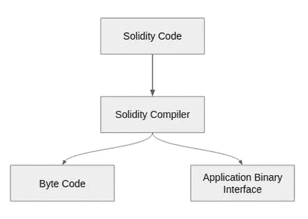

# 使用 Web 应用程序的智能合同:第 1 部分-开发智能合同

> 原文：<https://medium.com/coinmonks/ethereum-smart-contract-development-with-a-web-app-part-1-develop-the-smart-contract-ee2a7c735936?source=collection_archive---------0----------------------->


在本指南中，您将了解将 web 应用程序转换为 dApp 所需的全部知识。本教程非常适合那些有一些创建智能合同的经验，但是不知道如何真正应用他们的知识用 dapp 做一些有用的东西的人。那我们开始吧。

> 交易新手？试试[加密交易机器人](/coinmonks/crypto-trading-bot-c2ffce8acb2a)或者[复制交易](/coinmonks/top-10-crypto-copy-trading-platforms-for-beginners-d0c37c7d698c)

ICOs，智能合约，Mist，Remix，Metamask，geth，web3。如果你花一点时间尝试进入以太坊开发的世界，你很可能已经看到了这一切。

一些人将智能合约部署到测试网络，另一些人指导你阅读黄皮书，还有一些人鼓励你使用 truffle 套件，因为它非常出色。而你在那里，不知道具体要做什么，也不知道一切是如何配合的。

如果这是你阅读的第一篇关于以太坊或区块链生态系统的文章，你会爱上它的！专家们在不安全的标准、Twitter 和协议、未经测试和漏洞百出的开发工具上互相谩骂。并非所有的事情都是有意义的，每个人都在朝着不同的方向前进，还有很多事情需要完成。机构、政府和银行的未来正由疯狂的开发商决定！太牛逼了。

但是，您不需要再强调了，我将尝试在这个教程系列中为您关联所有的点，并带您浏览 dapps 开发和智能合同的宇宙，并向您演示一切是如何结合在一起的。

智能合约带来了加密货币世界的重大突破之一。它将区块链技术从加密货币交易转移到分布式应用程序(dApps)开发。智能合同的引入被认为是区块链技术下一版本(V2.0)的诞生。

这是一系列的博客文章，由以下三个主要部分组成。

1。在 Solidity 中开发一个智能合同，并将其部署在一个测试网络中(本文)

2.[在真实网络(Rinkeby 网络)中自动测试和部署您的智能合约](/@priyalwalpita/ethereum-smart-contract-development-with-a-web-app-part-2-testing-and-deployment-34a885e750b2)

3.构建一个前端 web 层来与智能合约进行交互。

4.在您自己的多节点以太网上部署智能合约

**ERC — 20 标准**

在以太坊中，智能合约可以被视为可以买卖或交易的代币。这些令牌可以表示可以附加各种价值的数字资产。这些可以是协议、凭证、借据，甚至是现实世界中的物品。

ERC-20 定义了一个通用的规则列表，所有以太币都要遵循。这意味着，当您将令牌(智能合约)部署到任何以太网时，它将以相同的方式运行。ie:项目不需要在每次发布新令牌时重做。相反，它们被设计为与新令牌兼容，只要这些令牌遵守规则。

你可以在这个[链接](https://theethereum.wiki/w/index.php/ERC20_Token_Standard)中获得更多关于 ERC 20 的细节。

您可以使用以下语言在以太坊中开发智能合约。

1.LLL:低级的类似 Lisp 的语言

2.巨蛇:类似于蟒蛇；它旨在最大限度地干净和简单

3.Mutan:已于 2015 年弃用

4.坚固性:类似 Java 脚本的语言。以太坊 ERC 20 开发中最常用的语言

**坚固度**

Solidity 是使用最广泛的语言，可以用来开发以太坊中的智能合约。Solidity 可能是一种面向联系人的高级语言，用于执行明智的合同。它受到 Python、C++和 JavaScript 的影响，旨在专注于以太坊虚拟机。solidity 编译器以 EVM 为目标，并在成功编译后生成运行在 EVM 之上的字节码。



Image 1 : Solidity Compiler

除了字节码，solidity 编译器还输出 ABI(应用程序二进制接口)。当我们需要从另一个应用程序(例如:一个 Web 应用程序)访问智能合同时，就会用到这个 ABI。在这个博客系列的后面，我们将使用 ABI 来连接 web 应用程序。

**Remix online IDE**

Remix 是一个易于使用的在线 IDE 来编码和测试你的 solidity 智能合约。Remix 的主要优势在于，它会给你样本账户地址来测试你的合同。如果您愿意在应用程序中执行任何调试操作，Remix 也包含有限的调试功能。

**智能合同开发**

这篇博文并不是要教你[可靠性](https://ethereumbuilders.gitbooks.io/guide/content/en/solidity_tutorials.html)、[以太坊](https://ethereum.org/)或[区块链](https://www.guru99.com/blockchain-tutorial.html)技术。如果你想学习它们，你可以跟随我给你的链接。这篇博文假设您已经掌握了这些技术的基础知识。

因此，让我们以 ethereum smart contract in solidity 进入深水区:)

**智能合同需求示例**

示例应用程序旨在满足以下要求。

一个人可以创建一个批准合同，其中包含需要转移到特定方(地址)的金额。智能合约的发起者需要指定谁(什么地址)应该批准该智能合约。在所有预期方(地址)批准后，智能合同中的金额应该转移到发起者定义的指定方。

首先，我们需要定义一个结构来保存批准者的数据(地址和批准状态)。

结构审批{
地址审批人；
布尔被批准；
}

然后，我们需要定义合同的全局数据。很明显，我们需要在智能合约的所有状态中保持批准者列表、发起者地址和接收者地址。

寻址公共请求者；
地址公共接收器；
审批[]公共审批人；

然后我们需要定义智能契约的构造函数。这应接受批准者列表、发起者发送的初始金额和接收方的地址。

```
constructor(address[] approversList, address receivedBy) public payable{

        requester = msg.sender;
        receiver = receivedBy;
        **for**(uint256 i=**0**;i<approversList.length;i++)
        {
            approval a;
            a.approver = approversList[i];
            a.isApproved = false;

            approvers.push(a);
        }
    }
```

您可以看到，我们使用 solidity 的 msg 全局变量来接受创建者最初转移的金额。for 循环只是遍历批准者的列表，并将其推送到数组中。确保构造函数是可支付的，因为我们在启动智能合同时发送了一些以太网。

接下来，我们需要开发 approve 和 getContractBalance 方法，如下所示。

```
function approve() public payable{
        bool isAllApproved=true;
        **for**(uint256 i=**0**;i<approvers.length;i++)
        {
            **if**(approvers[i].approver == msg.sender)
                approvers[i].isApproved = true;

            **if**(!approvers[i].isApproved)
                isAllApproved = false;

        }
        **if**(isAllApproved)   
              receiver.transfer(this.balance);  
    } 

    function getContractBalance() constant public returns(uint) {
     **return** this.balance;
    }
```

我们需要将 payable 属性添加到 approve 方法中，因为如果满足所有条件，合同的余额应该被转移到指定的接收者。我们可以使用“this.balance”来检索合同的金额。

完整的源代码应该如下所示。

```
pragma solidity ^**0.4**.**17**;

contract MultiAuth{

    address public requester;
    address public receiver; 
    approval[] public approvers;
    int n;

    constructor(address[] approversList, address receivedBy) public payable{

        requester = msg.sender;
        receiver = receivedBy;
        **for**(uint256 i=**0**;i<approversList.length;i++)
        {
            approval a;
            a.approver = approversList[i];
            a.isApproved = false;

            approvers.push(a);
        }
    } 

    function approve() public payable{
        bool isAllApproved=true;
        **for**(uint256 i=**0**;i<approvers.length;i++)
        {
            **if**(approvers[i].approver == msg.sender)
                approvers[i].isApproved = true;

            **if**(!approvers[i].isApproved)
                isAllApproved = false;

        }
        **if**(isAllApproved)   
              receiver.transfer(this.balance);  
    } 

    function getContractBalance() constant public returns(uint) {
     **return** this.balance;
    }

    struct approval{
        address approver;
        bool isApproved;
    }
}
```

下一步，我们需要使用 Remix 编译我们的源代码。我们可以使用 start to compile 按钮来完成这项工作。如果你的代码中有任何错误，编译器都会抱怨。

为了测试我们的智能合约，我们需要进入 Run 选项卡。确保您已经将环境选择为 JavaScript VM。应该有一个部署按钮，你需要输入你的参数。确保您已经选择了第一个帐户(应该有 5 个帐户)，并再选择一个批准人(从其他帐户复制地址)。

以下是我的构造函数参数。前两个被批准，最后一个参数是收件人的地址。

>[" 0x 14723 a 09 acff 6 D2 a 60 dcdf 7 aa 4 aff 308 fddc 160 c "，" 0x4b 0897 b 0513 FDC 7c 541 b 6 d9 d 7 e 929 C4 e 5364 D2 db "]，0x DD 870 fa 1 b 7c 4700 F2 BD 7 f 44238821 c 26 f 7392148


如果您已经成功地部署了契约，您将能够看到如下输出。


请注意，第一个帐户的余额已降至 89.999*。这是因为我们在合同中增加了 10 个其他人，而其他人则被用于采矿。

您可以使用接收方、请求方和 getContractBalance 按钮查看各自的值。请记住，我们没有设置 get 方法来检索接收者和请求者属性的值。但是因为我们已经将它定义为公共属性，所以 Solidity 创建了它的默认 get 方法。

这里还有一件事要提一下，所有蓝色的功能都不需要你支付任何采矿费用，因为这些只是查看功能，你不会改变智能合同的任何状态。但是红色的功能确实需要一些交易费用(在我们的例子中是 approve ),因为它确实改变了合同的状态。

然后选择一个批准的账户，执行批准功能。一旦所有必需的批准人都获得批准，您会注意到智能合同的余额已添加到接收人的帐户中。

**混音调试**

如果您想调试任何事务或功能，只需在控制台窗口中选择 debug 按钮。


您将被重定向到调试器窗口。您可以使用任何调试器都应该包含的传统单步执行、单步退出等功能。除此之外，当您在调试器中一行一行地浏览时，您还可以进行代码导航。


**结论**

你最终的 dApp 将是一个备选的 web 应用程序。一些数据将存储在另一种变量中，您需要利用一些技巧来绕过区块链的约束。无论你遇到什么困难，在谷歌上寻找答案，尝试不同的事情。

重要的是，您对智能合同开发有很强的理解，因此请确保阅读文档并继续增长您的知识。如果你有创新精神，区块链的绝大多数事情都是可能的。

为了提高速度，你能做的最好的练习之一就是努力把你现有的所有网络应用程序都改成 dApps。然后你会学到让你成为伟大以太坊开发者的小事情。

感谢您阅读这篇文章。试着在 Reddit、Twitter 和 LinkedIn 上与你的朋友分享。如果你被困在某个地方，请联系我，我会尽力鼓励你。我通常很忙，所以可能需要一段时间才能回复你。

你可以在 [Twitter](https://twitter.com/PriyalTheGeek) 和 [LinkedIn](https://www.linkedin.com/in/priyalwalpita/) 上关注我。你需要我写什么内容？给我发一封关于 priyal.aruna.walpita@gmail.com 的邮件，告诉我你的想法。

参考

 [## ERC20 令牌标准-以太坊维基

### 编辑描述

theethereum.wiki](https://theethereum.wiki/w/index.php/ERC20_Token_Standard) 

【http://solidity.readthedocs.io/en/v0.4.24/ 