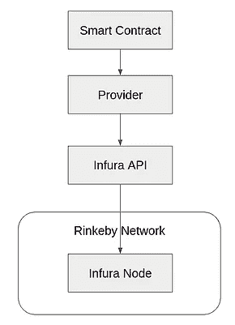
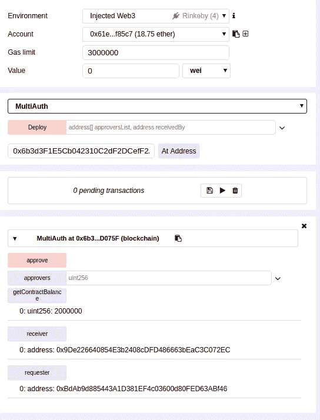

# 使用 Web 应用程序开发以太坊智能合约—第 2 部分:测试和部署

> 原文：<https://medium.com/coinmonks/ethereum-smart-contract-development-with-a-web-app-part-2-testing-and-deployment-34a885e750b2?source=collection_archive---------4----------------------->


在本指南中，您将了解将 web 应用程序转换为 dApp 所需的全部知识。本教程非常适合那些有一些创建智能合同的经验，但是不知道如何真正应用他们的知识用 dapp 做一些有用的东西的人。那我们开始吧。

ICOs，智能合约，Mist，Remix，Metamask，geth，web3。如果你花一点时间尝试进入以太坊开发的世界，你很可能已经看到了这一切。

一些人将智能合约部署到测试网络，另一些人指导你阅读黄皮书，还有一些人鼓励你使用 truffle 套件，因为它非常出色。而你在那里，不知道具体要做什么，也不知道一切是如何配合的。

这是博客系列的第二部分，包含以下章节。

1.  [在 solidity 中开发智能合同，并将其部署在其中一个测试网络中](/@priyalwalpita/ethereum-smart-contract-development-with-a-web-app-part-1-develop-the-smart-contract-ee2a7c735936)
2.  在真实网络(Rinkeby Network)中自动测试和部署您的智能合约
3.  构建一个前端 web 层来与智能合约进行交互。
4.  在您自己的多节点以太网上部署智能合约

如果你还没有看完[的第一部分](/@priyalwalpita/ethereum-smart-contract-development-with-a-web-app-part-1-develop-the-smart-contract-ee2a7c735936)，我建议你浏览一下第一部分，然后开始关注这篇文章。如果你对以太坊和 solidity 中的智能合约开发很熟悉，那么你可以进入这篇文章。

我们将使用我们在第一部分中开发的相同的智能合约。在这篇文章中，我们使用[松露框架](https://truffleframework.com/)来签约创建、本地测试和部署。最终，智能合同将被部署到 Rinkeby 测试网络中进行真正的测试。

Truffle 框架包含了一个很棒的工具集来执行许多以太坊操作，但即使是现在仍有许多开发在进行。这个框架被认为不是那么稳定。所以当你使用这样一个框架时，你需要做好失败的准备。

**设置测试和部署环境**

在上一篇文章中，我们已经使用了 [Remix](http://remix.ethereum.org/) online IDE 来创建我们的智能合约，并使用了它自己的测试环境。当你在生产级的真实应用程序中工作时，一个在线 IDE 是不够的。

在您的本地计算机中设置以下文件夹结构以继续。无需在文件中添加任何内容，只需暂时保留空白即可。


Image 1 : Folder Structure

我使用 Linux 作为操作系统，VS 代码作为本地 IDE。但是你可以使用任何你喜欢的操作系统或者集成开发环境。

转到项目文件夹的根目录，执行 npm init 命令。这将初始化所有需要的文件结构和需要的库。为所有必需的参数提供默认值。

下一步我们需要配置编译器。我们将使用 solidity 编译器来编译我们的智能合同。

> npm 安装—保存 solc

接下来，我们需要将合同代码从 Remix 复制并粘贴到 multiauth.sol 文件中。

然后我们需要创建我们的 compile.js 文件，如下所示。

```
**const** path = require('path');
**const** fs = require('fs');
**const** solc = require('solc'); 

**const** sourcePath = path.resolve(__dirname,'contracts','multiauth.sol');

**const** source = fs.readFileSync(sourcePath,'utf8');

console.log(solc.compile(source,**1**));
```

这个编译脚本读取源文件并使用 solc 编译器编译它。

保存 compiler.js 文件并运行编译命令，如下所示。

>节点 compile.js

如果一切顺利，它会在控制台中给出以下输出。


Image 2 : Compile output

编译器输出许多属性，如字节码、接口和操作码。如果你还记得上一篇文章，我提到过 solidity 编译器输出两个我们可以利用的部分，字节码和 ABI(应用二进制接口)。运行在 EVM 和接口之上的二进制文件中的字节码是我们用来将智能合约与任何第三方应用程序集成的。

**测试合同**

编译之后，我们需要确保我们编译的契约运行正常，没有任何故障。记住，伙计们，不像我们每天编译和执行的其他程序，以太坊合同是和钱联系在一起的。因此，您需要确保您的代码中没有错误，因为您不希望最终将一些自动事务发送给错误的人。

手动测试是一项低效且乏味的任务。因此，我们需要自动化测试过程，以便在任何更改之后，我们可以用更少的努力快速测试我们的智能合同。

我们需要建立一个本地测试网络，Ganache(正式名称为 TestRPC)可以用于这个目的。Ganache 将提供与 Remix 的测试版 EVM 相同的服务。我们将使用 Web3 库(它与契约的 ABI 交互)来执行我们的测试。下图说明了测试设置。


Image 3 : Bytecode and ABI interface with Ganache

首先，我们需要安装 Web3、Ganache 和 mocha(测试框架)，如下所示。

> npm 安装—保存摩卡

> npm 安装—保存 ganache-cli

> npm 安装—保存 web3@1.0.0-beta.26

我们正在安装 Web3 版本 1.0，因为它支持异步/等待调用和承诺，这对我们的异步编程模式很有用。以前的 web3 版本只支持异步代码的回调。

在 Web3 中，我们需要指定一个提供者来负责与任何以太网(在我们的例子中是 Ganache)的接口。Mocha 框架提供了所有需要的测试功能，比如断言等..如下更改 package.json 文件以包含 mocha 框架。(只需更改脚本->测试属性。

```
{
  "name": "mutiauth",
  "version": "1.0.0",
  "description": "",
  "main": "index.js",
  "scripts": {
    "test": "mocha"
  },
  "author": "",
  "license": "ISC",
  "dependencies": {
    "ganache-cli": "^6.1.4",
    "mocha": "^5.2.0",
    "solc": "^0.4.24",
    "web3": "^1.0.0-beta.26"
  }
}
```

Ganache 提供了一些未锁定的缺省值(您不需要担心这些帐户的私有/公共密钥)来测试我们的合同。

编辑 multiauth.test.js 文件，如下所示，列出我们所有的 ganache 本地测试帐户。

注意，我们在这里执行一个空断言，只是为了列出我们的测试帐户。

```
**const** assert = require('assert');
**const** ganache = require('ganache-cli');
**const** Web3 = require('web3');

**const** provider = ganache.provider();
**const** web3 = **new** Web3(provider);

beforeEach( async ()=> {

    // Get list of all accounts       
     web3.eth.getAccounts() 
         .then(fetchedAccounts => {
            console.log(fetchedAccounts);
        });    

});

describe('MultiAuth',()=>{
    it('contract deployment',()=>{});
});
```


Image 4 : Ganache testaccounts

您可以看到它包含 10 个测试帐户。这些账户预装了足够的 ETH，所以我们可以用它们来汇款和执行其他功能。

接下来，我们将把我们的契约部署到 Ganache，并测试部署过程。在改变测试脚本之前，我们需要对我们的编译脚本做一个小小的改动。之前，我们只是记录了编译命令的输出。为了将这个输出注入到测试脚本中，我们需要做如下的改变。

module . exports = solc . compile(source，1)。合同[':多授权']；

如下更新测试脚本。

```
**const** assert = require('assert');
**const** ganache = require('ganache-cli');
**const** Web3 = require('web3');

**const** provider = ganache.provider();
**const** web3 = **new** Web3(provider);

//get output of the compilers  
**const** {**interface**,bytecode} = require('../compile');
**let** auth;
**let** accounts;

beforeEach( async ()=> {

    // Get list of all accounts       
    accounts = await web3.eth.getAccounts();

    auth = await **new** web3.eth.Contract(JSON.parse(**interface**))
        .deploy({data:bytecode, arguments:[[accounts[**1**],accounts[**2**]],accounts[**3**]]})
        .send({from:accounts[**0**], gas: '1000000', value: '2000000000'});

});

describe('MultiAuth',()=>{
    it(' Deployment and log ', async ()=>{
        console.log(auth);
    });

});
```

在这个测试脚本中，我们将导入 compile.js 文件的输出，并将接口和字节码元素赋给一个常量。然后，我们使用 ABI(接口变量)将所需的参数传递到契约中。我们需要指定初始气体量、我们正在部署的帐户以及智能合同的初始值。

最后，我们将部署过程的输出记录到控制台中。如果一切顺利，您将能够在控制台中检查部署的结果。

是时候写下一些真实的断言来测试我们的智能契约了。我们将测试以下项目。

1.接收器

2.合同余额

3.审批过程

4.接收方的最终余额

下面是使用断言的完整测试脚本。

```
**const** assert = require('assert');
**const** ganache = require('ganache-cli');
**const** Web3 = require('web3');

**const** provider = ganache.provider();
**const** web3 = **new** Web3(provider);

//get output of the compilers  
**const** {**interface**,bytecode} = require('../compile');
**let** auth;
**let** accounts;

beforeEach( async ()=> {

    // Get list of all accounts       
    accounts = await web3.eth.getAccounts();

    auth = await **new** web3.eth.Contract(JSON.parse(**interface**))
        .deploy({data:bytecode, arguments:[[accounts[**1**],accounts[**2**]],accounts[**3**]]})
        .send({from:accounts[**0**], gas: '1000000', value: '20000000000000000000'});

});

describe('MultiAuth',()=>{

    it('Testing Receiver  ', async ()=>{
        assert.equal(await auth.methods.receiver().call(),accounts[**3**]);
    });

    it('Testing The Contract balance  ', async ()=>{
        **const** bal = await auth.methods.getContractBalance().call();
        assert.equal(bal,'20000000000000000000');   
    }); 

    it('Testing The Approval ', async ()=>{
       await auth.methods.approve().send({from:accounts[**1**]}); // First approver 
       await auth.methods.approve().send({from:accounts[**2**]}); // Second approver     
    });

    it('Testing The Receivers balance ', async ()=>{         
      **const** accBal = await  web3.eth.getBalance(accounts[**3**]);
      assert.ok(accBal >= **120000000000000000000**);        
     });
});
```

执行以下命令来运行测试。

> npm 运行测试

如果您的所有测试都通过了，您将能够看到如下消息。


Image 5: Test results

**将合同部署到真实的测试网络中**

测试成功后，现在我们需要将合同部署到真实的网络中。在本帖中，我们将把智能合约部署到 Rinkeby 网络中。

与我们的测试环境不同，Rinkeby 网络没有开放的测试帐户。因此，首先，我们需要在 Rinkeby 网络中设置几个示例帐户。你可以使用[元蒙版](https://metamask.io/)工具轻松做到这一点。

将元蒙版工具安装到你的浏览器中，你就可以随心所欲地创建多个账户。为了得到一些乙醚测试(在林克比)，你使用[林克比水龙头。](https://faucet.rinkeby.io/)你需要做的就是在社交媒体网站上发布你的账户地址。

为了将我们的合同部署到一个真实的网络中，我们必须有一个以太坊节点。但是配置它并不是一件容易的事情，这也超出了这篇博文的范围。因此，我们将使用 [Infura](https://infura.io/) 来部署我们的合同。一旦你注册，你会得到一个 API 密钥和每个网络的端点。我们要去那些 API 端点部署我们的合同。

以下是高级部署图。



Image 6 : Deployment diagram

接下来，我们需要编写部署脚本。首先，你需要安装松露钱包提供者如下。

> npm 安装—保存 truffle-hdwallet-provider

下面是 deploy.js 代码。

```
**const** HDWalletProvider = require('truffle-hdwallet-provider');
**const** Web3 = require('web3');
**const** {**interface**,bytecode} = require('./compile');

**const** provider = **new** HDWalletProvider(
    '<your mnemonic>',
    'https://rinkeby.infura.io/<your Infura API Endpoint>'

);

**const** web3 = **new** Web3(provider);

**const** deploy = async () => {
    **const** accounts = await web3.eth.getAccounts();

    console.log('Deploying to the Network using account : ', accounts[**0**]); 

    **const** result = await **new** web3.eth.Contract(JSON.parse(**interface**))
     .deploy({data: '0x'+ bytecode, arguments: [['0x61Ee7fA43ff49d4E9CC680E6031F074bd4BF85c7','0xBdAb9d885443A1D381EF4c03600d80FED63ABf46'],'0x9De226640854E3b2408cDFD486663bEaC3C072EC']})
     .send({gas: '1000000', from : accounts[**0**], value: '2000000' });

    console.log('Contract Deployed to : ', result.options.address);
};

deploy();
```

我们使用 truffle-hdwallet-provider 来配置 Infura API。注意传入元掩码助记符和 InfuraAPI 来访问我们的帐户。然后，我们需要在部署脚本中指定正确的参数列表和其他相关参数。请确保提供有效的地址作为参数，因为我们需要使用这些帐户执行智能合同。

最后，我们将记录我们已经部署了智能合约的地址，因为我们需要知道我们的智能合约是在哪里部署的。


Image 7 : Deployment output

我们可以使用 [EtherScan](https://rinkeby.etherscan.io/) 来分析您的智能合约在何处以及如何部署。它记录了 Rinkeby 网络中的所有交易，并使用易于使用的网页进行展示。

为了分析我们所做的交易，复制合同的部署地址并粘贴到搜索栏中。


Image 8 : Deployed Smart contract details

您可以看到合同的余额、块号、部署合同的地址等..因此，如果我们准备好了一个 web 应用程序，那么我们就可以与这个契约进行交互。我们将在这个博客系列的下一部分讨论这个问题。

但在那之前，我们有一种方法可以用混音来测试。在你的浏览器中打开 Remix 工具，进入 Run 标签。将环境更改为 Injected Web3。现在，您可以看到帐户设置为您在元蒙版工具中选择的帐户，余额就是该帐户的余额。


Image 9: Remix Account properties

将已部署契约的地址复制到“At Address”部分，然后您就可以将已部署契约加载到 Remix 中。您可以检查余额、请求者地址等..使用混音工具。



Image 10 : Testing in Remix

**使用 Remix 执行合同的功能**

现在，从元掩码工具中选择任何批准者帐户。使用帐户下拉菜单确保您在连接帐户中。尝试使用“批准”按钮批准合同。

您将从 Meta mask wallet 得到一个提示，询问您是否同意执行交易。因此，这将发送一些以太网到目标地址(合同的地址)。


Image 11 : Confirm Metamask transaction

给你一些时间来挖掘你的交易(是的，现在你是在一个真正的以太网:D)并使用合同中的批准者按钮分析批准状态。您可以看到第一个审批人批准了合同。


Image 12 : Smart contract approval status

请所有必需的审批人批准合同。

现在，去看看接收者的账户，看看那里发生了什么。您将能够看到特定的帐户收到了合同的余额。

**结论**

在这篇文章中，我们使用 mocha 和 truffle 框架进行了智能合约测试。然后，我们将智能合约部署到一个真实的测试网络(Rinkeby)中，并使用 Remix 工具与部署的智能合约进行交互。

希望在下一节中看到您，构建一个 web 应用程序来与这个智能契约进行交互。

你可以在[这个 git repo](https://github.com/priyalwalpita/Ethreum-MultiAuth) 中找到源代码文件。