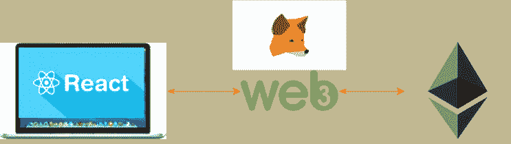

# 使用 Web 应用程序开发以太坊智能合约—第 3 部分

> 原文：<https://medium.com/coinmonks/ethereum-smart-contract-development-with-a-web-app-part-3-71cb51144249?source=collection_archive---------6----------------------->



在这篇文章中，你将会学到一些如何将以太坊(使用 solidity 开发的)智能合约转换成有用的 web 应用程序的知识。这是以太坊智能联系人开发博客系列的第三部分。如果这是你提到的第一个帖子，我建议你访问以前的帖子，了解一些关于在以太坊中使用 Solidity 进行智能合约开发的知识。在本例中，我也将使用我们在前面部分中开发的智能合约。在这篇文章中，我只是在之前部署的智能合约中添加了一个用户界面层。

以下是这个博客系列的其他主题。

1.  [在 Solidity 中开发智能合同，并将其部署在其中一个测试网络中](/coinmonks/ethereum-smart-contract-development-with-a-web-app-part-1-develop-the-smart-contract-ee2a7c735936)
2.  [在真实网络(Rinkeby 网络)中自动测试和部署您的智能合约](/coinmonks/ethereum-smart-contract-development-with-a-web-app-part-2-testing-and-deployment-34a885e750b2)
3.  构建一个前端 web 层来与部署的智能合同进行交互(本文)
4.  在您自己的多节点以太网上部署智能合约

在这篇文章中，我将使用 ReactJs web toolkit 开发一个 web 应用程序，与以太坊 Rinkerby 网络中部署的智能联系人进行交互。您可以使用任何其他语言/工具来开发 web 前端，但是，与其他工具相比，ReactJs 包含一些很好的工具，您可以轻松地与 Web3 框架集成。

首先我们需要安装 npm 包来创建一个 React 应用程序。

> sudo NPM install-g create-react-app

然后我们需要使用下面的命令创建 react 应用程序。

>创建-反应-应用程序多重授权

当您创建 react 应用程序时，它会创建一个样板模板，您可以从这里开始工作。它包含所需的主要文件，如 index.heml、app.js、index.js、index.css 等..

Web3 是一个包，我们将使用它作为已部署智能合约的接口，并访问加密钱包(元掩码)

> npm 安装—保存 web3@1.0.0-beta.26

现在我们有东西开始我们的开发工作了。在开始开发工作之前，我想解释一件小事。我希望此时你已经熟悉了 MetaMask 钱包。如果您已经将它作为插件安装在浏览器中，它会自动将 web3 提供程序添加到您的浏览器中。因此，当我们开发我们的网络应用程序时，我们可以使用相同的插件。然而，问题是使用 MetaMask 安装的缺省 Web3 版本是 0.2*(截至本文撰写之日)。但是我们需要 Web3 版本 1.0 来使用我们的智能合约。因此，我们需要做的是用我们需要的版本覆盖元掩码的默认版本。

下图描述了 Web3 提供程序的格式。


Image : ReactJs App interface with Web3

接下来，我们必须设置所需的库和样板工程。现在让我们关注如何处理编码，以便与我们在 Rinkerby 网络中部署的智能契约进行交互。

首先，我们需要创建一个 js 文件来指定我们的 ABI(应用程序二进制接口)和部署地址。如果你不知道如何得到它，请参考我以前在这个博客系列中的文章。

在这个例子中，我将使用 multiauth.js 文件来满足这个需求。

```
import web3 **from** './web3';

**const** deployeAddress = '**0**x101D450A5Cf279A4875fb31dA5791546406D0767';

**const** deployedAbi = [{"constant":**false**,"inputs":[],"name":"approve","outputs":[],"payable":**true**,"stateMutability":"payable","type":"function"},{"constant":**true**,"inputs":[],"name":"getContractBalance","outputs":[{"name":"","type":"uint256"}],"payable":**false**,"stateMutability":"view","type":"function"},{"constant":**true**,"inputs":[],"name":"requester","outputs":[{"name":"","type":"address"}],"payable":**false**,"stateMutability":"view","type":"function"},{"constant":**true**,"inputs":[{"name":"","type":"uint256"}],"name":"approvers","outputs":[{"name":"approver","type":"address"},{"name":"isApproved","type":"bool"}],"payable":**false**,"stateMutability":"view","type":"function"},{"constant":**true**,"inputs":[],"name":"receiver","outputs":[{"name":"","type":"address"}],"payable":**false**,"stateMutability":"view","type":"function"},{"inputs":[{"name":"approversList","type":"address[]"},{"name":"receivedBy","type":"address"}],"payable":**true**,"stateMutability":"payable","type":"constructor"}];

export **default** **new** web3.eth.Contract(deployedAbi,deployeAddress);
```

我们需要在代码中指定部署的地址(部署到 Rinkerby 网络中的智能合约的地址)和 ABI，并从该文件中导出合约对象。

web3 包封装在文件(web3.js)中，如下所示。

```
import Web3 **from** 'web3';

**const** web3 = **new** Web3(window.web3.currentProvider);

export **default** web3;
```

该文件用于覆盖我们安装到该应用程序中的版本的 MetaMask 的默认 web3 版本(v0.20)。

最后，也是最重要的，我们需要如下所示的 app.js 文件。我将带您浏览每个部分并描述其功能。

```
import React, { Component } **from** 'react';
import logo **from** './logo.svg';
import './App.css';
import web3 **from** './web3';
import auth **from** './multiauth';

**class** **App** extends Component {

  constructor(props){
    super(props);

    **this**.state = {requester : '', receiver:'', balance: '', message:''};
  }

 **async**  **componentDidMount**(){
    **const** requester = **await** auth.methods.requester().call();
    **const** receiver = **await** auth.methods.receiver().call();
    **const** approvers = **await** auth.methods.approvers(**0**).call();
    **const** balance = **await** web3.eth.getBalance(auth.options.address);

    **this**.setState({requester,receiver,balance});
  }

  onSubmit = **async** (**event**)=>{
      **event**.preventDefault();
      **const** accounts = **await** web3.eth.getAccounts();

      **this**.setState({message: 'Approving the smart contract ..... Mining **in** process ! '});
      **await** auth.methods.approve().send({**from**: accounts[**0**]});
      **this**.setState({message: 'Smart Contract approved'});
  };

  render() {
    **return** (
        <div>
          <h1> Multi Party Auth systems  </h1>
          <p> This **is** approval **is** requested by {**this**.state.requester}</p>
          <br/>
          <p> This **is** approval will be received By {**this**.state.receiver}</p>
          <br/>
          <p> This **is** approval amount **is** :  { **this**.state.balance} Wei </p>
          <hr/>
          <form onSubmit={**this**.onSubmit}>
            <h3>Approve the contract</h3>
            <div>
              <input
                **value** = {**this**.state.**value**}
                onChange = { **event** => **this**.setState({**value** : **event**.target.**value**})}
              />
              <button>Aprove the contract</button>
            </div>
          </form>
          <hr/>
          <h3>{**this**.state.message}</h3>
        </div>

    );
  }
}

export **default** App;
```

一旦呈现了所有组件(componentDidMount 方法)，应用程序就访问关于该智能合约的所需信息。我们可以在 render 方法中呈现这些信息。

当应用程序启动时，它看起来如下。


Image 2 : ReactJs App User Interface

你可能会看到网页看起来不酷，但它会按要求做工作。

在这个智能合同中，最重要的方法是批准。这是可以批准智能联系人的地方。如果您检查代码，您可能已经注意到我们正在使用一个基于索引的帐户来批准合同，如下所示。

等待 auth.methods.approve()。发送({发件人:帐户[0]})；

这些帐户是从元掩码工具中获取的，帐户[0]表示元掩码中选定的帐户。该帐户通过 MetaMask 安装的内置 web3 与浏览器连接。

一旦正确的用户触发了批准按钮，您可能会发现处理交易需要一些时间(大约 30-120 秒)。这是我们可以体验传统交易和区块链交易的主要区别。您可以在传统数据库驱动的应用程序中非常快速地(几毫秒)处理这种事务。但请记住，当涉及到区块链交易时，我们需要进行挖掘。

一旦用户单击 approve 按钮，MetaMask 就会弹出，提示您批准继续进行交易。


Image 3 : MetaMask payment conformation

您可以看到元掩码正在执行从您选择的帐户到部署的智能合约的地址的交易。

**结论**

恭喜你！您在以太坊网络中使用 Solidity、Web3 和 ReactJs 实现了一个端到端的应用。我希望你喜欢这个博客系列，并准备在 Ethrerum 中实现你自己的智能合同。ReactJs 应用程序需要更多的修补，如验证、UI 改进、异常处理等..但是它包含了你需要开始的所有骨架。

如果你有任何疑问/担忧，那么你可以给我发一封电子邮件到 [LinkedIn](https://www.linkedin.com/in/priyalwalpita/) 或 [Twitter](https://twitter.com/@priyalthegeek) 给我发信息。我只差一条消息:)感谢阅读！

> [直接在您的收件箱中获得最佳软件交易](https://coincodecap.com/?utm_source=coinmonks)

[](https://coincodecap.com/?utm_source=coinmonks)