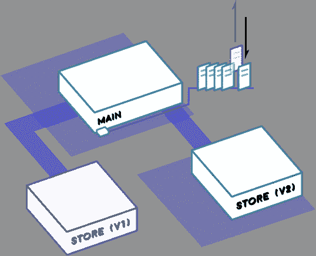

# 以太坊智能合约迁移

> 原文：<https://medium.com/coinmonks/ethereum-smart-contract-migration-13f6f12539bd?source=collection_archive---------0----------------------->



*这是摘自*[](https://concurrence.io/)**[*的契约迁移*](https://concurrence.io/exploration/contractmigration/) *的探索。***

**当发现错误或需要新功能时，我们将需要一种从前体迁移到后代的方法。正如在[契约沿袭](https://concurrence.io/abstract/contractlineage)一节中提到的，我们将努力保持契约的简单，我们将创建一个沿袭的链表，这样区块链内外的其他契约和脚本就可以通过地址追踪到最新版本。**

**让我们从一个名为 **Store** 的新合同开始，它将保存顶级加密货币的当前价格(这也将有助于演示 oracle 的某些方面)。这个契约将使用*映射*数据类型来存储一个*字节 32* = > *uint* 关系，称为**价格**:**

**只有合同的所有者能够运行一个调用 **setPrice()** 函数来更新**价格** *映射*的挖掘器。然后，区块链上的其他合约可以调用 **getPrice()** 来检索某种货币的价格。我们将使用互联网端点[https://api.coinmarketcap.com/v1/ticker/](https://api.coinmarketcap.com/v1/ticker/)来检索数据。这个 url 将被传递给 **Store** 构造函数，通知矿工从哪里获取数据。**

**我们还将扩展一个名为**前任**的新契约，使所有者能够定义一系列**后代**地址:**

**请注意，**商店**中的**价格**映射不像[以前的合同](https://concurrence.io/exploration/deployingacontract/)那样是公共的，我们有一个 **getPrice()** 函数来代替。这允许我们在请求数据时有更多的控制权。我们可以查看是否设置了一个**后代**，并转发 **getPrice()** ，而不是立即传递价格。**

**让我们编译并部署**商店**:**

```
**node compile Store 
node deploy Store**
```

**(在 [etherscan.io](https://ropsten.etherscan.io/tx/0x47385af159170c14e2fa99433ee768659ab9a4157c087b64aec65396f8917ac2) 上的部署交易)**

```
**0x68a3724eb459c0d70c7f3148b86a1b42e718c27b**
```

**(我们将不包括进行这些查询所必需的 javascript 代码，它们与[前几节](https://concurrence.io/exploration/)中的几乎完全相同。)**

**如果我们向它询问一种货币的当前价格，我们应该得到 0x0:**

```
**node contract getPrice Store null ETH PRICE OF [ETH]: $0 USD**
```

**是时候构建我们的第一个请求挖掘器版本来支持这个简化的集中式 oracle 了:**

**如果我们运行它，它将检索价格并更新合同:**

```
**node contract minePrice Store null BTC,ETH,XRP,BCH,LTC ** Calling price source url:https://api.coinmarketcap.com/v1/ticker/ 
** Symbols: [ 'BTC', 'ETH', 'XRP', 'BCH', 'LTC' ] 
**== setting price for BTC to 5678190000000000 
**== setting price for ETH to 336595000000000 
**== setting price for XRP to 263983000000.00003 
**== setting price for BCH to 314947000000000 
**== setting price for LTC to 65467400000000 ETH 0x40fd6e3097c25fab8f81caae9bd16d44c5de917393e451b27d09b37bd86fdc64 LTC 0x85c55ab4275129132c3f044933ebcca5dec3798a2bc9cf8ba616bee86909774e BCH 0x676aafbfbe07f0d4e0e49599b686d473438113b5358ada27f4349f018ef23ccd XRP 0x1f40ea0c0d776525fc2cd675578f4013d6c00ed4e13feeeb001dccc90168c4df BTC 0xb57d91a2fe56b5c48d9865449e96ef6e171da084bc94a6186ee8d29000517364**
```

**(在 [etherscan.io](https://ropsten.etherscan.io/tx/0x85c55ab4275129132c3f044933ebcca5dec3798a2bc9cf8ba616bee86909774e) 上的一个 Miner 事务【LTC】的例子)**

**哎呀，如果这是在主网上，那会相当昂贵；设定[LTC]映射的价格只需 0.32 美元。这让我们对未来的采矿费用有了一个概念，并帮助我们规划我们的基础设施。正如在[链外共识](https://concurrence.io/abstract/offchainconsensus)部分提到的，我们将希望尽可能多地做链外工作，但最终，为了让其他合同可以获得信息，我们将不得不写信给区块链。**

**我们来问问我们的合同，莱特币现在的价格是多少:**

```
**node contract getPrice Store null LTC PRICE OF [LTC]: $65.4674 USD**
```

**然后让我们进行另一轮挖掘:**

```
**node contract minePrice Store null BTC,ETH,XRP,BCH,LTC ** Calling price source url:https://api.coinmarketcap.com/v1/ticker/ ** Symbols: [ 'BTC', 'ETH', 'XRP', 'BCH', 'LTC' ] 
**== setting price for BTC to 5687570000000000 
**== setting price for ETH to 336711000000000 
**== setting price for XRP to 263952000000.00003 
**== setting price for BCH to 315263000000000 
**== setting price for LTC to 65718300000000 BTC 0x71a874871cfb9083598a2ed50c49b525bcbcad1a73f8f2214312460d73fedba5 BCH 0x0f2891051e472b915cfadb91f3691bd4733768f129e59ca8709f0deabddf2ee1 LTC 0x291da538e1db6545e34edb73fefea4806bfa0f3155ba6cf7b28665f9b105762c XRP 0xdef369acd5b111e31df1c90dbc5afb67e76d7099f24329fa8e325129b50f625f ETH 0xc767d9a6ca3d782b0daf810de60cd03ce3edde2412fef40172786bccdf9f83a5**
```

**我们应该看到莱特币的价格略有上涨:**

```
**node contract getPrice Store null LTC PRICE OF [LTC]: $65.7183 USD (previously $65.4674)**
```

**太棒了，我们在链上有很好的数据，让我们编写一个名为 **EthVsBch** 的*客户端*合同，它将告诉我们以太币或比特币现金是否更值钱:**

**让我们用 **arguments.js** 中的**存储**地址*硬编码*来编译和部署 **EthVsBch** :**

```
**module.exports = ["0x68a3724eb459c0d70c7f3148b86a1b42e718c27b"]node compile EthVsBch
node deploy EthVsBch**
```

**(在 [etherscan.io](https://ropsten.etherscan.io/tx/0x756d189e11df779f123a751ded6bfa18627c69d3fcfa9a3512f361b2eb83314e) 上的部署交易)**

```
**0xc46A9BAE68Fb60402049202521279494D440F493**
```

**现在让我们获取 **EthVsBch** 的状态，它将命中**存储**并执行其逻辑:**

```
**node contract getState EthVsBch

CURRENT WINNER: Result { '0': 'ETH', '1': '336711000000000' }**
```

**假设 BCH 和瑞士联邦理工学院的价格在这次勘探期间不会交叉，我们不能真正测试所有的可能性，但让我们运行另一轮开采，然后回来检查:**

```
**node contract minePrice Store null BTC,ETH,XRP,BCH,LTC

** Calling price source url:https://api.coinmarketcap.com/v1/ticker/
** Symbols: [ 'BTC', 'ETH', 'XRP', 'BCH', 'LTC' ]
**== setting price for BTC to 5699690000000000
**== setting price for ETH to 336907000000000
**== setting price for XRP to 263843000000
**== setting price for BCH to 316191000000000
**== setting price for LTC to 65846500000000.01

BTC 0xbd5f2ee16e87b7b7d1fa3bf0980af6defd3c0a6033b8d1af7461a7fd56ca78c8
XRP 0x73df00e7bca3f4bb1747056210d904c6badf9ae13e06639f0434e8db2ba0d9b7
ETH 0x92d0ffb887b7967c50d6dea88d11d8c59e93532fd50ab348f7b3ce7b318fbf4d
BCH 0x7fb8f2ae02a88a1d0d2d6618624e2ba1dada2135dfdf976350a141c80caffd8c
LTC 0xe3b60849d769d3351f445d9620166020993e25c59432935dbe1cdebbf997878a node contract getState EthVsBch

CURRENT WINNER: Result { '0': 'ETH', '1': '336907000000000' }
(previously '336711000000000')**
```

**太好了，所以当我们的矿工继续为**商店**合同提供数据时，区块链的其他合同可以获得这些数据来做出决策。但是，合同如何知道**商店**中的数据是否已经过期？如果将来我们收到开发商的请求，要求我们添加一个**单元**来告诉他们价格有多旧呢？让我们现在就开始吧:**

**请注意，这个新版本的**存储**保留了一个 **lastUpdate** *uint* ，它在矿工运行更新时被设置为 **block.number** 。该合同还必须向后兼容，因为 **EthVsBch** 的第一个版本需要继续与硬编码的前一个**商店** *地址*一起工作，但是由于天然气成本和复杂性，我们只希望采矿者更新一个合同(单一真实来源)。让我们编译和部署下一个版本的**商店**:**

```
**node compile Store
node deploy Store**
```

**(在 [etherscan.io](https://ropsten.etherscan.io/tx/0xcb9a83f1f157e45e1edb55c584a7180bb4c373c366ce482d03684ae6eed5b49d) 上的部署交易)**

```
**0xD0557B2c5A11F8B5F2635Bfa57dEb8dCF6021475node contract getState Store

OWNER:0xA3EEBd575245E0bd51aa46B87b1fFc6A1689965a
SOURCE:https://api.coinmarketcap.com/v1/ticker/
DESCENDANT:0x0000000000000000000000000000000000000000

node contract getPrice Store null ETH

PRICE OF [ETH]: $0 USD

node contract getLastUpdate Store

LastUpdate:0**
```

**因此，新合同是空的，旧合同仍然运行良好。转换过程要求我们在建立沿袭之前在新契约中获得一些数据，这样外部开发人员的契约就不会获得空数据。让我们进入新的**商店**:**

```
**node contract minePrice Store null BTC,ETH,XRP,BCH,LTC

** Calling price source url:https://api.coinmarketcap.com/v1/ticker/
** Symbols: [ 'BTC', 'ETH', 'XRP', 'BCH', 'LTC' ]
**== setting price for BTC to 5681640000000000
**== setting price for ETH to 336505000000000
**== setting price for XRP to 264403000000
**== setting price for BCH to 315928000000000
**== setting price for LTC to 65956700000000

BCH 0x0fd5fe447795cbff9b33f0a349caa8545bd8fb4db3149a2ed75f36e9dfacd409
ETH 0x6b134c98fe962a7bbfb6f27fb155b49dce980d7ca3eab6a22b6c299465efcc7e
BTC 0x6102e186a2f84447dd9143e5a11a943ddddb0820e4eccb06184c0f616b8986e8
XRP 0x2b7cad141ebc3f4e9687202c7df8d23460f5fa65a34711d88b9ced1b6553374d
LTC 0x6da8151bb660e489d94bb592cc42c526cb88b70b15d3452273d82bf12e1b67d7node contract getPrice Store null ETH

PRICE OF [ETH]: $336.505 USD

node contract getLastUpdate Store

LastUpdate:1878626**
```

**因此，现在我们可以获得价格更新的最后一个块号，并且我们可以在外部合同中使用它，以便仅在处理当前价格时执行功能。**

**随着新契约填充了数据，我们已经准备好让遗留契约开始与它接口，而不是以前的版本。为了触发这个迁移，我们将从**的前任**调用 **setDescendant()** 来开始将 **getPrice()** 传递到最新版本的 **Store** :**

```
**node contract getDescendant Store previous DESCENDANT:0x0000000000000000000000000000000000000000 node contract setDescendant Store previous**
```

**(在 [etherscan.io](https://ropsten.etherscan.io/tx/0xf45124e60c86e9f26368f3cd05b185af4931464b6a3d26fed45e30fbd363a0d4) 上的迁移交易)**

```
**node contract getDescendant Store previous

DESCENDANT:0xD0557B2c5A11F8B5F2635Bfa57dEb8dCF6021475**
```

**太神奇了，前任**店**现在有了后代**店**，让我们看看 **EthVsBch** 契约与新**店**沟通愉快吗:**

```
**node contract getState EthVsBch CURRENT WINNER: Result { '0': 'ETH', '1': '336505000000000' }**
```

**它从最新的**商店**获取最新价格，即使旧的**商店** *地址*被硬编码。我们的迁移已经完成，挖掘器可以继续更新最新的**存储**。**

**现在，假设开发人员决定在他们的 **EthVsBch** 合同中实现块号检查:**

**请注意，开发人员正在检查价格信息是否过期 10 个街区，如果是，将返回一个错误。**

**让我们编译并部署它来进行测试。还是那句话，开发者会*硬编码*(哥们，没有更好的办法了吗？)新**店** *地址*:**

```
**module.exports = ["0xD0557B2c5A11F8B5F2635Bfa57dEb8dCF6021475"]node compile EthVsBch
node deploy EthVsBch**
```

**(在 [etherscan.io](https://ropsten.etherscan.io/tx/0xc9d574351948647bcf515605a90b0615f3ba1b5eed40b1d637b45f7e37a64a88) 上的部署交易)**

```
**0x8507E664d156d9deF72759F314629486783CDC49**
```

**有了新版本的契约，并且暂时没有挖掘数据发送到**存储**中，我们应该会得到一条关于陈旧数据的消息:**

```
**node contract getState EthVsBch

CURRENT WINNER: Result { '0': 'OUTOFDATE', '1': '0' }**
```

**现在让我们运行挖掘器并更新数据:**

```
**node contract minePrice Store null BTC,ETH,XRP,BCH,LTC

** Calling price source url:https://api.coinmarketcap.com/v1/ticker/
** Symbols: [ 'BTC', 'ETH', 'XRP', 'BCH', 'LTC' ]
**== setting price for BTC to 5686980000000000
**== setting price for ETH to 338896000000000
**== setting price for XRP to 264500000000
**== setting price for BCH to 316889000000000
**== setting price for LTC to 65747699999999.99

BTC 0x5991181b611b27aea7ee199e80f8f94ecf25ff84846f5e8afe97404ed7c0d585
ETH 0xc1649f7d16562b796318ef3c34e69a97a66a0f0f804cc00aa2c7e36355750816
BCH 0x170fca205d15bf57227a38d09e903718a22461a6289f6760b05dd120902b93f7
LTC 0x492ad533be63dfe8892001f6cb9d7c64de03d95829c3ae7adb72c47db847939a
XRP 0xca81f55994fb58b30f1f7bcb42cb072ce5a6665f29e3710bd79577f3cf77f712 node contract getState EthVsBch

CURRENT WINNER: Result { '0': 'ETH', '1': '338896000000000' }**
```

**整洁！一个完整的开发周期，我们的合同和开发人员的合同都得到了新功能的更新，而不破坏遗留版本。**

> **[直接在您的收件箱中获得最佳软件交易](https://coincodecap.com/?utm_source=coinmonks)**

**[](https://coincodecap.com/?utm_source=coinmonks)**

***这是节选自*[](https://concurrence.io/)**[*契约迁移*](https://concurrence.io/exploration/contractmigration/) *的探索。*****

**阅读更多关于我们的[去中心化 Oracle 探索](https://concurrence.io/abstract/)的信息。**