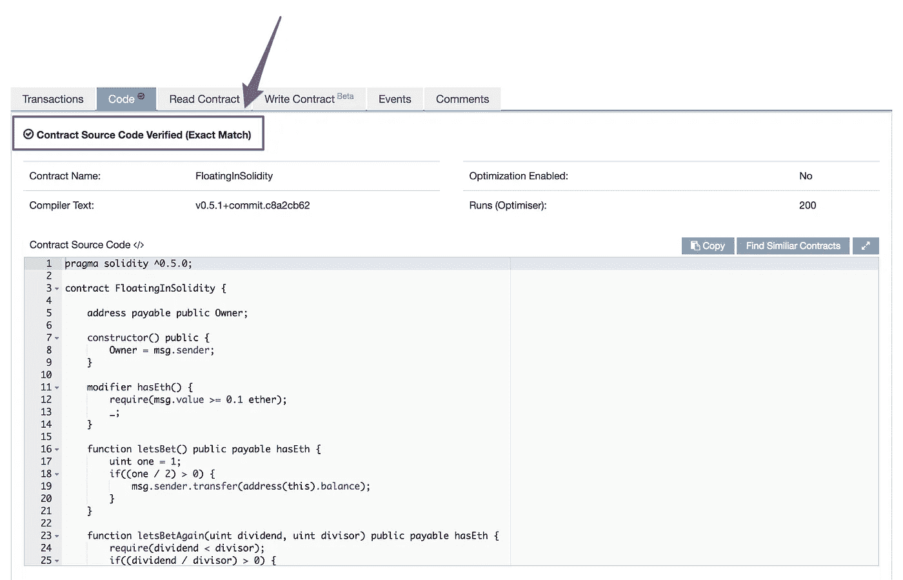

# 以太坊智能合约安全|程序员解释

> 原文：<https://medium.com/coinmonks/ethereum-smart-contract-security-programmer-explain-77723c4cde68?source=collection_archive---------0----------------------->

## 「数学系」

```
**Goal:** To write a smart contract with **explicit** vulnerabilities that attack naïve attackers to launch attack against, whereas which locks up the funds of the attackers.**Expected Attacker Behavior:** Naïve attacker will send the 0.1 Ether in order to get all the money from smart contract.Take away: (**For Solidity Smart Contract Developer**)
It is better to use [SafeMath](https://github.com/OpenZeppelin/openzeppelin-solidity/blob/master/contracts/math/SafeMath.sol) whenever you are dealing with number calculation in Solidity.
```

> 步骤 1
> **找到新创建的已验证的合同**
> 攻击者将使用网络爬虫获取所有新创建的合同，并查看该合同是否已被验证。一旦合同被验证，它会显示智能合同源代码。



> 第二步
> 让我们做一个简单的数学计算

```
Do you think the following math statement is a true?**(1 / 2) > 0**--------------------------------------------------------------------In **Javascript****(1 / 2) > 0    <- will return true**is a true/positive statement.--------------------------------------------------------------------In **Solidity****(1 / 2) > 0    <- will return false**is a false/negative statement.**Reason:** Currently, Solidity does not provide float/double data types.
```

让我们回顾一下。

目前，Solidity 不提供 float/double 数据类型。所以最好使用 [SafeMath](https://github.com/OpenZeppelin/openzeppelin-solidity/blob/master/contracts/math/SafeMath.sol) 来避免这种意外结果的发生。

请在 Etherscan 上查看这份[智能合同](https://etherscan.io/address/0xc2d4f0e0891f1f72d95c320e0571e005e297aefa)。

**关于我**
我是一名全栈 javascript / DApps 开发者，也是开源区块链项目 [DEXON](https://medium.com/u/1d41c18242ad?source=post_page-----77723c4cde68--------------------------------) 和 [NEO](https://medium.com/u/95d056302ecb?source=post_page-----77723c4cde68--------------------------------) 的贡献者之一。

请随时通过 [Gitter](https://goo.gl/zTrF7J) 联系我。或者跟着我 [Wayne Chiu](https://medium.com/u/f2be1f70f3b9?source=post_page-----77723c4cde68--------------------------------) 。


```
**Disclamer**
This is only for education purpose for smart contract vulnerabilities that you might encounter while developing smart contract.
```

> [直接在您的收件箱中获得最佳软件交易](https://coincodecap.com/?utm_source=coinmonks)

[](https://coincodecap.com/?utm_source=coinmonks)