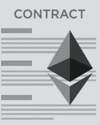

# 以太坊——智能合约和区块链原则

> 原文：<https://medium.com/coinmonks/ethereum-smart-contracts-and-blockchain-principles-9dcbd135142?source=collection_archive---------8----------------------->

以太坊是目前最有趣的区块链平台。我对 [IOTA](https://www.iota.org/) 和 [HashGraph](https://www.hederahashgraph.com/) 很感兴趣，因为它们声称解决了以太坊和几乎大多数平台/令牌都存在的可扩展性问题，然而它们没有以太坊那样广泛的采用和丰富的生态系统。得益于比特币纸币，区块链在 2009 年开始流行，但市场和开发行业仍相当新。以太坊允许我们创建智能合约，这比你使用比特币时得到的要强大得多。区块链和以太坊平台中的大多数想法都不是新的，它们是相当老的概念，比如[密码学](https://en.wikipedia.org/wiki/Cryptography)、[不变性](https://en.wikipedia.org/wiki/Immutable_object)、[分布式计算](https://en.wikipedia.org/wiki/Distributed_computing)和[一致性算法](https://en.wikipedia.org/wiki/Consensus_(computer_science))。显然，金融行业是区块链的第一个应用领域，但是，我们并不局限于金融应用，我们还可以应用于许多其他行业，如医疗保健、农业、能源、房地产、法律、保险、教育、政府和许多其他行业。在这里你可以查看[其他用例](/fluree/blockchain-for-2018-and-beyond-a-growing-list-of-blockchain-use-cases-37db7c19fb99)。今天我想和你分享一些关于 [Solidity](http://solidity.readthedocs.io/en/v0.4.24/) 的见解，Solidity 是一种以太坊高级语言，用于运行在 EVM(以太坊虚拟机)上的智能合约。

区块链是怎么回事？

基本上一个字:“信任”或者说“信任不足”。都是“信任”的问题。区块链是关于分布式分类帐的，这意味着所有对等体都有权读取分类帐。交易被加密，所以没有人能看到谁是谁。关于区块链的另一个非常重要的方面是不可变的事实，一旦你在一个“块”中写了东西，你就不能回滚。您将需要编写另一个块或部署一个新版本的智能契约，它知道如何处理您所犯的“潜在”更改或错误。你可能想知道分布式系统一点都不新鲜——那么有什么区别呢？让我们想想对等系统，它们并没有什么不同，但区块链也是关于不变性和检查数据是否被“更改”的能力，这要归功于加密技术，你可以证明数据是正确的，没有被更改。为什么会这样？这完全是因为缺乏信任，所以你不信任一个中央服务器，很多服务器可以读写区块链。我可以构建哪些应用程序？什么是杀手级应用？——嗯，没有杀手级应用——你可以构建类似的应用，就像没有区块链一样，但更“透明”。有些人可能会声称，区块链也为自治系统提供了一个接口，比如说，自动驾驶汽车可以使用以太坊支付通行费或选择最便宜的道路，所有这些都是由我的以太坊智能合同和 API 驱动的。然而，同样可以在没有以太坊或任何其他区块链的情况下，但是以“集中的”不可信的传统方式进行存档。

安全性呢——我们能消除欺诈吗？

有些人声称区块链更安全，并解决了我们在现实生活中遇到的一些问题，然而，这不是 100%正确的，因为不在区块链上的东西和它进入链的那一刻之间的边界是“欺骗”可能发生的时刻。你可能会说，但我在采矿，有了采矿，就可以 100%保证区块是我的——这是真的，但事实并非如此。此外，你可能会说我有一个有 3 个不同密码的钱包(祝你好运，如果你失去了密码:D)，如果我设法用简单的社会工程技术得到你的 3 个密码呢？或者你传递了错误的信息。所以欺诈可能会发生。没有一个系统是 100%防欺诈的。

**公共和私有网络**

大多数人认为他们需要一枚“硬币”来处理所有的事情。那不一定。此外，我们不需要使用以太坊公共网络，我们可以建立一个专用网络，我们只允许一些部分加入网络。不用说，专用网络更安全，也更容易管理和控制。以太坊公共[网络是有意义的](https://ethereum.stackexchange.com/questions/29075/main-network-vs-private-network-pro-and-cons)如果你想创造一些全世界都能很容易访问和消费的东西。假设我们正在构建一个 B2B 解决方案，我们只需要 100 家公司来访问这些数据，这样我们就可以完美地构建一个私有网络，即使我们需要 1 千或 10 万人来访问，如果我们可以构建一个 pivate 网络的话。归根结底，隐私和权限控制也是如此。但重要的是要考虑到这是一个设计元素，我们不应该认为在以太坊中所有东西都需要连接到公共网络。

**坚实度 101**

以太是以太坊的加密货币。你在以太坊智能合约中做的每一件事都要耗费汽油(以太)。交易(消息)中涉及两大实体，即钱包和智能合约。我们才刚刚开始稳固。我不是指这篇文章，而是指目前的市场:

*“94%的合同被叫价不到 10 次*

*5%的合约被叫价 10 到 100 次"*

— [来源](https://hackernoon.com/ethereum-smart-contracts-most-of-them-are-rarely-used-f45749730d3e)。像其他语言一样，Solidity 有许多结构，例如:

*   原始类型
*   用线串
*   IF/Else
*   对于循环
*   映射(K/V 存储，如映射/字典)
*   数组
*   结构
*   合同(如类)
*   多重继承(契约可以扩展其他契约)
*   事件
*   要求(为了进行验证)
*   还有更多

智能契约就像类一样，它们可以有公共或私有方法。您还可以强制某个方法仅在有外部事务时调用(internal | external)。Solidity 为我们编辑合同并执行检查。Solidity 语法类似于 JavaScript。

契约可能调用另一个契约，如果需要，就调用它们自己。你也可以创建“库”，允许你在以太坊或者“[框架](https://github.com/OpenZeppelin/openzeppelin-solidity)”中重用代码。以太坊很烦人，因为你可以做一些数学溢出，但有一些库可以帮助你。比如说[安全数学](https://github.com/OpenZeppelin/openzeppelin-solidity/tree/master/contracts/math)。

智能契约可以被视为纯粹的 RPC 机制(写一些东西然后退出)，或者也可以被视为状态机，你在那里写东西，你可能会进入下一个状态，然后运行其他代码，但所有这些都是以一种不可变的方式进行的(我在这里并不暗示一个长期运行的作业)。

以太坊有一个叫做 [REMIX](https://remix.ethereum.org/) (以前叫做 browser-solidity)的开发的浏览器 ide。让我们看看简单的可靠性代码。

这里我们有一个名为 helloWorld 的 solidity 智能契约，它有一个名为 renderHelloWorld 的公共方法。这个方法是“纯”的，这意味着他们保证不改变区块链状态，只是读取它，这个方法返回一个字符串。

**气体消耗**

这是最有趣的概念之一。基本上，你在 solidity 做的每一行代码，每一条指令都是要花钱的。价值有时很难定义，但成本却很容易。这很好，因为现在好的编程实践让你真的省钱了。可靠是指你在记忆中做的事情和你写在合同上的事情，这显然要花更多的钱。以太是以太坊的加密货币。你在以太坊智能合约中做的每一件事都要耗费汽油(以太)。交易(消息)中涉及两大实体，即钱包和智能合约。如果您不确定要循环多少个元素，那么在以太坊(像在任何语言中一样)中使用 For 循环通常不是一个好主意。For 循环是 O(N ),并且它们还使得执行时间不可预测(也称为非接触时间),这是以太坊中最糟糕的方式，因为随着时间的推移，它会消耗越来越多的气体。以太坊有很棒的工具集，所以你可以在部署合同之前看到一个联系人花费了多少钱/气。这是我们需要特别注意的事情。因为不仅仅是钱或省钱，而且还有糟糕的用户体验，因为更长的执行时间意味着更长的延迟，而且通常是不好的。有些人可能会认为延迟很好，还会说以太坊可以横向扩展，这就是为什么他们要与银行目前使用的旧解决方案进行比较。当我们与 VISA/MASTER 信用卡等高效金融系统进行比较时，我们可以看到以太坊/区块链无法扩展到那个级别(高频系统)。

**微服务和以太坊**

以太坊是一个“分布式”日志，每个人都可以看到其中的数据。So 就像一个“分布式”数据库，可以用作某种数据的真实来源。然而，你可以仅仅使用以太坊来构建一个应用程序，很多时候应用程序需要额外的功能，比如缓存来加快处理时间(我不是说你可以在以太坊中放一个缓存来加快事务处理——因为你不能)，大多数时候我们需要搜索，所以我们可能需要一个搜索引擎，或者我们有太多的数据需要一个队列和节流。以太坊不是 NoSQL 数据库，以太坊也不是全文搜索引擎。话虽如此，但考虑到几乎所有公司都有微服务，可以让微服务在一种混合应用程序中与智能合同对话。你可以将以太坊网络隐藏在微服务之后，让服务像以太坊不存在一样互相对话，或者直接向客户端公开以太坊网络。微服务和以太坊之间有互动是很好的——其实这也是我所期待的。因为输入问题不会消失，以太坊也不是银弹，所以很难看到有效的应用程序只与以太坊一起工作。干杯，迭戈·帕切科

*最初发表于*[*【diego-pacheco.blogspot.com】*](http://diego-pacheco.blogspot.com/2018/05/ethereum-smart-contracts-and-blockchain.html)*。*