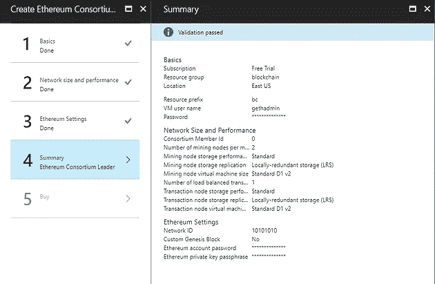

# Azure 中的以太坊智能合约

> 原文：<https://medium.com/coinmonks/ethereum-smart-contracts-in-azure-99a1768a585e?source=collection_archive---------5----------------------->


最近，以太坊在加密货币领域加快了步伐。截至本博客发表之日，1 ETH 等于 474 美元。截至目前，这是继比特币之后需求第二大的加密货币。

在 Azure 中，我们可以使用以太坊创建自己的私人区块链。这篇博客是关于如何建立 Azure 区块链联盟以及如何在你的本地机器上建立一个开发环境的。然后，我们将创建一个示例智能契约，并在本地测试它。最后，我们将把经过测试的智能合约部署到 Azure 以太坊区块链中。

**成立 Azure 以太坊区块链联盟**

可以如下设置以太坊区块链 Azure。

首先创建一个 Azure 帐户。你可以免费预装 200 美元来创建它。前往 portal.azure.com 的[创建您的账户。](https://portal.azure.com/)

账号创建完成后，需要创建以太坊财团领袖，以区块链开始。搜索以太坊中的一切，并执行以下步骤。


然后你需要如下创建以太坊网络。


创建网络后，您需要如下设置基本设置。


然后，您需要指定网络规模和性能。挖掘节点的数量决定了执行挖掘过程的速度。接下来，您需要执行以太网凭证设置。验证过程后，您可以购买网络。



在 Azure 中部署新创建的区块链网络需要一些时间。

成功部署后，您将能够获得如下设置。


您可以访问管理站点并查看您的网络状态，如下所示。


所以现在我们有足够的乙醚来玩了。

我们可以通过使用 Metamask ( MetaMask 是一个 Chrome 插件，可以充当加密货币钱包)进行一些交易来测试新创建的以太坊端点。

您可以在 MetaMask 中输入 Azure Ethereum RPC 端点，并按如下方式进行连接。


然后你可以从你的 Azure 帐户发送一些乙醚到这个钱包作为测试。将元掩码地址复制到剪贴板，然后发送如下内容。


**设置开发环境**

我希望现在你已经了解了区块链的基本原理。现在是建立环境开始我们的开发工作的好时机。以下是我们将在此设置中使用的工具列表。

1.  铬
2.  元掩码
3.  Visual Studio(我使用的是企业版，但是 Visual Studio 代码对于我们的工作来说已经足够了)
4.  NodeJS 包管理器
5.  巧克力
6.  饭桶
7.  Windows 构建工具
8.  测试 RPC
9.  松露

MetaMask:这是一个 chrome 插件，你可以从这个[链接](https://www.google.lk/url?sa=t&rct=j&q=&esrc=s&source=web&cd=1&cad=rja&uact=8&ved=0ahUKEwiXjeavoe_VAhXMqo8KHTJxAcQQFggjMAA&url=https%3A%2F%2Fchrome.google.com%2Fwebstore%2Fdetail%2Fmetamask%2Fnkbihfbeogaeaoehlefnkodbefgpgknn&usg=AFQjCNE5yVOgbJ5sdbIuFRiPl0TMEdCbpg)获得。

Visual Studio:可以获得免费版的 [Visual Studio 代码](https://code.visualstudio.com/download)。

Node JS:从[这里](https://nodejs.org/en/)取。

Chocolatey:我们需要使用 PowerShell(在 Windows 中)来安装所需的软件包。首先，我们需要将 PowerShell 执行策略更改为“RemoteSign ”,如下所示。这允许我们运行安装巧克力所需的脚本。

```
*Set-ExecutionPolicy -ExecutionPolicy RemoteSigned*
```

然后转到 Chocolatey 站点，复制以下命令进行安装。

```
*iex ((New-Object System.Net.WebClient).DownloadString(‘https://chocolatey.org/install.ps1'))*
```

GIT:我们可以使用 choco 命令来安装 GIT。

```
*choco install git*
```

这将安装其他有用的组件，如 SSH。

然后，我们需要使用以下命令使用 NPM 安装节点附加构建工具。

```
*npm install -g node-gyp*
```

然后，Windows 使用以下命令构建工具。

```
*npm install — global — production windows-build-tools*
```

接下来，我们需要安装名为 Test-RPC 的本地以太坊测试服务器，以便测试我们的区块链。

```
*npm install -g ethereumjs-testrpc*
```

接下来是松露工具集。Truffle 用于执行我们的智能合约代码的编译。

```
*npm install -g truffle*
```

**智能合同基础知识**

我们将使用名为 Solidity 的语言来创建我们的智能合约。比特币区块链也支持这种语言。

Solidity 是一种面向对象的 Javascript 风格的语言。这是 2014 年首次推出的。

首先，我们需要使用 Solidity 创建一个项目。我们可以使用 Truffle 创建一个示例演示应用程序。使用 Powershell 为您的项目创建一个文件夹，并使用以下命令创建一个项目。

```
*truffle init*
```

您可以使用 Visual Studio 代码打开这个项目，您将看到 init 命令相应地创建了几个文件夹和文件。

在合同文件夹中创建以下文件，并给出扩展名。sol(例如:HelloWorld.sol)


```
1  pragma solidity ^**0.4**.**4**;
2
3  contract HelloWorld
4  {
5          **function** SayHello() returns (string) {
6                **return** ("Hello World!");
7          }
8  }
```

我们在这里使用的是 0.4.4 版本的 solidity，整个项目必须在一个特定的 solidity 版本下运行。在本例中，我们创建了一个简单 Helloworld 契约，并返回一个字符串值。

您需要做的下一件事是更新部署工件。转到 deploy_contracts 文件，并按如下方式更新它。truffle init 命令创建了很少的其他契约和部署工件。只是暂时忽略它们，并相应地更新 HelloWorld。

```
 1  **var** ConvertLib = artifacts.require("./ConvertLib.sol");
 2  **var** MetaCoin = artifacts.require("./MetaCoin.sol");
 3  **var** HelloWorld = artifcats.require("./HelloWorld.sol");
 4
 5  module.exports = **function**(deployer) {
 6     deployer.deploy(ConvertLib);
 7     deployer.link(ConvertLib, MetaCoin);
 8     deployer.deploy(MetaCoin);
 9     deployer.deploy(HelloWorld);
10  };
```

**测试智能合约**

我们需要使用已经安装的 TestRPC 来测试创建的智能契约。打开 Poweshell 终端并启动 TestRPC 实例，如下所示。


正如您所看到的，TestRPC 服务器运行在端口 8545 上，它创建了一组私钥和帐户来开始我们的测试。

使用以下命令编译代码。

*松露编译*

编译成功后，您需要将合同迁移到区块链中。

*块菌迁徙*


您可以看到，成功迁移后会创建相应的地址。

您可以使用 truffle 控制台编写一个小的 Javascript 代码，并测试您的合同应用程序，如下所示。


**签订智能合同**

所以现在我们做了 HelloWorld 应用程序。但是让我们尝试用智能合同做一些现实的事情，它与我们的 Azure 以太坊区块链相关联。撰写智能合同有 4 个主要步骤。

1.写

2.编制

3.部署

4.互动

创建一个新目录(在我的例子中是 MarksDemo ),初始化一个 truffle 项目，并使用 Visual Studio 打开，如前一步所述。删除所有不需要的 sol 文件和部署工件。

添加以下 sol 文件并编译。

```
 1 pragma solidity ^**0.4**.**4**;
 2 contract MarksStore{
 3     mapping(string => **int**) StudentMarks;
 4     **function** AddPersonScore(string name, **int** startingMarks){
 5         **if**(StudentMarks[name]>**0**)
 6         {
 7             assert(**true**);
 8         }
 9         **else**{
10        StudentMarks[name] = startingMarks;
11        }        
12   }
13
14   **function** GetMarks(string name) returns (**int**){
15        **return** StudentMarks[name];
16    }
17    
18 }
```

运行测试 RPC 服务器并迁移已编译的协定。

打开松露控制台，执行以下命令

*> var 标志*

*> MarksStore.deployed()。然后(function(deployed){ marks = deployed；});*

*标记>标记。AddPersonScore("Priyal "，27)；*

您将能够看到添加了块哈希、交易哈希、块序列号等的联系人..


您可以使用 GetMarks 方法来检索持久标记。

*>标记。get marks . call(" Priyal ")；*

你将能够成功地看到结果。

**将智能合约部署到 Azure 区块链**

到目前为止，我们已经测试了本地 TestRPC 服务器中的所有内容。现在是时候把我们的合同发给 Azure 区块链了。

为此，我们需要在 truffle.js 文件中输入一个条目，指定我们的生产环境，如下所示。

```
 1  module.exports = {
 2    networks: {
 3      development: {
 4        host: "localhost",
 5        port: **8545**,
 6        network_id: "*" // Match any network id
 7      },
 8        production: {
 9        host: "bcgvy6jty.eastus.cloudapp.azure.com",
10        port: **8545**,
11        network_id: "*" // Match any network id
12      }
13  
14    }
15  };
```

生产主机是您的 Azure 以太坊-RPC-端点地址。

然后尝试使用以下命令进行部署

*>块菌迁移—网络生产*

你肯定会得到一个错误:)。这是因为我们的 Azure 端点不信任我们的连接，它正在防止未经授权的更改。为了解决这个问题，我们需要使用 SSH 登录 Azure 端点并执行以下更改。

要登录 SSH 会话，我们需要使用 Azure 中的 SSH-TO-FIRST-TX-NODE 参数。

使用 SSH-TO-FIRST-TX-NODE 中的值连接到 SSH 门户。

然后，您需要连接到 geth 控制台，如下所示。

*geth attach*

当提示符可用时，键入以下命令解锁。


在 TX 节点中工作时，保持此控制台打开。

现在，它应该成功迁移，如下所示。


然后，我们可以在 Azure 中创建一个智能合约，并使用 AddMarks 和 GetMarks 方法测试功能，就像我们在本地网络中进行开发一样。

# **结论**

在这篇博文中，我们在 Azure cloud 中部署了一个全功能的以太坊智能合约，并使用 Metamask wallet 测试了交易。然后，我们在本地以太坊网络中构建并测试一个简单的智能合约，然后将其部署到我们的 Azure 区块链中。

我希望您已经对 Azure 中的智能合约开发和部署有了基本的了解。

感谢阅读！