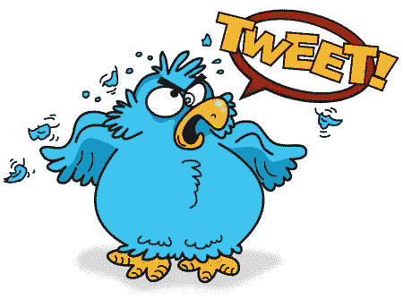

# 以太坊社会治理不应该留给鸟类

> 原文：<https://medium.com/coinmonks/ethereum-social-governance-shouldnt-be-left-to-the-birds-8ae8436d5255?source=collection_archive---------2----------------------->

[https://acriddle.com/2009/07/31/portfolio-illustration/from-the-sketchbook-angry-twitter-bird/](https://acriddle.com/2009/07/31/portfolio-illustration/from-the-sketchbook-angry-twitter-bird/)

今天，Twitter 是以太坊社会治理的主要场所之一。觉得不应该实现 ProgPOW？发微博说说吧。想集结军队资助 EIP-1559 吗？发微博说说吧。想展示你是最有影响力的核心开发者？指向你的推特粉丝。

**然而推特从来不是为以太坊社会治理这样重要的过程服务的。**事实上，该平台极大地阻碍了我们社区达成有效共识的能力。

单纯从功能的角度来看，Twitter 有很多问题。**首先，Twitter 没有有效地衡量社区对以太坊社区面临的各种问题的看法。**

即使有人在推特上发布民意调查，试图衡量社区对特定问题的看法，该民意调查也不会在整个社区共享，到一天结束时，通常会深埋在人们的反馈中。根据 Twitter 的时间表，参与这些民意调查是被扼杀的，此外，不能指望决策者花时间浏览历史推文，以找出社区想要什么！

其次，Twitter 给了那些拥有最多追随者的人更大的影响力来推广他们的信息。关注者数量无论如何都不是一个基于绩效的指标。仅仅因为一个人有最多的追随者，并不意味着他们要说的话是有意义的。

事实上，追随者数量与内容质量成反比。通常，有人会因为娱乐或引起愤怒而获得很多追随者，这就引出了我的下一个重点。

Twitter 的整个社交平台都是为了引发愤怒。你为什么认为滚动浏览 Twitter 会如此累人，因为你看到左右两边的人不断地相互尖叫？

**愤怒产生浏览量，浏览量产生广告支出，广告支出产生收入。**正如之前多次说过的，Twitter 不是在为我们用户服务，他们是在把我们的数据放在盘子里提供给广告商。在处理像社会治理这样重要的问题时，愤怒是最糟糕的情绪。

**更糟糕的是，Twitter 甚至不喜欢以太坊社区。自从 Twitter 黑客事件以来，一些著名的以太坊项目，如 myetherwallet，仍然没有找回他们的账户。像尼克·约翰逊这样受人尊敬的社区领袖仍然无缘无故地被暂停帐户，像《联邦理工学院新闻周刊》这样的重要信息来源也是如此。**

我们该死的以太坊表情符号在哪里？！

**Twitter 不应该是以太坊社会治理发生的主要场所。**以太坊社会治理需要在一个专门为以太坊社会治理唯一目的而搭建的平台上；这太重要了，不能让它沦为 Twitter 这样一个破坏性的平台。

**我们以太(**[**www . The Ether . io**](http://www.theether.io/)**)正在为以太社区建立一种社会治理体验，这种体验将更好地维护我们共同持有的价值观。**

今天就加入我们吧！

> [直接在您的收件箱中获得最佳软件交易](https://coincodecap.com?utm_source=coinmonks)

