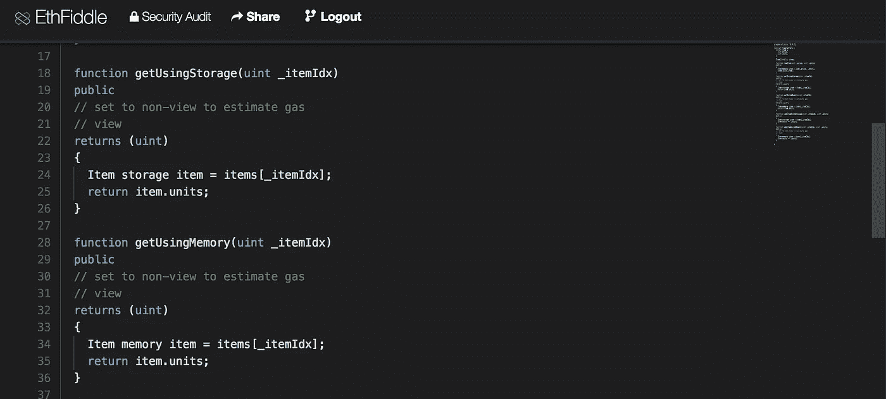

# 以太坊稳固性:内存与存储&何时使用它们

> 原文：<https://medium.com/coinmonks/ethereum-solidity-memory-vs-storage-which-to-use-in-local-functions-72b593c3703a?source=collection_archive---------0----------------------->



有人在 [Github](https://github.com/saurfang/ipfs-multihash-on-solidity/issues/1) 上问我，在下面的简化代码片段中，我们应该使用`storage`还是`memory`关键字:

对于`getUsingStorage`和`getUsingMemory`，我尝试了`storage`和`memory`，我的单元测试在这两种情况下都能通过。那么`storage`和`memory`到底有什么区别，我们应该什么时候使用它们呢？

> [发现并回顾最佳以太坊开发工具](https://coincodecap.com/category/blockchain-node-and-api)

根据[固体文件](https://solidity.readthedocs.io/en/v0.4.21/types.html#reference-types)，这两个关键字用于`Reference Types`处

> 复杂类型，即不总是适合 256 位的类型，必须比我们已经看到的值类型更小心地处理。由于复制它们可能相当昂贵，我们必须考虑是希望它们存储在**内存**(不是持久的)还是**存储器**(保存状态变量的地方)。
> 
> …
> 
> 每个复杂类型，即*数组*和*结构*，都有一个附加的注释，即“数据位置”，关于它是存储在内存中还是存储在存储器中。

现在重要的是看一下[EVM(以太坊虚拟机)在哪里存储数据](http://solidity.readthedocs.io/en/v0.4.21/frequently-asked-questions.html#what-is-the-memory-keyword-what-does-it-do):

> 以太坊虚拟机有三个区域可以存储物品。
> 
> 第一个是“存储”，所有契约状态变量都驻留在这里。每个契约都有自己的存储，并且在函数调用之间是持久的，使用起来非常昂贵。
> 
> 第二个是“内存”，这是用来保存临时值。它在(外部)函数调用之间被擦除，使用起来更便宜。
> 
> 第三个是堆栈，用来保存小的局部变量。它几乎可以免费使用，但只能保存有限的值。

最重要的是，

> 例如，如果您在函数调用中传递这样的变量，如果它们的数据可以留在内存或存储中，则不会复制它们。

这就是令人困惑的地方:

1.  `storage`和`memory`关键字分别用于引用存储器和内存中的数据。
2.  合同存储是在合同构造期间预先分配的，不能在函数调用中创建。毕竟，如果要持久化，在函数的存储中创建新变量是没有意义的。
3.  内存不能在契约构造期间分配，而是在函数执行时创建。契约**状态变量**总是在存储中声明。同样，拥有不能持久的状态变量是没有意义的。
4.  当将一个`memory`引用的数据赋给一个`storage`引用的变量时，我们将数据从内存复制到存储器。**不创建新的存储。**
5.  当将一个`storage`引用数据赋给一个`memory`引用变量时，我们将数据从存储器复制到内存。分配了新的内存。
6.  当通过查找在函数中本地创建一个`storage`变量时，它只是引用已经在存储器上分配的数据。没有创建新的存储。

概括地说，请参考文档:

> 强制数据位置:
> 
> *外部函数的参数(不返回):calldata
> 
> *状态变量:存储
> 
> 默认数据位置:
> 
> *函数的参数(也是返回):内存
> 
> *所有其他局部变量:存储

我们可以只对功能上的`parameters of functions`和`local variables`改变`data location`。每当`storage`引用被转换为`memory`时，就会产生一个副本，并且对对象的进一步修改不会传播回契约状态。`memory`如果内存数据可以复制到预先分配的状态变量，引用只能“分配”给`storage`引用。

回到我们上面的说明性契约，对于 getters:

```
function getUsingStorage(uint _itemIdx)
public
// set to non-view to estimate gas
// view
returns (uint)
{
Item storage item = items[_itemIdx];
return item.units;
}function getUsingMemory(uint _itemIdx)
public
// set to non-view to estimate gas
// view
returns (uint)
{
Item memory item = items[_itemIdx];
return item.units;
}
```

两个函数返回相同的结果，除了在`getUsingMemory`中创建了一个新变量并导致使用了更多的气体:

```
// getUsingStorage
"gasUsed": 21849// getUsingMemory
"gasUsed": 22149,
```

另一方面，对于 setters:

```
function addItemUsingStorage(uint _itemIdx, uint _units)
public
{
Item storage item = items[_itemIdx];
item.units += _units;
} function addItemUsingMemory(uint _itemIdx, uint _units)
public
// set to non-view to estimate gas
// view
{
Item memory item = items[_itemIdx];
item.units += _units;
}
```

只有`addItemUsingStorage`修改了状态变量(消耗更多气体):

```
// addItemUsingStorage
// `units` changes in `items`
"gasUsed": 27053,// addItemUsingMemory
// `units` does not change in `items`
"gasUsed": 22287,
```

最后，要点如下:

1.  `memory`和`storage`指定变量引用哪个`data location`
2.  `storage`不能在函数中新建。函数中的任何`storage`引用变量总是引用合同存储器上预先分配的一段数据(状态变量)。函数调用后，任何突变都会持续。
3.  `memory`只能在函数中新建。它可以是新实例化的复杂类型，如数组/结构(如通过`new int[...]`)或从`storage`引用的变量复制而来。
4.  当引用通过函数参数在内部传递时，记住它们默认为`memory`，如果变量在`storage`上，它将创建一个副本，任何修改都不会持续。

参考资料:

[](https://stackoverflow.com/questions/33839154/in-ethereum-solidity-what-is-the-purpose-of-the-memory-keyword) [## 以太坊坚固中，“记忆”关键字的用途是什么？

### 如果没有 memory 关键字，Solidity 会尝试在存储中声明变量。Lead Solidity dev chriseth:“你可以思考…

stackoverflow.com](https://stackoverflow.com/questions/33839154/in-ethereum-solidity-what-is-the-purpose-of-the-memory-keyword) [](https://ethereum.stackexchange.com/questions/1701/what-does-the-keyword-memory-do-exactly) [## “记忆”这个关键词到底是做什么的？

### 强烈推荐完整阅读关于“内存”的 Solidity FAQ，下面提供了一个片段。以太坊…

ethereum.stackexchange.com](https://ethereum.stackexchange.com/questions/1701/what-does-the-keyword-memory-do-exactly) [](/loom-network/ethereum-solidity-memory-vs-storage-how-to-initialize-an-array-inside-a-struct-184baf6aa2eb) [## 以太坊稳固性:内存与存储&如何在结构中初始化数组

### 在 Loom Network 的 Telegram(拥有约 8000 名会员！)人们就各种话题提问，比如 Loom 的路线图……

medium.com](/loom-network/ethereum-solidity-memory-vs-storage-how-to-initialize-an-array-inside-a-struct-184baf6aa2eb) 

> 加入 Coinmonks [电报频道](https://t.me/coincodecap)和 [Youtube 频道](https://www.youtube.com/c/coinmonks/videos)获取每日[加密新闻](http://coincodecap.com/)

## 另外，阅读

*   [密码电报信号](http://Top 4 Telegram Channels for Crypto Traders) | [密码交易机器人](/coinmonks/crypto-trading-bot-c2ffce8acb2a)
*   [复制交易](/coinmonks/top-10-crypto-copy-trading-platforms-for-beginners-d0c37c7d698c) | [加密税务软件](/coinmonks/crypto-tax-software-ed4b4810e338)
*   [网格交易](https://coincodecap.com/grid-trading) | [加密硬件钱包](/coinmonks/the-best-cryptocurrency-hardware-wallets-of-2020-e28b1c124069)
*   [最佳加密交易所](/coinmonks/crypto-exchange-dd2f9d6f3769) | [印度最佳加密交易所](/coinmonks/bitcoin-exchange-in-india-7f1fe79715c9)
*   开发人员的最佳加密 API
*   最佳[密码借贷平台](/coinmonks/top-5-crypto-lending-platforms-in-2020-that-you-need-to-know-a1b675cec3fa)
*   [杠杆代币](/coinmonks/leveraged-token-3f5257808b22)终极指南
*   [加密交易的最佳 VPNs】](https://coincodecap.com/best-vpns-for-crypto-trading)
*   [最佳加密分析或链上数据](https://coincodecap.com/blockchain-analytics) | [Bexplus 评论](https://coincodecap.com/bexplus-review)
*   [NFT 十大市场造币集锦](https://coincodecap.com/nft-marketplaces)
*   [AscendEx Staking](https://coincodecap.com/ascendex-staking)|[Bot Ocean Review](https://coincodecap.com/bot-ocean-review)|[最佳比特币钱包](https://coincodecap.com/bitcoin-wallets-india)
*   [Bitget 回顾](https://coincodecap.com/bitget-review)|[Gemini vs block fi](https://coincodecap.com/gemini-vs-blockfi)|[OKEx 期货交易](https://coincodecap.com/okex-futures-trading)