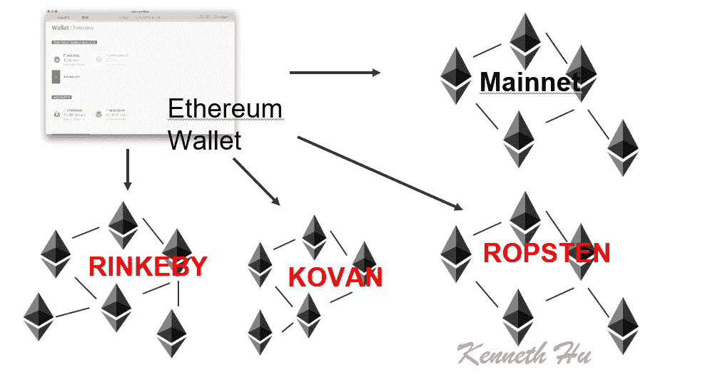
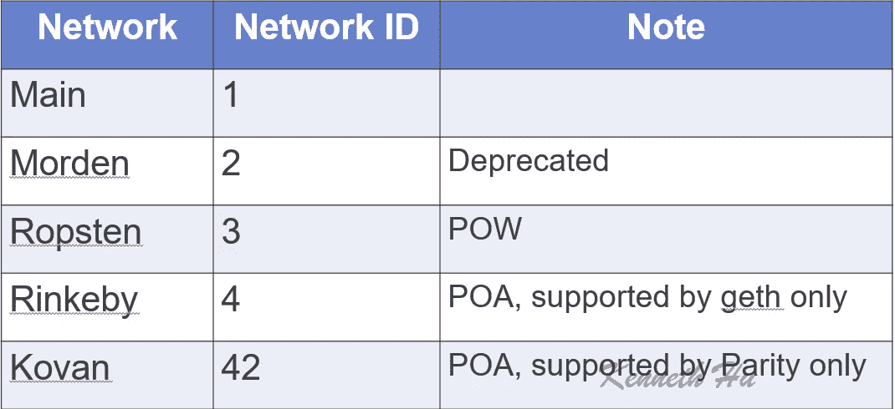

# 以太坊测试网络

> 原文：<https://medium.com/coinmonks/ethereum-test-network-21baa86072fa?source=collection_archive---------1----------------------->

以太坊有三个测试网络供开发者开发和做测试，分别是 ROPSTEN、KOVAN 和 RINKEBY。

# rops ten(2022 年 10 月 5 日已弃用。)

*   **动力测试网**
*   网络 id: `3`
*   封锁时间:`sub-30 seconds`
*   命令:
*   `geth --testnet`或`geth --networkid 3`
*   `parity --chain ropsten`
*   探险家[https://ropsten.etherscan.io/](https://ropsten.etherscan.io/)
*   https://github.com/ethereum/ropsten

> [发现并回顾最佳区块链软件](https://coincodecap.com)

## 历史:

*   2016 年 11 月开学。以斯德哥尔摩的一个地铁站命名。
*   是不是 2017 年 2 月 [DoS 攻击](https://ethereum.stackexchange.com/questions/12477/ropsten-testnet-is-under-kind-of-attack-what-can-we-do)导致同步变慢，让客户端消耗大量磁盘空间。
*   2017 年 3 月[是否复活](https://github.com/ethereum/ropsten/blob/master/revival.md)并再次可用。

## 优点:

*   **最好地再现了当前的生产环境**，即实时以太坊主网上的系统和网络状况，因为它是战俘网。
*   **可与 geth 和奇偶校验一起使用。**
*   **乙醚可以开采**。或者从水龙头请求:
*   [https://faucet.metamask.io/](https://faucet.metamask.io/)
*   [http://水龙头. ropsten.be:3001](http://faucet.ropsten.be:3001/)
*   [https://faucet.bitfwd.xyz/](https://faucet.bitfwd.xyz/)
*   有哪些公共测试网络和水龙头？

## 缺点:

*   **不能免受垃圾邮件的攻击。因此它不太稳定。**

# 科万

*   由奇偶校验团队启动的 PoA 测试网
*   网络 id: `42`
*   封锁时间:`4 seconds`
*   命令:`parity --chain kovan`
*   探险家[https://kovan.etherscan.io/](https://kovan.etherscan.io/)
*   github[https://github.com/kovan-testnet/proposal](https://github.com/kovan-testnet/proposal)

## 历史:

*   2017 年 3 月开学。以新加坡的一个地铁站命名。

## 优点:

*   **免受垃圾邮件攻击**(因为乙醚供应由可信方控制)

## 缺点:

*   **geth**中不支持。
*   因为它使用 PoA，所以不能完全再现当前的生产环境。
*   **乙醚不能开采**。必须从[龙头](https://github.com/kovan-testnet/faucet)请求。

# rinke by(2022 年 10 月 5 日已弃用。)

*   **以太坊团队启动的 PoA testnet** 。使用 Clique PoA 共识协议。
*   网络 id: `4`
*   封锁时间:`15 seconds`
*   命令:`geth --rinkeby`或`geth --networkid 4`
*   探险家[https://rinkeby.etherscan.io/](https://rinkeby.etherscan.io/)
*   https://github.com/ethereum/EIPs/issues/225
*   网址 [https://www.rinkeby.io](https://www.rinkeby.io/)

## 历史:

*   2017 年 4 月开学。以斯德哥尔摩的一个地铁站命名。

## 优点:

*   **对垃圾邮件攻击免疫**(因为乙醚供应由可信方控制)

## 缺点:

*   仅受 geth 支持
*   因为它使用 PoA，所以不能完全再现当前的生产环境。
*   **乙醚不能开采**。它必须从水龙头发出请求:
*   [https://faucet.rinkeby.io/](https://faucet.rinkeby.io/)

# 格利

测试网的工作始于 9 月初的 ETHBerlin 黑客马拉松，当时 Parity 的 Afri Scohedon 与 Chainsafe Systems 联合起来试图创建一个“下一代公共以太坊测试网络”。

*   **PoA 测试网**
*   探险家[https://goerli.etherscan.io/](https://goerli.etherscan.io/)
*   https://github.com/goerli/testnet
*   网址 [https://www.rinkeby.io](https://www.rinkeby.io/)
*   龙头:[https://goerli-faucet.slock.it/](https://goerli-faucet.slock.it/)

## 其他:

*   `0`:奥林匹克、以太坊公共预发布测试网
*   `1`:边疆，家园，大都市，以太坊公共主网络
*   `1`:经典，【非】分叉公共以太坊经典主网，*连锁 ID* `*61*`
*   `1`:expense，另类以太坊实现，*链 ID* `*2*`
*   `2`:现代，公共以太坊测试网，现在以太坊经典测试网
*   `3` : Ropsten，公共跨客户端以太坊测试网
*   `4` : Rinkeby，大众 Geth PoA 测试网
*   `8` : Ubiq，公网 Gubiq 主网同传难度*链 ID* `*8*`
*   `42` : Kovan，公共平价 PoA 测试网
*   `77` : Sokol，公共 POA 网络测试网
*   `99`:核心，公共 POA 网络主网
*   `100` : xDai，公共 MakerDAO/POA 网络主网
*   `401697` : Tobalaba，公共能源网络基金会测试网
*   `7762959` : Musicoin，音乐区块链
*   `61717561` : Aquachain，抗碱性链
*   `[Other]`:可能表示您连接到了本地开发测试网络。

来源:[https://ether eum . stack exchange . com/questions/27048/comparison-of-the-different-test nets/30072 # 30072](https://ethereum.stackexchange.com/questions/27048/comparison-of-the-different-testnets/30072#30072)

[https://ether eum . stack exchange . com/questions/17051/how-to-select-a-network-id-or-is-a-list-of-network-ids/17101 # 17101](https://ethereum.stackexchange.com/questions/17051/how-to-select-a-network-id-or-is-there-a-list-of-network-ids/17101#17101)

> 加入 Coinmonks [电报频道](https://t.me/coincodecap)和 [Youtube 频道](https://www.youtube.com/c/coinmonks/videos)获取每日[加密新闻](http://coincodecap.com/)

## 另外，阅读

*   [复制交易](/coinmonks/top-10-crypto-copy-trading-platforms-for-beginners-d0c37c7d698c) | [加密税务软件](/coinmonks/crypto-tax-software-ed4b4810e338)
*   [电网交易](https://coincodecap.com/grid-trading) | [加密硬件钱包](/coinmonks/the-best-cryptocurrency-hardware-wallets-of-2020-e28b1c124069)
*   [密码电报信号](http://Top 4 Telegram Channels for Crypto Traders) | [密码交易机器人](/coinmonks/crypto-trading-bot-c2ffce8acb2a)
*   [最佳加密交易所](/coinmonks/crypto-exchange-dd2f9d6f3769) | [印度最佳加密交易所](/coinmonks/bitcoin-exchange-in-india-7f1fe79715c9)
*   [币安 vs 比特邮票](https://coincodecap.com/binance-vs-bitstamp) | [比特熊猫 vs 比特币基地 vs Coinsbit](https://coincodecap.com/bitpanda-coinbase-coinsbit)
*   [如何购买 Ripple (XRP)](https://coincodecap.com/buy-ripple-india) | [非洲最好的加密交易所](https://coincodecap.com/crypto-exchange-africa)
*   [非洲最佳加密交易所](https://coincodecap.com/crypto-exchange-africa) | [胡交易所评论](https://coincodecap.com/hoo-exchange-review)
*   [eToro vs robin hood](https://coincodecap.com/etoro-robinhood)|[MoonXBT vs by bit vs Bityard](https://coincodecap.com/bybit-bityard-moonxbt)
*   开发人员的最佳加密 API
*   最佳[密码借贷平台](/coinmonks/top-5-crypto-lending-platforms-in-2020-that-you-need-to-know-a1b675cec3fa)
*   [免费加密信号](/coinmonks/free-crypto-signals-48b25e61a8da) | [加密交易机器人](/coinmonks/crypto-trading-bot-c2ffce8acb2a)
*   [杠杆代币的终极指南](/coinmonks/leveraged-token-3f5257808b22)