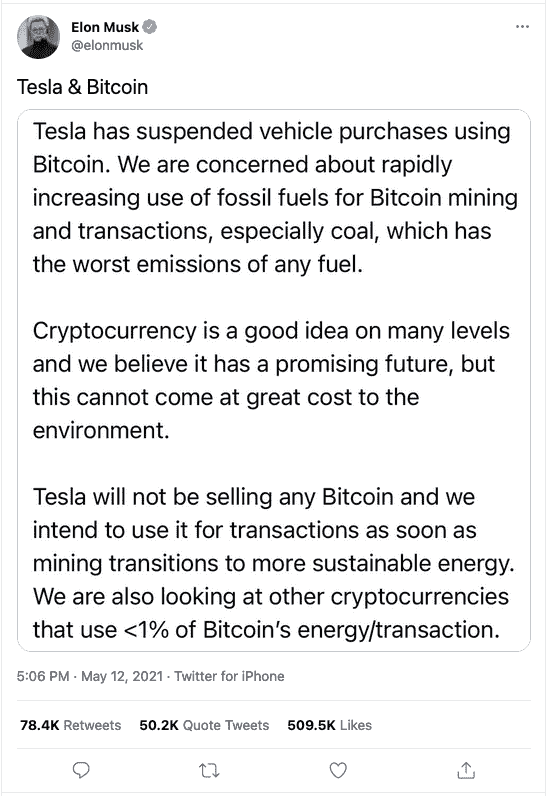
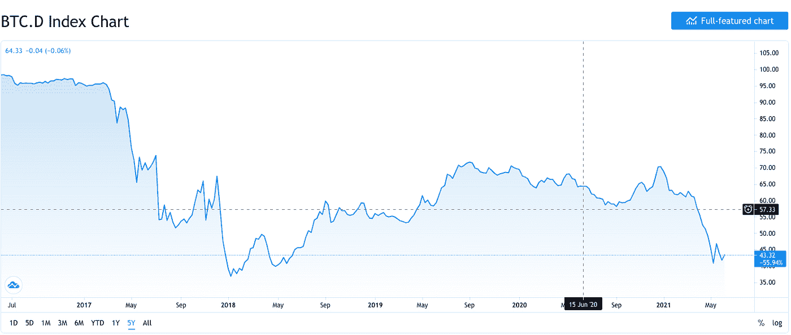
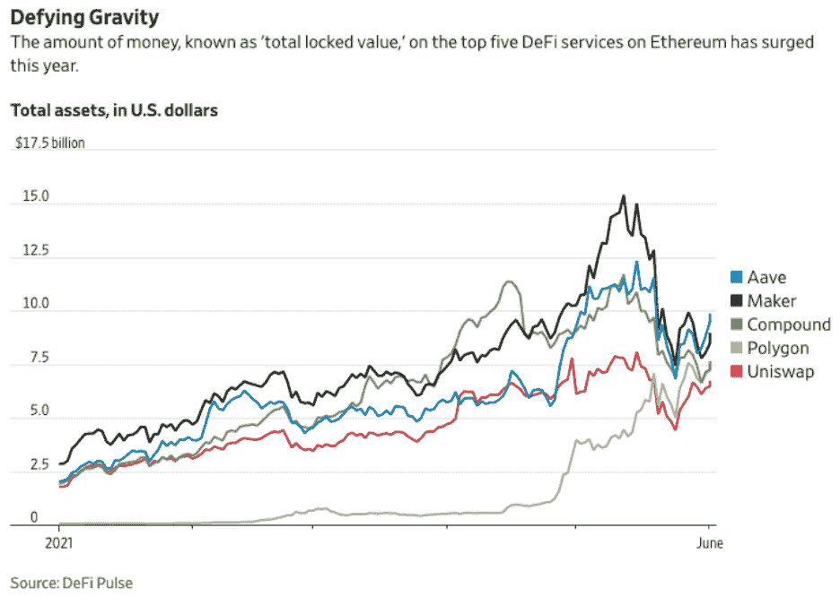
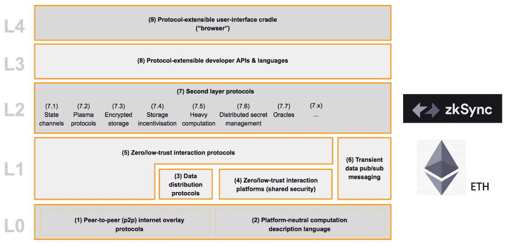

# 以太坊:通向新互联网的大门

> 原文：<https://medium.com/coinmonks/ethereum-the-gateway-to-the-new-internet-95b5a7e62e43?source=collection_archive---------6----------------------->

Design by Colorscape

俗话说得好，“种树的最佳时间是 20 年前，次佳时间是现在。”你可能会因为没有在 10k 比特币换成 [2 个大披萨](https://www.investopedia.com/news/bitcoin-pizza-day-celebrating-20-million-pizza-order/)的时候投资比特币而自责，但你并没有完全错过这个机会。

这篇文章将讨论一般加密市场动态，以太坊的重要性，web3 的崩溃，以及为什么第二层协议与大型消费产品的交叉是加密中最令人兴奋的地方*。*

# *是什么推动了加密市场最近的调整(2021 年 5 月版)？*

*基本的区块链技术没有任何技术上的变化，但最近市场的大部分波动可以追溯到以下方面:*

1.  *地缘政治事件([中国禁止加密](https://www.reuters.com/technology/chinese-financial-payment-bodies-barred-cryptocurrency-business-2021-05-18/))*
2.  *出于环境原因，埃隆·马斯克和特斯拉不再接受比特币*

**

*3.导致价格大幅波动的大量杠杆。亚洲的公司，如 BitMEX，允许 100 比 1 的杠杆比率用于加密货币交易。摘自《华尔街日报》的一篇文章，*

> **“杠杆押注的内爆是加速比特币和其他加密货币长达一个月抛售的关键因素。随着价格暴跌，许多看涨押注被自动平仓，增加了价格下行压力，并导致进一步平仓的恶性循环。”**

# *以太坊(ETH)为什么这么重要…我以为比特币是#1？*

*目前，比特币( [$683B](https://www.coindesk.com/price/bitcoin) )的市值仍然远远领先于以太坊( [$299B](https://www.coindesk.com/price/ethereum) )。多年来，随着更多项目的加入，我们已经看到比特币相对于市场其他部分的规模在慢慢缩小。我们现在接近 2017 年底崩盘期间的历史低点。*

**

*然而，比特币不仅仅被数量庞大的替代币击败，用户和开发者最终也发现了比特币替代品的实用性和消费者吸引力。*

*在我最近读过的最好的东西，一篇题为“[拥有互联网](https://www.notboring.co/p/own-the-internet)”的文章中，作者 Packy McCormick 介绍了以太坊的牛市案例，他说:*

> *“拥有 ETH 就像拥有互联网的股份。随着 web3 应用的增加，对 ETH 的需求将会上升，而即将到来的(技术)变化将会减少 ETH 的供应，让持有者获得更多价值。”*

*我不会谈论即将到来的对 ETH 的技术改变，但是[这个](https://markets.businessinsider.com/currencies/news/ethereum-upgrades-boost-ether-price-eip1559-prrof-of-stake-2021-5-1030404464)会。我*想重点谈谈以太坊和 web3 应用之间的联系。把以太坊想象成一张供创作者建立的白板。为了更好地理解构建者可用的工具，请查看这篇文章的底部，了解更多关于**智能合同、Oracle**和 **DAOs(分布式匿名组织)的信息。让我们来谈谈 web3，以理解为什么以太坊越来越多地被采用是重要的。****

* [## 最佳免费加密交易机器人——前 16 名比特币交易机器人[2021]

### 2021 年币安、比特币基地、库币和其他密码交易所的最佳密码交易机器人。四进制，位间隙…

medium.com](/coinmonks/crypto-trading-bot-c2ffce8acb2a) 

# 什么是 web3？

让我们从 web1 开始。Web1 包含为信息消费而设计的静态桌面网页，由昂贵的服务器提供服务。当脸书和 AirBnB 等公司将互动体验和用户生成的内容融入其应用程序时，Web1 变成了 web2。一个 Web2 应用的名片是它是**移动的，**具有强大的**社交元素**并且由**云**提供支持。Web2 已经有了明显的赢家，他们利用强大的网络效应，在赢家通吃的世界中建立了不可逾越的领先优势。

对于那些努力监管大型科技公司政治权力的人来说，web3 可能是打破他们主导市场地位的框架。

Web3 应用程序是建立在**开放**、**无信任**和**无许可**网络之上的。

*   **开放**——由开发者社区公开构建，由开源软件连接，他们共同努力改进
*   **无信任** —网络的构建方式是参与者可以在没有可信第三方的情况下公开或私下互动。交易和交易对手在以太坊区块链透明上市。
*   **无权限** —应用程序中的任何参与者都可以在没有管理机构授权的情况下参与

Web3 网络旨在以可控的方式促进大量信息的交换，因此边缘计算、分散数据存储和机器学习等其他令人兴奋的技术可以很容易地融入新的应用程序。[1]

 [## 加密税务软件——五大最佳比特币税务计算器[2021]

### 不管你是刚接触加密还是已经在这个领域呆了一段时间，你都需要交税。

medium.com](/coinmonks/best-crypto-tax-tool-for-my-money-72d4b430816b) 

# Web1、2 和 3 的一些例子是什么？

## **金融**

1.  Web1 —大多数传统社区银行都被困在 Web1 中。许多公司已经推出了移动应用，但其中许多金融机构仍停留在旧的核心金融平台上，数据被锁定在本地服务器上。
2.  web 2——PayPal 首席执行官丹·舒尔曼(Dan Schulman)认为 Venmo 的社交交易源是该服务的“[秘方](https://www.businessinsider.com/venmo-social-feed-is-its-secret-sauce-2015-12?r=US&IR=T)”，以及在朋友之间发送/接收大量美元的核心应用功能。
3.  Web3 — [制造商](https://makerdao.com/en/)允许借款人使用以太坊作为与美元挂钩的数字货币贷款的抵押品。对部分令牌的更改由通过 DAO 组织的治理令牌(MKR)的所有者投票决定。

## **农民保险的天气数据**

1.  当地报纸/农民年鉴
2.  Weather.com 应用程序
3.  [Chainlink 的](https://www.coindesk.com/chainlink-to-provide-data-for-farming-insurance-startup-arbol)分散式 *oracle* 网络为智能合约提供可靠的防篡改天气数据。保险初创公司 Arbol 为中小型农民或企业提供农作物保险。当一个预设值——如月平均气温或降雨量——与合同规定不符时，智能合同会向用户支付索赔。

 [## 加密税务软件——五大最佳比特币税务计算器[2021]

### 不管你是刚接触加密还是已经在这个领域呆了一段时间，你都需要交税。

medium.com](/coinmonks/best-crypto-tax-tool-for-my-money-72d4b430816b) 

# 不利之处

**市场—** 我不知道 ETH 的短期或长期价格会是多少。加密市场具有极大的投机性，受到大量杠杆的驱动，可能会因埃隆·马斯克的一条推文而发生巨大变化。我相信长远的前景… [HODL](https://www.investopedia.com/terms/h/hodl.asp) ！

**技术限制**——以太坊因其高昂的使用费和交易速度太慢而受到批评。在之前的[帖子](https://www.linkedin.com/pulse/unlocking-growth-through-ownership-erik-huckle/)中，我谈到了 NBA 顶级投篮，他们建立了自己的区块链(流量)来解决这些问题。

# 机会

当以太坊的核心开发者正在努力改进他们的平台时，在“第二层”(L2)的其他公司正在提供速度的显著提高和更低的费用。

*   联合广场风险投资公司最近[发布了](https://www.usv.com/writing/2021/06/scaling-ethereum-with-zksync/)关于他们正在投资的一个名为 **zkSync** 的 L2 解决方案。这家合资企业使用“零知识证明，以一种极具性能和可伸缩性的方式验证和整合交易，而不会牺牲完整性和安全性。”
*   其他值得研究的有趣的 L2 项目包括 Arbitrum、Polygon 和 Matic

下面是 web3 技术栈，ETH 在 L1，zkSync(和 oracles)在 L2，API 在 L3，用户界面在 L4。

# 我们将何去何从？

如果你一直是加密的局外人，并且只是想涉足这个游戏，现在是考虑投资一些美元到以太坊的时候了。我个人将开始批判性地看待建立在上述 L2 解决方案之上的消费者应用程序。在这一领域，我们可能正处于一个关键时刻，传统风险投资的严格性(客户终身价值/收购成本、流失率、毛利润等)。)可以适用于 web3 公司，不投资纯投机！

 [## BlockFi 评论 2021 —通过您的加密获得 8.6%的利率

### 让你的密码发挥作用，获得比特币和其他加密货币的最佳利率

medium.com](/coinmonks/blockfi-review-53096053c097) 

# 行动号召//我在寻找什么

我为自己的教育研究并写了这篇文章，也是为了在这个特定的领域看到更多的交易。如果你是一家正在寻找资金的初创公司，一位可以审查这些项目的技术大师，一位精通正确/错误种子阶段模式识别的风险投资家，或者只是一个想参与游戏的感兴趣的人，请给我写信。

## ***定义***

*   **智能合同** —合同由一个庞大的法律机构支撑，包括律师、警察和公证人(以及许多相关的工作)。以太坊对所有这些功能进行了抽象，因此合同的必要条件可以放在区块链中，并通过预先确定的代码来执行，从而以可忽略不计的成本创建一个不可信的环境。
*   **神谕** — [神谕](https://ethereum.org/en/developers/docs/oracles/)是连接以太坊和外部真实世界信息的数据源。这会将数据输入到您的智能合约中。
*   **分散自治组织**(DAO)—DAO 采用智能合约功能来支持无信任组织，从两个朋友分享 NFT 收益到大型跨国公司。

***接着读……***

[1]马克斯·默施和理查德·穆尔黑德。"[什么是 Web 3.0 &为什么重要](/fabric-ventures/what-is-web-3-0-why-it-matters-934eb07f3d2b)。"2019 年 12 月 31 日

凯尔·萨曼尼。"[第 1 层和第 2 层的值捕捉开启](https://multicoin.capital/2019/03/14/on-value-capture-at-layers-1-and-2/?mc_cid=4aebfbacd3&mc_eid=%5B429609807e%5D)。"2019 年 3 月 14 日。

大卫·霍夫曼。[第二层淘金热](https://newsletter.banklesshq.com/p/the-layer-2-gold-rush-market-monday-92e)。2021 年 5 月 31 日。

> 加入 [Coinmonks 电报频道](https://t.me/coincodecap)，了解加密交易和投资

 [## 最佳 6 个加密交易信号电报通道

### 这是乏味的找到正确的加密交易信号提供商。因此，在本文中，我们将讨论最好的…

medium.com](/coinmonks/best-crypto-signals-telegram-5785cdbc4b2b) 

## 另外，阅读

*   [电网交易机器人](https://blog.coincodecap.com/grid-trading) | [Cryptohopper 审查](/coinmonks/cryptohopper-review-a388ff5bae88)
*   [加密复制交易平台](/coinmonks/top-10-crypto-copy-trading-platforms-for-beginners-d0c37c7d698c) | [如何在 WazirX 上购买比特币](/coinmonks/buy-bitcoin-on-wazirx-2d12b7989af1)
*   [CoinLoan 点评](/coinmonks/coinloan-review-18128b9badc4)|[Crypto.com 点评](/coinmonks/crypto-com-review-f143dca1f74c) | [火币保证金交易](/coinmonks/huobi-margin-trading-b3b06cdc1519)
*   [尤霍德勒 vs 科恩洛 vs 霍德诺特](/coinmonks/youhodler-vs-coinloan-vs-hodlnaut-b1050acde55a) | [Cryptohopper vs 哈斯博特](https://blog.coincodecap.com/cryptohopper-vs-haasbot)
*   [顶级付费加密货币和区块链课程](https://blog.coincodecap.com/blockchain-courses) | [币安评论](/coinmonks/binance-review-ee10d3bf3b6e)
*   [MXC 交易所评论](/coinmonks/mxc-exchange-review-3af0ec1cba8c) | [Pionex vs 币安](https://blog.coincodecap.com/pionex-vs-binance) | [Pionex 套利机器人](https://blog.coincodecap.com/pionex-arbitrage-bot)
*   [如何在印度购买比特币？](/coinmonks/buy-bitcoin-in-india-feb50ddfef94) | [WazirX 评论](/coinmonks/wazirx-review-5c811b074f5b) | [BitMEX 评论](https://blog.coincodecap.com/bitmex-review)
*   [印度的加密交易所](/coinmonks/bitcoin-exchange-in-india-7f1fe79715c9) | [比特币储蓄账户](/coinmonks/bitcoin-savings-account-e65b13f92451) | [HitBTC 评论](/coinmonks/hitbtc-review-c5143c5d53c2)
*   [币安收费](/coinmonks/binance-fees-8588ec17965) | [Botcrypto 审查](/coinmonks/botcrypto-review-2021-build-your-own-trading-bot-coincodecap-6b8332d736c7) | [Hotbit 审查](/coinmonks/hotbit-review-cd5bec41dafb) | [KuCoin 审查](https://blog.coincodecap.com/kucoin-review)
*   [我的密码交易经验](/coinmonks/my-experience-with-crypto-copy-trading-d6feb2ce3ac5) | [AAX 交易所评论](/coinmonks/aax-exchange-review-2021-67c5ea09330c)
*   [逐位融资融券交易](/coinmonks/bybit-margin-trading-e5071676244e) | [币安融资融券交易](/coinmonks/binance-margin-trading-c9eb5e9d2116) | [超位审核](/coinmonks/overbit-review-9446ed4f2188)
*   [加密货币储蓄账户](/coinmonks/cryptocurrency-savings-accounts-be3bc0feffbf) | [YoBit 审查](/coinmonks/yobit-review-175464162c62) | [Bitbns 审查](/coinmonks/bitbns-review-38256a07e161)
*   [Botsfolio vs nap bots vs Mudrex](/coinmonks/botsfolio-vs-napbots-vs-mudrex-c81344970c02)|[gate . io 交流回顾](/coinmonks/gate-io-exchange-review-61bf87b7078f)
*   [CoinFLEX 评论](https://blog.coincodecap.com/coinflex-review) | [AEX 交易所评论](https://blog.coincodecap.com/aex-exchange-review) | [UPbit 评论](https://blog.coincodecap.com/upbit-review)
*   [AscendEx 保证金交易](https://blog.coincodecap.com/ascendex-margin-trading) | [Bitfinex 赌注](https://blog.coincodecap.com/bitfinex-staking)
*   [麻雀交换评论](https://blog.coincodecap.com/sparrow-exchange-review) | [纳什交换评论](https://blog.coincodecap.com/nash-exchange-review)
*   [Godex.io 评审](/coinmonks/godex-io-review-7366086519fb) | [邀请评审](/coinmonks/invity-review-70f3030c0502) | [BitForex 评审](/coinmonks/bitforex-review-c4bb28d9e271) | [北海巨妖评审](/coinmonks/kraken-review-6165fc1056ac)
*   [最佳比特币保证金交易](/coinmonks/bitcoin-margin-trading-exchange-bcbfcbf7b8e3) | [萝莉点评](/coinmonks/lolli-review-e6ddc7895ad8) | [比特币保证金交易](https://blog.coincodecap.com/bityard-margin-trading)
*   [创造并出售你的第一个 NFT](https://blog.coincodecap.com/create-nft) | [本地比特币评论](/coinmonks/localbitcoins-review-6cc001c6ed56) | [Prokey 评论](/coinmonks/prokey-review-26611173c13c)
*   [加密保证金交易交易所](/coinmonks/crypto-margin-trading-exchanges-428b1f7ad108) | [赚取比特币](/coinmonks/earn-bitcoin-6e8bd3c592d9) | [Mudrex 投资](https://blog.coincodecap.com/mudrex-invest-review-the-best-way-to-invest-in-crypto)
*   [WazirX vs coin dcx vs bit bns](/coinmonks/wazirx-vs-coindcx-vs-bitbns-149f4f19a2f1)|[block fi vs coin loan vs Nexo](/coinmonks/blockfi-vs-coinloan-vs-nexo-cb624635230d)
*   [杠杆代币](/coinmonks/leveraged-token-3f5257808b22) | [最佳密码交易所](/coinmonks/crypto-exchange-dd2f9d6f3769) | [Paxful 点评](/coinmonks/paxful-review-4daf2354ab70)
*   [加密套利](/coinmonks/crypto-arbitrage-guide-how-to-make-money-as-a-beginner-62bfe5c868f6)指南| [如何做空比特币](/coinmonks/how-to-short-bitcoin-568a2d0b4ae5) | [1xBit 回顾](https://blog.coincodecap.com/1xbit-review)
*   [如何在印度购买以太坊？](https://blog.coincodecap.com/buy-ethereum-in-india) | [如何在币安购买比特币](https://blog.coincodecap.com/buy-bitcoin-binance)
*   [在美国如何使用 BitMEX？](https://blog.coincodecap.com/use-bitmex-in-usa) | [BitMEX 评论](https://blog.coincodecap.com/bitmex-review) | [期货交易机器人](/coinmonks/futures-trading-bots-5a282ccee3f5)
*   [最佳加密交易信号电报](/coinmonks/best-crypto-signals-telegram-5785cdbc4b2b) | [MoonXBT 评论](/coinmonks/moonxbt-review-6e4ab26d037)
*   [OKEx 评论](/coinmonks/okex-review-6b369304110f) | [Coinswitch 俱吠罗评论](/coinmonks/coinswitch-kuber-review-1a8dc5c7a739) | [比特币基地收费](/coinmonks/coinbase-fees-831e77d4f2c5)
*   [AscendEX 审查](/coinmonks/ascendex-review-53e829cf75fa) | [OKEx 交易机器人](/coinmonks/okex-trading-bots-234920f61e60) | [OKEx 交易机器人](/coinmonks/okex-trading-bots-234920f61e60)*