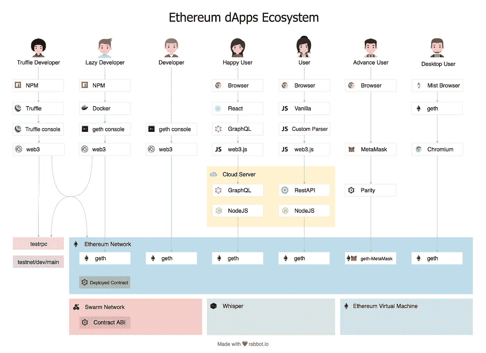

# 以太坊❤松露

> 原文：<https://medium.com/coinmonks/ethereum-truffle-d32e5ded1de8?source=collection_archive---------0----------------------->

以下是您如何**构建/运行/测试/部署** dApps！

dApps

在阅读了许多关于 dApps 发展的博客后。我认为这是混乱的，令人困惑的，大量的框架错误。但像往常一样，我会让它变得非常简单！

# 知识库

*   [**区块链**](https://en.wikipedia.org/wiki/Blockchain) 是一个持续增长的记录列表，称为区块，使用加密技术进行链接和保护。每个块通常包含一个散列指针作为到前一个块的链接、一个时间戳和事务数据。它启用了名为**比特币**和**以太坊**的数字货币。
*   [**比特币**](https://en.wikipedia.org/wiki/Bitcoin) 是其发明者中本聪设计的一种数字资产，可以作为货币使用。
*   [**以太坊**](https://ethereum.org/) 是一个去中心化的平台，在定制构建的区块链上运行智能合约。它提供了一种称为“以太”的加密货币令牌，并实现了去中心化 **web3** 。
*   [**web3**](http://ethdocs.org/en/latest/introduction/web3.html) 是一个去中心化 app 的平台( **dApps** )。
*   [**dApps**](http://www.ethereumwiki.com/ethereum-wiki/dapps/) 是 web3 上的一个去中心化的应用，在区块链上连接前端和智能合约。
*   [**MetaMask**](https://metamask.io/) 是作为 Chrome 扩展的 dApps 浏览器。允许您直接在浏览器中运行以太坊 dApps，而无需运行完整的以太坊节点。
*   [**道**](https://ethereum.org/dao) :分权自治组织

# 开发商

*   [**web3.js**](https://github.com/ethereum/web3.js/) 是以太坊兼容的 JavaScript API，实现了通用的 JSON RPC 规范。它作为一个节点模块在 npm 上可用
*   [**松露**](https://github.com/trufflesuite/truffle) 是一个用于以太坊的 NodeJS 框架，用于编译、部署智能合约。
*   [**Solidity**](http://solidity.readthedocs.io/en/latest/#solidity) 是一种面向契约的高级语言，其语法类似于 JavaScript 的语法，其设计目标是以太坊虚拟机(EVM)。
*   **ABI** :应用程序二进制接口，基本上就是你如何调用合同中的函数并取回数据。
*   进程间通信，操作系统提供的允许进程管理共享数据的机制。
*   RPC :远程过程调用，一种请求-响应协议

# 例子

*   设置:[https://github.com/katopz/ethereum-docker](https://github.com/katopz/ethereum-docker)
*   简单:[https://github.com/katopz/truffle-simple-storage-example](https://github.com/katopz/truffle-simple-storage-example)
*   前进:[https://github.com/katopz/truffle-metacoin-example](https://github.com/katopz/truffle-metacoin-example)
*   https://github.com/katopz/ethereum-todolist
*   网络 3:[https://github.com/katopz/web3-react-example](https://github.com/katopz/web3-react-example)
*   https://github.com/katopz/ethereum-to-graphql

很抱歉，我只是一次给你所有的例子，但你不会在任何地方找到工作的例子，因为松露 4 刚刚发布，因为**松露开发**，裸露**松露初始化**(没有元硬币的例子)将打破任何你从松露 3 已经知道的东西。所以上面这些例子会节省你一些时间。:)

> [直接在您的收件箱中获得最佳软件交易](https://coincodecap.com/?utm_source=coinmonks)

顺便说一句，我将通过 **github 更新我接下来发现的关于以太坊的相关内容，**你可以在这里[https://github.com/katopz/hello-eth](https://github.com/katopz/hello-eth)主演⭐️并观看

哦！如果你的电脑真的很快，请尝试打开 **Safari** 中的这个链接[https://rabbot.io/minemark/](https://rabbot.io/minemark/)，如果打开一会儿就离开，目前 **Chrome** 已经入侵高分了！

## 快乐以太！💎