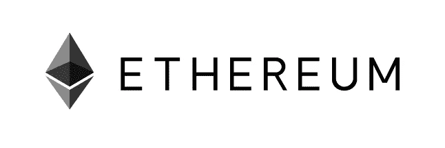
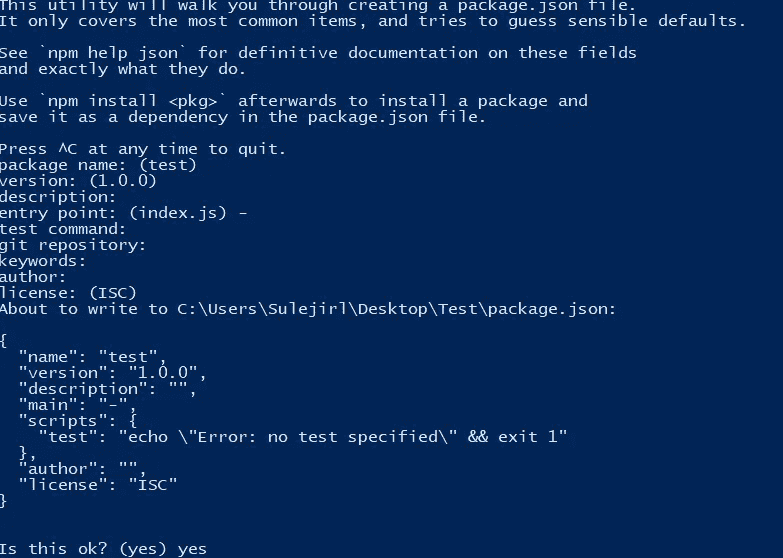

# 以太坊教程:通过 NodeJS 后端发送事务

> 原文：<https://medium.com/coinmonks/ethereum-tutorial-sending-transaction-via-nodejs-backend-7b623b885707?source=collection_archive---------1----------------------->



*注:在本教程中，我使用的是 web3js 1.0 版本*

大家好，我将解释如何从 NodeJS 后端发送事务。我将使用 Rinkeby testnet 并创建一个路由器，还将添加一些节点模块并使用 Infura HTTP provider 来完成教程

我们需要 web3js、express 和 ethereumjs-tx 模块来执行事务。在那之后，你需要通过注册 Infura 从 [Infura](https://infura.io) 获得你自己的 API 密匙。

> [发现并回顾以太坊开发工具](https://coincodecap.com/category/blockchain-node-and-api)

**开始**

首先，您需要为这个项目创建一个空文件夹，以便于访问它。创建文件夹后，您需要在该文件夹中打开一个命令 shell。我假设您的计算机上安装了 npm。npm 是由 nodejs 发布的，所以如果你安装了 nodejs，你就会得到 npm。如果您没有 npm 下载节点，请从[这个站点](https://nodejs.org/en/)下载。安装 npm 后，您需要调用。

```
npm init
```



PowerShell window after finishing th npm init process

如果要保留默认设置，包括默认名称(即文件夹名称)，可以通过单击 enter 跳过所有行。在这个过程的最后，您将得到一个 package.json 文件。

启动项目后，在文件夹中你需要创建一个 js 文件，它的名字是你想要的，这将是我们的后端

**获取模块**

在我的代码中，你可以看到有模块需求，我们只是通过 npm 下载将它们包含到项目中。他们的国家预防机制呼吁是:

```
npm install web3 --savenpm install express --savenpm install ethereumjs-tx --save
```

您需要从命令行单独调用这几行来将它们安装到项目中。当您完成安装过程时，您可以看到有一个名为 node modules 的文件夹，这是您的模块下载的文件夹。

**INFURA**

当你下载完模块后。您需要一个 infura api 密钥。Api 键是完成本教程的关键部分。唱到 [Infura 就能得到。](https://infura.io)当您获得 infura api 密钥时，您需要用您的 api 密钥更改第 7 行(YOUR_API_KEY)。

顺便说一下，infura 是非常好的提供商。您还可以联系到 ipfs，这是一家区块链的存储提供商，提供 infura api。你可以从他们的网站上获得更多关于 IPF 的信息

通过获得 infura api 密钥，我们完成了代码的预请求。我们可以开始编码了。从现在开始，我将逐行解释代码。

在前 3 行，我将模块添加到 js 文件中。

*   web3 是将与以太坊交互的模块。
*   创建路由器需要 Express。
*   创建事务需要 ethereumjs-tx

在第 5 行，我使用 express 模块创建了我的应用程序。

创建应用程序后，我们需要编写文件的最后一行

```
app.listen(3000, () => console.log('Example app listening on port 3000!'))
```

在第 8 行，我用 httpprovider 创建了 web3js 对象，它位于 nodejs 后端。如果你在阅读本教程之前搜索了以太坊后端，你可以看到它们中的许多是由 reactjs 编码的，并且它们使用元掩码作为提供者。NodeJS 后端无法访问浏览器材质，因此 NodeJS 后端无法使用元掩码作为提供者，所以我为它做了一个变通方法，使用 infura 作为提供者。

在 web3 的一些函数中，你需要 web3 的 websocket provider，所以你需要在需要的时候用这行代码替换第 8 行。

```
web3js = new web3(new web3.providers.WebsocketProvider('wss://mainnet.infura.io/_ws'));
```

在第 10 行，我创建了我的路由器，这是一个 get，但它需要进行逻辑 post。我创建这个教程只是为了展示如何发送事务，所以这一点并不重要。

在路由器内部，我需要我的 rinkeby Ethereum 地址(myAddress)、我将发送我的事务的地址(toAddress)、合同地址(Contract address)和合同 abi(contractABI)。您可以通过以太坊钱包或以太扫描访问联系人的 abi。我从以太坊钱包为这个教程部署我自己的合同，你不需要部署任何合同。您可以简单地使用现有的一个。

我最不需要的就是我的私钥(private key)。这不是一个安全的方法，但由于我们在前端没有任何钱包(因为我们没有前端:)，我们在这一点上手动做事情。您无法从以太坊钱包中获取您的私人密钥，因此您需要将您的 rinkeby 以太坊帐户导入到 [MyEtherWallet](https://www.myetherwallet.com) like 网站

在路由器上定义变量后，我们创建原始事务，然后用我们的私钥对其签名。在签署交易后，我们通过 web3js 将它发送到 rinkeby testnet。

完成编码后，我们需要测试它。在同一个文件夹中，打开一个命令 shell 并启动后端。我的文件名是 backend.js，所以我用代码开始它

```
node backend.js
```

这意味着您可以用代码启动您的后端

```
node <filename with extension>
```

启动我们的后端后，你需要打开你的浏览器，你需要在地址栏写[http://localhost:3000/sendtx](http://localhost:3000/sendtx)

就是这样。我们为以太坊创建了我们的小后台。

感谢您阅读本教程。我不是本地人，所以语法可能有问题，抱歉给您带来不便。如果有任何问题或者你想问什么，你可以通过[推特](https://twitter.com/AhmetSayarli)联系我

> 加入 Coinmonks [电报频道](https://t.me/coincodecap)和 [Youtube 频道](https://www.youtube.com/c/coinmonks/videos)获取每日[加密新闻](http://coincodecap.com/)

## 另外，阅读

*   [复制交易](/coinmonks/top-10-crypto-copy-trading-platforms-for-beginners-d0c37c7d698c) | [加密税务软件](/coinmonks/crypto-tax-software-ed4b4810e338)
*   [网格交易](https://coincodecap.com/grid-trading) | [加密硬件钱包](/coinmonks/the-best-cryptocurrency-hardware-wallets-of-2020-e28b1c124069)
*   [密码电报信号](http://Top 4 Telegram Channels for Crypto Traders) | [密码交易机器人](/coinmonks/crypto-trading-bot-c2ffce8acb2a)
*   [最佳加密交易所](/coinmonks/crypto-exchange-dd2f9d6f3769) | [印度最佳加密交易所](/coinmonks/bitcoin-exchange-in-india-7f1fe79715c9)
*   开发人员的最佳加密 API
*   最佳[密码借贷平台](/coinmonks/top-5-crypto-lending-platforms-in-2020-that-you-need-to-know-a1b675cec3fa)
*   杠杆代币的终极指南
*   [AscendEx Staking](https://coincodecap.com/ascendex-staking)|[Bot Ocean Review](https://coincodecap.com/bot-ocean-review)|[最佳比特币钱包](https://coincodecap.com/bitcoin-wallets-india)
*   [Bitget 评论](https://coincodecap.com/bitget-review)|[Gemini vs BlockFi](https://coincodecap.com/gemini-vs-blockfi)|[OKEx 期货交易](https://coincodecap.com/okex-futures-trading)
*   [美国最佳加密交易机器人](https://coincodecap.com/crypto-trading-bots-in-the-us) | [经常性评论](https://coincodecap.com/changelly-review)
*   [在印度利用加密套利赚取被动收入](https://coincodecap.com/crypto-arbitrage-in-india)
*   [霍比评论](https://coincodecap.com/huobi-review) | [OKEx 保证金交易](https://coincodecap.com/okex-margin-trading) | [期货交易](https://coincodecap.com/futures-trading)
*   [麻雀交换评论](https://coincodecap.com/sparrow-exchange-review) | [纳什交换评论](https://coincodecap.com/nash-exchange-review)