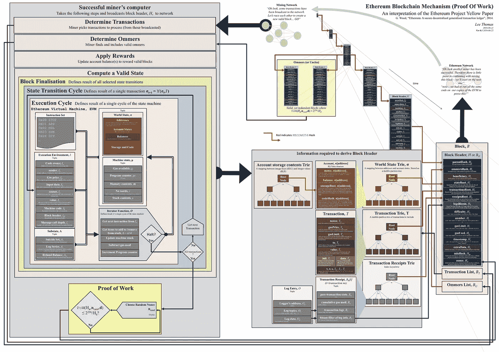
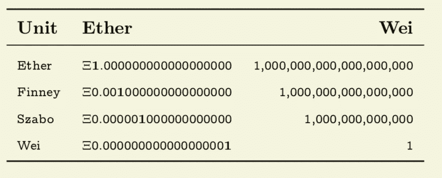
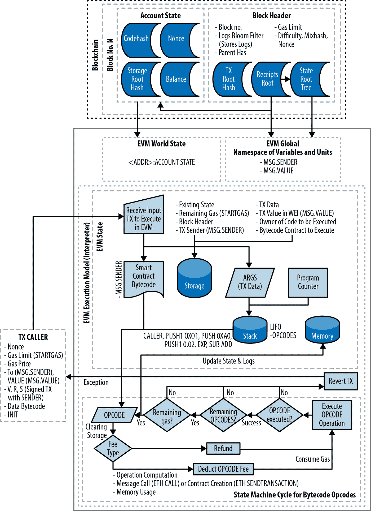

# 引擎盖下的以太坊:第 1 部分(0.4 版)

> 原文：<https://medium.com/coinmonks/ethereum-under-the-hood-part-1-ver-0-4-7ac9ccbfd0f6?source=collection_archive---------1----------------------->

这个系列将跟随我从头开始探索以太坊的旅程。我假设你有一些编程知识，理解一些但不是所有的概念。注意，我会在我认为合适的时候用更多的信息更新这个帖子的多个版本。

**世界计算机:以太坊区块链**



[**Ethereum Virtual Machine**](https://ethereum.stackexchange.com/questions/268/ethereum-block-architecture)

[以太坊](https://ethereum.org/)是一个混合了 g [ame 理论/经济学](https://blockgeeks.com/guides/cryptocurrency-game-theory/)的复杂软件。如果你试图理解下面发生了什么，这可能令人难以置信，有时也令人厌倦。我发现很难找到理解规范的资源。我没有找到一本，而是想写一本。

理解以太坊的一个好方法是理解[白色](https://github.com/ethereum/wiki/wiki/White-Paper)、[米色](https://github.com/chronaeon/beigepaper/blob/master/beigepaper.pdf)、[黄色](https://github.com/ethereum/yellowpaper)论文中提到的定义。所有这些文件都指向细节不同的相同规格，**白色**是更高级别的规格，**黄色**是更详细的规格。在整个系列中，我们将主要参考米色纸(BP)和一些黄色纸(YP)的元素。因此，让我们暂时坚持 BP 的定义，开始我们的旅程。

*提示:我建议您将* [*BP*](https://github.com/chronaeon/beigepaper/) *和* [*YP*](https://github.com/ethereum/yellowpaper) *以 PDF 格式在两个窗口中打开，并在需要时参考规格。*

**以太坊是什么？**

以太坊 imho 是一个全局状态和虚拟机的结合体。**以太坊=世界状态+虚拟机**。

**什么是世界状态？**

世界状态简单地称为**这个系统在给定快照下的宇宙真理**。让我们从一个不同的角度来看，假设一个州的数据是可用的，谁将使用它，他们能做什么？暂时保持这种想法。让我们来看看一些可用于世界状态数据库的 API 的框架代码。让我们假设有两个基本的*函数*可用`getGlobalState() and isValidGlobalState()`，API 的框架代码可能看起来像下面的代码片段。

```
*function* **getWorldState()**{
 return stateInfo ;
}
*function* **isValidWorldState(obj stateInfo)**{
  return true/false ;
}
```

第一个*函数*返回该时间点的**真值**，换句话说，该函数返回当前状态(又名真值)。第二个函数验证状态是否正确，这意味着您可以相信您所得到的东西，没有任何东西被篡改。下一个函数是否验证它接收到的状态是否准确？。让我们说一些未知的球员通行证说一个当前状态 **XYZ** 和一个应该验证当前状态 **XYZ** 是准确的使用`**isValidWorldState(XYZ)**` 和你应该得到**真**如果不是呀！警报警报。

接下来的问题是？**状态 XYZ** 必须存储在硬盘中，并且应该是另一组功能可以识别的格式，该功能将读取和添加新的状态。注意，我说的是读取和添加，而不是**更新，**我们没有**更新**功能，因为几乎所有的区块链都是只追加的，不能修改当前状态。

让我们为我们的**虚拟机**探索一些可能的*功能*。根据黄皮书，虚拟机是状态转移函数的子集。看一看方便的参考资料。

***正式:***[***σT+1≡υ(σT，T)***](https://ethereum.github.io/yellowpaper/paper.pdf) ***出自黄纸。更多细节在*下面提供**

```
*function* **addNewState(obj nextState)**{ 
  verify currentState;
  newState = currentState+nextState;
  return newState;
 }
```

状态函数的读数可以是这样的:

```
*function* **readState(obj currentState)**{
    verify currentState;
    return nextState;
 }
```

**挖掘**也是状态转移函数和 YP 的一部分，这里有一个我正在创建的方便的表格来解释证据。

*提示:方便参考 YP 使用的* [*符号*](https://ethereum.stackexchange.com/questions/6022/algebra-symbology-guidance-for-ethereum-yellow-paper) *和* ***附录-A*** *下面*

Yellow Paper State Functions

我们可以有另一个名为 **verifyState()** 的*函数*，我的观点是保持它的简单，通过使用这些状态转换*函数*，简单的计算机即虚拟机(VM)执行这些函数中的指令，并确保一切正常。让我在这里停下来，引用英国石油公司的论文摘要

" ***以太坊协议是一个确定性但实际上无界的状态机，有两个基本功能；第一个是全局可访问的单例状态，第二个是将更改应用到该状态的虚拟机*** *。”*

在我们继续之前，请记住我们讨论过“虚拟机”(来自上一节)，也就是“VM”。VM 函数验证世界状态，并通过添加新块来改变状态。想象一下，你正在出租我们的计算机来执行一些计算。

没有免费的东西，虚拟机不能运行一些随机代码，代码需要检查，数据需要验证，代码需要小心退出等等。所以每一个需要运行的代码都应该提交一定的费用。费用是**乙醚**。让我们在这里停下来想一想。

**什么是以太？**

所以让我们回头看看以太坊是什么。以太坊是一台功能性的全球计算机，所以要运行这台全球计算机，我们需要付出一些网络成本，这个网络成本单位就是**以太:**ξ

ξ可以分解成以下单位。**卫**(ξ)是最小的单位，你可以看到一个**芬尼**可以被命名为**卫**(ξ)或 0.0010000000000000000】醚



[Source: Biege Paper](https://github.com/chronaeon/beigepaper/)

以太坊没有付费玩的概念怎么办？如果我是一个糟糕的演员，我可以很容易地用一个无限循环关闭系统，并消耗所有的资源，虚拟机不能执行下一个指令集。以太坊通过让人们付费来防止这种情况，其理念是一旦你为某样东西付费，你就会小心，不会伤害系统。我确实把这个想法过于简单化了，但是你明白了。在下一节中，我们将讨论什么是“真实”也就是全局状态，以及如何验证全局状态，什么是全局状态中的数据

**这个数据在*世界*状态*下是什么？***

简单地说，世界状态中的数据是由块划分的状态，每个新的块代表一个新的全局状态。块包含使用称为 [***递归链接前缀(RLP)***](https://github.com/ethereum/wiki/wiki/RLP) 的串行化/去串行化算法的**地址和账户状态**的映射，并作为[**Patricia-Merkle Trie**](https://github.com/ethereum/wiki/wiki/Patricia-Tree)**存储在维护[字节数组](https://stackoverflow.com/questions/4019837/what-do-we-mean-by-byte-array)到字节数组的映射的数据库后端中。我们将在下一集深入探讨什么是 RLP。**

**因此，World state = Total 数据库中数据库关系散列的总散列。我要在这里停下来伸展一下，我建议你也这样做。**

**假设我们有一个键，值对数组，LHS 是
状态的映射，即 Bytearray - > Bytearray。RHS 是实际的映射本身**

```
 state 1 = [key1, val1]
 state 2 = [key2, val2]
 state 3 = [key3, val3] Global State = *hash*( [ [state1], [state2], [state3]...] )
```

**引用《黄皮书》*中的话，国家可以包括账户余额、声誉、信托安排、与现实世界信息有关的数据等信息；简而言之，任何目前可以由计算机表示的东西都是可以接受的。”***

**还记得我们谈论过的*函数*以及这些函数中的一个参数“obj”吗，现在让我们稍微扩展一下“obj”，“obj”是“Object”的缩写。以太坊世界中的一个对象是一个字节数组。例如本质上是字节数组的对象的。**

**`“Dog” [“D”,”o”, “g”], [[], “Dog”, [“Cat”]]`**

**根据 BP，字节数组以特殊格式存储，称为**递归链接前缀(RLP)** 。我们以前简单地提到过它。让我们在下一篇文章中更深入地探讨一下 RLP 的大惊小怪到底是怎么回事。**

**让我们回顾一下本周的发现。**

1.  **以太坊是一台世界计算机。**
2.  **以太坊是单一世界状态+虚拟机的**组合****
3.  **世界状态是所有状态的集合。**
4.  **一个**状态**是一个**块**的集合。**
5.  **根据微型数据库中的 **RLP** 前缀规范，世界状态被存储为**帕特丽夏·默克尔特里树**。**
6.  **只有虚拟机可以**添加**一个新状态。**
7.  **虚拟机需要**燃料**来执行指令，燃料是‘乙醚’来防止流氓行为。**

***在* [***下一节***](/coinmonks/ethereum-under-the-hood-part-2-rlp-encoding-ver-0-3-c37a69781855)*中我们将深入探讨什么是****【RLP】并且我们将使用一些代码示例。*****

****附录 A: YP 符号****

****Yellow Paper Symbols****

****参考文献:****

**[https://github . com/Benjamin ion/yellow paper _ cheat sheet/blob/master/ypcheat sheet . pdf](https://github.com/benjaminion/YellowPaper_CheatSheet/blob/master/YPCheatSheet.pdf)**

****

**[**Source:Etherum Virtual Machine**](https://cypherpunks-core.github.io/ethereumbook/13evm.html)**