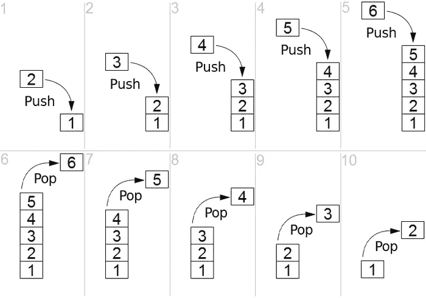
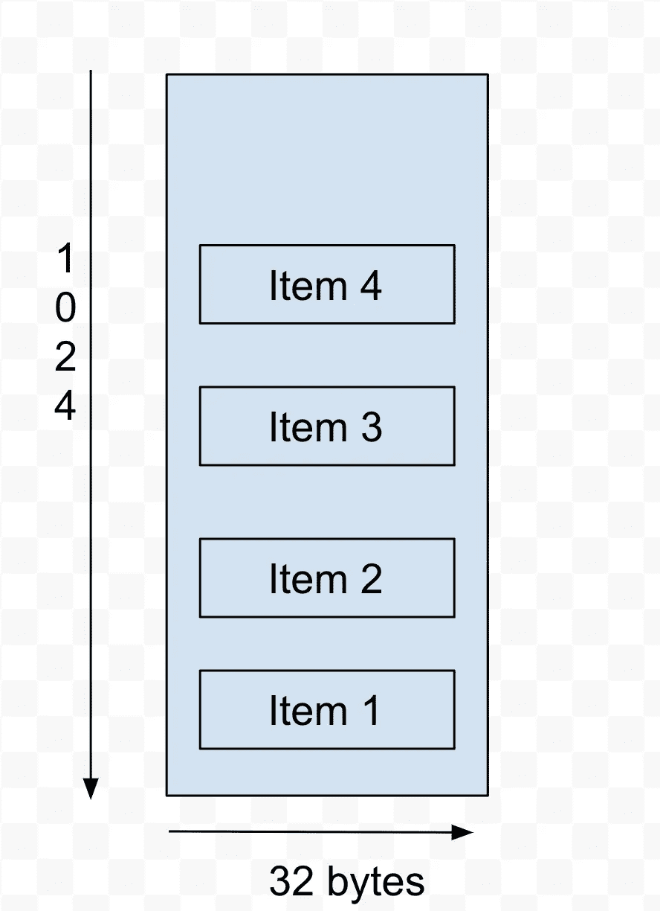

# 引擎盖下的以太坊-第 2 部分(RLP 编码)-0.3 版

> 原文：<https://medium.com/coinmonks/ethereum-under-the-hood-part-2-rlp-encoding-ver-0-3-c37a69781855?source=collection_archive---------1----------------------->

原始发布日期:[2018 年 4 月 25 日](/coinmonks/ethereum-under-the-hood-part-ii-i-933411deebe1?source=post_page-----933411deebe1--------------------------------)

*更新:语法修正*

*文章的第二部分，如果你还没有完成第一部分，请完成。我们将在本文中介绍以太坊如何使用* ***递归长度前缀*** *对数据和状态进行编码。*

这是一个稍微长一点的阅读，所以给自己弄点咖啡，准备好被弄糊涂，我读了关于 RLP 的书

**问题:**

以太坊是一台全球计算机，以太坊要处理的数据必须通过线路紧凑高效地发送。以太坊团队选择了**递归链接前缀**解码/编码算法来实现上述目标。如果你浏览以太坊的文章，会发现提到了"[堆叠机器](https://github.com/ethereum/wiki/wiki/Ethereum-Development-Tutorial#state-machine)"以及它们在以太坊中的用法，所以让我们稍微介绍一下。

**堆垛机:**

让我们简单介绍一下什么是[堆栈](https://en.wikipedia.org/wiki/Stack_(abstract_data_type))。



**Stack Machine**

[来源:维基](https://en.wikipedia.org/wiki/File:Lifo_stack.png)

以太坊虚拟机(EVM)是一种基于堆栈的机器，它使用后进先出(LIFO)方法将指令和数据存储在基于堆栈的中。让我们以字符串" **cat** "为例，看看它是如何将**推入堆栈的**

```
['c','a','t' ] 
so the PUSH operation will be:
**PUSH(‘c’) 
PUSH(‘a’) 
PUSH(‘t’)** When data has to be retrieved POP function is used in the order it was put in:
**POP('t')
POP('a')
POP('c')**
```

以太坊栈有一定的限制。堆栈深度在 [1024](https://ethereum.stackexchange.com/questions/26938/why-is-the-evm-stack-limited-to-1024) 元素处达到最大，每条指令的最大字长为 256 位或最大 32 字节。我认为这就是指令集的宽度，如下图所示。



Ethereum Stack Machine(1024 elements max height, 32 bytes max word size)

栈式机器是实现小型编译器的理想选择。让我们来看一个表达

```
[**[0x12344**]**,[ (a+b*c/d**), **'x', 9]** ]
```

需要考虑一些事情，上面的数组中有两个项目。十六进制值和表达式。将十六进制值(0x12344)视为以太坊地址，将表达式视为状态变化信息。注意，该字的最大长度为 256 位。我们来考虑一下`[(a+b*c/d), ‘x’, 9 ].` 整个表达式小于 32 字节。你问为什么是 32 字节？这里有一个关于这个话题的很好的[栈交换](https://ethereum.stackexchange.com/questions/7382/rationale-behind-256-bit-words-in-evm)讨论。

看看这个关于[堆垛机](https://www.youtube.com/watch?v=GtKJ-ccF3oI)的 youtube 视频

**字节数组和项目**:

让我们回顾一下从上一篇文章中学到的一些概念。以太坊中的所有数据都被[序列化](https://stackoverflow.com/questions/3784143/what-is-the-difference-between-serializing-and-encoding)并反序列化为一个字节数组。放，一个字节数组是一个[字节数组](https://stackoverflow.com/questions/4019837/what-do-we-mean-by-byte-array)，值得重复一些这些字节数组的例子。

**RLP** 编码函数接受一个**项**或一组**项**

*   字符串(即字节数组)是一个项目
*   项目列表也是一个项目

***例项和目项***

*   **“比特币”**
*   **[ [] ]**
*   **[《狮子》]**
*   **[ ["猫"，123，' d '，' o '，' g'] ]**

**现在，什么是*递归链接前缀* (RLP)？**

RLP 是一组编码和解码结构和数据的规则。*第二部分。我*关注 **RLP 编码；我们**将在*第二部中讲述**RLP**解码。II* 的文章在后面的帖子里。让我们回顾一下 RLP 的内涵。如果你记得在之前的[文章](/@deepakraous/ethereum-under-the-hood-part-i-ver-0-1-4f2fb24b3d68)中我们讨论过**“项目”**，所有的“项目”都是**字节数组**。RLP 函数接受类型**对象的一个参数。**

RLP 的一个重要方面是，它将特定结构的编码规则留给顶级层，例如，如果存在另一种结构，例如{“ABC”}。RLP 会将其视为字符串元素，并将编码工作留给顶层

```
*function* encodeRLP**(rawData)**{ 
  .....,
 return encodedData #type bytearray;
}*function* decodeRLP**(bytearray stateInfo)**{
  .....,
  return decodeData #raw;
}
```

让我们进入这些对象的 RLP **编码**规则:

*提示:我建议打开一个* [*ASCII*](https://www.asciitable.com/) *图表。*

# RLP 编码规则定义如下:

***规则 1:当对具有 1 个字节的有效载荷进行编码并且该字节中的值落在以下范围[0x00，0x7f]内时，换句话说，落在[0，127]内，然后将该单字节编码为 RLP 本身***

```
$ 120 to rlp
***78*** $ 127 to rlp
***7F*** $ "a" to rlp
**a**
```

因此，将 120 编码成 RLP 导致了 ***78*** ，127 导致了 ***7F、*** ，对于“a”，编码导致了“ **a** ”，并且字节大小为 1，并且编码规则#1 适用。

***规则 2:当对一个介于 0 和 55 字节之间的字符串(在字节数组中)进行编码时，应用以下逻辑。***

`**0x80+length(string),string**`

```
string "dog" to byte-array in hex is [0x64,0x6f,0x67] and size of the byte array is 3
```

让我们将项目“ **dog** ”编码到 RLP 中，字节数组的大小即长度为 3，因此编码到 RLP 中将导致

`[0x80+3,0x64,0x6f,0x67] -> [**0x83**, 0x64, 0x6f, 0x67]`

例如:另一个例子是 RLP 编码的“ **hello world** ”。“hello world”的大小是 11 字节。

```
$ "hello world" to rlp
 [**0x8B** 0x68 0x65 0x6C 0x6C 0x6F 0x20 0x77 0x6F 0x72 0x6C 0x64]
```

***规则 3:对大于 55 字节的字符串(字节数组)进行编码时，应用以下规则。***

```
1)0xb7+length_in_bytes(byte_size(string)) 
2)length(string)
3)encoded string  
Join 1,2,3
```

让我们举一个例子字符串“你好，我是一个很长很长的字符串，我将在 RLP 得到编码！”。**管柱**的长度为 **76，**因此规则 3 适用。让我们先解决几个先决条件。

```
*a)len raw string = 76 
b)byte_size(string) =76 
c)length_in_bytes(byte_size(string) ) = 1*
```

遵循规则#3 的步骤

1.  0xb7 + 1
2.  76
3.  "你好，我是一个很长很长的字符串，我将在 RLP 被编码！"
4.  (0xb7+1)，76，“你好，我是一个非常非常长的字符串，我将在 RLP 得到编码！”

所以最终的十六进制 RLP 编码是:

```
**B84C***48656C6C6F2074686572652C204920616D206120766572792076657279206C6F6E6720737472696E6720616E64204920616D20676F696E672067657420656E636F64656420696E20524C5021*
```

***规则 4:当对一个列表进行编码，并且列表中的编码净荷在 0–55 字节之间时，应用以下编码规则。***

```
1)0xc0+length of (list)) 
2)Encoded string
Join 1,2
```

用 **["狗"、"老鼠"、"老虎"，127]** 给定一个输入给 RLP 编码

我们需要首先对列表中的有效载荷进行编码。

*   “狗”: **0x83** ，0x64，0x6F，0x67
*   “鼠标”: **0x85** ，0x6D，0x6F，0x75，0x73，0x65
*   “老虎”: **0x86** ，0x74，0x69，0x67，0x65，0x72，0x73
*   127 : 0x7F

现在，带有编码负载的列表如下所示:

`[ **0x83** 0x64 0x6F 0x67 **0x85** 0x6D 0x6F 0x75 0x73 0x65 **0x86** 0x74 0x69 0x67 0x65 0x72 0x73 **0x7F** ] and the length of the list is 18(12 in hex)`

所以这条规则的最终输出是:

1.  0xc0+12 : **0xd2**
2.  `[ **0x83** 0x64 0x6F 0x67 **0x85** 0x6D 0x6F 0x75 0x73 0x65 **0x86** 0x74 0x69 0x67 0x65 0x72 0x73 **0x7F** ]`
3.  1 和 2 的并集
4.  最终输出:**0x D2**0x 830x 64 0x6F 0x 67**0x 85**0x6D 0x6F 0x 75 0x 73 0x 65**0x 86**0x 74 0x 69 0x 67 0x 65 0x 72 0x 73**0x7F**

***规则 5:当对一个列表进行编码，并且列表中的编码净荷大于 55 字节时，应用以下编码规则。***

```
1)0xf7+length_in_bytes(item 2)
2)length(payload)
3)Encoded payload
Join 1,2,3
```

我会让你做剩下的事情，非常类似于上面的规则。

**最后一点注意事项**

*   RLP 以 [Big Endian 格式、](https://betterexplained.com/articles/understanding-big-and-little-endian-byte-order/)对正整数进行编码，并丢弃前导零，整数值零与空字节数组相同。
*   空列表、字符串和整数 0 都有特定的常量

```
1) Empty List   **[]** encoded to **0xC0**
2) Empty String **""** encoded to **0x80**
3) Integer      **0**  encoded to **0x80**
```

重述重述重述

我的建议是让这个消化一下，再回到文章上来。我也不能 100%确定一些更好的细节，但我确实从 stack-exchange 的好人们那里获得了一些关于设计决策的有用观点和一些奇妙的帮助。

让我们回顾一下:

*   RLP 是对一个项目或项目列表进行编码的一组规则。
*   RLP 根据有效载荷的大小有一套不同的规则。
*   字符串是一个字节数组。
*   空字符串，列表有预定义的值。
*   使用 RLP[是因为](https://ethereum.stackexchange.com/questions/19092/why-was-rlp-chosen-as-the-low-level-protocol-encoding-algorithm)它能够压缩数据并且简单。

*提示:试着阅读关于以太坊团队为什么选择 RLP 的设计决策的* [*理由*](https://github.com/ethereum/wiki/wiki/Design-Rationale) *。RLP 有多种实现方式。我建议浏览一下。我确实参考了* [*仙丹*](https://elixir-lang.org/) *和红宝石中的实现。*

也有其他伟大的媒体职位对 RLP，我完全提到去，并将继续这样做，为未来的参考。在来自 [girishramnani](https://medium.com/u/555875ec10a0?source=post_page-----933411deebe1--------------------------------) 的代码片段的帮助下，查看我的[实现](https://github.com/deepakraous/elixir_rlp)，非常感谢[@ kvkalidi](http://twitter.com/kvkalidindi)的校对和宝贵意见。

在下一篇文章中， [*第 3 部分*](/coinmonks/ethereum-under-the-hood-part-3-rlp-decoding-df236dc13e58) ***，*** 我们将介绍 **RLP 解码**的一些实现参考。

参考资料:

[](http://hidskes.com/blog/2014/04/02/ethereum-building-blocks-part-1-rlp/) [## 以太坊积木第 1 部分:RLP

### 在这一系列的博客文章中，我将试着写更多关于这些部分的内容，当它们结合在一起时，就构成了新的…

hidskes.com](http://hidskes.com/blog/2014/04/02/ethereum-building-blocks-part-1-rlp/) [](/@phansnt/data-structure-in-ethereum-episode-1-recursive-length-prefix-rlp-encoding-decoding-d1016832f919) [## 以太坊中的数据结构。第 1 集:递归长度前缀(RLP)编码/解码。

### 有很多论文、博客解释以太坊是如何组织数据的，但它们似乎都太…

medium.com](/@phansnt/data-structure-in-ethereum-episode-1-recursive-length-prefix-rlp-encoding-decoding-d1016832f919)  [## 了解以太坊 trie

### 前几天，我终于开始阅读整个以太坊黄皮书，并弄清楚如何修改…

easythereentropy.wordpress.com](https://easythereentropy.wordpress.com/2014/06/04/understanding-the-ethereum-trie/)