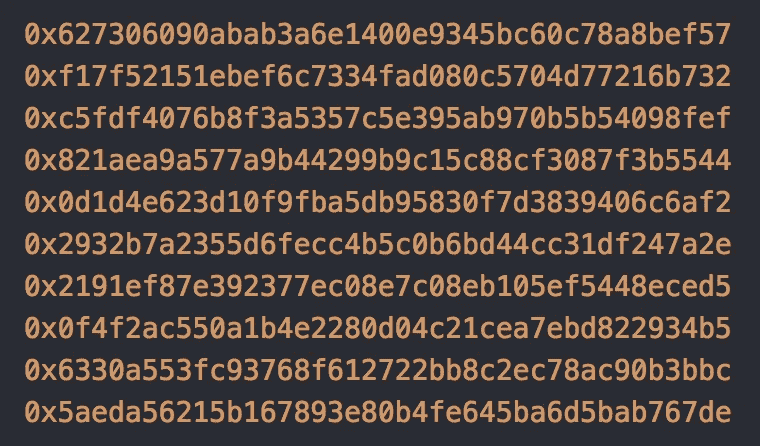

# 引擎盖下的以太坊第三部分(RLP 解码)

> 原文：<https://medium.com/coinmonks/ethereum-under-the-hood-part-3-rlp-decoding-df236dc13e58?source=collection_archive---------2----------------------->



***更新:语法修正***

*递归链接前缀的 Part-3(RLP 解码)，* ***如果没有经历过 Part-1，Part-2，请做*** *。在本节中，我们使用* ***RLP 解码规范*** *解决解码以太坊数据。*

让我们简单回顾一下到目前为止我们所学的内容:

> *以太坊是世界计算机(全局状态+一个虚拟机(VM))。VM 可以向全局状态机添加新的状态。状态是块的集合，块包含一组事务。以太坊使用 RLP 来序列化/反序列化数据。RLP 规范只理解两种数据原语(项目、项目列表)。世界状态存储为* [*以太坊*](https://github.com/ethereum/wiki/wiki/Patricia-Tree) *(注:如果这听起来不熟悉请再读一遍* [*部分*](/@deepakraous/ethereum-under-the-hood-part-i-ver-0-1-4f2fb24b3d68) *1。)*

现在让我们直接进入主题， **RLP 解码**很简单，“解码”是一个花哨的词，意思是我要将这些信息转换成它的原始格式。

**RLP 解码规则:**

1.  看第一个字节，第一个字节应该落在以下范围之一: *[ [0x00..0x7f]，[0x80..0xb7]、[0xb8..0xbf ]，[0xc0..0xf7]，[0xf8..0xff]* ]如果字节在以下范围内，则使用以下规则解密数据类型:

> *【0x 00..0x7f]:数据是类型* ***字符串*** *并且应该按原样解码。*
> 
> *【0x 80..0xb7] :* ***字符串*** *及其一个* ***短*** *字符串*
> 
> *【0xb 8..0xbf ] :* ***字符串*** *及其一个* ***长*** *字符串*
> 
> *【0xc 0..0xf7] :* ***列表*** *和* ***简称*** *列表*
> 
> *【0x F8..0xff] :* ***列表*** *并且是一个* ***长*** *列表*

2.获取字节数组的**长度**:

*【第一个字节—字节范围的第一个字节】=数据的长度，例如:* `*0x83–0x80 = 3*` *，3 是字节数组*的长度

3.重复第一步和第二步，直到字节数组结束。

让我们举一个简单的例子，将一个字符串**“dog”**编码成 RLP，如下所示:

```
"dog" = [**0x83**, 0x64, 0x6f, 0x67]
```


[Ascii](https://www.asciitable.com/) Chart for handy reference

让我们**按照我们的规则解码**输入，因此给定一个字节数组作为输入

`**0x83 '***d' 'o' 'g'*`

1.  检索第一个字节: **0x83**
2.  检查范围是否在设定的指定范围内，在这种情况下，范围在 **[0x80..0xb7]** 因为第一个字节是 **0x83。**
3.  计算长度:第一个字节- **字节范围内的第一个字节**，**0x 83**-**0x 80**= 3
4.  数据类型为字符串，长度为 **3**
5.  有了这些事实，解析直到字符串结束: **0x64，0x6f，0x67**

让我们再举一个处理**列表的例子；前面的例子是一个简单的数据结构字符串“dog”。解码列表稍微复杂一些；我们需要计算列表的总长度，并用列表破译元素。对于可重复的任务，我们还需要通过使用[递归](https://en.wikipedia.org/wiki/Recursion#In_computer_science)技术对列表进行解码，直到结束。**

`***[“cat”, “dog” ] -> C8 83*** *636174* ***83*** *646F67*` *，*在这里暂停一秒钟，让我们通过看结构来破译。我在这里看到几个项目，这是一个列表，它有两个元素，这些元素的数据类型是一个字符串，解码我们得到的列表`[***C8 83*** *63 61 74* ***83*** *64 6F 67*](https://github.com/ethereum/wiki/wiki/RLP) *(tip: refer to the ascii chart above)*`

1.  检索第一个字节:`**0xc8**`
2.  找到第一个字节所在的最近的字节范围；在这种情况下，第一个字节落在范围`**[0xc0 .. 0xf7]**`内，因此数据是一个**列表。**
3.  创建一个空列表`**[]**` 进行累加
4.  列表长度，[0xc8 -0xc0] = `**8**`
5.  开始破译`c8 to get the encoded data from the List until end of List.`后
6.  `***C8 83*** *63 61 74* ***83*** *64 6F 67*`
7.  我们知道我们有一个列表[它有八个元素]，现在让我们看看列表里面有什么。
8.  算出长度是:第一个字节范围， `0x83–0x80` = `3`
9.  数据类型为**字符串，**，长度为`3`
10.  解析并解密下一个 **3** 字节`*0x63, 0x61, 0x74*`
11.  重复步骤 8 至 11，直到下一组字节的列表结束，结果为`**0x83**, 0x64, 0x6f, 0x67`
12.  计算长度并解释数据，在这种情况下，数据是`**0x64,0x6f,0x67.**`

嗯，所涉及的步骤是可重复的，并且 ***递归*** 将是解码整个字节数组的有用模式。看看实现 RLP 解码规范的代码框架。*注意下面代码中转换成小数的字节范围。*


*RLP Decoding* [*Skeleton*](https://github.com/deepakraous/elixir_rlp) *Code in Elixir*


Encoding/Decoding RLP for a Small String.

我选择 Elixir 有各种原因，包括它的列表操作和原始数据类型。除此之外，我强烈推荐阅读其他语言中包含的许多示例，请查看下面的参考资料。

在我们结束这一部分之前，我们还需要花一点时间研究一下编码和解码规范。我们学习了处理价值观的 RLP。为了检索数据，我们需要一个**键**，它提供了一个找到值的路径。因此，让我们快速浏览一下黄皮书中的[十六进制前缀(附录 C)](https://ethereum.github.io/yellowpaper/paper.pdf.) 。

**十六进制前缀:**

用简单的英语来说，把十六进制前缀想象成以太网中给定**值**的“路径”的编码/解码机制；这意味着*我知道去这个房子的方法，这是存放房子地图的方法。*我认为这是{Key，Value}元组中的“键”,我将整个数据结构设想为:

`[{key1, value1}, {key2, value2}, {key2, value2} ]`

`[ {hp1, rlp1}, {hp2, rlp2}, {hp3, rlp3} ]`

大概就是这样；我强烈推荐[phan sơntự](https://medium.com/u/2d1e5cc8c1db?source=post_page-----df236dc13e58--------------------------------)medium 关于十六进制前缀的帖子，以供进一步参考。在 [**Part-4**](/coinmonks/ethereum-under-the-hood-part-4-the-trie-a3f71f8dbef8) 中，我们在谈论 Trie 时将一些片段连接起来，并联系到我们目前所学的内容。再见，直到那时。

# 参考资料:

[](/codechain/test-4245f1fd1bb3) [## 代码链序列化

### 我们都知道每个区块链都需要序列化和反序列化块。块存储在磁盘上，然后发送…

medium.com](/codechain/test-4245f1fd1bb3) [](https://www.badykov.com/elixir/2018/05/06/rlp/) [## Elixir 中以太坊的递归长度前缀编码

### 本周，我们在 Mana 项目，重写了以太坊的递归长度前缀(RLP)编码的实现，所以现在…

www.badykov.com](https://www.badykov.com/elixir/2018/05/06/rlp/) [](/coinmonks/data-structure-in-ethereum-episode-1-compact-hex-prefix-encoding-12558ae02791) [## 以太坊中的数据结构。第 1 集+:压缩(十六进制前缀)编码。

### 在第一集，我们讨论了 RLP 编码/解码，然而以太坊还有另一种编码叫做压缩…

medium.com](/coinmonks/data-structure-in-ethereum-episode-1-compact-hex-prefix-encoding-12558ae02791) [](https://ethereum.stackexchange.com/questions/12941/in-the-ethereum-modified-merkle-particia-tree-what-do-the-prefix-key-and-value/12942#12942) [## 在以太坊改进的 Merkle-Particia 树中，前缀、键和值表示什么？

### 黄皮书的附录 D 在定义节点类型时指出(斜体是我的):Leaf:一个两项结构，其…

ethereum.stackexchange.com](https://ethereum.stackexchange.com/questions/12941/in-the-ethereum-modified-merkle-particia-tree-what-do-the-prefix-key-and-value/12942#12942) [](https://github.com/ethereum/wiki/wiki/Patricia-Tree) [## 以太坊/维基

### 维基——以太坊维基

github.com](https://github.com/ethereum/wiki/wiki/Patricia-Tree)