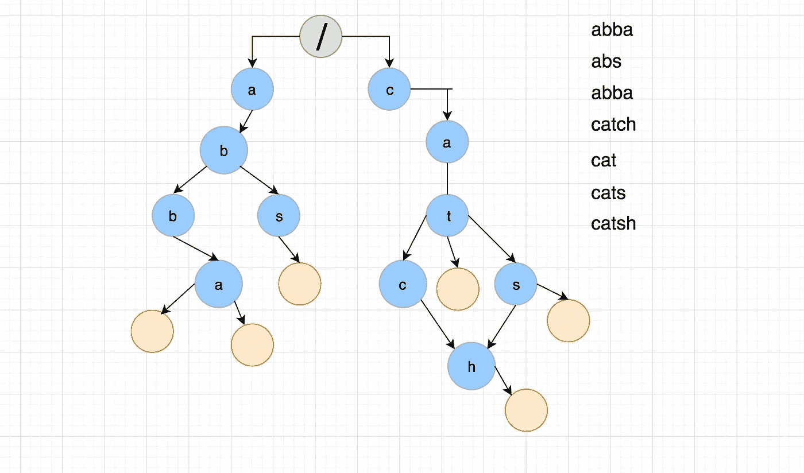
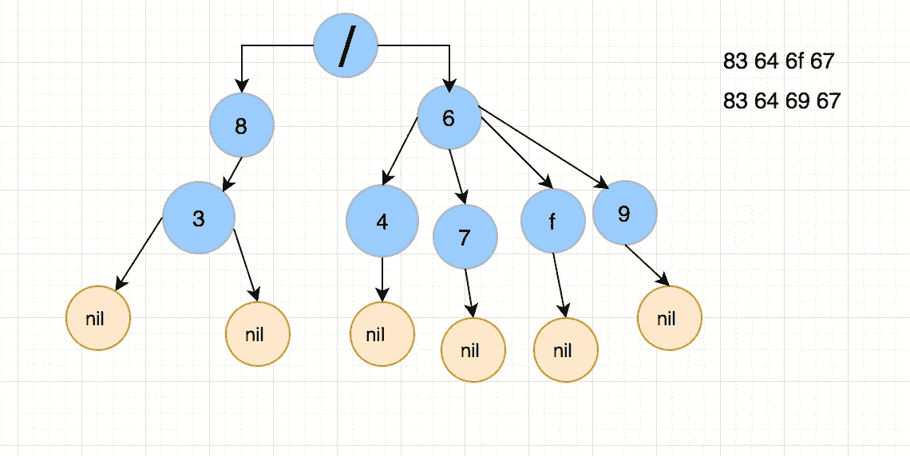
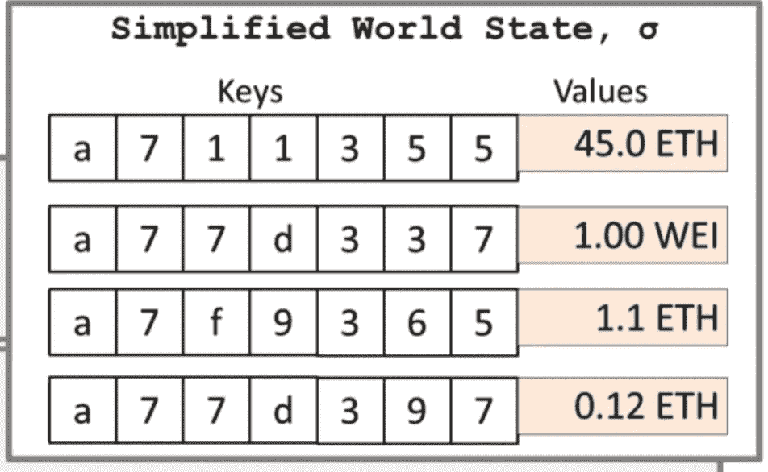
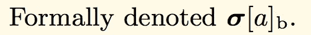
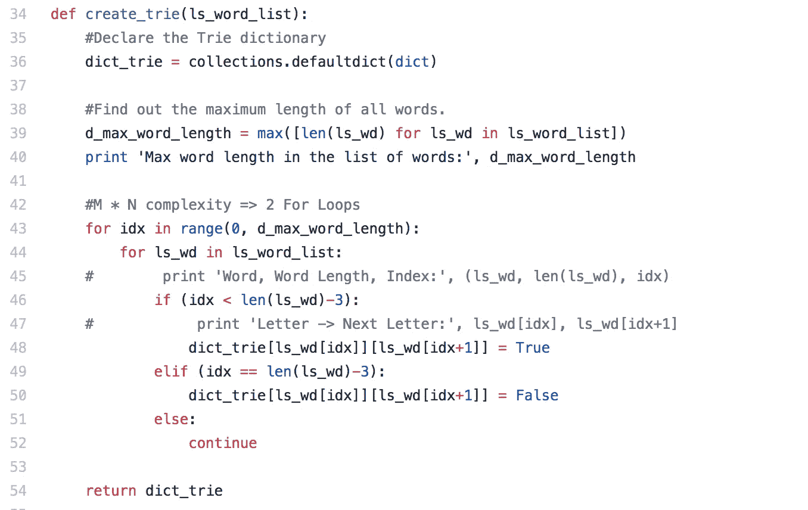

# 引擎盖下的以太坊:第四部分(特里)

> 原文：<https://medium.com/coinmonks/ethereum-under-the-hood-part-4-the-trie-fc029e25ed04?source=collection_archive---------3----------------------->

**更新:语法修正**

这一集假设你已经看完了这个系列的[第一部](/coinmonks/ethereum-under-the-hood-part-i-ver-0-1-4f2fb24b3d68)，第二部，[第三部](/coinmonks/ethereum-under-the-hood-part-3-rlp-decoding-c0c07f5c0714)，如果你还没有看完这篇文章，请先看完。这一集的标题是“特里”，而不是“帕特里夏·默克尔·特里”(PMT)。我觉得有必要先了解一下尝试，而不是直接进入 PMT。让我们开始吧:

我们将讨论:

1.  Trie 及其应用？
2.  对特里的更深入的研究
3.  以太坊与 Trie 的关系
4.  一个示例实现
5.  接下来呢？

*提示:我在* ***中用粗体*** *标注了一些单词，以强调重点或者引起你的注意。*

## Trie 及其应用？：

我们从尝试开始；有许多关于 Trie 的文章，请随意在维基上发表。Trie 是一种数据结构，它意味着快速 re **trie** val 以及单词“trie”。使用 trie 数据结构的一个真实用例是聊天会话时的 [**自动完成**](https://www.youtube.com/watch?v=Wqzp0KC6DfE) 或**自动纠正**功能，与下面的不完全一样:-)


Source:AutocorrectEpicFail.com

对于自动填充或自动纠正，我们需要多种可能性的快速查找，存储和检索给定**前缀**的值应该很快，这就是为什么 Trie 是这些用例的有用数据结构。

## 更深入地了解尝试:

请看下图，它将给定的**字符集**映射到给定的**单词集**的简化 Trie 数据结构中。



Basic Trie

在我们简化的 Trie 中，这些圆圈中的每一个都可以被认为是具有某些属性的**节点。**在我们简化的 trie 中，有三种节点 1)**根节点**节点(绿色)2)字符节点(蓝色)3)空节点(橙色)。现在让我们回到正题，添加一些我们熟悉的以太坊的属性。

所有节点类型(蓝色、绿色、橙色)都可能具有三个基本属性之一的值:

1.  ***一个唯一的 Id。***
2.  ***指向子节点和父节点的单个字符和指针。***
3.  ***状态 id。***

前两个属性是不言而喻的，但是属性#3: ***状态 Id*** 是一个令人兴奋且必不可少的属性，可以把它看作一个时间标记，或者简单地放一个维护全局状态 Id 的排序系统，例如:**状态- > 0** 是初始状态，下一个**状态- > 1** 。

假设我们要添加的第一个**字是**“ABBA”**，我们要添加的第二个**字是“abs”，数据结构可能如下所示:****

**`{ word = “**abba**”, **state_id = 1** }`**

**`{ word = “**abs**” , **state_id = 2** }`**

***谁决定什么* ***第一个*** *和第二个* ***下一个*** *是另一天的故事*，我们将在后面的系列中讨论这个问题，但请坚持这个想法。考虑到这一点，我们现在可以有一个简单的数据结构，如下所示。为了我们简单的尝试。我们将向简化的 trie 函数发送三个参数。**

**基本 Trie**

***注:如果想了解 trie 更多，可以看看这篇优秀的* [*文章*](/basecs/trying-to-understand-tries-3ec6bede0014) *。***

## **以太坊和 Trie 有什么关系？：**

**如果你还记得前两集[中的 RLP](/coinmonks/ethereum-under-the-hood-part-ii-i-933411deebe1)以太坊使用 **RLP** 来编码/解码值，例如，编码为 **83** 64 6f 67】和**dig**的字符串*64 69 67】将被编码为 **83** 64 69 67】。这种编码值搜索需要快速访问。***

***注:“狗”换算成十六进制是 64 6f 67。***

****

**“dog” and “dig” depicted as our Simplified Trie**

**查看上面的 trie，我们可以了解数据类型，我们可以确定数据类型以及它们的数量。查看 trie 的左侧，数字**“83”**表示 RLP 编码规范指定的数据类型**字符串**，有两个**。****

**有三个主要功能应用于我们简化的 Trie: 1)添加 2)删除 3)搜索节点。查看 Trie 的框架代码:**

*****Trie* 添加*功能骨架代码:*****

```
*function* **trie_add**(trie, word, state_id){//traverse through trie
     //add whatever character node not available in the trie
     //provide parent node id to child idto the new child node.
     //add 'nil' node if applicable and map it to state_idreturn status;}
```

*****Trie* 搜索*函数骨架代码:*****

```
*function* **trie_search**(trie, word){//Start from Root "/"
     //Retrieve all child nodes from "/"
     //verify if there is a match   
     //repeat until match completesreturn status;}
```

**回到以太坊，如果你记得我们讨论过以太坊世界状态，它本质上是一个键值对的散列。如下图所示:**

****

**Source: [Stack exchange](https://ethereum.stackexchange.com/questions/39915/ethereum-merkle-patricia-trie-extension-node)**

**想象一下那些***【nil】***充当终结符的节点有一个类似于**【45】**的数字，我在这里过于简单化了，但是当你在以太坊全局状态 [***上查找***](https://ethereum.github.io/yellowpaper/paper.pdf)*为关键字前缀:**【a77d】**，我们得到的值: ***{1.00 ETH，0 我们可以这样表达:******

***`***[ { “a77d337”: “1.00 WEI” }, {“a77d397”: “0.12 ETH”} ]***`***

***[黄皮书](https://ethereum.github.io/yellowpaper/paper.pdf)将此访问定义为:***

******

***Section 4.1 From the yellow Paper, where **a** is the address, **b** is the balance***

## ***一个示例实现:***

***下面是用 Python 编写的 Trie 的代码片段(感谢 [Vijay](https://medium.com/u/bfc1fe602830?source=post_page-----fc029e25ed04--------------------------------) )，我鼓励你自己制作一个简单的应用程序。***

******

*****Source: GitHub: @coolcalbeans*****

*****输出，Github: @coolcalbeans*****

***让我们在这里停下来喘口气。***

## ***下一步是什么？：***

***我建议你浏览一下参考资料，了解一下如何尝试。在下一节中，我们将讨论称为 **Patrica Merkle Trie** 的 Trie 的升级版本，以及它与以太坊的关系，在此之前请继续学习。***

# ***参考资料:***

***[](/basecs/trying-to-understand-tries-3ec6bede0014) [## 试图理解尝试

### 在本系列的每一期中，我们都试图理解和深入挖掘我们正在…

medium.com](/basecs/trying-to-understand-tries-3ec6bede0014) [](https://stackoverflow.com/questions/14708134/what-is-the-difference-between-trie-and-radix-trie-data-structures#14708989) [## trie 和 radix trie 数据结构有什么区别？

### 我的问题是 Trie 数据结构和 Radix Trie 是不是一回事？简而言之，没有。范畴基数三…

stackoverflow.com](https://stackoverflow.com/questions/14708134/what-is-the-difference-between-trie-and-radix-trie-data-structures#14708989) [](https://github.com/ethereum/wiki/wiki/Patricia-Tree#preamble-basic-radix-tries) [## 以太坊/维基

### 维基——以太坊维基

github.com](https://github.com/ethereum/wiki/wiki/Patricia-Tree#preamble-basic-radix-tries) 

来源:[https://www.youtube.com/watch?v=sAErv97lfIM&t = 276s](https://www.youtube.com/watch?v=sAErv97lfIM&t=276s)***