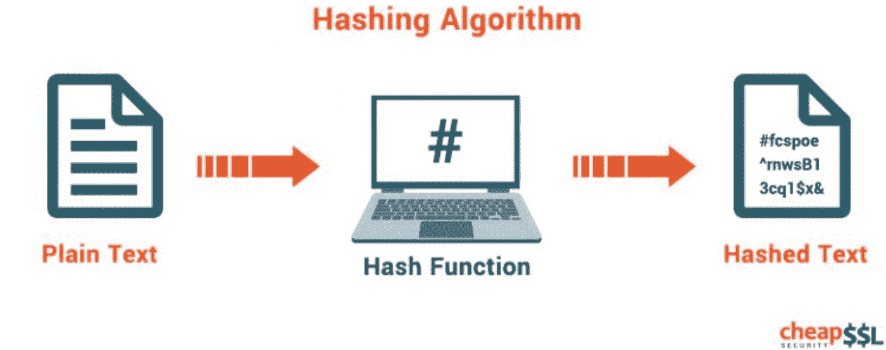
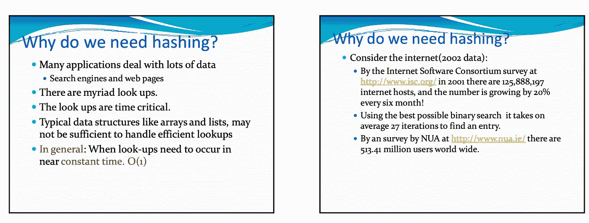
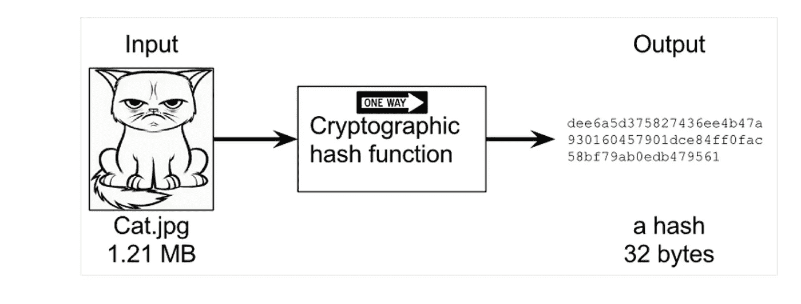
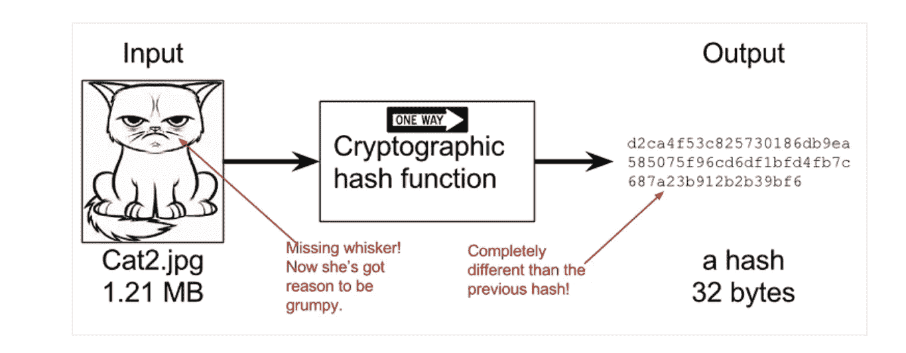
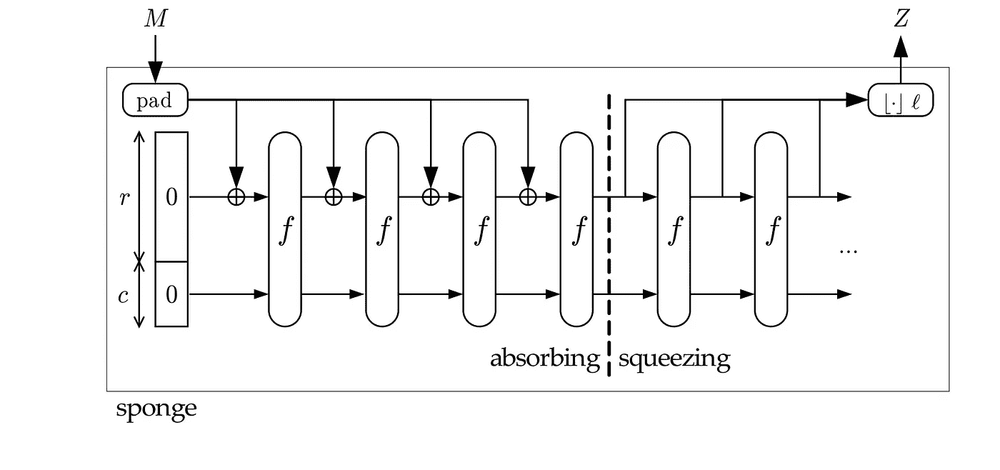
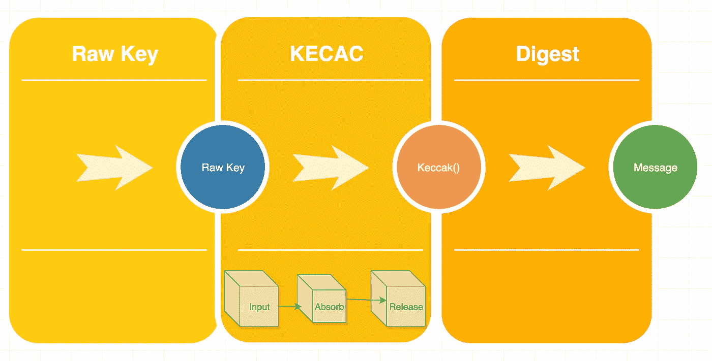
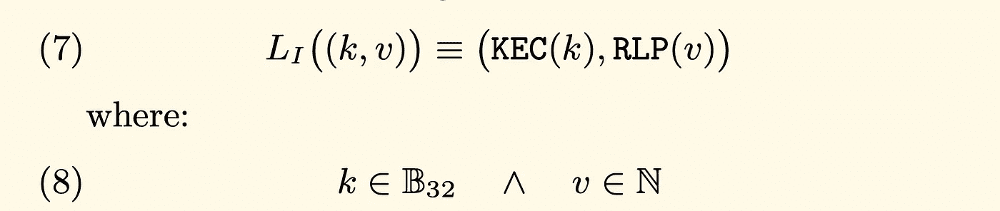
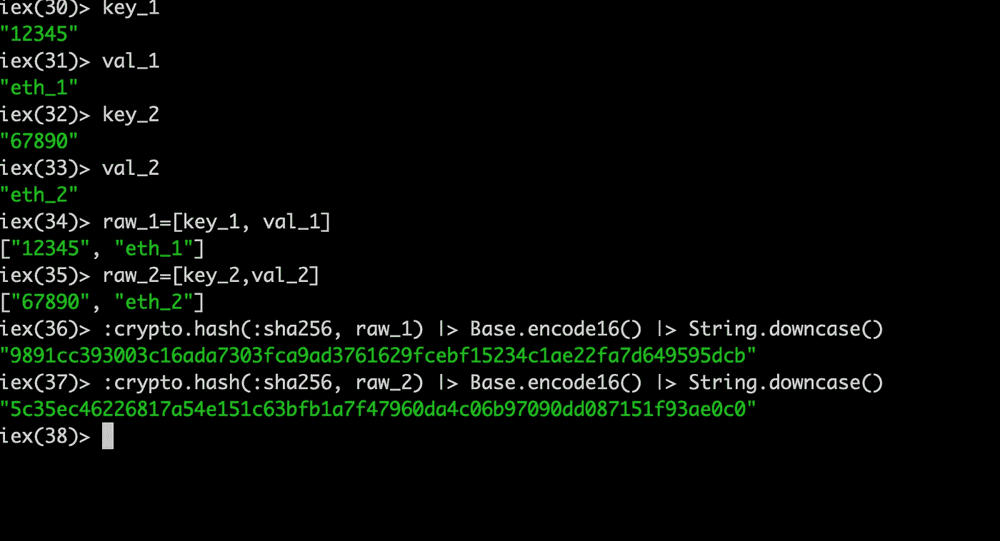

# 引擎盖下的以太坊第六部分(哈希)

> 原文：<https://medium.com/coinmonks/ethereum-under-the-hood-part-6-hashing-6abafa318bc6?source=collection_archive---------1----------------------->

从很长一段时间的休息中回来，并希望继续推进这一旅程，走向以太坊下面的技术和概念

以太坊的世界有许多变化，我可能会在我们前进的过程中涉及一些主题，但出于好奇，请看看这个关于下一代以太坊的优秀链接，标签为 [**ETH 2.0**](https://notes.ethereum.org/@ChihChengLiang/Sk8Zs--CQ/https%3A%2F%2Fbenjaminion.xyz%2Fnewineth2%2F20191003.html?type=book) 。还有一点要注意的是，我放弃了堡垒之夜主题，这一章将会很简短但很重要，我会在我们谈到的时候添加有用的链接:

1.  哈希是什么？
2.  为什么哈希？
3.  Keccak 加密哈希函数
4.  以太坊密钥和值
5.  摘要
6.  向前

## 什么是哈希:

哈希是一种算法函数，给定的输入字符串将总是返回一个固定长度的输出，称为“哈希”。我在几个段落中简化了这个概念，但这是哈希函数的本质，如下图所示:



[Source:cheapsslsecurity.com](https://cheapsslsecurity.com/blog/decoded-examples-of-how-hashing-algorithms-work/)

有关哈希的其他参考，请参考:

[](https://blockgeeks.com/guides/cryptographic-hash-functions/) [## 加密哈希函数的输入和输出

### 哈希函数是区块链技术的基础支柱之一。事实上，独自一人…

blockgeeks.com](https://blockgeeks.com/guides/cryptographic-hash-functions/) 

## 为什么哈希？：

哈希算法比列表或数组等其他算法有一些优势，因为它有两个主要特性:1)检索数据的速度**快**，无论数据的大小**如何，速度几乎保持不变；2)存储数据集使用的磁盘空间更少。这里有一个很好的参考，强调了为什么要使用哈希。**



[Lecture 23: Intro to Hashing (cs.cmu.edu)](http://www.cs.cmu.edu/~ab/15-121F10/lectures/lecture23.pdf)

## Keccak 加密哈希函数:

根据我们对哈希的了解，让我们稍微讨论一下加密哈希函数，并稍微详细地讨论一下 Keccak 加密哈希函数。

加密函数是一种特殊类型的哈希函数，具有一些附加功能，对密钥应用加密哈希函数将导致:

*   无冲突:没有两个不同的值可以产生相同的散列
*   安全:合理的随机性将产生安全的散列
*   散列函数的输入将总是产生相同的消息摘要

散列和加密散列函数是有区别的，下面的 StackExchange 讨论参考提供了一个有见地的区别。

[](https://security.stackexchange.com/questions/11839/what-is-the-difference-between-a-hash-function-and-a-cryptographic-hash-function) [## 哈希函数和加密哈希函数有什么区别？

### 我要说的是，这里需要理解的两个关键问题是:“哈希函数”这个术语是模糊的——或者更准确地说…

security.stackexchange.com](https://security.stackexchange.com/questions/11839/what-is-the-difference-between-a-hash-function-and-a-cryptographic-hash-function) 

下面我们来看一下暴躁猫图片哪个是 ***输入*** ，应用了加密哈希函数后，输出的是一个 ***哈希***



[Source: Manning.com](https://freecontent.manning.com/cryptographic-hashes-and-bitcoin/)

我们暴躁的猫图片的微小变化将导致完全不同的哈希



[Source: Manning.com](https://freecontent.manning.com/cryptographic-hashes-and-bitcoin/)

以太坊黄/白皮书指定了一个加密哈希函数“keccak”来满足这些基本属性

Keccak-256 是一个[海绵](https://en.wikipedia.org/wiki/Sponge_function)加密散列函数，其开发的重点之一是速度。类似于海绵，凯克具有吸收的属性。挤压和释放。对于给定的消息" **M** " Keccak hash 函数将以一定的速度执行一系列的"吸收"和"挤压"，结果将是消息 hash **Z** 如下图所示，注意吸收和挤压操作。



[source: Fig 2.1 Keccak Paper](https://keccak.team/files/CSF-0.1.pdf)

这是我对钥匙被吸收和释放的描述



Keccak sponge function

试着花点时间深入讨论一下 StackExchange 关于 Keccak256 加密哈希函数的更多细节:

[](https://ethereum.stackexchange.com/questions/11572/how-does-the-keccak256-hash-function-work) [## Keccak256 哈希函数是如何工作的？

### 由于以太坊平台依赖于 Keccak256 哈希算法，我想更好地了解它。我的粗糙…

ethereum.stackexchange.com](https://ethereum.stackexchange.com/questions/11572/how-does-the-keccak256-hash-function-work) 

[*注:以太坊 2.0 将切换到 SHA-256*](https://github.com/ethereum/eth2.0-specs/pull/779)

## 以太坊密钥和值:

以太坊将其数据存储在键和值的查找表中。在执行这些查找功能时，速度、安全性是重要的优先事项；回到黄皮书规范，加密散列函数提供了实现这些目标的方法:



[Ref: Yellow Paper( page: 4 )](https://ethereum.github.io/yellowpaper/paper.pdf)

让我们将上面的表达式扩展成一个简单的键/值对表，它可以转换成类似下面的**表**的东西，根据规范，键的大小是 32 字节。

```
 +-----------------------+-----------+
          | Keccak( Keys )        | RLP( Val )| 
          +-----------------------+-----------+
          | HASH 1                | Value 1   | 
          | HASH 2                | Value 2   |
          | HASH 3                | Value 3   |
          +-----------------------+-----------+
```

假设上表持续增长，一个可见的结果将是搜索结果时间的下降。使用散列函数，特别是加密散列函数，可以帮助执行快速值查找。

在接下来的文章中，我们将深入探讨**键**，但是现在，让我们假设键是公开可见的和安全的私有哈希值的组合。

为了说明一个简单的集合示例，我在 elixir 中创建了一个简单的 k，v 对，其中 k= > {"12345 "，" 67890"} 和 *v= > {"eth_1 "，" eth_2"}* ，并使用 SHA256 加密散列函数创建了一个散列



Sha256 hash function

如果我们将它转换成一个简单的键、值和散列函数的表，它可能看起来像下面的表，这是一个散列表的松散表示，或者恰当地称为“散列表”:

```
 +-----------------------+-----------+--------------------+
  | Keys                  |  Val      |  SHA256(k,v)       |
  +-----------------------+-----------+--------------------|
  | 12345                 | eth_1     |9891cc393003c1......|
  | 67899                 | eth_2     |5c35ec46226817a.....|
  +-----------------------+-----------+--------------------+
```

如果你想了解更多关于“哈希表”的知识，我推荐你参考下面的文章

[](/@bartobri/hash-crash-the-basics-of-hash-tables-bef82a8ea550) [## 哈希崩溃:哈希表的基础

### “如果我被困在一个荒岛上，只能带走一种数据结构，那就是哈希表。”

medium.com](/@bartobri/hash-crash-the-basics-of-hash-tables-bef82a8ea550) 

## 总结:

*   { key，value }使用哈希函数进行表搜索速度更快，使用的磁盘空间更少。
*   加密散列函数是一种特殊类型的散列函数。
*   以太坊目前实现了“Keccak”加密哈希函数。
*   Keccak 是一个类似海绵的函数，具有吸收和释放功能。
*   以太坊维护着一个密钥和值的数据库。

## 到:

在接下来的[章](https://link.medium.com/HQ7SRsncb4)中，我们将深入了解以太坊积木，直到那时为止。

## 参考资料:

[](/@ConsenSys/blockchain-underpinnings-hashing-7f4746cbd66b) [## 区块链基础:哈希

### 哈希的一般介绍

medium.com](/@ConsenSys/blockchain-underpinnings-hashing-7f4746cbd66b) [](https://crypto.stackexchange.com/questions/45377/why-cant-we-reverse-hashes) [## 为什么不能反转哈希？

### 首先，我知道散列是单向的。有无限多的输入可以产生相同的散列输出。为什么…

crypto.stackexchange.com\](https://crypto.stackexchange.com/questions/45377/why-cant-we-reverse-hashes) [](https://crypto.stackexchange.com/questions/32457/what-is-the-difference-between-sha-3keccak-and-previous-generation-sha-algorit) [## SHA-3(Keccak)和上一代 SHA 算法有什么区别？

### 感谢为加密堆栈交换贡献答案！请务必回答问题。提供…

crypto.stackexchange.com](https://crypto.stackexchange.com/questions/32457/what-is-the-difference-between-sha-3keccak-and-previous-generation-sha-algorit) [](https://www.freecodecamp.org/news/how-to-create-an-ethereum-wallet-address-from-a-private-key-ae72b0eee27b/) [## 如何从私钥创建以太坊钱包地址

### 在第一篇文章中…

www.freecodecamp.org](https://www.freecodecamp.org/news/how-to-create-an-ethereum-wallet-address-from-a-private-key-ae72b0eee27b/)