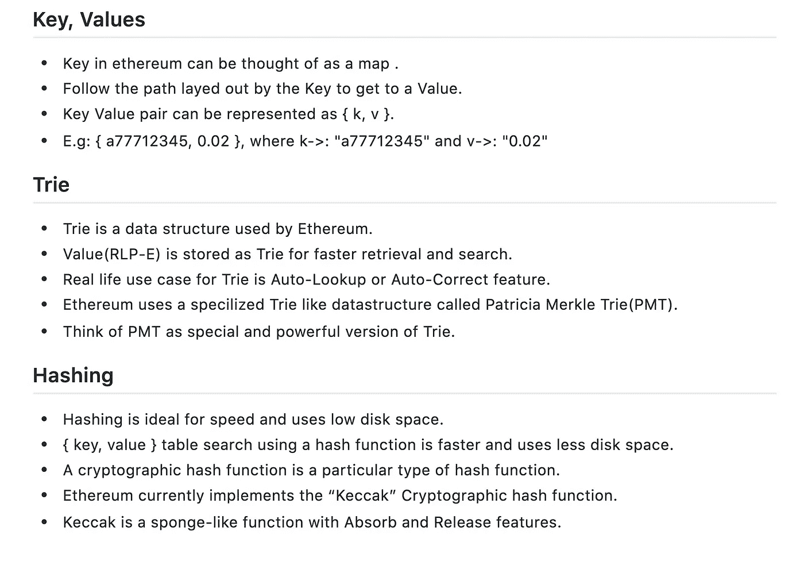
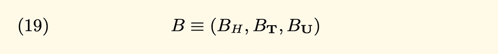
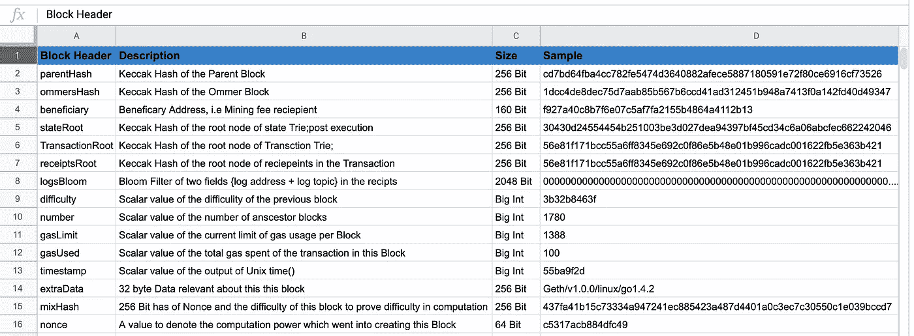
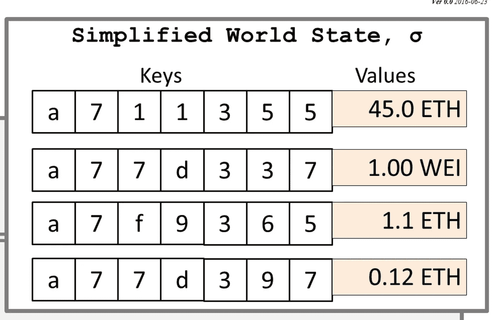
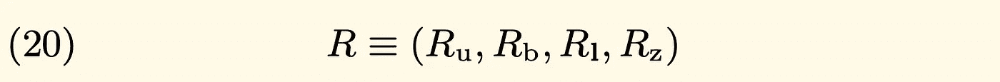
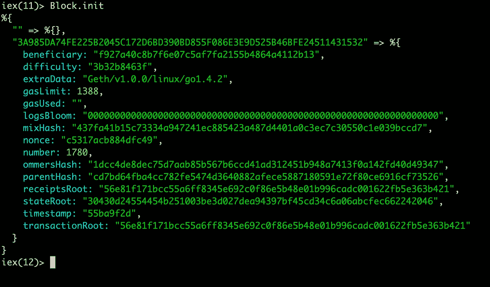
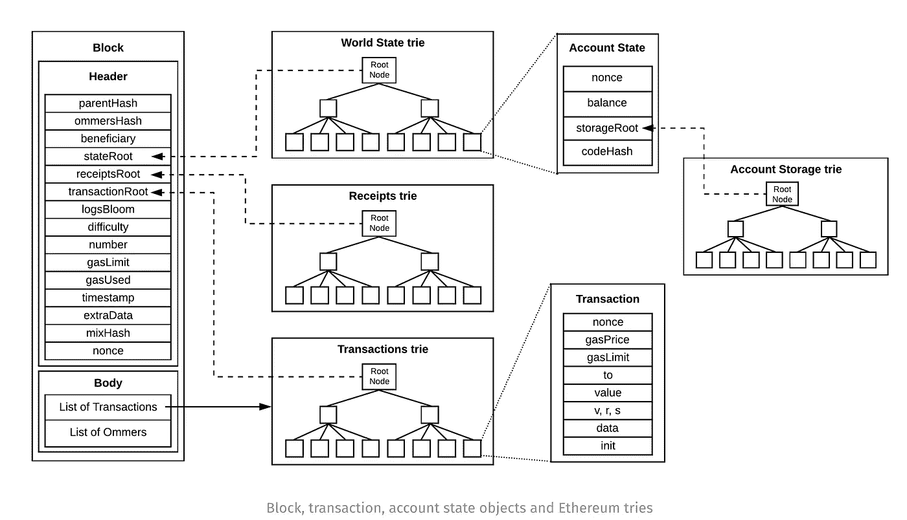

# 引擎盖下的以太坊第七部分(积木)

> 原文：<https://medium.com/coinmonks/ethereum-under-the-hood-part-7-blocks-c8a5f57cc356?source=collection_archive---------2----------------------->

欢迎回来，新年快乐。很高兴你还和我一起探索以太坊的内部。在第六章中，我们讨论了[](/@derao512/ethereum-under-the-hood-part-6-hashing-31077c7659ca)****；在**这一节中，我们将深入讨论模块。Block 是一个很大的主题，要在一篇中型文章中涵盖，所以我打算将 Block 分成 2 部分，第 1 部分的 Block 较短，所以在 **Block 第 1 部分**中，我们涵盖:**

1.  **快速回顾**
2.  **阻碍**
3.  **块标题**
4.  **摘要**
5.  **向前看。**

# **快速回顾:**

**我们正在探索以太坊的旅程中稍微深入一点，但是停下来回顾一下我们到目前为止所学的东西是很好的，我已经创建了一个公共要点来刷新我们的集体记忆，对于这个概述，让我们集中在第 3 部分到第 6 部分。**

****

**[Recap[ 3–6 ]](https://gist.github.com/deepakraous/d35635acc6d645494dba7203f1b525b5)**

# **区块:**

**街区是区块链概念的核心；块是事务列表的历史记录保存者。这句话包含了大量的信息。以太坊和它的前身比特币一样，有区块链的概念，为了理解区块，我们将区块作为一种数据结构来处理。**

**以太坊黄皮书，它将一个区块定义为三个实体 ***1 的集合。块标题 2。交易列表 3。Ommers List*** ，正式定义为:**

****

**[Section 4.3(Block)](https://ethereum.github.io/yellowpaper/paper.pdf)**

**块是一种类似的数据结构，具有一组经过验证的事务。**

# **块标题:**

**Blockheader，顾名思义是块的头，Block header 由 **15 个不同的字段组成**根据黄皮书，我尝试在一个电子表格中捕获它们，如下图所示:**

****

**[*Block Header-15 fields*](https://docs.google.com/spreadsheets/d/11keOrrjzdTiII0zL4TrGA0r7yZGQEzR3gdD74rFHdJg/edit?usp=sharing)**

**这些字段中的每一个都需要单独的一章，我们不会详细讨论这些字段中的每一个，但会集中讨论几个。我推荐看一看[***Part-4(The trie)***](/coinmonks/ethereum-under-the-hood-part-4-the-trie-a3f71f8dbef8)作为复习。现在回到块标题字段**

*****括号*** :该字段，顾名思义是指*该块*的父 Keccak hash。字段大小将是 256 位 [***Keccak 散列***](/@derao512/ethereum-under-the-hood-part-6-hashing-31077c7659ca) 函数，主要是散列值指示*这个*块的直接父代，使用这种技术是以太坊如何将一个块链接到另一个块，形成块链。**

*****state root****:*这是指状态 trie(执行后)的集合的 Keccak hash 根，它发生在创建*这个块*，一个 *{ key，value }* 集合之后。只有一个全局状态，并且持续更新，每个块将具有状态 trie DB 的根散列。**

****

**[Ethereum Global state](https://ethereum.stackexchange.com/questions/39915/ethereum-merkle-patricia-trie-extension-node)**

```
Keys ->  { Ethereum Address 160 bit }
Values -> { Nonce,Balance,StorageRoot,CodeHash }
```

*****Transaction root****:*事务 trie 的根节点的 Keccak Hash:该字段是指所有事务 Trie 的集合的 Keccak hash root，自*该块*创建以来发生。**

*****ReceiptsRoot****:*事务 trie 的根节点的 Keccak hash:该字段是指所有事务 Trie 的集合的 Keccak Hash 根，自*该块*创建以来发生。收据(R)是一个由 4 个字段组成的 [*元组*](https://en.wikipedia.org/wiki/Tuple) 。以太坊黄皮书详细提到了收据根字段。收据字段是以下内容的集合**

****

```
 | Description      | Symbol     |   
          | :— — — — — - - -:|: — — — — -:| 
          | Total Gas Spent  | Ru         |
          | Bloom Filter Root| Rb         | 
          | Logs of the Tran | Rl         | 
          | Status Code      | Rz         |
```

**黄皮书中详细描述的日志( *Rl* )和布隆过滤器根( *Rb* )字段；Bloom [过滤器](https://en.wikipedia.org/wiki/Bloom_filter)确实需要一个单独的部分，我计划在第 8 部分中讨论它们，但是现在，让我们把 Bloom 过滤器看作是一种可以帮助加快搜索结果速度的算法。**

**[](https://ethereum.stackexchange.com/questions/5888/relationship-between-transaction-trie-and-receipts-trie) [## 交易 Trie 和收款 Trie 之间的关系

### 感谢为以太坊栈交换贡献一个答案！请务必回答问题。提供详细信息…

ethereum.stackexchange.com](https://ethereum.stackexchange.com/questions/5888/relationship-between-transaction-trie-and-receipts-trie) 

下面是 Elixir 中以太坊块头的编码结构，我也提供了 go 代码库的链接。



[Ethereum Block header fields](https://github.com/ethereum/go-ethereum/blob/master/core/blockchain.go)

# 块标题结构:

看看这个来自卢卡斯·萨尔达尼亚的以太坊结构的出色的视觉表现，以及它与尝试的各种链接。



[**Source: Block Structure**](https://www.lucassaldanha.com/ethereum-yellow-paper-walkthrough-2/)

# 总结:

*   块由块头和事务组成。
*   块头由 15 个字段组成。
*   状态、交易、收据头字段具有指向根散列的指针。

# 到:

在 [**下一个**](/@derao512/ethereum-under-the-hood-part-8-blocks-2-8941d88014c0) 第 8 节中，我们将继续探索区块，创世纪区块，以及区块验证，直到那时了解上。

# 参考资料:

[](https://ethereum.stackexchange.com/questions/31314/block-header-format/31317#31317) [## 块标题格式

### 有人明白块头的每个元素代表什么吗？我这里有一个块标题示例…

ethereum.stackexchange.com](https://ethereum.stackexchange.com/questions/31314/block-header-format/31317#31317) [](https://github.com/ethereum/go-ethereum/blob/master/core/types/block.go) [## 以太坊/围棋以太坊

### 此时您不能执行该操作。您已使用另一个标签页或窗口登录。您已在另一个选项卡中注销，或者…

github.com](https://github.com/ethereum/go-ethereum/blob/master/core/types/block.go) [](https://ethereum.stackexchange.com/questions/59203/what-exactly-does-the-m-function-in-the-formal-bloom-filter-specifications-do) [## 正式的 Bloom filter 规范中的“m”函数到底是做什么的？

### 感谢为以太坊栈交换贡献一个答案！请务必回答问题。提供详细信息…

ethereum.stackexchange.com](https://ethereum.stackexchange.com/questions/59203/what-exactly-does-the-m-function-in-the-formal-bloom-filter-specifications-do) [](https://ethereum.stackexchange.com/questions/61537/how-to-include-transations-in-genesis-block) [## 如何在 genesis 块中包含事务

### 感谢为以太坊栈交换贡献一个答案！请务必回答问题。提供详细信息…

ethereum.stackexchange.com](https://ethereum.stackexchange.com/questions/61537/how-to-include-transations-in-genesis-block)**