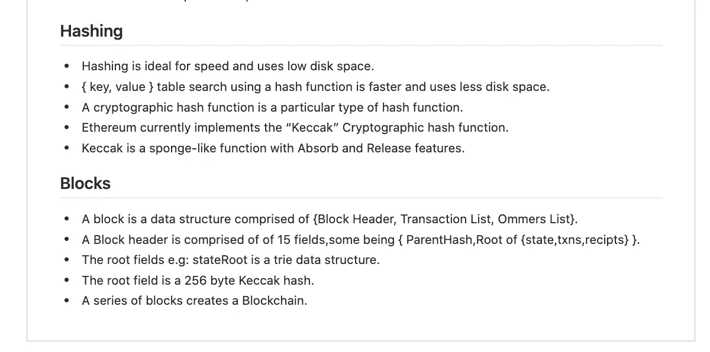
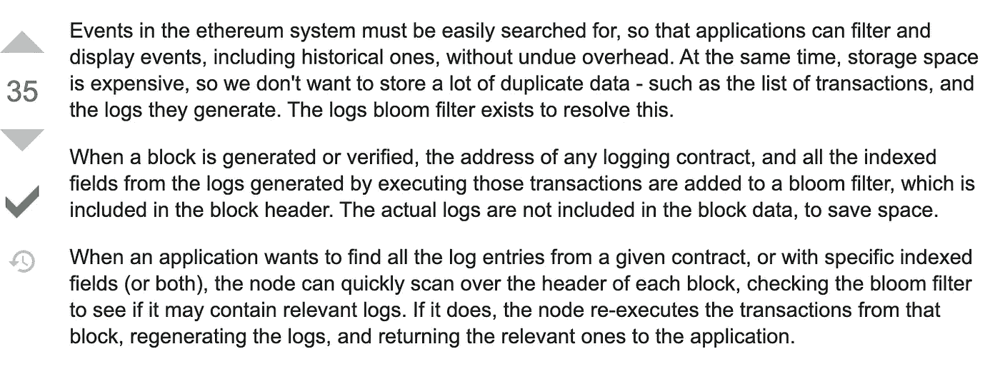
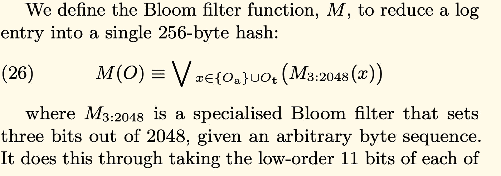
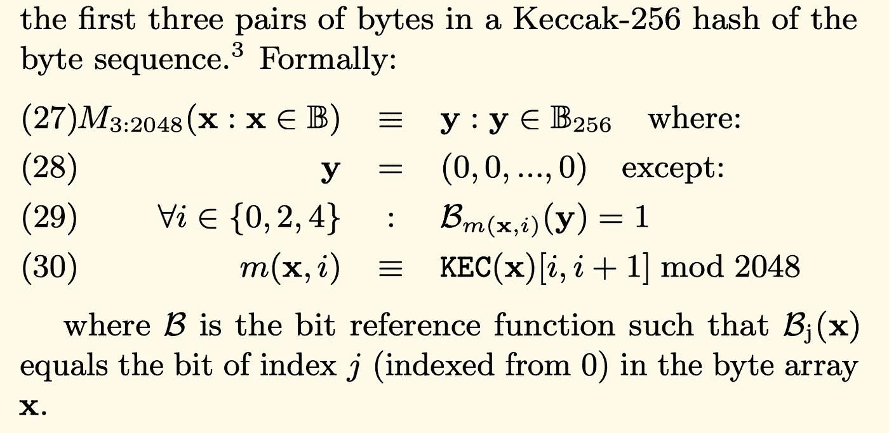
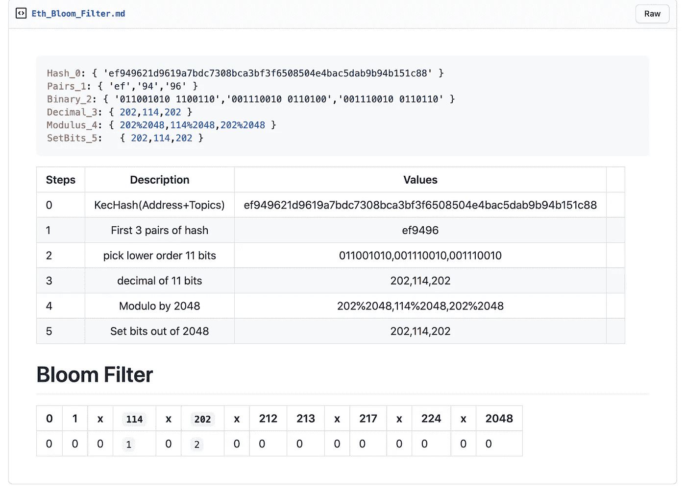
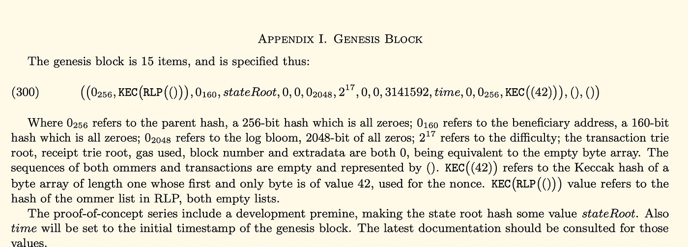
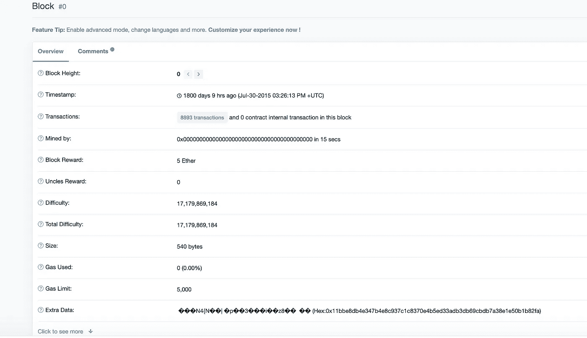

# 引擎盖下的以太坊-第八部分(街区-2)

> 原文：<https://medium.com/coinmonks/ethereum-under-the-hood-part-8-blocks-2-5fba93293213?source=collection_archive---------1----------------------->


**Black Lives Matter**

欢迎回来，我们从上次离开的地方开始，更深入地探讨块，对于那些关注以太坊 2.0 的人，我建议阅读[](https://ethos.dev/beacon-chain/)**，对于关于**块的这一部分，我们将介绍第 2 部分、**:**

1.  **快速回顾**
2.  **Bloom 过滤器/LogsBloom 字段**
3.  **创世街区**
4.  **摘要**
5.  **然后**

# **快速回顾:**

**作为本系列的常规练习，快速概述一下 [**Part-7**](/@derao512/ethereum-under-the-hood-part-7-blocks-7f223510ba10) :**

****

**[**Section [6–7] recap**](https://gist.github.com/deepakraous/d35635acc6d645494dba7203f1b525b5)**

# **BloomFilters 和 LogsBloom 字段:**

**在第 7 章，我们讨论了以太坊块头域；其中一个是 [**字段-8**](https://docs.google.com/spreadsheets/d/11keOrrjzdTiII0zL4TrGA0r7yZGQEzR3gdD74rFHdJg/edit#gid=0)**:logs bloom**。我们将尝试回答两个问题，并为 Bloom Filters 提供一些帮助。让我们关注两个问题。为什么需要这个字段？2.什么是布鲁姆过滤器？**

1.  ****为什么需要这个字段？:**以太坊是一个只转发的全局状态机，在中央数据库上进行金融和非金融交易。这些交易需要用一些标签记录下来，以便快速有效地查找。这些事件可以尽快搜索到结果。每个 Blockheader 包含 logsBloom 字段，该字段仅在一个字段中包含整组事件/日志的完整信息。下面是对这一领域的需求的极好描述。**

****

**[**Stackoverflow: Events in Ethereum quickly searched, for audit purposes**](https://ethereum.stackexchange.com/questions/3418/how-does-ethereum-make-use-of-bloom-filters)**

**以太坊块中的 LogsBloom 字段[ **2048** 字节]，注意" **1"** 位于**位置:212，**，" 2 "位于**位置** : **233，**我们将在 BloomFilter 中重新讨论这个主题。**

```
**logsBloom[2048]**:"0x0000000000000000000000000000000000000000000000000000000000000000000000000000000000000000000000000000000000000000000000000000000000000000000000000000000000000000000000000000000000000000000000000000000000000000**1**00000000000000000000**2**000000000000000000000000000000000000000000000000000000000000000000000000000000000000000000000000000000000000000000000000000000000000008000000000000000000000000000000000000000000000000000000000000000000000000000000000000000000000000000000000000000000000000000000000000000000000000000........0"
```

**2.**什么是布鲁姆滤镜？:**现在我们对 logsBloom 领域有了一个概念，让我们来探索一下 [Bloom 过滤器](https://odino.org/bloom-filters-when-data-structures-get-smart/)。以太坊选择布隆过滤器算法是因为它的速度和概率数据结构的有效性。在一个街区中可以有成千上万的事件，按照我们的常规主题，需要速度来寻找速度；看来布鲁姆过滤器是一个合适的选择。以太坊实现了黄皮书中定义的自定义布隆过滤器:**

****

****Source: Yellow Paper****

****

****Source: Yellow Paper****

**让我们通过下面的例子来了解一下这些规格。**

****

****Ethereum Bloom Filter****

*****深挖:*****

**[](https://ethereum.stackexchange.com/questions/6009/is-the-logsbloom-in-the-block-header-the-same-as-the-bloom-filter-in-the-transac) [## 块头中的 LogsBloom 是否与交易收据 Trie 中的 Bloom 过滤器相同？

### 感谢为以太坊栈交换贡献一个答案！请务必回答问题。提供详细信息…

ethereum.stackexchange.com](https://ethereum.stackexchange.com/questions/6009/is-the-logsbloom-in-the-block-header-the-same-as-the-bloom-filter-in-the-transac) 

# 创世纪街区:

现在我们对什么是积木有了一点了解，我们现在可以探索创世纪积木了。几乎所有的加密货币项目一开始都有一个“起源”的同义词，让我们回忆一下，以太坊是一个[世界状态+虚拟机](/coinmonks/ethereum-under-the-hood-part-i-ver-0-1-4f2fb24b3d68)，状态 0 是起源状态，它有一组由以太坊生态系统内所有参与者商定的预定义值。以太坊黄皮书定义了创世纪区块的预设值。



[**Yellow Paper( Apdx-1: Genesis Block )**](https://ethereum.github.io/yellowpaper/paper.pdf)

一个使用带有一些随机值的 Elixir 的 Genesis 块，注意字段的名称及其相应的值(图 1)

**创世纪街区**

看一眼创世纪区块，看看这是否符合黄皮书的规格



[**Genesis Block**](https://etherscan.io/block/0)

花些时间去探索创世块的规格转化为药剂的私人功能；我们将在接下来的小节中更深入地研究这段代码。

**仙丹中创世纪区块定义**

**Genesis Block in Elixir**

# 总结:

*   LogsBloom 是块头字段。
*   LogsBloom 字段是块头的全局事件指示器。
*   Bloom Filter 算法是 LogsBloom 领域的机制。
*   以太坊指定了专门的布隆过滤器算法。
*   一个起源块是块链的块 0 状态。
*   Genesis Block 具有生态系统认可的预定义值。

# 接下来:

在接下来的[***章节***](https://derao.medium.com/ethereum-under-the-hood-part-9-blocks-3-490103a2f197) 中，我们将深入挖掘街区，保持安全，学习，继续前进。

# 参考资料:

[](https://ethereum.stackexchange.com/questions/59203/what-exactly-does-the-m-function-in-the-formal-bloom-filter-specifications-do) [## 正式的 Bloom filter 规范中的“m”函数到底是做什么的？

### 感谢为以太坊栈交换贡献一个答案！请务必回答问题。提供详细信息…

ethereum.stackexchange.com](https://ethereum.stackexchange.com/questions/59203/what-exactly-does-the-m-function-in-the-formal-bloom-filter-specifications-do) [](https://github.com/ethereum/go-ethereum/blob/master/core/types/block.go) [## 以太坊/围棋以太坊

### 此时您不能执行该操作。您已使用另一个标签页或窗口登录。您已在另一个选项卡中注销，或者…

github.com](https://github.com/ethereum/go-ethereum/blob/master/core/types/block.go) [](https://ethereum.stackexchange.com/questions/59203/what-exactly-does-the-m-function-in-the-formal-bloom-filter-specifications-do) [## 正式的 Bloom filter 规范中的“m”函数到底是做什么的？

### 感谢为以太坊栈交换贡献一个答案！请务必回答问题。提供详细信息…](https://ethereum.stackexchange.com/questions/59203/what-exactly-does-the-m-function-in-the-formal-bloom-filter-specifications-do) [](/mycrypto/understanding-event-logs-on-the-ethereum-blockchain-f4ae7ba50378) [## 了解以太坊区块链上的事件日志

### 每个事务都有一个事件日志，但是这些事件日志可能很难阅读。

medium.com](/mycrypto/understanding-event-logs-on-the-ethereum-blockchain-f4ae7ba50378) [](https://www.asynclabs.co/blog/params-in-ethereum-genesis-block-explained/) [## 以太坊创世区块中的参数说明—异步实验室|软件开发和营销机构

### 全世界的开发者都在试验以太坊区块链，他们中的许多人发现以太坊测试网很难…

www.asynclabs.co](https://www.asynclabs.co/blog/params-in-ethereum-genesis-block-explained/)**