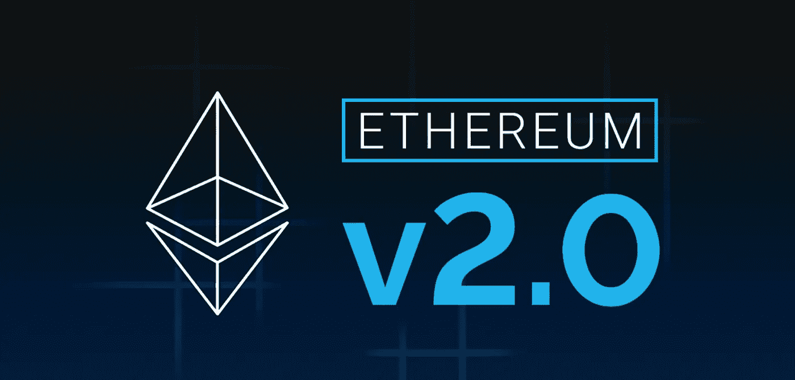

# 以太坊是它成功的牺牲品，但 Eth 2.0 即将到来

> 原文：<https://medium.com/coinmonks/ethereum-victim-of-its-success-but-eth-2-0-is-coming-c1df1b548dd5?source=collection_archive---------11----------------------->

ConsenSys 的联合创始人兼首席执行官 Joe Lubin 承认，使用以太坊非常昂贵。但这也是成功的代价，也是区块链 DeFi 和 NFT 受欢迎的成果。

对以太坊及其高昂交易费用的愤怒是一种反复出现的现象。以太坊版本 2 应该可以部分解决这个问题。但是对于 FTX 老板山姆·班克曼·弗里德来说，Eth 2.0 不会是…