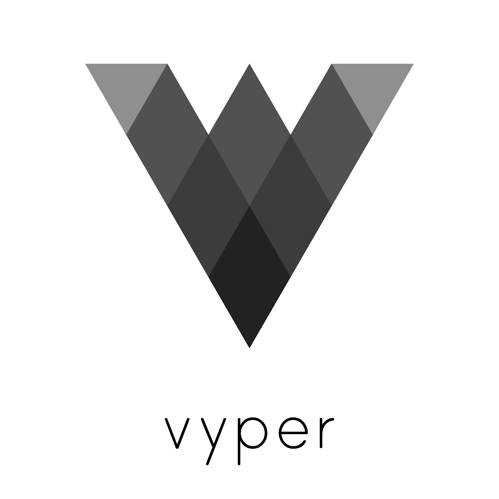

# 以太坊——使用块菌开发 Vyper

> 原文：<https://medium.com/coinmonks/ethereum-vyper-development-using-truffle-73781c4d81d5?source=collection_archive---------1----------------------->



# 为什么是 Vyper？

> Vyper 是一种面向契约的 pythonic 编程语言，目标是以太坊虚拟机(EVM)

Vyper 是一种相对较新的语言，它的编写注重安全性、简单性和可听性。它是以 Pythonic 的方式编写的，这吸引了我，作为一种更安全的替代物，我认为它有很大的潜力。我计划在未来写更多关于与 Vyper 合作的内容。

# 块菌——太爱吃甜食了？

我最近完成了一个[黑客马拉松项目](/@johngrant/ethereum-development-colony-hackathon-consenys-academy-react-8fc845ea47f1)，并完成了 [2018 ConsenSys Academy](/@johngrant/progress-34e8ad37442d) ，在那段时间里，不管是好是坏，我已经非常习惯使用 [Truffle](https://www.truffleframework.com/) 开发环境来编写代码、测试和部署——它只是让生活变得更容易。

所以，在一个理想的世界里，我想用松露和 Vyper 一起工作。经过一番调查后，我发现了 Maurelian 的这个 [ERC721 Vyper 实现](https://github.com/maurelian/erc721-vyper)，他做了一些工作使它与 Truffle 兼容。我认为记录构建过程以用于其他项目可能是有用的。

# 如何使用块菌进行葡萄开发

## 安装 Vyper

第一步是确保 Vyper 安装在本地。如果在您跳过之前已经完成了这一步，您可以通过运行`$ vyper -h`命令进行检查。有多种安装方式，包括使用 PIP，这里的文档是[这里是](https://viper.readthedocs.io/en/latest/installing-vyper.html)。我正在使用 Mac 电脑，并完成了以下操作:

设置虚拟环境:

```
$ virtualenv -p python3.6 --no-site-packages ~/vyper-venv
```

记住激活环境:

```
$ source ~/vyper-venv/bin/activate
```

然后在我的工作目录中:

```
$ git clone [https://github.com/ethereum/vyper.git](https://github.com/ethereum/vyper.git)
$ cd vyper
$ make
$ make test
```

## 安装 Truper

接下来我安装了 [Truper](https://github.com/maurelian/truper) ，这是一个由 Maurelian 编写的工具，用于将 Vyper 合同编译成 Truffle 兼容的工件。它使用 Vyper，这也是我们之前安装它的原因。(参见下一节了解它的详细功能)。要安装 run:

```
$ npm i -g truper
```

## 编译、测试、部署

从你的项目目录(你可以克隆 [ERC-721 项目](https://github.com/maurelian/erc721-vyper)进行快速测试)。

运行 ganache 测试网络:

```
$ ganache-cli
```

像往常一样，使用以下方法编制任何可靠性合同:

```
$ truffle compile
```

使用以下命令编译 Vyper 合同:

```
$ truper
* this must be called from the project dir and you must have the virtual environment you built Vyper in running.
```

块菌测试可以按常规方式编写和运行，即:

```
Use artifacts in test files:
const NFToken = artifacts.require('NFToken.vyper');Run tests using:
$ truffle test
```

块菌的迁移也以通常的方式进行。例如，我使用以下迁移文件部署到 ganache:

```
2_deploy_contracts.jsconst NFToken = artifacts.require('NFToken.vyper');
const TokenReceiverMockVyper = artifacts.require('NFTokenReceiverTestMock.vyper');module.exports = function(deployer) {
  deployer.deploy(NFToken, [], []);
  deployer.deploy(TokenReceiverMockVyper);
};$ truffle migrate
```

# 发生什么事了

Truper 使用 Vyper，这也是我们在第一步安装它的原因。如果我们看一下[https://github.com/maurelian/truper/blob/master/index.js](https://github.com/maurelian/truper/blob/master/index.js)，我们可以看到 Truper 正在为每个 Vyper 合同创建 Truffle 工件文件，并将它们写入。项目的/build/contracts 文件夹。

## 松露藏物文件

这些*。json 文件包含它们各自的智能合约的描述。描述包括:

*   合同名称
*   契约 ABI(应用程序二进制接口-智能契约中所有函数及其参数和返回值的列表)。由 Truper 使用`$ vyper -f json file.vy`创建
*   合同字节码(编译的合同数据)。由 Truper 使用`$ vyper -f bytecode file.vy`创建
*   契约部署的字节码(部署到区块链的字节码的最新版本)。由 Truper 创建，使用:`$ vyper -f bytecode_runtime file.vy`
*   上次编译协定时使用的编译器版本。(在部署之前不会添加。)
*   已部署合同的网络列表以及每个网络上的合同地址。(在部署之前不会添加。)

Maurelian 将其描述为一个临时的权宜之计，但它确实有效，所以谢谢你！

> [直接在您的收件箱中获得最佳软件交易](https://coincodecap.com/?utm_source=coinmonks)

[](https://coincodecap.com/?utm_source=coinmonks)