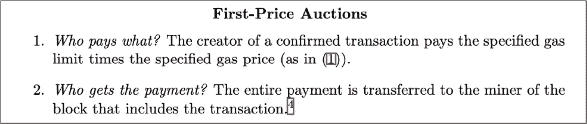
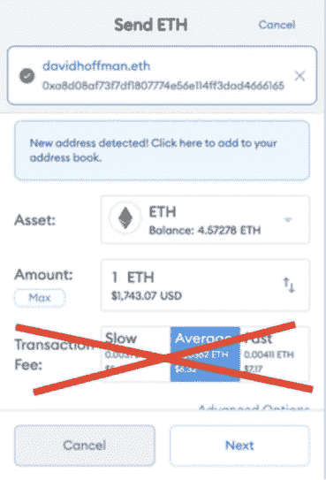
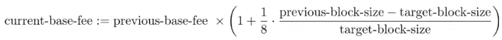

# EIP 以太坊-1559 年

> 原文：<https://medium.com/coinmonks/ethereum-with-eip-1559-678572af48d4?source=collection_archive---------8----------------------->

在这篇文章中，我将向你解释 EIP-1559，并试图指出主要问题。

**当前 ETH 系统中的一个问题？**

**什么是 EIP-1559？**

**EIP-1559 如何解决当前的 ETH 问题？**

先开始指出上面的问题。

EIP-1559 是 ETH 平台上的一大改进，EIP-1559 实质上是提出改变以太坊的收费结构。

**当前 ETH 系统的一个问题？**

我们来看看以太坊交易目前是如何运作的。目前的以太坊交易机制称为[首价拍卖](https://en.wikipedia.org/wiki/First-price_sealed-bid_auction)。

First-Price Auction

交易费市场的现状存在三大问题。详情请浏览链接。

1.  [交易费用水平的波动性与交易的社会成本不匹配。](https://notes.ethereum.org/@vbuterin/BkSQmQTS8)
2.  [首价拍卖的低效率](https://ethresear.ch/t/first-and-second-price-auctions-and-improved-transaction-fee-markets/2410)。
3.  没有街区奖励的区块链的不稳定性。

**“第一价格拍卖**，用户提交他们的出价以将他们的交易包括在区块中。这种竞争性招标造成了区块链以太坊的拥堵和油价上涨。更不用说，一些用户最终往往会比在同一个街区进行交易的其他人支付更多不必要的费用。这既不公平也不高效。

**什么是 EIP-1559？**

EIP，或以太坊改进提案，是由任何社区成员提出，然后在内部讨论的对平台的更改——包括核心协议规范、客户端 API 和合同标准。EIP 由以太坊联合创始人维塔利克·布特林(Vitalik Buterin)本人于 2019 年 4 月首次提出。

**EIP-1559 如何解决当前 ETH 的问题？**

*   那么，EIP-1559 将如何解决当前的这些问题呢？这不会解决所有问题，但这将是一个开始。通过部署**基地费**。它以市场为目标，通过逐块调整天然气价格。在这种情况下，用户不必选择慢速、平均或快速选项。

*   EIP 1559 帮助用户发送高于基本费用的交易，基本费用可以波动，并给包括他们在内的矿工小费。
*   为了解决这个问题，用户可以指定一个费用上限。这是他们想付的最高价。加入后，他们将获得最终基本费用和费用上限之间的差额，并且不要忘记小费！
*   钱包可以默认设置这个值，这样用户就不用每次都手动设置了。
*   EIP 1559 有助于当以太坊块得到超过 50%的充分，气体成本将增加。当区块的使用率低于 50%时，天然气成本就会降低。该 EIP 旨在消除以太坊燃气费的波动，同时帮助用户更好地估计他们的交易率和时间
*   **使用 EIP 1559 时 ETH 的供货**效果。使用 EIP 1559 有助于燃烧气费，气费由 eth 支付，所以在这种情况下，更多的 eth 燃烧会发生更多的交易。这将有助于 ETH。
*   **更新公式:**建议用于更新每区块基本费用的公式为

*   EIP-1559 降低了矿工尝试开采旧区块的动机。它通过烧毁支付给矿工的 ETH 奖励来实现这一点，这降低了他们在新区块已经繁殖后专注于旧区块的动机。

**利与弊&EIP 1559**

*   **EIP 1559 的优点**

>潜在的更低费用。由于每个区块现在可以容纳更多的交易，交易价格可能会降至更低、更合理的水平。

>避免用户多付费用，并针对市场调整气价。

>基础费用燃烧膨胀。

>减少网络拥塞。因为块大小可以响应需求而增加(尽管只有达到一定的限制)。

*   **EIP 1559 的缺点**

>矿工的激励直接受到影响，因为基本费用被烧掉了。 **(** 注:矿工仍从`**tips**`**&**`**block_rewards**`**)**

>燃气费没有完全优化。

**结论**

*   首次价格预测修正。
*   EIP 提供基本收费机制。
*   EIP 1559 通过固定气费估算和具有相同安全保证的较小可变气价来提供用户体验的增加。
*   使用 EIP 1559 对 ETH 供应的影响。
*   由于超过 40%的矿商收入来自交易费，EIP-1559 可能会减少收入。

参考

[https://uncommoncore.co/eip-1559/](https://uncommoncore.co/eip-1559/)

[https://medium . com/coin monks/economic-analysis-of-EIP-1559-a-summary-afac 46533928](/coinmonks/economic-analysis-of-eip-1559-a-summary-afac46533928)

 [## 以太坊 1559 社区电话

### 事件:世界协调时 2021 年 2 月 26 日 1400 时

medium.com](/ethereum-cat-herders/ethereum-1559-community-call-d43d5f0bf909)  [## 什么是 EIP-1559？为什么它对以太坊的未来很重要？

### EIP(以太坊改进提案)是一份设计文件，它提供信息和技术规范给…

medium.com](/ethereum-push-notification-service/what-is-eip-1559-why-is-it-important-for-the-future-of-ethereum-f0c0cb174c37) 

> 加入 Coinmonks [电报频道](https://t.me/coincodecap)和 [Youtube 频道](https://www.youtube.com/c/coinmonks/videos)了解加密交易和投资

# 另外，阅读

*   [比特币基地 vs 瓦济克斯](https://coincodecap.com/coinbase-vs-wazirx) | [比特鲁点评](https://coincodecap.com/bitrue-review) | [波洛涅克斯 vs 比特鲁](https://coincodecap.com/poloniex-vs-bittrex)
*   [德国最佳加密交易所](https://coincodecap.com/crypto-exchanges-in-germany) | [Arbitrum:第二层解决方案](https://coincodecap.com/arbitrum)
*   [币安交易机器人](/coinmonks/binance-trading-bots-d0d57bb62c4c) | [OKEx 评论](/coinmonks/okex-review-6b369304110f) | [Atani 评论](https://coincodecap.com/atani-review)
*   [最佳加密交易信号电报](/coinmonks/best-crypto-signals-telegram-5785cdbc4b2b) | [MoonXBT 评论](/coinmonks/moonxbt-review-6e4ab26d037)
*   [如何在 Bitbns 上购买柴犬(SHIB)币？](https://coincodecap.com/buy-shiba-bitbns) | [买弗洛基](https://coincodecap.com/buy-floki-inu-token)