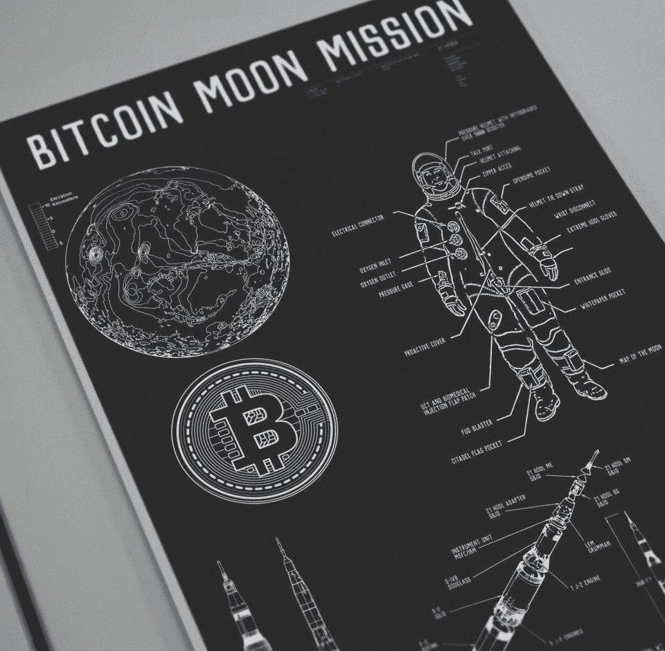
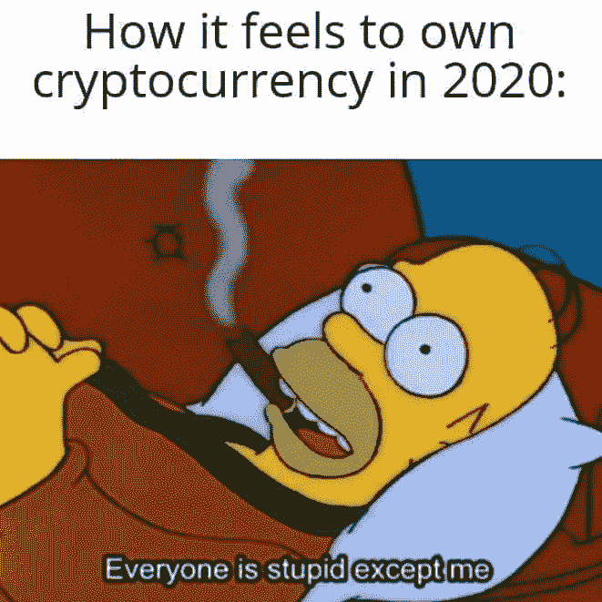
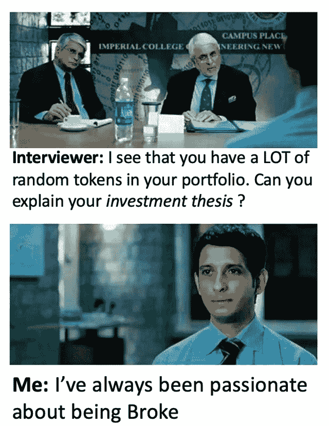
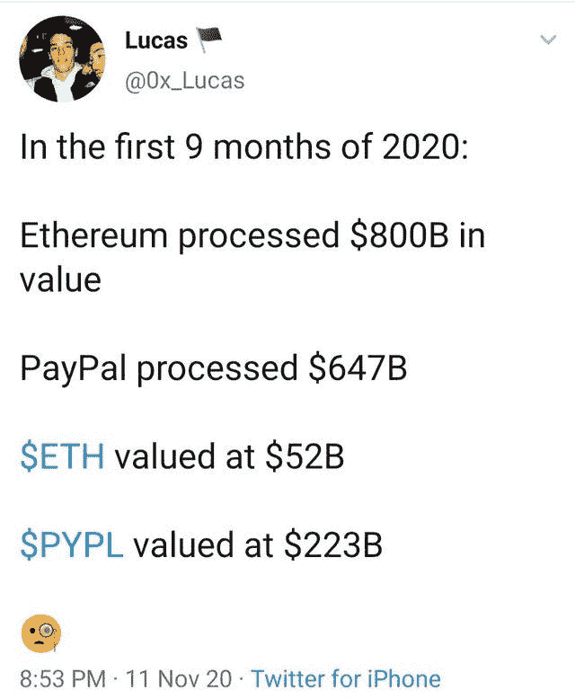

# 以太坊的意外硬叉/苹果在储存一切/艾莉亚·史塔克是比特币制造者

> 原文：<https://medium.com/coinmonks/ethereums-accidental-hard-fork-apple-is-storing-everything-arya-stark-is-a-bitcoiner-43e72c623956?source=collection_archive---------5----------------------->

Bitcoin moon mission — [Source](https://www.reddit.com/r/Bitcoin/comments/jvpid9/preparing_bitcoin_moon_mission/)

## 英国财政部将公布稳定硬币法规草案和一系列定义

*   如果你使用 Mac，[苹果知道你运行的每一个应用](https://sneak.berlin/20201112/your-computer-isnt-yours/)，你运行它的时间，你运行它的地点，最新的更新绕过了 VPN，所以苹果可以知道你的真实 IP 地址。
*   周三早上，许多加密货币社区成员和以太坊支持者抱怨网络问题。这个问题很快就解决了。

## [四缺](https://quadency.com/?r=ea20aa360c45d1f5ad47a19a)

试试 [Quadency](https://quadency.com/?r=ea20aa360c45d1f5ad47a19a) ，这是一个为交易者打造的交易终端，让他们的加密交易自动化。阅读我们的[季度回顾](/coinmonks/quadency-review-a-crypto-trading-automation-platform-3068eaa374e1)。

> 查看我们的[最佳加密交易机器人](/coinmonks/whats-the-best-crypto-trading-bot-in-2020-top-8-bitcoin-trading-bot-c16adeb13317)列表。

## 最新消息📰

*   拜登证实精通密码的加里·詹斯勒将领导金融政策过渡团队
*   以太坊[遭遇](https://news.bitcoin.com/ethereum-suffers-from-unannounced-hard-fork-few-third-party-services-got-stuck-on-minority-chain/)意外的“链分裂”，第三方服务“卡在少数人的链上”
*   世界第二大银行将发行可交易比特币的 3B 债券
*   随着 Hard Fork 上线，比特币现金[崩溃](https://decrypt.co/48287/bitcoin-cash-crashes-as-hard-fork-goes-live)
*   英国财政部将发布稳定货币条例草案
*   PayPal [删除了新加密服务的](https://www.coindesk.com/paypal-removes-waitlist-for-new-crypto-service)等待名单
*   花旗银行高管称，到 2021 年 12 月，比特币可能突破 30 万美元
*   比特币正在努力创造记录，但没有人谈论它
*   艾莉亚·史塔克[成为最新的比特币制造者？](https://cointelegraph.com/news/actress-maisie-williams-becoming-the-newest-bitcoiner)
*   获得许可的瑞士加密银行[推出](https://www.coindesk.com/licensed-swiss-crypto-bank-launches-tezos-trading-and-staking) Tezos 交易和赌注
*   Uniswap 上近 40%的流动性随着激励机制的枯竭而离开了平台。
*   在 Akropolis DeFi exploit 中被盗的 200 万美元
*   Defi 协议，[吹嘘说](https://news.bitcoin.com/defi-protocol-bragged-having-flash-loan-attack-prevention-hacked-6-million/) Flash Loan Attack Prevention 被黑了 600 万美元
*   Origin Protocol [在最近的 DeFi 攻击中损失了 700 万美元](https://www.coindesk.com/origin-protocol-loses-3-25m-in-latest-flash-loan-attack-reports)
*   奶酪银行数百万美元的黑客事件由一家安全公司解释
*   一家美国律师事务所称美国国税局正在追查逃税的比特币基地用户

> *报税季即将来临，使用最好的* [*加密报税软件*](/coinmonks/best-crypto-tax-tool-for-my-money-72d4b430816b) *来申报你的加密报税吧。*

[Source](https://www.reddit.com/r/CryptoCurrency/comments/jttx3h/dont_ever_use_the_word_smart_with_me/)

## 好的读物📑

*   [解决](https://www.fidelitydigitalassets.com/articles/addressing-bitcoin-criticisms)比特币的批评
*   [构建](/@fulgur.ventures/building-an-overview-of-the-lightning-network-ecosystem-a93be2343f61)闪电网络生态系统概述
*   比特币和数字货币[革命](https://www.wsj.com/articles/the-revolutionary-power-of-digital-currency-1422035061)
*   反馈[控制](/gauntlet-networks/feedback-control-as-a-new-primitive-for-defi-27b493f25b1)作为 DeFi 的新原语
*   [我们的网络](https://ournetwork.substack.com/p/our-network-issue-47):对向往、Aave、Hegic 和 Synthetix 的报道。
*   介绍[新型平衡器连接器](https://hummingbot.io/blog/2020-11-balancer-arbitrage/)和套利策略！
*   为您的加密投资组合设计的最佳定义[指数](https://bankless.substack.com/p/the-best-defi-indices-for-your-crypto)
*   eth2‌‌staking‌‌-‌‌best‌‌[practices‌](https://docs.google.com/document/d/1WZuP-K0S4RKlwH4GQVcGpgzVYPdpZF0WiHsawnmOKxM/edit)

> *买一个* [***硬件钱包***](/coinmonks/the-best-cryptocurrency-hardware-wallets-of-2020-e28b1c124069)*[*保护你的加密货币*](/coinmonks/how-to-prevent-cryptocurrency-hacking-and-theft-from-your-wallet-65c8ff767766) *。**

**

*[source](https://www.reddit.com/r/CryptoCurrency/comments/jtvxc6/waiting_for_a_correction/)*

## *开发商*

*   *[测试](https://blog.chain.link/testing-chainlink-smart-contracts/) Chainlink 智能合约*
*   *OpenZeppelin 合同可升级*
*   *[市场数据与区块链数据的联姻](https://bitquery.io/blog/market-data-with-blockchain-data)*
*   *将 0x API 集成到您的合同中*
*   *闪电池:技术性深潜*
*   *[观察](https://petkanics.medium.com/observations-at-the-four-year-mark-of-a-web3-protocol-build-fad1df5e1728)在 Web3 协议构建四周年之际*
*   *最新 [Eth2](https://hackmd.io/@benjaminion/eth2_news/https%3A%2F%2Fhackmd.io%2F%40benjaminion%2Fwnie2_201113) 更新*
*   *博尔特实验室 ZK 频道的[概述](/tezoscommons/an-overview-of-bolt-labs-zkchannels-456169a44d8a)*
*   *[投机](https://dfuse.io/en/announcing-speculative-execution-for-ethereum/)执行以太坊*
*   *ETH2 客户端行为[报告](https://github.com/leobago/BSC-ETH2/blob/master/report/Clients_behaviour_report.pdf)*
*   *计算机科学家[获得](https://www.quantamagazine.org/computer-scientists-achieve-crown-jewel-of-cryptography-20201110/)密码学的“皇冠上的宝石”*
*   *如何[把你的树莓皮](/coinmonks/how-to-turn-your-raspberry-pi-into-a-crypto-trading-bot-6cb07b93a8e)变成一个加密交易机器人*

**

*[Source](https://www.reddit.com/r/ethtrader/comments/juzb87/hits_home/)*

## *多方面的*

*   *[以太流](https://etherflow.quiknode.io/) —以太坊节点调试器& RPC 调用编辑器*
*   *以太坊虚拟机的代理人*
*   *[苗](https://kndrck.co/posts/miao-evm-tx-decoder/)——EVM 交易解码器*
*   *Eth2 叉[监视器](https://eth2-fork-mon.stokes.io/)*
*   *[DIDKit](https://forum.tezosagora.org/t/introducing-didkit/2405) —一个跨平台的工具包，用于处理 W3C 分散标识符(did)和可验证凭证(VCs)*
*   *[TezQuery](https://tzquery.io/) —以图形结构展示的 Tezos 区块链*
*   *中央[列表](https://ethereumnodes.com/)公共的、自由的 RPC 端点&它们的当前状态。*

## *播客和视频💽*

*   *[圈子](https://epicenter.tv/episodes/365) —为每个人创造普遍的基本收入经济*
*   *采访一个[斯巴达](https://www.youtube.com/watch?v=AngYaEWRbo4&feature=youtu.be)*
*   *安德鲁·凯斯&詹姆斯·斯拉萨斯*

## *黑客马拉松、活动和峰会*

*   *你好，世界！由波尔卡多特*
*   *以太坊的一个月*
*   *Eth2 [赌注](https://ethereum.org/en/eth2/get-involved/staking-community-grants/#requirements)社区赠款*

## *加密交易和折扣🔖*

*   *当你加入[***mud rex***](https://mudrex.com/signup?referral_code=COIN3566)时，你可以获得 25 美元的信用点数来支付费用*
*   **使用此* [*链接*](/coinmonks/botsfolio.com/?coupon=gaure27) *在****Botsfolio****享受七五折优惠。**
*   **试用*[***Altrady***](https://app.altrady.com/?a=COINMONKS)*使用优惠券代码* ***获得 40%的折扣****

## *产品评论和其他加密软件📙*

*   *[block fi vs Celsius](/coinmonks/blockfi-vs-celsius-vs-hodlnaut-8a1cc8c26630)vs Hodlnaut*
*   *2020 年排名前五的[密码借贷平台](https://blog.coincodecap.com/top-5-crypto-lending-platforms)*
*   *[2020 年最佳加密交易机器人](/coinmonks/whats-the-best-crypto-trading-bot-in-2020-top-8-bitcoin-trading-bot-c16adeb13317)*
*   *[莱杰 vs 特雷佐](/coinmonks/ledger-nano-s-vs-x-battery-hardware-price-storage-59a6663fe3b0)*
*   *[n 零审核](/coinmonks/ngrave-zero-review-c465cf8307fc)*
*   *[PrimeXBT 审查](/coinmonks/primexbt-review-88e0815be858) —杠杆交易、费用和交易*
*   *[FTX 密码交易所评论](/coinmonks/ftx-crypto-exchange-review-53664ac1198f)*
*   *[Deribit 审查](/coinmonks/deribit-review-options-fees-apis-and-testnet-2ca16c4bbdb2) —选项、费用、API 和测试网*
*   *[莱杰纳米 S vs X](/coinmonks/ledger-nano-s-vs-x-battery-hardware-price-storage-59a6663fe3b0)*
*   *[莱杰 Nano S vs 特雷佐 one vs 特雷佐 T vs 莱杰 Nano X](https://blog.coincodecap.com/ledger-nano-s-vs-trezor-one-ledger-nano-x-trezor-t)*

*想让我们展示你的产品吗？请通过 [Twitter @coinmonks](https://twitter.com/coinmonks) 联系我们*

## *照片说明了一切📷*

**

*[Source](https://www.reddit.com/r/ethtrader/comments/jsd2dy/eth_is_undervalued/)*

## *乔布斯👷*

*   *[Blocknative](https://www.blocknative.com/) 正在招聘[前端、后端和开发工程师](https://jobs.lever.co/blocknative?lever-origin=applied&lever-source=thisweekinETH)。(远程)*
*   *为 DeFi 而活？ [mStable](https://mstable.org/) 寻找有经验的[智能合约/协议开发](https://cryptocurrencyjobs.co/engineering/mstable-protocol-developer-defi/)*
*   *链家实验室正在寻找一名[的 BD &销售](https://jobs.lever.co/chainlink/d35cff18-ffc6-41fe-98b2-b86f960e2f88?lever-origin=applied&lever-source%5B%5D=Week%20in%20Ethereum)总监*
*   *[mStable](https://twitter.com/mstable_) 寻找有经验的[智能合约/协议开发](https://cryptocurrencyjobs.co/engineering/mstable-protocol-developer-defi/)*
*   *Bitquery 正在招聘 [Ruby 开发者](https://angel.co/company/bitquery/jobs)*
*   *Celer 雇佣可靠性和 Go devs。电子邮件:hiring@celer.network*
*   *[泽里昂](https://cryptocurrencyjobs.co/engineering/zerion-senior-frontend-engineer/) —高级前端工程师*
*   *MyCrypto —高级前端工程师*
*   *Celo 正在[招聘](https://jobs.lever.co/celo/bb6fc40f-4d3d-4abb-a6d3-a5b8ba152b6a)一名数据主管*
*   *a16z 正在[招聘](https://a16z.com/about/jobs/?gh_jid=4167628003)一名数据科学家*
*   *Livepeer 正在招聘一名[区块链社区营销+运营主管](https://angel.co/company/livepeer/jobs/874811-blockchain-public-network-community-marketing-associate)*
*   *作为营销总监[与 Chainlink 令人难以置信的生态系统合作](https://chainlinklabs.com/careers#job-492239)*
*   *小道消息招聘精英[区块链安全工程师](https://jobs.lever.co/trailofbits/4f459855-3299-462f-9e73-299a840d5baf) & [app 安全](https://jobs.lever.co/trailofbits/8b7f7fc1-efb0-4e89-b406-784c3a2d77e4)*
*   *DeFi devs！Yield 正在招聘可靠的前端人员—联系@yield.is*
*   *0x 正在招聘开发人员！[全堆栈、后端、前端或可靠性](https://0x.org/about/jobs)*
*   *Nexus Mutual: [经历了 Solidity dev](https://angel.co/company/nexus-mutual-1/jobs/967538-smart-contract-engineer)；首选欧洲时区*
*   *[Devops 或 SRE](https://authenticjobs.com/job/3006/textile-devops-or-sre/) :纺织品，遥控。*
*   *[分布式系统工程师](https://jobs.lever.co/3box):3 箱*
*   *[前端显影剂](https://twitter.com/ceramicnetwork/status/1305886402886995968):陶瓷*
*   *[远程高级软件工程师](https://jobs.lever.co/audius):奥迪斯，远程*
*   *[UI 工程师](https://textile.breezy.hr/p/2efb847aca79-ui-engineer):纺织，远程*

## *在 Coinmonks 上发布*

*如果你喜欢在 crypto/区块链空间上写教育文章，并且想在 Coinmonks 出版物上发表。只需发邮件给我**或者 DM 我**[***推特***](https://twitter.com/coinmonks)***

> ***[*在您的收件箱中直接获得最佳软件交易*](https://coincodecap.com/?utm_source=coinmonks)***

******