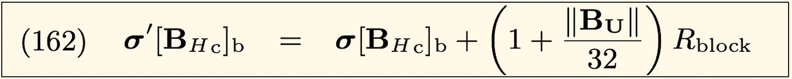

# 以太坊的发行:blockReward

> 原文：<https://medium.com/coinmonks/ethereums-issuance-minerreward-3cad5b9a72ff?source=collection_archive---------2----------------------->

最近，在 Crypto Twitter 上有一场关于以太坊货币供应的争论(在这里开始[，在这里](https://twitter.com/pierre_rochard/status/1291522796410089474)继续[)。有人声称以太坊的货币供应不容易获得，也没有得到广泛认同。](https://twitter.com/hashtag/SupplyGate)

新闻快讯:这两种说法都是对的。

在某一点上，我们的项目 TrueBlocks 被提及，所以我想我应该写一篇文章(现在已经发展为两篇文章[和一个代码库](/@tjayrush/ethereums-issuance-unclereward-72de71b0f9f6))来探讨这个问题。

虽然我们在这里提出的工作不一定使数字更容易获得(修复节点！)，数字精确到小数点后 18 位，并验证到每个区块的链上帐户余额。我们用 TrueBlocks 做到了这一点。

## 回归基础

要真正深入研究，我们要回到基础。在以太坊，这意味着阅读黄皮书。我们将仔细研究第 11.3 节，因为该节描述了新以太的发行，或者他们称之为奖励应用。

我将一字不差地呈现 11.3 节的每个句子，然后展示一份与该句子相关的方程式，然后将这些方程式翻译成英文。最后，我们使用 **TrueBlocks** 将这些方程翻译成有目的地简化的`C++`代码。 **TrueBlocks** 帮助我们提取和分析数据，作为[代码库](https://github.com/Great-Hill-Corporation/trueblocks-core/tree/develop/src/other/issuance)的一部分。

## 第 11.3 节

我们从 11.3 节的介绍性句子开始:

Introductory sentence of Section 11.3 of Yellow Paper

由于没有等式，我们将直接跳到英语重写开始:

> 在每一个街区，至少一个，但可能更多的账户余额被**发行**新硬币。

在讲得太远之前，我们先来定义一下*ommer 这个词。“Ommer”是中性词，表示父母的兄弟姐妹。你的叔叔和婶婶是孤儿。“ommer”和“uncle”这两个词在本文中可以互换使用。每个块都有一个零个或多个 ommers 的列表。给定块中最多有两个 ommers(第 11.1 节)。*

*上句中提到了两个不同账户余额的增加。*

*我们将第一次增加称为批量奖励的**受益人的账户余额**—`blockReward`。每个区块都有一个`blockReward`。`blockRewards`论述此文。*

*我们将第二次增加——到 ommer rewards 的**受益人的账户余额——称为`uncleReward`。不是所有街区都有大叔；因此，并不是所有的区块都有一个`uncleReward`。`uncleRewards`在[下篇](/@tjayrush/ethereums-issuance-unclereward-72de71b0f9f6)中讨论。***

## *第 11.3 节的关键*

*黄皮书第 11.3 节的下一句话是计算的关键。这句话充分描述了以太坊的**发行**:*

**

*Second sentence of Section 11.3 of Yellow Paper*

*虽然这个句子是完整的，但它非常不合语法，很难理解。*

*它有两个主要分句，用蓝色括号标识，更糟糕的是，第一个分句包含了两个被搅在一起的想法(并被分号错误地分开)。这两个想法应该结合起来，就像我对红色的修正一样。*

*幸运的是，这句话的两个部分对应于前面提到的两种余额增加。第一条是指给予整笔奖励 ( `blockReward`)的**受益人的奖励。第二条是指**的 ommer 奖励受益人** ( `uncleReward`)。***

## *批量奖励*

*请看第 11.3 节第二句话的前半部分(已更正)…*

**

*First half of second sentence of Section 11.3 (corrected)*

*…您应该能够看到这仅指的是**受益人账户**(即中奖矿工)。它表示中奖矿工的帐户余额增加(即硬币由 ***发行*** 至 ***)*** 一个由`R-block`(以下我们称之为`baseReward`)指定的金额加上该金额的`1/32`给区块中的每个大叔。*

*黄皮书用两个等式总结了这一数额的产生:等式 161 和等式 162。等式 161 表示:*

**

*Equation 161*

*哪里…*

**

*Explanation of symbols in Equation 161*

*换句话说，等式 161 表示，“ω是一个函数，它取当前块和当前块之前的状态，并转换到一个新状态，该新状态保持不变，除了……等式 162 中出现的内容”:*

**

*Equation 162*

*哪里…*

**

*Explanation of symbols in Equation 162*

*等式 162 表示“对于每个叔叔，受益人(矿工)的账户余额增加了`baseReward`加上`baseReward`的 1/32。”*

*`baseReward`在方程 166 中定义为:*

**

*Slightly incorrect Equation 166*

*这是稍微错误的，因为它忽略了在拜占庭硬分叉(从 5 以太到 3)和在君士坦丁堡硬分叉(从 3 以太到 2)的块奖励的变化。这一遗漏在法典中有所说明。*

*以上所有晦涩难懂的内容都可以用三行代码来编写:*

**

*Code for blockReward at a given block*

*注意，如果没有叔叔，`blockReward`与`baseReward`相同。如果有叔叔，每个叔叔的`blockReward`增加`baseReward`乘以`1/32`。包括我们在内的一些人把这种额外增加称为`nephewReward`。(恰当地说，如果一个块有一个叔叔，它有时被称为`nephew`。)*

*看起来很疯狂，这就是`blockReward`的全部计算。我们将在下一篇文章中查看`uncleReward`。*

*两个功能`getUncleCount`和`getBlockReward`(在上面的代码中显示为绿色)是 **TrueBlocks** 的一部分，有待解释。*

*`getUncleCount`是以太坊的 RPC 调用`eth_getUncleCount`的直接通道。感兴趣的读者可参考[文档](https://openethereum.github.io/wiki/JSONRPC-eth-module#eth_getunclecountbyblocknumber)了解该功能。*

*`getBlockReward`功能同样简单，因为它是`blockNumber`的常量功能。下面是`getBlockReward`的代码，它返回 wei 中的结果:*

**

*Code for getBlockReward corrected for change of issuance at hard forks*

*回顾一下，这个函数最好叫做`getBaseReward`。*

*之前我提到过`blockReward`只是以太坊**发行**计算的一部分。另一部分叫做`uncleReward`，将在下一篇文章的[中描述。](/@tjayrush/ethereums-issuance-unclereward-72de71b0f9f6)*

## *支持我们的工作*

*我要感谢梅里亚姆·赞迪对这篇文章的帮助。*

*帮助我们继续工作。访问我们的 GitCoin 赠款页面:[https://gitcoin.co/grants/184/trueblocks](https://gitcoin.co/grants/184/trueblocks)，今天就捐款吧。*

*或者，如果你不想让自己暴露在审查之下，但你仍然愿意捐赠，请将 ETH 发送到 0xb 97073 b 754660 bb 356 dfe 12 f 78 AE 366d 77 DBC 80 f。*

> *[在您的收件箱中直接获得最佳软件交易](https://coincodecap.com?utm_source=coinmonks)*

**