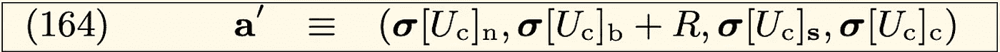

# 以太坊的发行:不透明

> 原文：<https://medium.com/coinmonks/ethereums-issuance-unclereward-72de71b0f9f6?source=collection_archive---------1----------------------->

这是详细介绍以太坊**发行**的两篇系列文章中的第二篇。阅读讨论`blockReward`计算的[第一部分](/@tjayrush/ethereums-issuance-minerreward-3cad5b9a72ff)。另外，实际代码见[代码库](https://github.com/Great-Hill-Corporation/trueblocks-core/tree/develop/src/other/issuance)。本文讨论的是`uncleReward`。

## 奖励叔叔

之前，我们看了以太坊黄皮书第 11.3 节中不合语法的第二句话。在第一篇中，我们讨论了关于`blockReward`的那句话的前半部分。在本文中，我们将讨论那句话的剩余部分(如下所示)，它详细描述了`uncleReward`。

Second half of sentence two of Section 11.3

黄皮书称“每个 ***矿工的受益者获得奖励”会更准确，因为街区里可能有不止一个叔叔，每个叔叔都有不同的矿工。我们称这种奖励为`uncleReward`。***

`uncleReward`的计算是它所在的`blockNumber`、大叔自己的`blockNumber`和上一篇文章的`baseReward`的函数。当一个块出现在规范块的叔叔列表中时，它就“成为叔叔”。

对于叔叔远离当前块的每个块，从块的`baseReward`减去`1/8`来计算`uncleReward`。如果一个叔叔的年龄超过六个街区，就没有奖励

## 小迂回

在我们继续之前，我们先绕个小弯看看 11.3 节的第四句话，这是我们唯一还没看的一句话。这句话通知了`minerReward`的计算。

Fourth sentence of Section 11.3

这简化了我们的顾虑。这意味着我们不必跟踪以前应用的奖励。一个`blockReward`的赢家也可能在同一区块赢得一个或多个`uncleRewards`。此外，单个矿工可能在同一个区块赢得两个`uncleRewards`。

## 回到主线…

`uncleReward`由以下三组不必要的复杂方程(163、164 和 165)描述:

Calculation of uncleReward in a block

我们将分别研究每一个问题。从等式 163 开始:

Equation 163

哪里…

Explanation of symbols in Equation 163

将等式 163 翻译成英语，它说“对于块的叔叔列表(如果有的话)中的每个叔叔，叔叔的矿工的账户或者(a)如果先前为空并且`uncleReward`为零，则保持为空，或者(b)根据等式 164，账户转变到新的状态(称为`a-prime`)”:

Equation 164

哪里…

Explanation of symbols in Equation 164

这翻译成英语就是，“冻结后叔叔的矿工的账户状态，`a-prime`，与冻结前相同，除了余额增加了值*R*(`uncleReward`)。

最后，等式 165 定义了`uncleReward:`

Equation 165

哪里…

Explanation of symbols in Equation 165

将这最后一位翻译成英语:“对于叔叔远离当前块的每个块，`uncleReward`是由`1/8`减少的`baseReward`。”

注意，叔叔的`blockNumber`将总是小于块的`blockNumber`，使得最里面的括号中的值总是负的，从而降低了远离链前端的每个块的`uncleReward`。

## 用代码

上述所有晦涩难懂的东西都很好地融入了这个 **TrueBlocks** 代码:

Calculation of the uncle reward for one uncle

这些计算，至少对我来说，用代码写出来比写在黄皮书上要容易得多。

注意需要为块中的每个大叔调用`getUncleReward`；所以首先要调用`getUncleCount`，自旋查询每个大叔块。然后，我们就可以提取大叔的块号，计算`uncleReward`。

我们为叔叔们累积奖励，并将该值返回给呼叫者:

Calculation of the uncle rewards for all uncles in a block

## 卷起它

我们已经展示了`blockReward`和`uncleReward`并不复杂，它们都是`blockNumber`和`nUncles`的函数。

到目前为止，我们已经展示了针对单个块的计算。剩下唯一要做的事情就是遍历链中的每个块，积累结果以供展示。

我们使用一个叫做`CReconciliation`的`C++`累加器类。这个名字意味着一个额外的特性，我们将在代码库的[自述文件中讨论，其中我们直接从链中将预期值或模型值与实际账户余额“协调”。](https://github.com/Great-Hill-Corporation/trueblocks-core/tree/develop/src/other/issuance)

对于加密推特的喧嚣，还有其他提议的脚本。那些脚本只 ***模型*** 的行为链。他们不验证或审计行为。我们在[自述文件](https://github.com/Great-Hill-Corporation/trueblocks-core/tree/develop/src/other/issuance)中解释了这个审计过程。

现在，我们用处理每个块的奖励的代码来结束本文。

## 永远…事情…

下面的代码展示了 **TrueBlocks** 的一个优秀特性。

**TrueBlocks** 提供了很多以`forEvery`开头的功能，如`forEveryBlock`、`forEveryAddressInBlock`、`forEveryTransactionInBlock`、`forEveryIndexFile`等。

这些函数本质上类似于 Javascript 的`map`和`reduce`。我们向链中的每个块(或每个事务、每个地址或其他)发送任意函数和任意数据指针，并允许将函数应用于数据。

这往往会使 **TrueBlocks** 应用程序的顶层代码非常少:

Main function for Article

我们只需要定义函数`calcRewards`，我们已经在这两篇文章中完成了。

上面的代码遍历每个块，累积、审计和显示该块的数据，然后将累积数据的结果报告给屏幕。

## 最后一个想法

在这里，我想插一句我个人的意见:黄皮书是愚蠢的过于复杂。最终，生成以太供应的代码是琐碎的。出于某种不虔诚的原因，规范把它过分复杂化了。我想这是拥有博士学位的工程师的天性。

## 支持我们的工作

我要感谢梅里亚姆·赞迪对这篇文章的帮助。

帮助我们继续工作。访问我们的 GitCoin 赠款页面:[https://gitcoin.co/grants/184/trueblocks](https://gitcoin.co/grants/184/trueblocks)，今天就捐款吧。

或者，如果你不想让自己暴露在审查之下，但你仍然愿意捐赠，请将 ETH 发送到 0xb 97073 b 754660 bb 356 dfe 12 f 78 AE 366d 77 DBC 80 f。

## 另外，阅读

*   最好的[密码交易机器人](/coinmonks/crypto-trading-bot-c2ffce8acb2a)
*   [密码本交易平台](/coinmonks/top-10-crypto-copy-trading-platforms-for-beginners-d0c37c7d698c)
*   最好的[加密税务软件](/coinmonks/best-crypto-tax-tool-for-my-money-72d4b430816b)
*   [最佳加密交易平台](/coinmonks/the-best-crypto-trading-platforms-in-2020-the-definitive-guide-updated-c72f8b874555)
*   最佳[加密贷款平台](/coinmonks/top-5-crypto-lending-platforms-in-2020-that-you-need-to-know-a1b675cec3fa)
*   [最佳区块链分析工具](https://bitquery.io/blog/best-blockchain-analysis-tools-and-software)
*   [加密套利](/coinmonks/crypto-arbitrage-guide-how-to-make-money-as-a-beginner-62bfe5c868f6)指南:新手如何赚钱
*   最佳[加密制图工具](/coinmonks/what-are-the-best-charting-platforms-for-cryptocurrency-trading-85aade584d80)
*   [莱杰 vs 特雷佐](/coinmonks/ledger-vs-trezor-best-hardware-wallet-to-secure-cryptocurrency-22c7a3fd391e)
*   了解比特币最好的[书籍有哪些？](/coinmonks/what-are-the-best-books-to-learn-bitcoin-409aeb9aff4b)
*   [3 商业评论](/coinmonks/3commas-review-an-excellent-crypto-trading-bot-2020-1313a58bec92)
*   [AAX 交易所评论](/coinmonks/aax-exchange-review-2021-67c5ea09330c) |推荐代码、交易费用、利弊
*   [Deribit 审查](/coinmonks/deribit-review-options-fees-apis-and-testnet-2ca16c4bbdb2) |选项、费用、API 和 Testnet
*   [FTX 密码交易所评论](/coinmonks/ftx-crypto-exchange-review-53664ac1198f)
*   [n 零审核](/coinmonks/ngrave-zero-review-c465cf8307fc)
*   [Bybit 交换审查](/coinmonks/bybit-exchange-review-dbd570019b71)
*   [3Commas vs Cryptohopper](/coinmonks/cryptohopper-vs-3commas-vs-shrimpy-a2c16095b8fe)
*   最好的比特币[硬件钱包](/coinmonks/the-best-cryptocurrency-hardware-wallets-of-2020-e28b1c124069?source=friends_link&sk=324dd9ff8556ab578d71e7ad7658ad7c)
*   最佳 [monero 钱包](https://blog.coincodecap.com/best-monero-wallets)
*   [莱杰 nano s vs x](https://blog.coincodecap.com/ledger-nano-s-vs-x)
*   [bits gap vs 3 commas vs quad ency](https://blog.coincodecap.com/bitsgap-3commas-quadency)
*   [莱杰纳米 S vs 特雷佐 1 vs 特雷佐 T vs 莱杰纳米 X](https://blog.coincodecap.com/ledger-nano-s-vs-trezor-one-ledger-nano-x-trezor-t)
*   [block fi vs Celsius](/coinmonks/blockfi-vs-celsius-vs-hodlnaut-8a1cc8c26630)vs Hodlnaut
*   Bitsgap 评论——一个轻松赚钱的加密交易机器人
*   为专业人士设计的加密交易机器人
*   [PrimeXBT 审查](/coinmonks/primexbt-review-88e0815be858) |杠杆交易、费用和交易
*   [埃利帕尔泰坦评论](/coinmonks/ellipal-titan-review-85e9071dd029)
*   [SecuX Stone 评论](https://blog.coincodecap.com/secux-stone-hardware-wallet-review)
*   [BlockFi 评论](/coinmonks/blockfi-review-53096053c097) |从您的密码中赚取高达 8.6%的利息