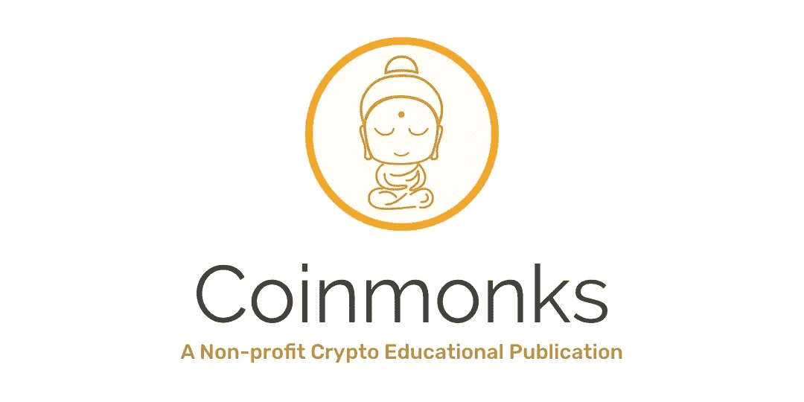

# 以太坊真正的杀手级 app:内生政治改革

> 原文：<https://medium.com/coinmonks/ethereums-true-killer-app-endogenous-political-reform-ed37fd08a570?source=collection_archive---------2----------------------->

> 我不认为解决我们问题的方法仅仅是选出正确的人。重要的是建立一种政治舆论氛围，让错误的人做正确的事在政治上有利可图。除非错误的人做正确的事情在政治上有利可图，否则正确的人也不会做正确的事情，或者如果他们尝试，他们很快就会下台。
> 
> —米尔顿·弗里德曼

## 介绍

随着 2019 年去中心化金融(DeFi)的兴起，以太坊杀手级应用的候选人目前似乎是钱。顺便说一句，这不是一个谦虚的说法:随着资金的持续分散，不平等、商业周期甚至价格通胀等重大社会问题不是由关心的政治家解决，而是由顽强的建设者解决。dapps 的无许可可组合性是传统金融没有希望复制的进化灵丹妙药。尽管 DeFi 变得如此神奇，但我不相信它真的是以太坊的终极目标。过度热心的监管者始终威胁着 DeFi，他们若隐若现的阴影诱使 DeFi 创始人小心翼翼地绕过 SEC 的公告，这在一定程度上抑制了 DeFi 的发展。除非诚实、善意、透明的以太坊建造者可以自由地尝试全新的概念，而不会受到与卡洛斯·马托斯(Carlos Matos)等人相提并论的威胁，否则创新将主要是对已经被证明是合法安全的东西的提炼。人们常常感觉立法者在黑暗的摇摆俱乐部里跌跌撞撞地走来走去，面对“坏”的密码人，他们对这个迅速膨胀的空间的细微差别知之甚少。如果监管者和立法者能够让他们的**激励措施**与该领域的诚实行为者保持一致，对管辖权选择和持续的保护性法律建议的需求就会减少。更重要的是，这需要以一种保持以太坊开放和无权限的方式发生。也就是说，诚实的演员不应该必须表明自己的身份，组成游说团体或获得许可证。这让我想到了以太坊真正的杀手级应用。

## **内生政治改革**。

秘密经济学有望让政客们做正确的事情在政治上有利可图，而腐败行为则无利可图。使用博弈论来保证理想行为的基础首先由比特币的工作证明挖掘得到证明，在 DAOs 和分散式争端解决机制(如 [Kleros](https://kleros.io/) )的帮助下，以太坊提供了鼓励政治家挖掘“好法律”和拒绝坏法律所需的基础设施。“内生改革”一词表达了这样一种观点，即在这个新时代，法律不会从遥远的首都传下来，而是将从经济内部众包，作为公民可以消费的服务。当内生改革时代开始时，世界将开始自发的政治分权，为人类成为一个真正的全球文明奠定基础。本文将解释内生改革的经济学，为什么它应该随着围绕以太坊发展的法律改革而启动，并以一个实践中的简单例子结束。

## 企业和政府之间的传统分野

在市场经济的传统观念下，企业通过由国家建立的机构所限定的市场来运作。私有财产保护、国际贸易条约、临时稳定的法律体系甚至货币生产等制度，传统上都被市场和经济学家视为外生常数，因为市场力量对它们没有直接影响。相反，这些机构是从政府民主制度的政治阴谋中诞生的。

## 大堂会议

> 同一行业的人很少聚在一起，即使是为了娱乐和消遣，但谈话最终会以反对公众的阴谋或提高价格的某种阴谋而告终。—亚当·斯密，《国富论》

公共选择理论打破了市场和国家在正交现实中发展的观点，该理论探讨了公共(即政府)行为者的激励以及他们的个人偏好如何转化为公共政策。公共选择理论还研究了狭隘经济利益集团的经济学，这些利益集团游说在议会和国会等立法机构中施加影响。游说是市场和政治参与者之间的金融桥梁。事实上，游说一词来源于代表商业利益的代理人在国会山的大厅里等待，以便有机会在国会议员就问题投票的途中与他们“交谈”。

## 游说的经济学

假设几天后就要对提高袜子进口关税进行投票。分析人士怀疑投票将会分成两半，只有 3 名参议员持观望态度。如果该法案通过，每双袜子的价格将上涨 20 美分，这将为当地袜子行业带来 4500 万美元的额外利润。大袜子派游说者到国会山，希望动摇犹豫不决的参议员。如果这三个犹豫不决的参议员能被说服不到 4500 万美元，那么这项努力就被认为是有利可图的。在承诺为每位参议员的连任竞选捐赠 500 万美元后，他们获得了全部 3 票，法案获得通过。游说的总成本为 1500 万美元，这意味着游说工作为该行业带来了 3000 万美元的利润。

为什么参议员们这么容易扣？正是因为大多数消费者并没有真正注意到每双鞋额外增加的 20 美分。从政治上来说，参议员投票支持保护主义面临的打击很小，但个人收益是巨大的。

游说的根本问题在于，特殊利益集团从中获益巨大，这给了他们强大的动力去协调复杂的游说活动，而保护主义的成本被分散到如此多的人身上，以至于消费者个人几乎没有动力去协调并向政治家提出反建议。

## 公共物品的解释(如果你知道什么是公共物品，请跳过)

对于大多数商品来说，一个人消费会阻止其他人消费。如果我吃了苹果，你就不能再吃了。为了防止冲突发生，文明社会制定了谁有权消费物品的规则，通常以私有财产权的形式出现。如果我拥有苹果，我就有独占权去消费它，直到我自愿放弃权利，要么把它送人，要么把它卖掉。相反，我消费一个苹果的唯一方式是要么自己种一个，要么用我拥有或生产的其他东西来交换。只要苹果的产权得到强有力的执行，自然会出现一个满足苹果消费者需求的市场。苹果被认为是私人物品，因为它们的管理、生产和所有权可以由私人很好地处理。

还有一类商品的消费权分配要模糊得多。例如，路灯在晚上给所有的路人提供了安全感。我受益于街灯并不妨碍你受益于同样的光。因为接触光线无法控制，所以无法出售。假设路灯造价 1200 美元。在任何一年，都会有 30 个人从它下面经过，每个人一年中接受到的光的价值是 150 美元。这意味着整个社会对这盏灯的估价是 4500 美元。如果每个人都拿出 40 美元来建造这盏灯，那么每个人的净收益就是 110 美元。另一方面，单独为这盏灯提供资金将是一笔巨大的净亏损(150–1200 =-1050 美元)。这类商品的市场并不总是自发形成的，因为协调的过程更加复杂，充满了信任问题。这通常意味着路灯等产品产量不足。由于这个原因，社会倾向于期望这种性质的商品由像国家这样的大型集体出资，这就是为什么它们被称为公共品。

## 作为公共利益的良好法律

我们可以将良好的法律体系视为公共“商品”。为此，我们只需要稍微修改一下术语。假设当我受益于一部好的法律时，我正在*消费*它。例如，一对同性伴侣在新合法化的同性婚姻下结婚可以说是*在消耗*新的立法。同样，有效的刑事司法改革从根本上降低了我所在地区的犯罪率，当我晚上走在街上，人身和财产都很安全的时候，我正在思考这些改革。在这两个例子中，我的消费并不妨碍其他人消费善法。由于这个原因，我们陷入了理智上的舒适信念，即法律可以而且应该只由国家制定，因为它展示了公共物品的属性。

当然，正如袜子关税的例子所指出的那样，问题在于负责制定好法律(或等同于废除坏法律)的人不成比例地被游说者形式的狭隘经济利益所左右。游说的唯一平衡是，足够离谱的立法可以每隔几年在投票箱中受到一次惩罚。然而，这并不足以遏制看似良性的[监管俘获](https://www.investopedia.com/terms/r/regulatory-capture.asp)的不断产生，比如上面袜子关税的例子。我们需要的是一个足够大的融资机制，以诱使立法者抵制特殊利益集团的提议。资金只需要大到足以迫使游说者陷入无利可图的境地，对社会来说幸运的是，这仍然远远低于社会从说服立法者避开保护主义中获得的好处。

## 游说 vs 以太坊:入道

在从 DAO 黑客事件中恢复过来，并从 2017 年简化的 ICO 模型的高点下来之后，DAO 研究的创新再次在以太坊开花。DAO innovation 的第一个参与者是令人兴奋的 [MolochDAO](https://molochdao.com/) ，这是一个理论上平衡的简单游戏，其明确目的是为以太坊生态系统的发展提供资金。公共区块链，特别是以太坊，正在展示社区如何通过使用创新的方式为贡献者获取价值来内生地推动公共产品融资。从稀缺的公用令牌到声誉，到不可替代的徽章，再到未来的投票权，DAO 治理奖励仍处于起步阶段，但有望彻底改变公共产品融资的方式。既然 DAO 促进了公共产品的众包，我们应该能够将这一概念应用于“好法律”的规定，设想一种旨在奖励立法者抵制游说者诱惑的 DAO。“道”的目标不是那些可能得不到党羽支持的高层领导，而是可以被设计成在政治上对整个立法机构有利可图。例如，免除公共债务或资助一个受欢迎的公共项目，以换取贸易保护主义法律的废除。

## 从莫洛赫岛到莫岛

莫·易卜拉欣奖(Mo Ibrahim prize)是由苏丹亿万富翁莫·易卜拉欣(Mo Ibrahim)设立的，旨在为在任期届满后自愿辞职的非洲领导人提供数百万美元的奖金。该奖项是遏制腐败的一项崇高努力，我们只能希望最终效果是更好的治理，但与腐败领导人希望从掠夺国库或收受贿赂中获得的东西相比，该奖项本身仍然微不足道。在道斯时代，我们现在有技术把莫·易卜拉欣奖带到下一个层次。想象一个*模式*旨在筹集足够的资金来奖励有意义的改革，以完善法律。

## 自举模式:减少监管的案例

要启动改革，我们应该确定一个能带来快速社会创新的改革领域。我认为，最好的起点是改革和制定与 DeFi 相关的法规。如果传统金融无法通过监管俘获挫败 DeFi，内生改革将拥有强大的融资引擎。

法规和监管合规性的代价是提高所有行业新来者的准入门槛。尤其是在以太坊和 [DeFi](https://consensys.net/blog/news/2019-was-the-year-of-defi-and-why-2020-will-be-too/) 领域，人们常常感觉一张合规之网正在慢慢收紧，以扼杀该行业的活力。这些限制是作为一种保护消费者免受 Bitconnect 式诈骗者侵害的形式出现的。然而，如果部署首先需要咨询法律团队，那么拥有一个开放、透明、无权限的智能合约部署机制就没有什么意义了。这不是一个支持更自由市场的简单论点。事实上，我认为监管传统金融行业的动机并不意味着监管分散金融。由于该行业本质上是开放的(智能合同可以在区块链上检查)，该行业有许多自我监管的方式。这与传统的“非连锁”实体企业非常不同。

## 克莱罗斯与以太坊 dapps 内源性调控的诞生

> **法规被编入交易算法**

[Kleros](https://kleros.io/) 是以太坊区块链上的一种分散式争议解决机制，可用于建立真实世界事件的真相，并将这些真相记录在链上，供智能合约消费和整合。到目前为止，Kleros 的杀手级应用并不是解决当事人之间的纠纷，而是促进列表的分散管理。听起来很奇怪，这些名单是以太坊生态系统中金融监管和消费者保护的基础。为了理解为什么要考虑令人讨厌的 ERC20 代币。ERC20 标准不能保护消费者免受集中诈骗硬币的侵害。它只是指定了这些令牌用来在区块链上操作的接口。为了打击诈骗硬币，Kleros 建立了一个徽章系统，令牌可以通过遵守一套严格的要求来获得。例如，DutchX 徽章要求令牌不能被某个集中的来源从供应中任意删除。徽章存在于以太坊区块链上，以供任何人或任何合同检查，以便如果代币被授予徽章，其他智能合同可以基于该信息立即选择接受或拒绝代币。希望只允许合法代币交易的分散式交易所可以自动禁止未授予徽章的代币。这种检查发生在交易时间，不需要人工监督。**将规则编入交易算法**。如果代币由于某种原因失去了它的徽章状态，它将自动从分散的交换中消失，而不需要任何人工操作。随着越来越多这样的合法性列表在 Kleros 上创建，一个新的道德 dapps 生态系统将会出现，它会自动遵守这些列表所支持的理想。这种类型的监管不是外部监管，而是区块链的运作所固有的，这就是为什么我称之为内生监管。

> 理想情况下，我们不希望诚实的行为者承担任何合规成本，而这正是内生监管所要实现的。

将 Kleros 提供的内生监管与传统金融监管进行对比:它不仅不严厉，还选择性地为骗局硬币的采用增加了障碍，同时为诚实硬币扫清了道路，而诚实硬币的创造者不需要法律合规团队。理想情况下，我们不希望诚实的行为者承担任何合规成本，而这正是内生监管所要实现的。传统的监督监管给诚实者和不诚实者都带来了负担，并且经常被较大的现有者以潜在的创新者为代价进行监管俘获。虽然不道德的 dapps 仍然可以在内生监管的环境中存在，因为以太坊是没有许可的，不像实体企业，他们不能假装合法，也不能隐藏他们的集权程度。任何没有经过仔细论证的集权形式都是一个信号，表明他们可能在试图隐藏什么。

在行为经济学中，有一个被称为完全披露原则的概念，该原则指出，如果一个人可以发出信号，让自己与竞争对手区分开来，那么即使是竞争对手也将被迫披露自己的不利地位。例如，假设法律禁止潜在雇主在工作面试时要求提供高等教育证明。这项法律的目的是给那些没有学位的人一个公平的就业机会。然而，由于受访者知道拥有学位能让他们脱颖而出，那些拥有学位的人会主动提供信息。然后，面试官可以推测那些不主动提供自己资质的人没有任何资质。

如果我们将完全披露原则应用于 Kleros 列表，没有批准徽章的令牌(因此不能在需要此类徽章的分散式交易所上市)向世界发出信号，表明它们可能没有资格获得徽章。

模拟市场也有标准机构，但这些机构的特点是对信任的要求，而 Kleros 不会受到这种条件的影响。例如，假设我想吃纯素食产品。有许多组织在各种产品上贴上纯素食主义和“未在动物身上试验”的标签，但除非我亲自审核这些组织，否则我只能相信他们。共谋和腐败是严重的问题，没有明显的解决方案，但加密经济学可以通过某些数学保证来消除。模拟市场中的自由市场自我调节能力较弱，因为企业受制于消费者选择的达尔文主义，但在不道德的操作和消费者发现这一信息之间有时会有很大的滞后效应。这种滞后为监管监督创造了合理的理由。

另一方面，以太坊生态系统随着时间的推移变得更安全、更清洁、更少腐败，这不是巧合，而是有意为之。在存在诸如 Kleros 名单等内生监管的情况下，根据充分披露原则，不道德经营和消费者发现之间的滞后完全消除，随之而来的是，监管监督的需要也同样消除。

## 磨刀的主要指令

KYC 合规或把代币归类为证券等传统监管不仅完全不适合去中心化金融，而且扼杀了 dapps 发展的基石之一:无许可创新，对创新有害无益。出于这个原因，MoDAO 的主要使命应该是奖励那些积极放任以太坊 dapps 的司法管辖区。也许他们可以通过豁免法，如“只要 dapp 充分警告消费者所涉及的风险，并且不对利润作出数字承诺，只要 dapp 不仅仅是传统金融公司的幌子，dapp 的运营就不必遵守现有的金融法规，也不必向任何机构注册。为了被认为是 dapp 而不仅仅是应用程序，dapp 应该具有分散的治理。但是，新的 dapps 有 2 年的宽大期。”

## 实践中的磨刀

MoDAO 的主要融资机制可能是以每张 1 Dai 的价格出售门票。门票收入被添加到中央储备中，存入某种 DeFi 产品，以获得利息并战胜通货膨胀。也许为了安全起见，这些资金被直接或通过中介令牌如、、、cDai 或存入 T1。门票授权持有者提名最近或正在进行以太坊友好改革的政府或管辖区。为了提名一个司法管辖区，需要门票押金。押金越多，提案越快得到审查。提名连同提名理由清单一起提交。该提案由 Kleros 法院系统进行评估。首先对列表进行评估，以查看原因是否符合 MoDAO 的理想。如果他们这样做，原因本身的真实性进行评估。如果这两个步骤中的任何一个失败了，票就被销毁了(在奖励了 Kleros 陪审团之后)。如果提名通过，持票人可以用赌注票赞助被提名人，某种渗透预测市场机制，如[全息共识](/daostack/holographic-consensus-part-1-116a73ba1e1c)可以用来将获胜者推向顶峰。一旦明确的获胜者存在，并且该获胜者获得了法定人数，奖金可以分配给该获胜者。此时，代理人必须代表获胜国家领奖。或许像普华永道这样的第三方审计公司可以充当道与国家之间的中间人。这里，需要再次调用 Kleros 来保证 DAO 代理是合法的。

## 改革所有的事情

一旦 MoDAO 使以太坊监管领域的改革在政治上有利可图，它就可以将目光转向其他需要改革的领域，如财政不可持续的国家、复杂的贸易壁垒、刑事司法改革等。想象一下，激励各州将他们的监狱系统变得更像挪威，或者将他们的教育系统变得更像芬兰。然而，如果 MoDAO 所做的唯一事情是为以太坊创造繁荣的空间，我相当有信心 dapp 开发者会找到创造性的方法来改善世界和分散我们的未来。

> [直接在您的收件箱中获得最佳软件交易](https://coincodecap.com/?utm_source=coinmonks)

