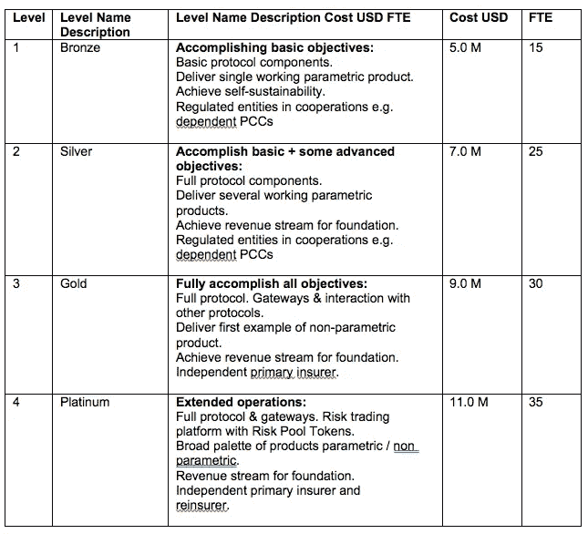

# Etherisc ICO 审查——分散保险

> 原文：<https://medium.com/coinmonks/etherisc-ico-review-decentralized-insurance-5562835e414b?source=collection_archive---------1----------------------->

**一个分散的保险协议，用于合作开发新的保险产品，目的是使市场民主化，使保险更加公平。**

*+++这不是财务建议或税务建议。+++你是在自担风险投资！+++投资前先做好自己的调研！+++我打算投资 Etherisc ++没有人付钱给我写这篇评论，我只是一个项目的粉丝，这个项目看到了让世界变得更美好的巨大潜力++++*

# **1。** **保险业—挑战**

对我们大多数人来说，保险是抵御风险的“必要之物”。他们不受欢迎。在最好的情况下，他们很难打交道，在最坏的情况下，他们把我们埋在纸里，卖给我们我们不需要的保险，到了该付钱的时候就甩开了。

尤其是最后一部分很难。你以为你买了保险，但发现实际发生的事情不在保险范围内。这可能来自于你一开始没有理解的许多合同页面，或者保险模型所承担的利益冲突。一方面他们答应付款，另一方面每次付款都在减少他们的利润。

保险的成本结构主要是销售、营销和销售支持、IT、索赔管理、保单服务、设施和其他项目的成本流出。一切都必须由我们的保费支付。

风险部分本身，即所谓的“损失率”，可以在保险费的 30%到 75%之间变动。这主要取决于保险的类型、保险公司的效率和实际索赔。这意味着风险范围本身只负责标价的 30%到 75%。在财产险和意外险中，平均比例约为 50%。剩下的就是相关的人和机器以及利润。参见[麦肯锡保险成本报告](https://www.mckinsey.com/~/media/mckinsey/industries/financial%20services/our%20insights/what%20drives%20insurance%20operating%20costs/successfully_reducing_operating_costs.ashx)。

另一个问题是:许多有投保需求的风险并没有被覆盖。主要原因是:低保险费，目前的成本结构，自动化程度低。

主要问题:

a)高保费(由庞大的成本结构造成)

b)缺乏信任(销售期间和付款时的利益不一致)

c)不涵盖不符合当前成本结构的风险

# **2。** **一种分散解决方案**

成分:

A.保险风险的风险计算方案

B.重新分配正常风险的风险池

C.黑天鹅事件的风险池或再保险

D.如果定义的事件已经发生，自动检查的智能合同(“oracle”)，如果需要，由独立人员进行扩展检查

E.自动支付保险的智能合同

F.涵盖以上所有内容的 IT 系统

**风险计算和池**

保险产品的潜在风险必须是可靠的，并由专家(精算师)完成。当系统收集到足够的数据作为可靠预测的良好基础时，对这些专家的需求将会减少。当然，当一个新产品被设计出来时，每一次都需要这些专家。

安装了一个风险池，它可以覆盖进来的保费和出去的索赔的正态分布。一个额外的风险池涵盖很少发生但可能摧毁正常基金的极端情况(“黑天鹅事件”)。

**智能合约和独立的真实世界检查**

智能合同具有已定义的属性，可以自动执行大部分流程:

a)客户能够将他的钱转移到合同中

b)检查(通过 oracle)定义的事件是否已经发生

c)向客户支付保险金额

d)与合适的专家签约，作为承包商检查索赔

如果保险事件的发生可以由外部提供商单独通过数据证明，智能合同能够直接向客户支付。如果这是不可能的，智能合同可以与一个独立可信的外部人员签订合同来检查索赔。根据所涉及的任务，这个人可以是普通人，也可以是某个领域的专家。

**一个 IT 系统**

IT 系统必须涵盖以上所有内容。主要是:

风险计算和自动保费计算

向客户解释投保风险的更好方式

签署具有法律约束力的合同的机制

智能合同可以关闭合同、检查 oracle 的数据、支付索赔、与外部专家签约、接受和处理专家的反馈

提供审计历史

# **3。** **那么 Etherisc 提供了什么？**

Etherisc 提供了一个“分散保险协议，用于新保险产品的合作开发”。他们想让保险市场民主化，让保险更加公平。

**以太平台**

实施和运行各种保险产品的技术

保险许可证

聚集风险投资资本的手段

完全可审计的系统

技术平台为新玩家提供了一个有趣的机会:

他们可以提供保险而不需要保险执照

不使用保险时不付款(纯可变)

如果需要帮助，他们可以从外部来源获得帮助(例如精算师计算风险模型)

他们可以在标记化的风险池中整合额外的资本(较大的合作伙伴或许多较小的主权投资者)

换句话说:你不一定要成为一个保险人才能提供保险服务。你唯一应该有的就是市场需求和良好的市场准入。中间人的日子会不好过。

# **4。** **令牌经济学**

Etherisc 模型中的激励机制设置得很好。每个玩家都可以在这个新市场中获得自己的份额:

被保险人可以享受更广泛的保险

被保险人将更好地了解什么是保险，并能更容易地购买保险

被保险人支付较低的保险费

被保险人对客观赔付(自动决定或由独立专家决定)具有透明度和更好的信任

许多新的参与者可以通过设计新产品、提供风险模型、提供数据、保险许可贷款和监管报告等方式参与到这一经济中，并赚取部分保费。

主权投资者可以将其资本(如美元、瑞士法郎、BTC)投入风险池，并获得有吸引力的利率

这是一个对每个人都有吸引力的模型，体现了平台令牌和单一风险池的真正价值。

# **5。** **当前状态**

2016 年 10 月，Etherisc 在现实生活测试中推出了第一款工作原型**航班延误保险**。77 人购买了保险，承保他们飞往上海参加会议的航班延误。5 个人自动收到了奖金。该产品与一家保险合作伙伴在坎昆举行的 2017 年 DevCon3 大会上再次上线。参见保险杂志中的[文章，参见](https://www.insurancejournal.com/news/international/2017/10/30/469647.htm)[演示](https://fdd.etherisc.com/)，参见[博客文章](https://blog.etherisc.com/the-keys-to-successful-token-implementation-2442b59cec88)。

**社会保险**，为死亡和重病等严重事件提供简单、轻量级的解决方案，是帮助度过困难时期的第一笔即时紧急支付。任何人都能负担得起和获得。可扩展，易于使用，显然完全可审计。可以由政府或其他组织部署。基于最多 12 个成员的本地团体和固定的支付。市场:约 50 亿人。在概念阶段。参见[视频](https://www.youtube.com/watch?v=pMiqYmLEj00&feature=youtu.be)。

**作物保险**，例如由 [NDVI 指数](https://en.wikipedia.org/wiki/Normalized_difference_vegetation_index)测量的作物健康下降 XX%触发。这也将加强对作物保险和作物特定指标的应用研究，这种研究目前还没有达到必要的规模。参见[演示](https://crop.etherisc.com/)。

**冷库** **保险** **的密码资产**，其中绑定了冷库的一个技术标准。这对于传统的资产管理公司来说很重要，他们仍然不愿意将加密资产作为他们投资组合的一部分。准备中。

目前大约有 25 种产品处于不同的开发阶段。

很期待即将问世的众多创新机型。

# **6。** **团队——他们能做到吗？**

这个团队不是白纸团队。他们已经交付了一个全功能的解决方案。现在，他们决定升级游戏，创建一个将改变保险行业的灵活平台。

[**Christoph mussen Brock**](https://www.linkedin.com/in/christoph-mussenbrock/)，联合创始人，协议&架构

在合作社、IT 和监管框架方面有很强的背景。曾是一家合作社的董事会成员和一家专门从事风险管理解决方案的公司的首席执行官。数学硕士学位。

[**Stephan Karpischek**](https://www.linkedin.com/in/karpischek/)，生态系统联合创始人。社区

数字战略和咨询。在里面 20 多年。电信和银行数字战略顾问。2015 年，瑞银加密 2.0 创新实验室的一部分。自 2008 年以来一直从事数字货币方面的工作。

[**Renat khasanshin**](https://www.linkedin.com/in/renatco/)，联合创始人，保险产品和收入

Renat 是 Runa Capital 的风险合伙人和 Altoros 的首席执行官。与主要客户安联保险公司、好事达保险公司和自由互助保险公司共同领导 Altoros 保险业务的启动，重点关注区块链的典型使用案例，即承保、再保险和保险证券化(巨灾债券)。Renat 共同创立了 Altoros，这是一个拥有 250 多名员工的软件和研究实验室(重点:分布式数据库、容器编排和开发人员市场)。受监管的保险中介公司的软件工程师。构建了保险行业最早的在线分销门户网站之一。实时报价、支付和保单签发让美国未投保的消费者可以在同一天访问由 3 万名医生组成的网络。2007 年，Renat 与人合著了 Apatar(GPL 许可的 100%开源数据集成工具)，并共同创建了白俄罗斯 Java 用户组。Renat 在白俄罗斯国立技术大学学习工程学。

整个核心团队目前有 16 名成员，扩展团队中还有 5 名成员。

# 7。 **顾问和合伙人**

顾问:

Ron Bernstein(首席执行官 paradex.io，在 20 多个市场从事商品期货期权交易超过 25 年，顾问 Augur)

ralf Glabisch(in acta 管理合伙人，信息管理咨询、合规、实施和维护。湖畔合伙人。领投加密谷合伙人。联合创始人 Crypto Valley Labs)

杰克·布鲁克曼(CoinFund 联合创始人兼管理合伙人)

William Mougayar(Token Summit 创始人兼制作人、董事会成员 Stratumn，著有《商业区块链》一书)

Tobias Noack(AON 风险解决方案业务委员会成员，自 1991 年以来从事保险业)

daneil zak risson(cofound . it 联合创始人，投资评估 ICONOMI 负责人。之前是一家医疗科技公司的首席技术官。)

合作伙伴:

安永会计师事务所

MME(法律、税务、合规)

inacta(信息管理、区块链应用)

湖畔合伙人

共同基金

Altoros(云解决方案，企业区块链)

# **8。** **投资**

资金将进入总部设在瑞士的基金会，该基金会受" eidgenö ssische Stiftungsaufsicht "的监督，该机构监督基金会的运作并强制执行基金会的宗旨。

虽然基金会将保持其自身业务的精简和成本效益，但它将利用其

两个主要领域的资金:

1.资助制定分散保险协议和

客户、用户和参与者社区

2.建立商业保险公司，并单独或与其他合作伙伴(最好是保险公司)一起为这些公司提供资本。

以太网运行费率 c: 2 年，FTE 平均成本为每 FTE 10 万美元，人力资源成本与其他成本的比率为 2:1。

对于第二个领域——作为基金会附属机构的商业实体的资本总额，资本总额的衡量标准是不同的。由于基本的监管方法，保险公司的业务量大致为

与其资本化成正比，因为在保险中，业务量意味着风险，风险需要自有资金覆盖。

符合 Solvency II 以经营可持续保险所需的最低资本约为 1000 万美元。开办保险业务所需的营运资金占必要偿付能力资本的 25 %- 50 %,总计为 1250 万至 1500 万美元。

Etherisc 认为影响融资的一些风险:

Etherisc 只需要在一个回合中资本化。

Etherisc 在一个全新的领域运营(成熟的系统，未经证实的经济学)。他们在模型的每个方面都是先锋。

监管机构将要求比以传统模式运营的同等保险更高的资本要求。

提升业务的持续时间可能会比预期的长，目前尚不清楚加密货币和加密商业模式的大规模采用将会以多快的速度开始。

所以 2000 万美元的软封顶和 5000 万美元的硬封顶都是似是而非，并不夸张。

安全性:

Etherisc 是阿拉贡发起的“[透明项目](https://projecttransparency.org/)”的成员。每一笔至少 0.5%的资金用途都会公开公布。

团队已经编写了代币销售智能合同。该代码经过了知名 solidity 专家的三次独立审核，一旦最终版本的合同被认为稳定，就会发布。

> [在您的收件箱中直接获得最佳软件交易](https://coincodecap.com/?utm_source=coinmonks)

# **9。** **更多想法**

如果你考虑公平保险，你甚至可能会决定限制你的利润，并把剩余部分返还给你的客户。系统应该能够

计算支付给客户、内部成本和外部专家成本后的利润百分比

为投资者自动偿还超过目标利率的资金

**挑战者/新人**

对于所有拥有大量客户基础的公司来说，这将是一个非常好的机会。他们可以为会员提供更好的服务，赚更多的钱。

想象一下一家大型电信提供商和一家智能手机保险公司。他们甚至可能选择整合他们的(微任务)。或者想想大型住房合作社，它们可以建立自己的基金，而不是依赖正常的保险公司。

这在一定程度上可能会像过去一样带来保险，当时中国商人会将他们的贵重货物分散到多艘船上，每艘船都载有另一艘船上同等份额的货物。以这种方式，任何一次损失都不会是灾难性的。当然，这种风险的分散也阻止了一个商人带着船上的货物潜逃，并且永远无法与其他商人团聚；他会失去太多。实际上，他们都参与了这场游戏，而这仍是现代金融最难以捉摸的元素之一。

**现任者**

保险公司有一个独特的机会来重新审视他们的整个价值链。他们应该更好地行动起来。想象一下“死亡证明”被符号化，这样你就有了一个人死亡的官方证明。这将改变最重要的保险市场的游戏规则，并将对因被保险人去世而无人认领的数十亿保险金产生巨大影响，而他们的受益人也无法将这些线索联系起来。

# **10。** **来源深挖**

[**网页**](https://etherisc.com) : [**下载**](https://etherisc.com/#downloads) : [**2 分钟视频**](https://www.youtube.com/watch?v=F4X_LGHpXPY) : [**更多视频:**](https://www.youtube.com/results?search_query=etherisc)

[**电报频道** :](https://t.me/etherisc_community) [**推特**](https://twitter.com/etherisc?lang=en):[**Github**](https://github.com/etherisc):

**播客:** [采访雷纳特·卡桑辛](https://block.news/makers/renat-khasanshyn/) : [采访斯蒂芬](https://thebitcoinpodcast.com/an-ethereum-podcast-episode-14/)

[**统计—比率:**](https://www.oecd.org/daf/fin/insurance/Global-Insurance-Market-Trends-2015.pdf)

[**InsureTech 的机会**(尤其是幻灯片 9，展示了 insurate tech 可以改进保险模式的领域):](http://euro-events.co/wp-content/uploads/2017/06/01.Kurani_Dissecting_Insurtech_v6.pdf)

*+++这不是财务建议或税务建议。+++你是在自担风险投资！+++投资前先做好自己的调研！+++我打算投资 Etherisc ++我写这篇评论并没有得到任何人的报酬，我只是一个项目的粉丝，这个项目看到了让世界变得更美好的巨大潜力++++*

如果你喜欢我的评论，请鼓掌 1、2、3 或 50 次。:-)

