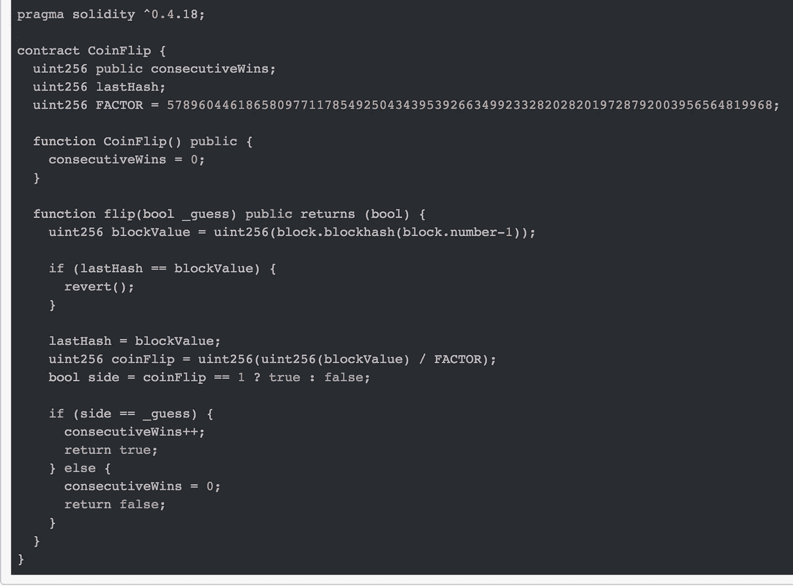
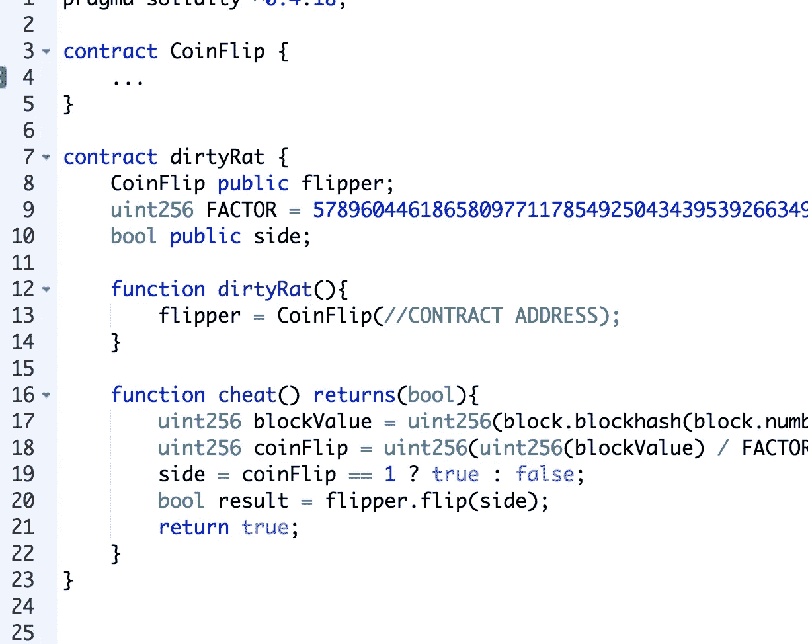

# 以太币翻转问题

> 原文：<https://medium.com/coinmonks/ethernaut-coin-flip-problem-4f326df872cb?source=collection_archive---------1----------------------->


不确定什么时候发生的，但是在 CTF 的游戏中有一些新的挑战；“T [he Ethernaut](https://ethernaut.zeppelin.solutions/) ”。这是一个开始智能合约开发的好地方，因为所有的挑战都是完全独立的，并且是基于已经让很多人失去了一些 ETH 的实际漏洞。

现在，我将分解挑战，标题为:“[](https://ethernaut.zeppelin.solutions/level/0xd340de695bbc39e72df800dfde78a20d2ed94035)****”。****

# **让我们创造自己的运气🍀**

****

**The CoinFlip contract**

> **“这是一个抛硬币游戏，你需要通过猜测抛硬币的结果来建立你的连胜纪录。要完成这一关，你需要用你的通灵能力连续猜对 10 次。”**

**其实没必要黑这个合同！我们可以只翻转 10 次，希望连续猜对 10 次的概率是 0.5 ⁰。这可能需要一段时间，但没有什么比艰苦的重复性工作更能磨炼灵魂了。**

**或者我们可以在提交猜测之前检查结果。**

**但在此之前，让我们先把合同通读一遍，然后再考虑解决方案。**

```
function CoinFlip() public {
   consecutiveWins = 0;   
}
```

**此契约的构造函数并不做太多工作，它只是将连续 Wins 计数器设置为 0。它实际上不需要这样做，因为每个已定义但未赋值的变量都默认为其空状态(对于 uint 为 0)，但无论如何这样做有利于清晰。**

**契约存储中的其他值得注意的事情是 lastHash，我们现在还不知道它的用途，但值得注意的是它不是公共存储的一部分。还有一个因素就是屁股大！经过一番查找，它看起来确实很“神奇”,原来这个数字等于 2 ⁵⁵(好奇🤔)**

# **翻转🐬**

**看起来大部分的思考都必须在 **flip()** 函数的方向上进行。**

**让我们看看函数签名:**

```
function flip(bool _guess) public returns (bool) {...
```

**"*函数，我给出一个布尔值，然后返回一个布尔值*"**

**继续前进。**

```
uint256 blockValue = uint256(block.blockhash(block.number-1));
```

**block.number 和 block.blockhash 分别是一个全局可用的变量和函数，它们的作用如下:**

***块号(uint)* :当前块号**

***block . block hash(function(uint)returns(bytes 32))*:给定块的散列—仅针对 256 个最近的块**

**换句话说，每当翻转事务包含在一个块中时，我们查看前一个块的编号，我们使用该编号来查找前一个块的哈希(类型为 bytes32 ),并将它转换为类型 uint256。**

**这到底是什么样子？让我们来填补空白，以便获得一个概念:**

```
// Current block number 30010 
// Network, Ropsten (This matters, naturally)1\. blockValue = uint256(block.blockhash((30010-1));
2\. blockValue = uint256(block.blockhash((30009));
3\. blockValue = uint256( 0xf5e22612a5c856807346a40b329664fb393e6ea0e585bd34cffc9f59a50353bd
);
4\. blockValue = 111216218108639340416231065655650431318691078275559772203362371055421202060221
```

**大数就是大。值得注意的是，将字节 32 转换为 uint256 覆盖了相同的数字空间。任何有效的 uint256 都可能出现在 32 字节的转换中。**

**接下来:**

```
if (lastHash == blockValue) {revert();}
lastHash = blockValue;
```

**好的。这就是 lastHash 的用途。如果有一个成功的事务，那么 lastHash 将被设置为这个 blockValue，它完全依赖于包含该事务的块，blockValue 等于 lastHash 值的唯一合理的方法是在同一个块中有对这个函数的多个事务。如果是这样的话，只有第一个会通过，这就为我们关闭了一条通道。如果这里没有这个，我们可以用相同的猜测对每个块进行 10 次，并为每个事务获得相同的块值。**

```
coinFlip = uint256(uint256(blockValue) / FACTOR);
bool side = coinFlip == 1 ? true : false;
```

**3 / 4 = 0，在固体中。我们把任何除法的结果四舍五入，然后去掉余数。直觉应该告诉你 *(blockValue / Factor)* 应该等于 1 或者等于 0。而且很有道理！为了更便于管理，让我们将 blockValue 视为 uint8，将 Factor 视为 uint7。**

```
//Maxed out!
FACTOR = X 1 1 1 1 1 1 1
blockValue = ? ? ? ? ? ? ? 
```

**重要的是，对于大于因子的块值，它只需要最左边的位等于 1，否则它将小于因子(或等于)。**

**因此，这种除法的结果(0 或 1)取决于 blockvalue 的最左边的一位，这显然是随机确定的。酷毙了。**

```
if (side == _guess){ consecutiveWins++; return true; } 
else { consecutiveWins = 0; return false; }
```

**最后，我们比较我们的伪随机翻转结果与用户提供的猜测，并相应地调整连续的胜利。那么，它呢？无论如何，你会想到这份合同吗？**

**如果您考虑 lastHash 子句的必要性，另一个漏洞应该变得非常明显。**

# **解决方法！🏅**

> **同一个块中的每个事务都可以评估“coinflip”结果！！**

**因此，通常情况下，破解智能合同的最佳方式是与另一方合作:**

****

**Str8 outta Remix**

**这里我们实例化定义 CoinFlip 契约的接口，并使用我们的目标契约的地址实例化它。然后，只需在我们迂回的 dirtyRat 契约上调用欺骗函数，就会评估 coinflip 的结果，并将“猜测”传递给真正的 CoinFlip 契约。**

**这是在单个事务中完成的，因此我们的 CoinFlip 计算显然将与 CoinFlip 契约中的计算相同，因为我们必须在同一个块中进行。**

**现在剩下的就是十次垃圾邮件作弊功能。😎**

# **还有一件事…**

**这里还有另一个同样明显的弱点。矿工。在一个区块最终确定之前，矿商们通过不同的交易建立区块，并相互竞争将区块提交给区块链。这意味着他们可以在搭积木时运用自己的判断力。一个矿工，给时间可以尝试许多不同的猜测，而不是提交块，他是错误的。**

**这种基于共识的工作证明的属性是在区块链上实现真正随机结果的最大障碍之一。在建立一个分散的乐透之前，考虑一下这个问题🤑**