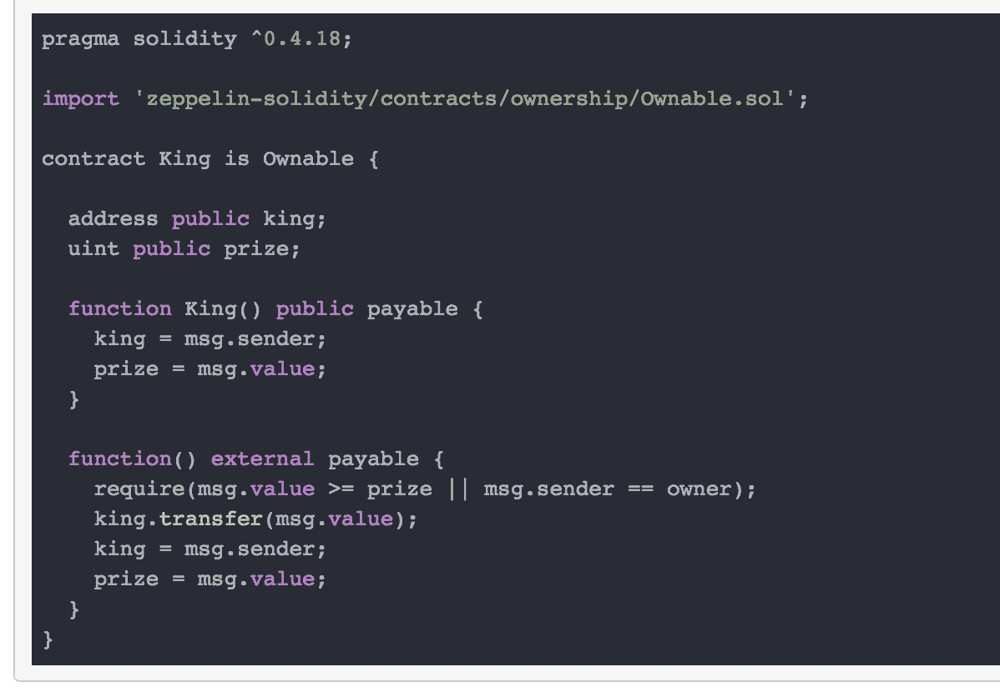
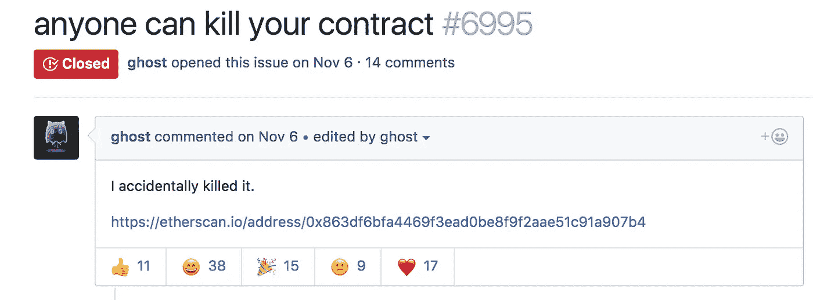
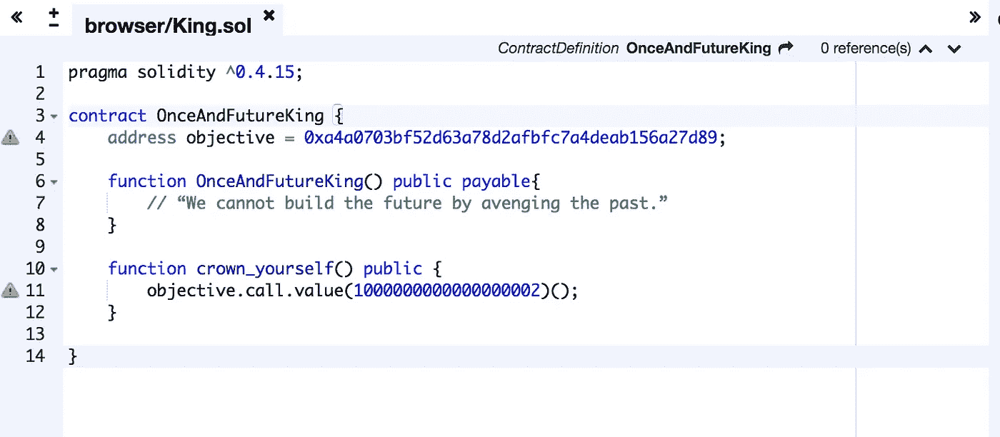

# 以太王问题

> 原文：<https://medium.com/coinmonks/ethernaut-king-problem-2ccec1ee4190?source=collection_archive---------0----------------------->


El eternauta original.

回到 11 月 [Zeppelin Solutions](https://medium.com/u/4e5199c3ee0a?source=post_page-----2ccec1ee4190--------------------------------) 邀请所有人参加他们的智能合同 CTF 竞赛，名为“[以太者](https://ethernaut.zeppelin.solutions/)”。这是开启 Devcon3 的绝佳方式！世界各地的开发者很快就粉碎了最初的六项挑战。

这些谜题大多是以太坊坎坷历史中真实黑客行为的简化实现。对于任何开始安全智能合约开发的人来说，它们都是一个很好的切入点，也是一个很好的网站，因为 OZ 团队一直在增加新的挑战！

所以，这里有一点关于最新加入的(目前)第六位**国王的报道。**

如果你不想被**宠坏**请停止阅读，试一试:[王者](https://ethernaut.zeppelin.solutions/level/0x32d25a51c4690960f1d18fadfa98111f71de5fa7)

# **山丘之王**



The **King** contract

挑战的目的是防止契约在你提交实例后收回王权。因为在这个契约中改变王权的唯一方法是通过后备功能，所以我们可以专注于此。

首先，我们肯定要从合同中取得王权，要以合法的方式做到这一点，我们只需要向合同地址发送一个价值大于当前奖金(1 ETH)的交易

我们可以很容易地接受它，现在棘手的部分是当契约最终再次调用回退函数时保留。所以让我们一行一行地来，看看我们能想出什么。

```
require(msg.value >= prize || msg.sender == owner);
```

这看起来很有希望。换句话说，如果消息值小于当前奖金**并且**消息发送者不是所有者，则[回退功能](http://solidity.readthedocs.io/en/develop/contracts.html#fallback-function)将失败。

值得看一看 [Ownable.sol](https://github.com/OpenZeppelin/zeppelin-solidity/blob/master/contracts/ownership/Ownable.sol) 看看我们在处理什么。在这里，我想起了 2017 年 11 月臭名昭著的 Parity Multi-sig 钱包黑客攻击，其中一名所谓的初学者面无表情地锁定了价值超过 1.5 亿美元的 ETH。



Not even the biggest news from that week

在这种情况下,“黑客”获得了一个未初始化的库的所有权，所有单独的奇偶校验钱包实例都使用这个库。凭借他的新特权，我们彻底摧毁了图书馆，不留活口。

# 或许我们也可以这样做？

重访:

```
require(msg.value >= prize || msg.sender == owner);
```

如果我们可以获得合同的所有权，并用超出当前所有者余额的价值来替换奖品，我们就可以锁定游戏，永远统治下去。但是我们不能。这种情况不像奇偶校验黑客，Ownable.sol 相当可靠，没有办法增选这样一个简单的契约实现。

如果我们接受这一现实，就没有理由在这个诱人的要求上浪费更多的时间，因为只要我们不能取得合同的所有权，它总是会过去的。我们可以安全地前进…

```
king.transfer(msg.value);
```

旧**推**交易，无异常处理。总是问题的宝库。这条线让现任国王在被驱逐前得到报酬。交易失败的方式有很多，*总的来说*现在我们只需要一种适合我们需要的方式。

1.  **出气失误。**我们没有在这里打电话，所以这不是我们能控制的。
2.  **回退功能(FF)的任意错误。如果我们的事务最终执行了一个总是以某种人为方式失败的契约中的代码。这可能行得通。但是我们可以让它更简单**
3.  **处理无应收账款/应付账款的合同。**丁。根据文档，当对合同地址进行交易而不包括任何数据时，调用该合同的回退功能。如果一个合同没有一个我们失败了，或者如果我们在交易中包括一些 ETH 并且回退函数缺少可支付修饰符我们也失败了！万岁！



我们可以用自己的契约代理王权。那么当合同试图废除我们时，价值转移就会失败。成功！！(我们将终生处于劣势，所以这实际上是一种“让世界燃烧吧”的黑客行为)

# **包装**

这一次没那么棘手。当你**知道**有一个漏洞时，一行一行地检查合同代码是相对简单的，直到你找到一个弱点。但那只是在你知道的情况下。很难将同样的原则应用到你认为可能运行良好的代码中。黑客将继续堆积，确保你的代码是不负责的，并通过你的审计。:P

> [直接在您的收件箱中获得最佳软件交易](https://coincodecap.com/?utm_source=coinmonks)

[](https://coincodecap.com/?utm_source=coinmonks)