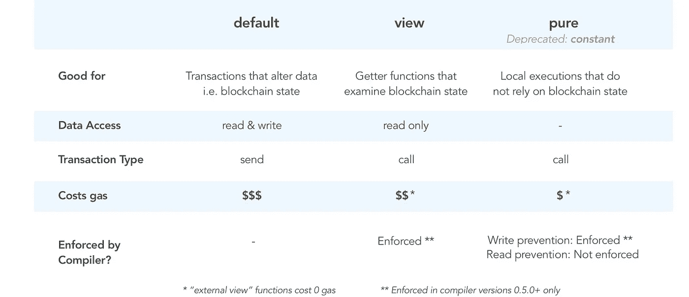
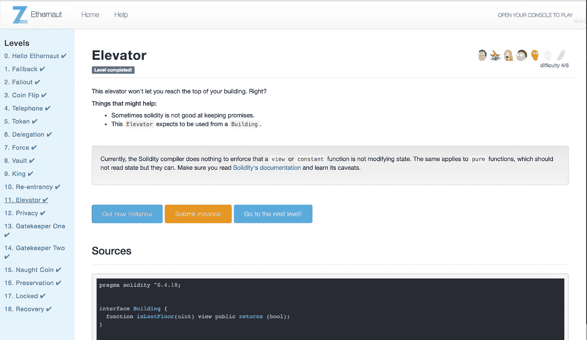

# Ethernaut Lvl 11 电梯演练:如何滥用 Solidity 接口和函数状态修饰符

> 原文：<https://medium.com/coinmonks/ethernaut-lvl-11-elevator-walkthrough-how-to-abuse-solidity-interfaces-and-function-state-41005470121d?source=collection_archive---------2----------------------->

## 这是一个围绕 [Zeppelin](https://openzeppelin.org/) 团队的[智能合约安全拼图](https://ethernaut.zeppelin.solutions/)的[深度系列](/@nicolezhu)。我们学习关键的可靠性概念，以便 100%靠自己解决难题。

这一层要求你乘电梯到顶层。

# 什么是纯视图函数

实度函数有函数修饰符，在每个函数调用开始时执行。您已经熟悉了**可见性修饰符**，比如`public`和`private`，它们决定了谁可以调用这些函数。

同样，`pure`和`view`是内置的**状态修饰符**。他们“承诺”*功能将如何与以太坊区块链上的数据交互，即*状态*。*

*按照递增状态权限的顺序:*

*   *`pure`:承诺函数**既不读取也不修改状态**。注意:在最近的编译器中，Pure 取代了`constant`。*
*   *`view`:承诺函数**只读取，不修改状态***
*   *`default`:【no modifier】承诺**将读取和修改状态**的功能*

*理论上，您应该遵循修改器的最佳实践(见下文):*

**

***安全警告:**在早期的编译器版本中，它*允许*而*在函数背叛它们的修饰符承诺时不给出警告*。所以一个`pure`函数可以违背自己的承诺，修改函数状态，没有任何警告。*

> *重要的是将这些数据修饰符视为对数据可变性的承诺，而不是保证。*

# *什么是接口*

*接口允许不同的契约类相互通信。*

*把接口想象成一个 ABI(或 API)声明,它迫使契约都以相同的语言/数据结构进行通信。但是接口没有规定函数内部的逻辑，让开发人员实现自己的业务层。*

> *契约接口指定了什么，但没有指定如何*

## ***开发者通常使用接口:***

*   ***设计合同:**在实施实际合同之前，先生成一个工作 ABI。*
*   ***对于令牌契约**:通过声明一个共享语言，所以不同的契约可以使用这些令牌来处理它们的业务逻辑。*
*   ***未使用**:一些开发人员想要[完全废弃接口](https://github.com/ethereum/solidity/issues/3420)，以支持抽象类*。*

> **注意:抽象类与接口有相似的安全漏洞。在抽象契约中，一些功能已经被编程，但是很容易被覆盖。*

# *详细演练*

**

*为了通过这一关，我们必须在一个单独的`goTo()`函数调用中使这个检查**首先**返回 true，然后**返回 false** :*

```
*// 1st check has to return false
if (! building.isLastFloor(_floor)) {
    floor = _floor;// 2nd check has to return true
      top = building.isLastFloor(floor);  //winning statement
}*
```

*请注意，Elevator.sol 从未从 Building 接口实现过`isLastFloor()`函数。*

*这意味着我们可以创建一个名为 Building 的恶意契约来实现这个功能。然后，如果我们从恶意契约中调用 goto()，我们版本的`isLastFloor`函数将在我们级别的 Elevator.sol 实例的上下文中使用*！**

1.  *在`Elevator.sol`下面，创建一个`Building.sol`契约，最终在某个任意楼层调用`Elevator.goto()`:*

```
*contract Building {
    Elevator public el = Elevator(YOUR_LVL_INSTANCE);     function hack() public {
        el.goTo(1);
    }
}*
```

*2.用一个开关实现`isLastFloor`,保证先真后假的响应。确保您的函数声明和修饰符与接口一致:*

*3.使用 [Remix](http://remix.ethereum.org/) ，调用 hack()推倒所有多米诺骨牌。注意，尽管`isLastFloor`承诺是一个`pure`函数，但它确实改变了区块链状态。*

*一个快速的`await contract.top()`现在显示我们在顶层。*

# *关键安全要点*

*   *接口不保证协定的安全性。请记住，仅仅因为另一个契约使用了相同的接口，并不意味着它会按照预期的方式运行！*
*   *继承从接口扩展的契约时要小心。每一层抽象都通过信息模糊引入了安全问题。这使得每一代合同都比前一代越来越不安全。*
*   ***你正在使用或继承的编译器版本**是什么？`View`和`pure`承诺可能会在你不知情的情况下被违背！*

> *“Solidity 编译器不会强制执行`view`或`constant`函数不修改状态。这同样适用于`pure`函数，它不应该读取状态，但它们可以。请务必阅读 [Solidity 的文档](http://solidity.readthedocs.io/en/develop/contracts.html#view-functions)，并了解其注意事项。”—以太网*

# *更多级别*

*[](/coinmonks/ethernaut-lvl-10-re-entrancy-walkthrough-how-to-abuse-execution-ordering-and-reproduce-the-dao-7ec88b912c14) [## 以太网 Lvl 10 重入演练:如何滥用执行顺序和再现道…

### 这是一个围绕齐柏林团队的智能合同安全难题的深入系列。我们学习关键的可靠性概念…

medium.com](/coinmonks/ethernaut-lvl-10-re-entrancy-walkthrough-how-to-abuse-execution-ordering-and-reproduce-the-dao-7ec88b912c14) [](/coinmonks/ethernaut-lvl-12-privacy-walkthrough-how-ethereum-optimizes-storage-to-save-space-and-be-less-c9b01ec6adb6) [## 以太坊 Lvl 12 隐私演练:以太坊如何优化存储以节省空间和减少…

### 这是一个围绕齐柏林团队的智能合同安全难题的深入系列。我们学习关键的可靠性概念…

medium.com](/coinmonks/ethernaut-lvl-12-privacy-walkthrough-how-ethereum-optimizes-storage-to-save-space-and-be-less-c9b01ec6adb6) 

> [直接在您的收件箱中获得最佳软件交易](https://coincodecap.com/?utm_source=coinmonks)

[](https://coincodecap.com/?utm_source=coinmonks)*