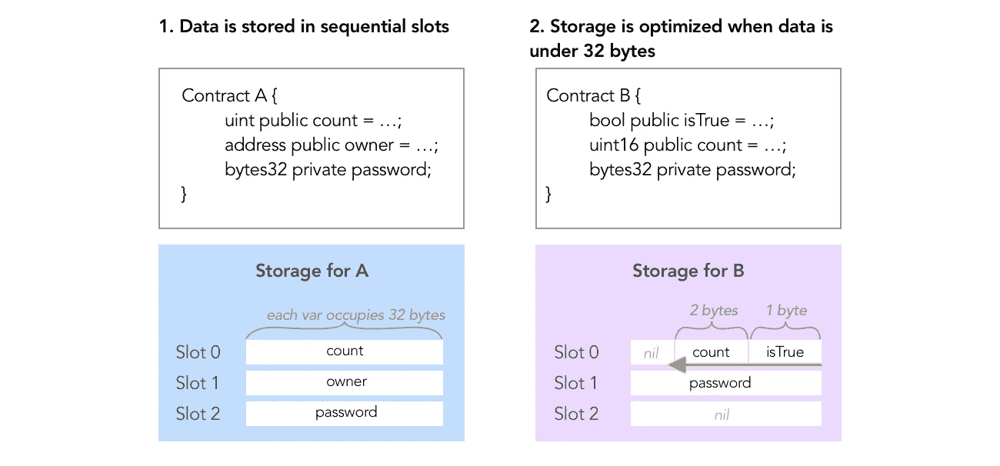
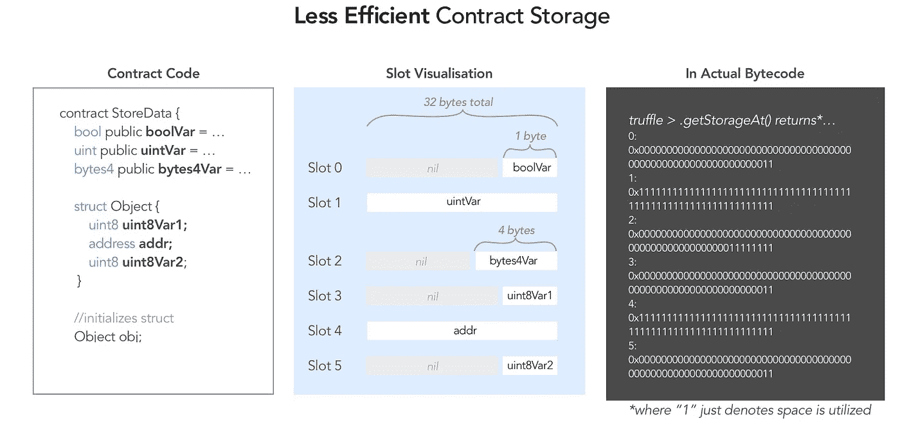
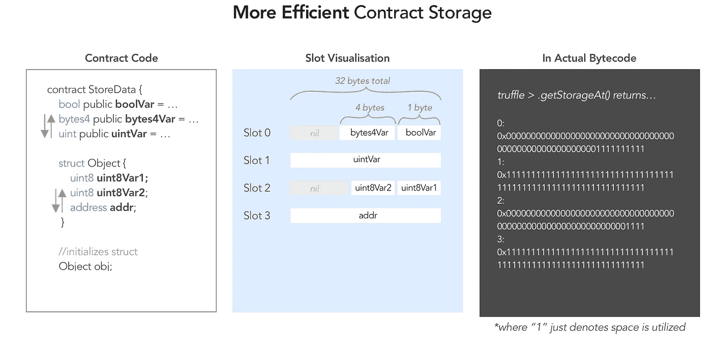
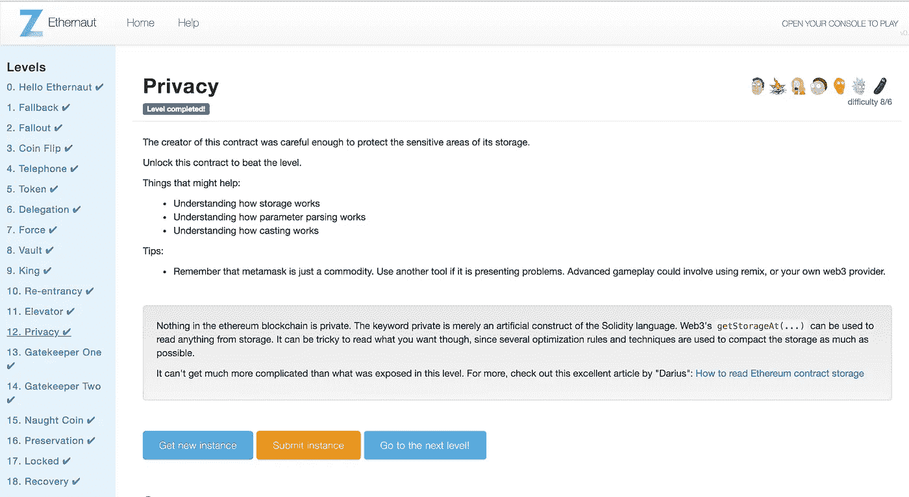

# 以太坊如何优化存储以节省空间和减少气体排放

> 原文：<https://medium.com/coinmonks/ethernaut-lvl-12-privacy-walkthrough-how-ethereum-optimizes-storage-to-save-space-and-be-less-c9b01ec6adb6?source=collection_archive---------0----------------------->

## 这是一个围绕 [Zeppelin](https://openzeppelin.org/) 团队的[智能合约安全拼图](https://ethernaut.zeppelin.solutions/)的[深度系列](/@nicolezhu)。我们学习关键的可靠性概念，以便 100%靠自己解决难题。

为了解决这个问题，让我们更深入地了解以太坊如何优化数据存储。但首先，确保您知道如何读取区块链上的存储，即在前面的[示例](/coinmonks/how-to-read-private-variables-in-contract-storage-with-truffle-ethernaut-lvl-8-walkthrough-b2382741da9f)中。



If you’re doing Ethernaut out of order, first check out [how to read Ethereum private variables](/coinmonks/how-to-read-private-variables-in-contract-storage-with-truffle-ethernaut-lvl-8-walkthrough-b2382741da9f)

# 以太坊如何优化数据存储

从 Solidity [docs](https://solidity.readthedocs.io/en/v0.4.24/miscellaneous.html) 中，我们得到这个定义:

> 静态大小的变量(除了映射和动态大小的数组类型之外的所有变量)从位置`0`开始连续地放置在存储中。根据以下规则，如果可能，需要少于 32 字节的多个项目被打包到单个存储槽中

## 让我们来分析一下

这是一个低效存储使用的示例。请注意，像`boolVar`和`bytes4Var`这样较小的变量没有按顺序初始化，当它们可以被打包在一起时，使用*新的槽 0 和 2* :



一个更有效的存储方法是**顺序地**声明`bool` (1 字节大小)和`bytes4` (4 字节大小)变量。然后，EVM 将这两个有效地打包到一个存储插槽中。

同样，在`Object` `struct`中，更有效的方法是将两个`uint8`打包在一起，占用 1 个槽。这样，Object 的所有未来实例只需要 2 个槽来存储，而不是 3 个。存储优化在结构中尤其重要，因为存储可能会快速增长:



**注意:**插槽从右到左索引为 0。`Bytes4Var`是在 boolVar 之后初始化的，所以它存储在 boolVar 的左边，距离 boolVar 正好 1 个字节。

## 例外情况:

1.`**constants**`不存放在仓库里。根据以太坊[文档](https://solidity.readthedocs.io/en/latest/contracts.html#constants)，编译器没有为`constant`变量预留存储槽。这意味着您不会在任何存储插槽中找到以下内容:

```
contract A {
    uint public constant number = ...; //not stored in storage
}
```

2.`**Mappings**`和`**dynamically-sized arrays**`并不拘泥于这些惯例。*以后会有更多关于这方面的内容。*

你现在有能力解决这一关！继续滚动查看详细的演练:

# 详细演练



为了解决这个问题，你必须找出`data[2]`中存储了什么，将其转换成一个`bytes16`变量，并将其作为密钥提交给`unlock()` Privacy.sol

**先决条件** : [如何读取区块链存储](/coinmonks/how-to-read-private-variables-in-contract-storage-with-truffle-ethernaut-lvl-8-walkthrough-b2382741da9f)(甚至私有变量)。

0.注意`Privacy.sol`中的以下变量声明。让我们数一数这些占用的存储插槽:

你应该预料到`locked`、`flattening`和`denomination`，总共 5 个字节，**只共享 1 个存储槽**(有 27 个字节的空闲存储空间备用)。

您应该期望`data`数组占用剩余的 3 个插槽，每个`data[index]`一个插槽。

1.  要获取数据[2]，请读取插槽 4 中的存储:

在`truffle console — network Ropsten`中，访问你的 level 实例，调用`getStorageAt(…, 3)`获取数据【2】。

2.使用 Remix，将`bytes32`结果转换为`bytes16`值。

3.使用 Remix，用 bytes16 值调用`unlock()`来解锁这个关卡！

# 关键安全要点

*   一般来说，过多地使用插槽会浪费时间，尤其是当你声明的结构会产生许多实例时。记得优化储物空间以节省汽油！
*   如果不需要保持智能合约状态，将变量保存到`memory`。SSTORE < > SLOAD 是非常气体密集型的操作码。
*   所有的存储在区块链上都是公开可见的，甚至是你的`private`变量！
*   不要在没有散列的情况下存储密码和私钥

# 更多级别

[](/coinmonks/ethernaut-lvl-11-elevator-walkthrough-how-to-abuse-solidity-interfaces-and-function-state-41005470121d) [## Ethernaut Lvl 11 电梯演练:如何滥用 Solidity 接口和功能状态…

### 这是一个围绕齐柏林团队的智能合同安全难题的深入系列。我们学习关键的可靠性概念…

medium.com](/coinmonks/ethernaut-lvl-11-elevator-walkthrough-how-to-abuse-solidity-interfaces-and-function-state-41005470121d) [](/coinmonks/ethernaut-lvl-13-gatekeeper-1-walkthrough-how-to-calculate-smart-contract-gas-consumption-and-eb4b042d3009) [## Ethernaut Lvl 13 看门人 1 演练:如何计算智能合同用气量(和…

### 这是一个围绕齐柏林团队的智能合同安全难题的深入系列。我们学习关键的可靠性概念…

medium.com](/coinmonks/ethernaut-lvl-13-gatekeeper-1-walkthrough-how-to-calculate-smart-contract-gas-consumption-and-eb4b042d3009) 

> [在您的收件箱中直接获得最佳软件交易](https://coincodecap.com/?utm_source=coinmonks)

[](https://coincodecap.com/?utm_source=coinmonks)