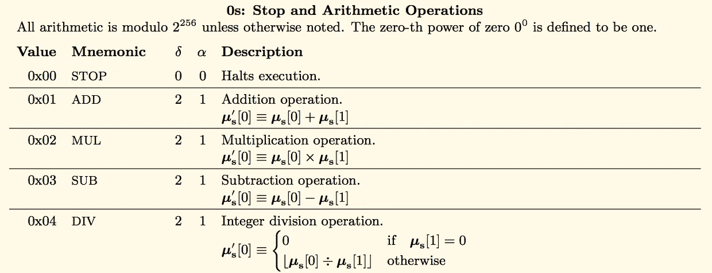
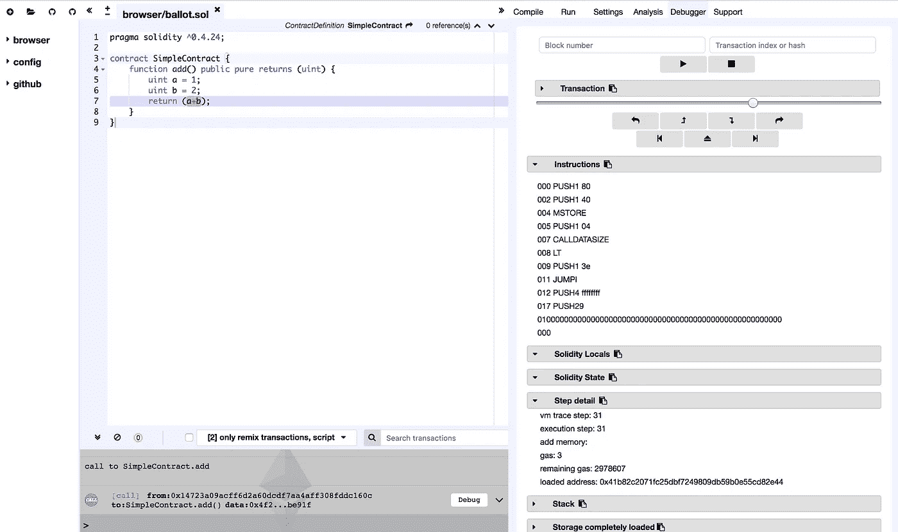
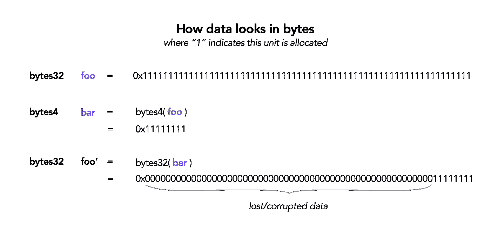
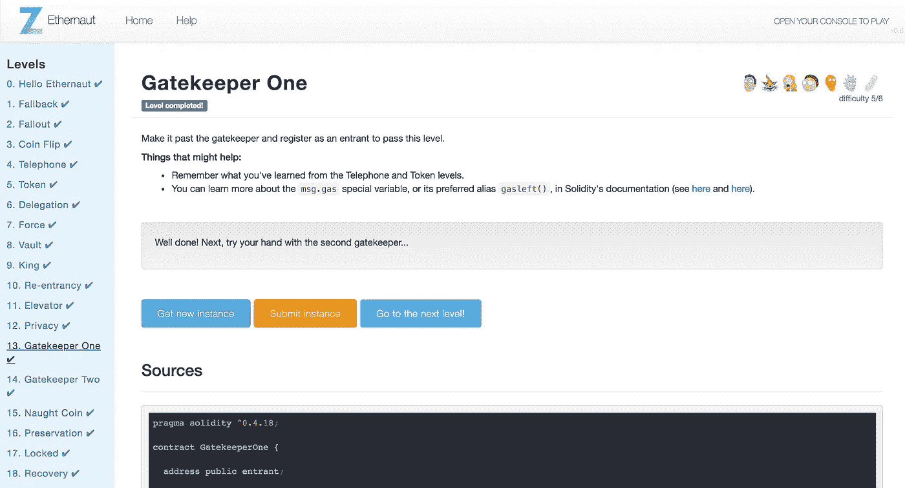
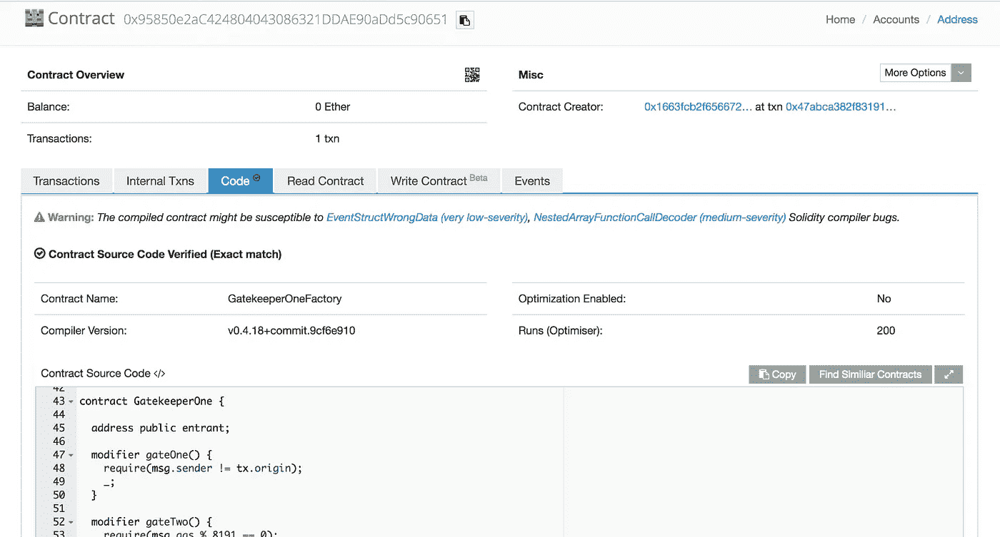

# Ethernaut Lvl 13 关守 1 演练:如何计算智能合同用气量(和字节屏蔽)

> 原文：<https://medium.com/coinmonks/ethernaut-lvl-13-gatekeeper-1-walkthrough-how-to-calculate-smart-contract-gas-consumption-and-eb4b042d3009?source=collection_archive---------1----------------------->

## 这是一个围绕[齐柏林](https://openzeppelin.org/)团队的[智能合约安全拼图](https://ethernaut.zeppelin.solutions/)的[深度系列](/@nicolezhu)。我们学习关键的可靠性概念，以便 100%靠自己解决难题。

在这个级别，你估计气体和屏蔽你的字节通过三个不同的门。门 1 背后的概念是[这里详细解释](/@nicolezhu/ethernaut-lvl-4-walkthrough-how-to-abuse-tx-origin-msg-sender-ef37d6751c8)。

# 如何计算气体

在以太坊，计算是要花钱的。这是由`gas * gas price`计算的，其中`gas`是计算单位，`gas price`随以太网上的负载而缩放。交易发送者需要为她/它调用的每个交易支付由此产生的费用。

> 复杂的交易(如合同创建)比简单的交易(如给某人送乙醚)花费更多。将数据存储到区块链比读取数据花费更多，读取常量变量[比读取存储值花费更少](/coinmonks/ethernaut-lvl-12-privacy-walkthrough-how-ethereum-optimizes-storage-to-save-space-and-be-less-c9b01ec6adb6)。

## 逐步通过**固体组件(2 号门)**

具体来说，`gas`是在组装级别分配的，即每次调用堆栈上发生操作时。例如，这些是算术运算及其当前燃气成本，来自[以太坊黄皮书](https://ethereum.github.io/yellowpaper/paper.pdf)(附录 H):



Where δ: gas to remove from the stack; α: gas to add to the stack

让我们使用 [Remix IDE](http://remix.ethereum.org/) 来逐步完成下面的简单契约:

```
pragma solidity ^0.4.24;
contract SimpleContract {
    function add() public pure returns (uint) {
        uint a = 1; 
        uint b = 2; 
        return (a+b);
    }
}
```

在 Javascript VM 中，部署这个契约，调用`add()`，在 Remix 控制台中点击`debug` enabler，调出调试器 UI:



当您进入每个汇编操作码时，启用**指令**和**步骤细节**下拉菜单。

请注意步骤详情中的气体值与黄皮书中的操作码表是如何对应的。在这种情况下，操作码`ADD`花费 3 gas，正如预测的那样。

## 重要的是要知道

不同的实度**编译器版本**会计算出不同的 gas。并且**优化**是否启用也会影响用气量。尝试在`Settings`选项卡中更改编译器默认值，看看**剩余气体**将如何变化。

*在开始这个级别之前，请确保您已经将 Remix 配置为正确的编译器版本。*

# 数据类型转换

解决这个问题的第二个知识是关于数据转换的。每当您将一个具有较大存储空间的数据点转换成一个较小的数据点时，您将丢失和损坏您的数据。



## 字节屏蔽(门 3)

相反，如果你想故意达到上述结果，你可以执行字节屏蔽。可靠性允许对字节和整型进行如下的位运算:

```
bytes4 a = 0xffffffff;
bytes4 mask = 0xf0f0f0f0;
bytes4 result = a & mask ;   // 0xf0f0f0f0
```

你现在准备解决这一关！

# 详细演练



## 通过 1 号门

1.  类似于以太者[4 级](/@nicolezhu/ethernaut-lvl-4-walkthrough-how-to-abuse-tx-origin-msg-sender-ef37d6751c8)，你可以通过简单地让你的合同作为中间人通过 1 号门。创建一个名为`Hack.sol`的契约来访问您的级别实例:

```
contract Hack {
    GatekeeperOne gate = GatekeeperOne(//YOUR ADDR);
    ...
}
```

## *通过 3 号门*

2.门 3 接收一个 8 字节的密钥，并具有以下要求:

```
require(uint32(_gateKey) == uint16(_gateKey));
require(uint32(_gateKey) != uint64(_gateKey));
require(uint32(_gateKey) == uint16(tx.origin));
```

这意味着整数键在转换成各种字节大小时，需要满足以下属性:

*   `0x11111111 == 0x1111`，仅当值被`0x0000FFFF`屏蔽时才有可能
*   `0x1111111100001111 != 0x00001111`，只有使用掩码`0xFFFFFFFF0000FFFF`保持之前的值时才有可能

3.使用`0xFFFFFFFF0000FFFF`掩码计算密钥:

```
bytes8 key = bytes8(tx.origin) & 0xFFFFFFFF0000FFFF;
```

## 通过 2 号门

最后，为了通过 Gate 2 的`require(msg.gas % 8191 == 0)`，你必须确保你的剩余 gas 是`8191`的整数倍，在调用栈中执行`msg.gas % 8191`的特定时刻。

4.因为您将计算 gas，所以首先要弄清楚您的契约实例的编译器版本和设置。在[以太扫描](https://ropsten.etherscan.io/)中，通过地址查找你的契约实例。

5.注意 GatekeeperOne 是在启用了`no optimization`的情况下用`version v0.4.18`编译的。相应地更新你的混音设置。



6.创建一个调用`enter()`的函数，并分配指定数量的气体。您应该使用较低级的`call`函数调用 enter()，这样可以更好地控制气体的使用。分配任意数量的气体:

```
function hackGate() public {
    gate.call.gas(99999)(bytes4(keccak256('enter(bytes8)')), key);
}
```

7.在 JavaScript VM 中调试 Remix 调试器，直到找到正确的操作码(当 Remix IDE 在`msg.gas % 8191`上高亮显示时)。

8.计算剩余气体的数量，并反推得出正确的原始气体分配。并用你的新值替换呼叫气体分配。

> 注意:在剩余的`gas % 8191`变为 0 之前，您可能需要重复步骤 8 1-2 次。

6.将混音切换回**注入的 Web3** ，你现在应该可以通过 GatekeeperOne 了！

# 关键安全要点

*   不要在你的智能合约中断言气体消耗，因为不同的编译器设置会产生不同的结果。
*   将数据类型转换为不同的大小时，要小心数据损坏。
*   **通过不存储不必要的值来节省气体**。将一个值推入状态`MSTORE`、`MLOAD`总是比用`SSTORE`、`SLOAD`将值存储到区块链更省时
*   **通过使用适当的修饰符来获得免费的函数调用，即`external pure`或`external view`函数调用都是免费的，从而节省汽油**！
*   **通过屏蔽值(更少的操作)而不是类型转换来节省气体**

# 更多级别

[](/coinmonks/ethernaut-lvl-12-privacy-walkthrough-how-ethereum-optimizes-storage-to-save-space-and-be-less-c9b01ec6adb6) [## 以太坊 Lvl 12 隐私演练:以太坊如何优化存储以节省空间和减少…

### 这是一个围绕齐柏林团队的智能合同安全难题的深入系列。我们学习关键的可靠性概念…

medium.com](/coinmonks/ethernaut-lvl-12-privacy-walkthrough-how-ethereum-optimizes-storage-to-save-space-and-be-less-c9b01ec6adb6) [](/coinmonks/ethernaut-lvl-14-gatekeeper-2-walkthrough-how-contracts-initialize-and-how-to-do-bitwise-ddac8ad4f0fd) [## Ethernaut Lvl 14 网守 2 演练:合同如何初始化(以及如何按位…

### 这是一个围绕齐柏林团队的智能合同安全难题的深入系列。我们学习关键的可靠性概念…

medium.com](/coinmonks/ethernaut-lvl-14-gatekeeper-2-walkthrough-how-contracts-initialize-and-how-to-do-bitwise-ddac8ad4f0fd) 

> [直接在您的收件箱中获得最佳软件交易](https://coincodecap.com/?utm_source=coinmonks)

[](https://coincodecap.com/?utm_source=coinmonks)