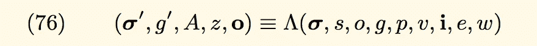
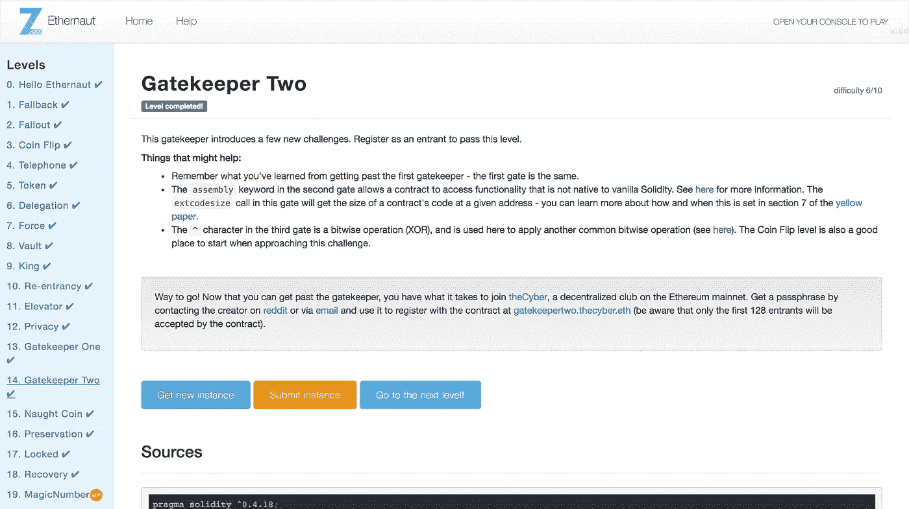

# Ethernaut Lvl 14 Gatekeeper 2 演练:协定如何初始化(以及如何进行位运算)

> 原文：<https://medium.com/coinmonks/ethernaut-lvl-14-gatekeeper-2-walkthrough-how-contracts-initialize-and-how-to-do-bitwise-ddac8ad4f0fd?source=collection_archive---------3----------------------->

## 这是一部[深度系列](/@nicolezhu)围绕[齐柏林](https://openzeppelin.org/)团队的[智能合约安全拼图](https://ethernaut.zeppelin.solutions/)。我们学习关键的可靠性概念，以便 100%靠自己解决难题。

这个关卡需要你熟悉[以太坊黄皮书](https://ethereum.github.io/yellowpaper/paper.pdf)并再通过三道关卡。

# 合同创建的内部工作方式

黄皮书将合同创建正式表示为:



**以下是如何创建合同的简化流程以及这些变量的含义:**

1.  首先，创建合同的交易*被发送到以太网。该交易包含输入变量，特别是:*

*   **发送方**:这是想要创建新合同的*直接*合同或外部钱包的地址。
*   [**原交易人(o)**](/@nicolezhu/ethernaut-lvl-4-walkthrough-how-to-abuse-tx-origin-msg-sender-ef37d6751c8) :创建合同的*原* *外部钱包*(用户)。注意`o != s`如果用户使用一个工厂合同来创建更多的合同！
*   **可用气体(g)** :这是用户指定的、分配给合同创建的总气体。
*   **天然气价格(p)** :这是单位天然气的市场价格，将交易成本转换为乙醚。
*   **禀赋(v)** :这是`value`(在魏那里)被转移来播种这个新合同。默认值为零。
*   **初始化 EVM 代码(i)** :这是你的新契约的`constructor`函数和初始化变量中的所有东西，以字节码的格式。

2.第二，仅基于交易的输入数据，新合同的指定地址被(预先)计算。在这个阶段，输入状态值被修改，但是新契约的状态仍然为空。

3.第三，初始化代码在 EVM 启动，并创建一个实际的合同。

4.在这个过程中，状态变量被改变，数据被存储，气体被消耗和扣除。

5.一旦契约完成初始化，它就存储它自己的与其(预先)计算的地址相关联的代码。

6.最后，剩余的 gas 和一个成功/失败消息被异步返回给发送方`s`。

> **提示:**请注意，在第 5 步之前，新合同的地址中不存在任何代码！

在黄皮书的脚注中:

> 在初始化代码执行期间，地址上的 EXTCODESIZE 应返回零，这是帐户代码的长度，而 CODESIZE 应返回初始化代码的长度(如 H.2 中所定义的

**简而言之**，如果您试图在合约构建之前或构建期间检查智能合约的代码大小，您将得到一个空值。这是因为智能契约还没有形成，因此不能自我认识到它自己的代码大小。

# 位运算

Solidity 支持以下逻辑门操作:

*   `&` : and(x，y)**x 和 y 的按位**；其中`1010 & 1111 == 1010`
*   `|` : or(x，y)**x 和 y 的按位**or；其中`1010 | 1111 == 1111`
*   `^` : xor(x，y)**x 和 y 的按位**xor；其中`1010 ^ 1111 == 0101`
*   `~`:not(x)**x 的按位**；其中`~1010 == 0101`

## 通知；注意

*   如果`A xor B = C`，那么`A xor C = B`
*   在 Solidity 中，取幂由`**`处理，而不是`^`

你现在有所有的知识来解决水平！

# 详细演练



1.  通过在 [Remix IDE](http://remix.ethereum.org/) 中创建一个智能合同中间人来通过第一关:

```
contract Hack {
}
```

接下来，让我们在 2 之前通过门 3，因为`key`值是在门 2 调用函数的先决条件。要解决 3 号门，请注意:

```
uint64(keccak256(msg.sender)) ^ uint64(_gateKey) == uint64(0) — 1)
```

2.回想一下，如果如果`A xor B = C`，那么`A xor C = B`。这意味着密钥只是以下内容的`bytes8`类型转换:

```
uint64(_gateKey) = uint64(keccak256(msg.sender)) ^ uint64(0) — 1)
```

最后，注意 Gate 3 使用一个汇编函数来检查调用契约的**大小是否为零，即包含 0 代码**。但是，为了调用 GatekeeperTwo，您的调用契约首先必须有代码。

```
assembly { x := extcodesize(caller) }
```

*那么这怎么可能呢？*

**回想一下，在契约的构造过程中，它从其(预先)计算的地址部署代码，但是该代码还没有与契约本身相关联地存储！**

这意味着如果`extcodesize`是发送方契约的原始`constructor`函数中的子例程，那么`extcodesize(sender)`应该返回 0。

3.将`enter()`函数调用放入您的`Hack.sol`的合同构造中:

恭喜你通过了两道门！

# 关键安全要点

*   除了[契约黑洞](/coinmonks/ethernaut-lvl-7-walkthrough-how-to-selfdestruct-and-create-an-ether-blackhole-eb5bb72d2c57)之外，还可以通过停止契约初始化来创建僵尸契约。由此产生的合同有一个地址，但永久没有代码，并且永远无法返回您最初的**捐赠**。

# 更多级别

[](/coinmonks/ethernaut-lvl-13-gatekeeper-1-walkthrough-how-to-calculate-smart-contract-gas-consumption-and-eb4b042d3009) [## Ethernaut Lvl 13 看门人 1 演练:如何计算智能合同用气量(和…

### 这是一个围绕齐柏林团队的智能合同安全难题的深入系列。我们学习关键的可靠性概念…

medium.com](/coinmonks/ethernaut-lvl-13-gatekeeper-1-walkthrough-how-to-calculate-smart-contract-gas-consumption-and-eb4b042d3009) [](/coinmonks/ethernaut-lvl-15-naught-coin-walkthrough-how-to-abuse-erc20-tokens-and-bad-icos-6668b856a176) [## 以太币 15 级零硬币演练:如何滥用 ERC20 代币和坏 ico

### 这是一个围绕齐柏林团队的智能合同安全难题的深入系列。我们学习关键的可靠性概念…

medium.com](/coinmonks/ethernaut-lvl-15-naught-coin-walkthrough-how-to-abuse-erc20-tokens-and-bad-icos-6668b856a176) 

> [直接在您的收件箱中获得最佳软件交易](https://coincodecap.com/?utm_source=coinmonks)

[](https://coincodecap.com/?utm_source=coinmonks)