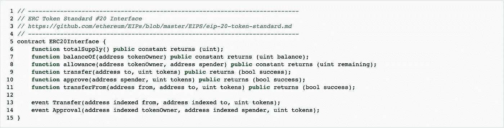
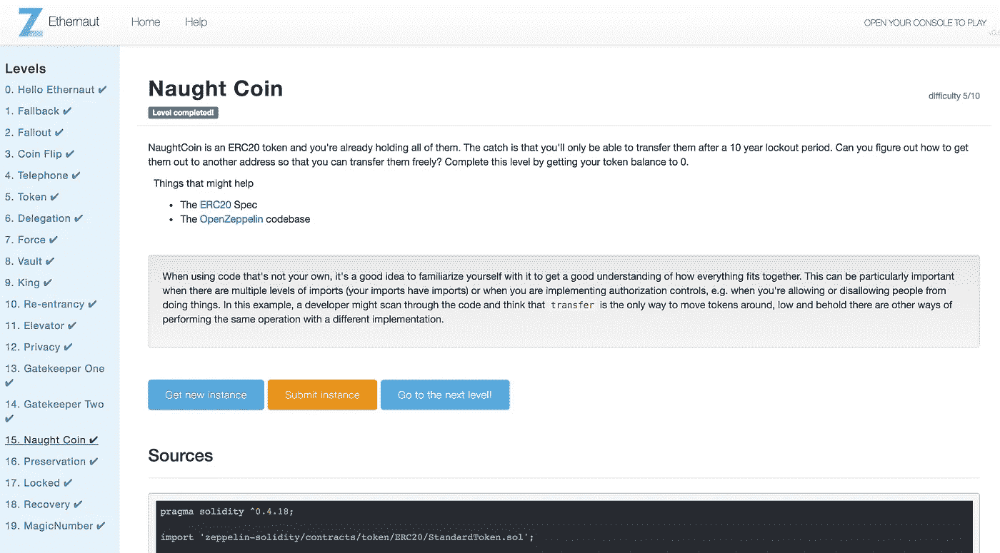

# 以太币 15 级零硬币演练:如何滥用 ERC20 代币和坏 ico

> 原文：<https://medium.com/coinmonks/ethernaut-lvl-15-naught-coin-walkthrough-how-to-abuse-erc20-tokens-and-bad-icos-6668b856a176?source=collection_archive---------1----------------------->

## 这是一个围绕[齐柏林](https://openzeppelin.org/)团队的[智能合约安全拼图](https://ethernaut.zeppelin.solutions/)的[深度系列](/@nicolezhu)。我们学习关键的可靠性概念，以便 100%靠自己解决难题。

这个级别要求你滥用一个坏的 ERC20 实现并控制 NaughtCoin 令牌。

# 什么是 ERC20

ERC(*以太坊请求评论*)是允许您在区块链上创建令牌的协议。具体来说，ERC20 是一个[契约接口](/coinmonks/ethernaut-lvl-11-elevator-walkthrough-how-to-abuse-solidity-interfaces-and-function-state-41005470121d)，它定义了围绕令牌的标准所有权和交易规则。

From: zeppelin-solidity/contracts/token/ERC20/StandardToken.sol

从上下文来看，ERC20 在 2015 年很酷，因为它就像是所有开发人员都同意的 API。第一次，任何人都可以创造一个新的资产类别。开发人员想出了 Dogecoin、Kucoin、Dentacoin 等代币，并且可以相信他们的代币被各地的钱包、交易所和合同所接受。

Assortment of ERC20 coins that ICO’ed

ERC20 一手促成了 2017 年的 ICO 热潮……以及随之而来的诸多 ICO 安全问题。

## 伴随 ERC20 的安全问题

*   **Batchoverflow** :因为 ERC20 没有执行 SafeMath，所以有可能发生整数下溢。正如我们在第 5 级中学到的，这意味着将你的代币消耗到 0 以下会给你`2^256 - 1`个代币！
*   **转移“bug”**:ERC 20 的制作者打算让开发者使用`approve()` & `transferfrom()`函数组合来四处移动令牌。但这在文档中从未明确说明，他们也没有警告不要使用`transfer()`(这也是可用的)。许多开发者使用了`transfer()`,它永远锁定了许多令牌。

> 正如我们[在第 9 层](/coinmonks/ethernaut-lvl-9-king-walkthrough-how-bad-contracts-can-abuse-withdrawals-db12754f359b)学到的，你不能保证第三份合同会收到你的转会。如果您将代币转移到非接收方，您将永远失去代币，因为代币合同已经减少了您自己帐户的余额。

*   【ERC20 继承不良:部分令牌合同没有正确实现 ERC 接口，导致很多问题。例如，假人的 GNT 甚至没有实现关键的`approve()`功能，留下`transfer()`作为唯一有问题的选项。

> ***提示*** 同样，这个等级没有实现一些关键功能——使得诺顿币容易受到攻击。

# 详细演练

在[第 11 级](/coinmonks/ethernaut-lvl-11-elevator-walkthrough-how-to-abuse-solidity-interfaces-and-function-state-41005470121d)中，我们学会了不要盲目信任从接口继承的其他契约。简而言之，您无法确定这些合同是否 I)按照预期正确地实现了一个功能，以及 ii)遵守了像 pure 和 view 这样的函数修饰符承诺。

在这个层面上，我们了解到**执行不力的非对抗性合同也可能被滥用。**

1.  [在 Remix](http://remix.ethereum.org/) 中，访问您的合同实例。

> 注意:Remix 找不到文件路径，请在 [StandardToken.sol 文件中](https://github.com/OpenZeppelin/openzeppelin-solidity/blob/4dcdd293e8b351851d5b5e555c33c062178ceb15/contracts/token/ERC20/StandardToken.sol)查找工作实际路径，或将文件粘贴到 Remix 中。

## **请注意以下事项:**

*   您可以使用`transfer()`和`transferFrom()`来移动代币
*   `lockTokens()`修改器仅应用于`transfer()`功能
*   `Approve()`和`transferFrom()`功能也可在 Remix IDE 中使用

这意味着您可以使用建议的`approve+transferfrom`组合移动令牌，绕过锁定令牌。

2.检查您的账户余额，然后用您自己的地址和准确的账户余额调用`approve()`。

3.使用以下参数调用`transferFrom()`:I)您的玩家地址，ii)任意的外部钱包，以及 iii)账户余额。

4.将实例提交回要通过的级别。

# 关键安全要点

*   **当与合同接口或实现 ERC 接口时，实现所有可用的功能。**
*   如果您计划创建自己的令牌，请考虑更新的方案，例如:ERC223、ERC721(由隐孢子虫使用)、ERC827 (ERC 20 杀手)。
*   如果可以的话，检查 [EIP 165 符合性](https://github.com/ethereum/EIPs/pull/881)，它确认外部契约正在实现哪个接口。相反，如果你是发行代币的人，记得要符合 EIP-165。
*   记得使用 SafeMath 来防止令牌下溢(正如我们在 lvl 5 中学到的

# 更多级别

 [## Ethernaut Lvl 14 网守 2 演练:合同如何初始化(以及如何按位…

### 这是一个围绕齐柏林团队的智能合同安全难题的深入系列。我们学习关键的可靠性概念…

medium.com](/coinmonks/ethernaut-lvl-14-gatekeeper-2-walkthrough-how-contracts-initialize-and-how-to-do-bitwise-ddac8ad4f0fd)  [## Ethernaut Lvl 16 保留演练:如何用 delegatecall 注入恶意契约

### 这是一个围绕齐柏林团队的智能合同安全难题的深入系列。我会给你直接的资源…

medium.com](/coinmonks/ethernaut-lvl-16-preservation-walkthrough-how-to-inject-malicious-contracts-with-delegatecall-81e071f98a12) 

> [在您的收件箱中直接获得最佳软件交易](https://coincodecap.com/?utm_source=coinmonks)

