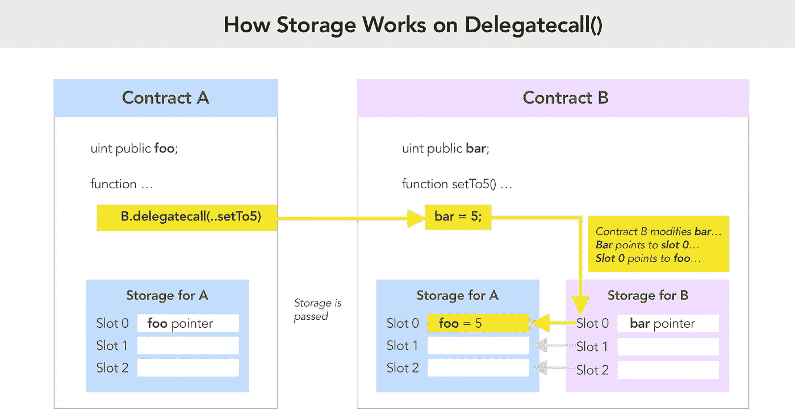
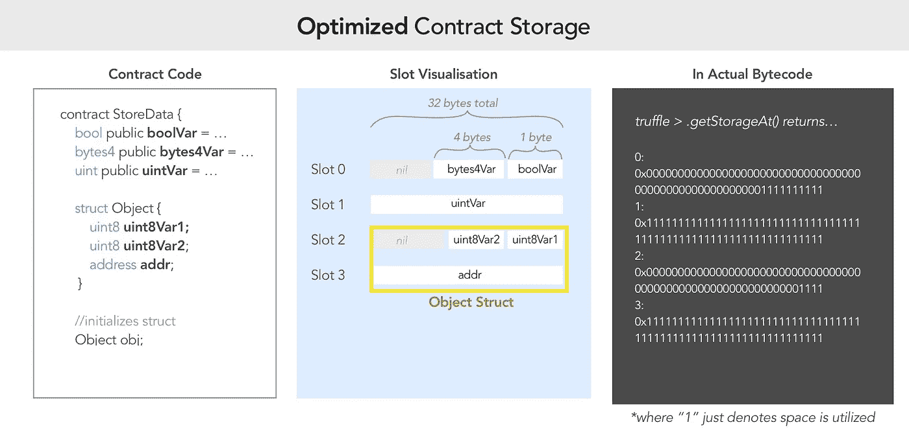
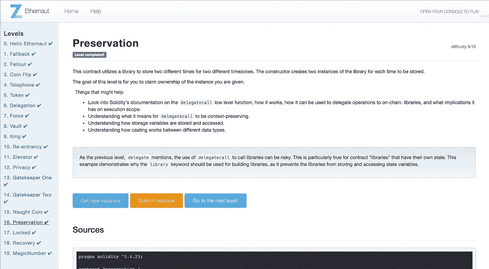

# Ethernaut Lvl 16 保留演练:如何用 delegatecall 注入恶意契约

> 原文：<https://medium.com/coinmonks/ethernaut-lvl-16-preservation-walkthrough-how-to-inject-malicious-contracts-with-delegatecall-81e071f98a12?source=collection_archive---------6----------------------->

## 这是一个围绕 [Zeppelin](https://openzeppelin.org/) 团队的[智能合约安全拼图](https://ethernaut.zeppelin.solutions/)的[深度系列](/@nicolezhu)。我会给你直接的资源和你需要的关键概念来 100%自己解决这些难题。

这个级别要求你结合来自级别 [6](/coinmonks/ethernaut-lvl-6-walkthrough-how-to-abuse-the-delicate-delegatecall-466b26c429e4) 和 [12](/coinmonks/ethernaut-lvl-12-privacy-walkthrough-how-ethereum-optimizes-storage-to-save-space-and-be-less-c9b01ec6adb6) 的知识来声明合同的所有权。

# `Refresher on delegatecall`



## [从第 6 级召回](/coinmonks/ethernaut-lvl-6-walkthrough-how-to-abuse-the-delicate-delegatecall-466b26c429e4):

*   `Delegate` call 是一种特殊的低级函数调用，旨在从另一个(通常是库)契约中调用函数。
*   如果契约 A 对契约 B 做了一个`delegatecall`，它允许契约 B 自由地改变它的存储 A，给定契约 B 的*相对*存储引用指针。

> **提示**:如果契约 A 调用契约 B，并且你可以控制契约 B，那么你就可以很容易地突变契约 A 的状态。

# 合同存储复习



## [从第 12 级召回:](/coinmonks/ethernaut-lvl-12-privacy-walkthrough-how-ethereum-optimizes-storage-to-save-space-and-be-less-c9b01ec6adb6)

*   以太坊分配 32 字节大小的存储槽*来存储状态。插槽从索引`0`开始，依次向上到 2 个⁵⁶插槽。*
*   从位置`0,`开始，然后是`1`，直到`2²⁵⁶-1`，基本数据类型在存储器中连续排列。
*   如果顺序声明数据的 ***组合大小*** 小于 32 字节 ，则顺序数据点被打包到单个存储槽中以优化空间和气体。

> **提示**:如果您可以匹配合同 A 和合同 B 之间的存储数据位置，您就可以精确地操作合同 A 中所需的变量。



# 详细演练

首先，请注意`LibraryContract`修改了插槽 0 的状态。此外，它允许外部方用任何其他 32 字节变量替换`storedTime`。

> **提示**:如果我们用契约地址替换槽 0 会怎么样？

```
uint storedTime; 
function setTime(uint _time) public { 
    storedTime = _time;
}
```

其次，注意你可以通过`setFirstTime`中的 delegatecall 从 **Preservation.sol** 中调用`setTime`。

这意味着你**可以修改**的 Preservation.sol 中的 slot 0，即改变`timeZone1Library`的地址！

> **提示:**如果您可以重新指向`timeZone1Libary`一个修改 Preservation.sol 中其他状态变量的恶意契约会怎么样？

## 第一部分—创建恶意合同

在第一部分中，让我们创建一个`timeZone1Libary`将指向的恶意契约。

1.  注意 **Preservation.sol** 在**槽 2** 存储`owner`地址。让我们创建一个具有*相同*存储布局的恶意合同:

```
contract BadLibraryContract {
    address public timeZone1Library; // SLOT 0
    address public timeZone2Library; // SLOT 1
    address public owner;            // SLOT 2
    uint storedTime;                 // SLOT 3
...
```

2.在 BadContract 中创建一个`setTime`函数，用你的钱包地址更新 slot 2。

```
function setTime(uint _time) public {
    owner = msg.sender;
}
```

*注意:使用与 LibraryContract 中相同的函数名很重要，因为 Preservation.sol 通过名称调用函数:*

```
bytes4(keccak256(“setTime(uint256)”));
```

3.在 [Remix](http://remix.ethereum.org/) 中部署 BadLibraryContract 到 Ropsten，并保存其实例地址。然后，计算`uint(address)`以导出输入变量:

```
setFirstTime(uint _timeStamp)
```

## 第二部分—将时区 1 库更新为恶意合同

1.  在混音中，访问你的关卡实例。
2.  用转换后的`uint(address)`调用`setFirstTime`。
3.  仔细检查`timeZone1Library`现在是你的恶意合同地址。

## 第三部分—获得所有权

1.  第二次，用任意输入的 uint 变量调用`setFirstTime`。这一次，你实际上是在调用`owner = msg.sender`。
2.  仔细检查保存处的主人。sol 现在是你的钱包地址。

# 关键安全要点

*   理想情况下，库不应该存储状态。
*   创建库时，使用`library`，而不是`contract`，以确保当调用者使用`delegatecall`时，库不会修改调用者存储数据。
*   使用更高级的函数调用来继承库，特别是当你 I)不需要改变契约存储和 ii)不关心气体控制的时候。

# 更多级别

[](/coinmonks/ethernaut-lvl-15-naught-coin-walkthrough-how-to-abuse-erc20-tokens-and-bad-icos-6668b856a176) [## 以太币 15 级零硬币演练:如何滥用 ERC20 代币和坏 ico

### 这是一个围绕齐柏林团队的智能合同安全难题的深入系列。我们学习关键的可靠性概念…

medium.com](/coinmonks/ethernaut-lvl-15-naught-coin-walkthrough-how-to-abuse-erc20-tokens-and-bad-icos-6668b856a176) [](/coinmonks/ethernaut-lvl-17-locked-walkthrough-how-to-properly-use-structs-in-solidity-f9900c8843e2) [## Ethernaut Lvl 17 锁定演练:如何在 Solidity 中正确使用结构

### 这是一个围绕齐柏林团队的智能合同安全难题的深入系列。我会给你直接的资源…

medium.com](/coinmonks/ethernaut-lvl-17-locked-walkthrough-how-to-properly-use-structs-in-solidity-f9900c8843e2) 

> [在您的收件箱中直接获得最佳软件交易](https://coincodecap.com/?utm_source=coinmonks)

[](https://coincodecap.com/?utm_source=coinmonks)