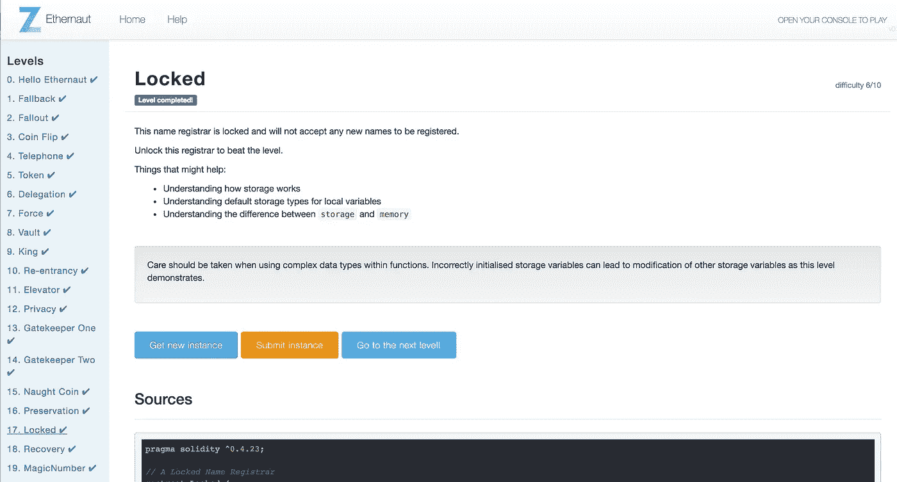

# Ethernaut Lvl 17 锁定演练:如何正确使用(和滥用)Solidity 中的结构

> 原文：<https://medium.com/coinmonks/ethernaut-lvl-17-locked-walkthrough-how-to-properly-use-structs-in-solidity-f9900c8843e2?source=collection_archive---------3----------------------->

## 这是一部[深度系列](/@nicolezhu)围绕[齐柏林](https://openzeppelin.org/)团队的[智能合约安全拼图](https://ethernaut.zeppelin.solutions/)。我会给你直接的资源和你需要的关键概念来 100%自己解决这些难题。

这个级别要求您通过滥用一个启动不良的结构来解锁注册器。

# 使用结构时的最佳实践

像在面向对象编程中一样，您可以通过`structs`创建复合数据类型。

结构可以包含函数和其他复杂的数据类型，如映射和数组。这些数组和映射甚至可以包含更多的结构。但是，结构不能直接包含其他结构(除非它们是映射或数组中的值)。

让我们逐步了解在使用结构时应该做什么和不应该做什么:

## 如何初始化结构

下面是[*实体文档*](https://solidity.readthedocs.io/en/v0.4.24/types.html) 中关于如何声明结构的一个例子:

```
**struct** Funder {
    address addr;
    uint amount;
}

**struct** StructOfStructs {
    ...
    mapping (uint => Funder) funders;
}
```

初始化结构有多种语法。

1.  您可以直接将值传递给 struct 对象:

```
... = Funder(msg.sender, msg.value);
```

2.或者，您可以使用对象表示法将值传递到 struct 对象中，以获得更好的可读性:

```
... = Funder({addr: msg.sender, amount: msg.value})
```

## 常见使用模式(内存与存储)

在契约中可以有单个全局声明的 struct 对象，但这违背了创建新数据类型的目的。

更常见的是，你将使用一个数组或一个映射来保存一个结构集合。例如，让我们创建一个`array of Funders`和一个`mapping of Funders`。

## **一系列资助者:**

```
Funders[] public funders;function ... {
    Funder **memory** f;
    f.address = ...;
    f.amount = ...;
    funders.push(f);
}
```

重要的是要知道:结构声明默认为存储。在创建或复制结构时，你应该总是使用一个`memory`修饰符。不建议在函数内部使用结构进行任何临时计算。

## **出资人映射:**

```
mapping (uint => Funder) funders; function ... {
    funders[index] = Funder(...);
}
```

> 重要的是要知道:当你直接将一个内存结构保存到一个状态变量中时，这个内存结构会被自动强制存储。

下面是创建新结构时不要做的事情的示例。

## 坏例子 1

您不应该在函数中声明新的存储结构，因为它会覆盖其他全局存储的变量。要通过这个以太等级，记住这一点很重要。

```
// Do NOT do this
function badFunction{
    Funder f;         //this defaults to storage
    f.address = ...;
    f.amount = ...;
    funders.push(f);  //this will fail
}
```

## **坏例子 2**

您不能隐式地将内存转换为存储。下面将引发一个编译错误:

```
// Do NOT do this
function badFunction{
    Funder storage f = Funder(...);
}// Do NOT do this
function badFunction(Funder _funder){
    Funder storage f = _funder;
}
```

请注意，函数输入参数也是内存，而不是存储引用指针。



# 详细演练

这个级别要求你将 Locked.sol 中的`unlocked`全局变量从`false`改为`true`。

请注意，契约将`unlocked`存储在其*的第一个*存储槽中。下一个项目是一个`bytes32 name`，所以你知道`unlocked`占据了整个第一个槽。false 的字节码是`0x00`，所以`unlocked`在契约的存储槽中看起来像这样:

```
0x0000000000000000000000000000000000000000000000000000000000000000
```

注意，当在公共`register()`函数中实现一个结构时，这个级别犯了一个大忌:

```
function register(_name...){
    NameRecord newRecord;     //storage declaration
    newRecord.name = _name;
    newRecord.mappedAddress = _mappedAddress;
...
```

`newRecord`默认存储！并且保存在 newRecord 中的任何数据都将覆盖存储器中现有的槽 1 和 2。

方便起见，`unlocked`当前存储在槽 1 中。让我们通过公共`register`函数传递一个伪装成`_name`变量的`true` bool 来覆盖`unlocked`。

1.  将`true`转换为`bytes32`变量:

```
0x0000000000000000000000000000000000000000000000000000000000000001
```

2.在 Remix 中，用你的`bytes32 true`和一个任意的契约地址调用 register。记得根据混音要求在你的值周围加上引号。

3.忽略 Metamask 警告信息，分配额外的气体。

4.再次检查您的`0x01`值是否已覆盖`unlocked`为真。在控制台中，检查以下情况是否属实:

```
await contract.unlocked();
```

# 关键安全要点

*   **结构声明默认为存储。在函数内部创建或复制结构时，你应该总是使用一个修饰符。不要在函数内计算中使用结构。**
*   您不应该在函数中声明新的存储结构，因为它会覆盖其他全局存储的变量。

## 了解有关结构的更多信息

查看 [Solidity Koans](https://github.com/nczhu/soliditykoans) (受 Ruby Koans 启发)并通过测试来练习使用 Solidity 中的结构！

# 更多级别

[](/coinmonks/ethernaut-lvl-16-preservation-walkthrough-how-to-inject-malicious-contracts-with-delegatecall-81e071f98a12) [## Ethernaut Lvl 16 保留演练:如何用 delegatecall 注入恶意契约

### 这是一个围绕齐柏林团队的智能合同安全难题的深入系列。我会给你直接的资源…

medium.com](/coinmonks/ethernaut-lvl-16-preservation-walkthrough-how-to-inject-malicious-contracts-with-delegatecall-81e071f98a12) [](/coinmonks/ethernaut-lvl-18-recovery-walkthrough-how-to-retrieve-lost-contract-addresses-in-2-ways-aba54ab167d3) [## Ethernaut Lvl 18 恢复演练:如何检索丢失的合同地址(两种方式)

### Solidity 开发人员丢失新创建的合同地址是一个常见的错误。这变得令人沮丧…

medium.com](/coinmonks/ethernaut-lvl-18-recovery-walkthrough-how-to-retrieve-lost-contract-addresses-in-2-ways-aba54ab167d3) 

> [在您的收件箱中直接获得最佳软件交易](https://coincodecap.com/?utm_source=coinmonks)

[](https://coincodecap.com/?utm_source=coinmonks)