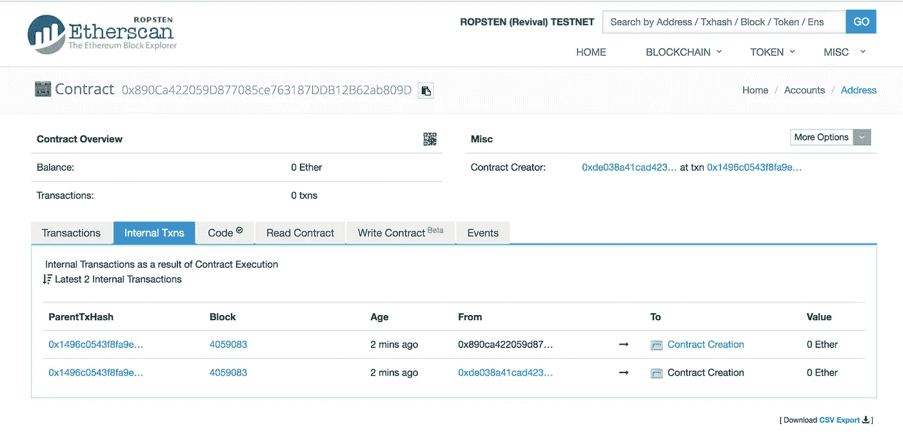
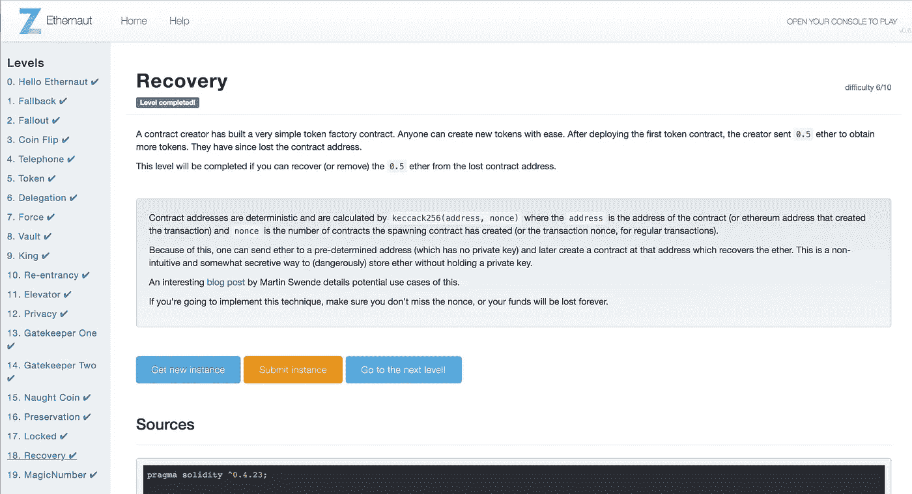

# Ethernaut Lvl 18 恢复演练:如何检索丢失的合同地址(两种方式)

> 原文：<https://medium.com/coinmonks/ethernaut-lvl-18-recovery-walkthrough-how-to-retrieve-lost-contract-addresses-in-2-ways-aba54ab167d3?source=collection_archive---------7----------------------->

## 这是一个围绕 [Zeppelin](https://openzeppelin.org/) 团队的[智能合约安全拼图](https://ethernaut.zeppelin.solutions/)的[深度系列](/@nicolezhu)。我会给你直接的资源和你需要的关键概念来 100%自己解决这些难题。

这个级别要求您检索丢失的合同地址，以重新获得剩余的 0.5 个醚。

Solidity 开发人员丢失新创建的合同地址是一个常见的错误。这变得令人沮丧，尤其是如果你还丢失了交易收据和其他追溯你的步骤的手段。

这里有两种查找合同地址的方法，分别通过原始发送者信息和以太网扫描。

# 方法 1:计算合同地址

合同地址是确定性计算的。摘自黄皮书:

> 新账户的地址被定义为仅包含发送者和账户随机数的结构的 RLP 编码的 Keccak 散列的最右边的 160 位。因此，我们为新账户`a ≡ B96..255 KEC RLP (s, σ[s]n − 1)` 定义了结果地址

表示该函数的一种更简单的方法是:

```
address = rightmost_20_bytes(keccak(RLP(sender address, nonce)))
```

其中:

*   `sender address`:是创建这个新合同的合同或钱包地址
*   `nonce`:是从`sender address`发出的交易笔数，或者，**如果发送方是工厂合同，** `**nonce**` **是该账户创建的合同笔数。**
*   `RLP`:数据结构上的编码器，默认序列化以太坊中的对象。
*   `keccak`:计算任何输入的 Ethereum-SHA-3 (Keccak-256)散列的加密原语。

## 重现这种混音

让我们计算一个由位于`0x890ca422059d877085ce763187ddb12b62ab809d`的现有合同创建的*新*合同的地址。让我们假设这是从此地址创建的第一个契约，因此 nonce(事务计数)应该是`1`。

> 有趣的事实:nonce 0 总是智能合约自己的创建事件

1.  从[文档](https://github.com/ethereum/wiki/wiki/RLP)中，20 字节地址的 RLP 编码为:`0xd6, 0x94`。而对于所有小于`0x7f`的整数，它的编码只是它自己的字节值。所以 1 的 RLP 就是`0x01`。
2.  在重新混合中，计算以下内容:

```
address public a = address(keccak256(0xd6, 0x94, YOUR_ADDR, 0x01));
```

3.这产生了`0x048559A2982f50c268B80E14b1A98A1524295016`，这可能是现有契约将部署的新智能契约的第一个地址。

4.要获得后续的约定地址，只需增加 nonce。

# **方法二:使用以太扫描**

从创建者那里获得新契约地址的一种更快的方法是使用 Etherscan。



1.  在 Etherscan 中，通过地址查找您当前的合同。
2.  在`Internal Txns`选项卡中，找到最新的合同创建，并点击链接进入新合同。
3.  新的合同地址现在应该显示在左上角。

*往下读破解这一关！*



# 详细演练

1.  通过`instance`获取控制台中合同创建者 **Recovery.sol** 的地址
2.  按照上述方法 1 或 2 获取新的合同地址。作为 SimpleToken.sol 的`nonce used should be 1`是它的第一个合同创造。
3.  在 Remix Injected Web3 中，通过地址检索 SimpleToken.sol。
4.  调用`selfdestruct(YOUR_WALLET_ADDR)`提取剩余的 0.5 乙醚。正如我们在 [lvl 7](/coinmonks/ethernaut-lvl-7-walkthrough-how-to-selfdestruct-and-create-an-ether-blackhole-eb5bb72d2c57) 中了解到的，自毁将在销毁该合同之前转移所有剩余资金。

# 关键安全要点

*   **洗钱的可能性** : [这篇博文](http://swende.se/blog/Ethereum_quirks_and_vulns.html)详细阐述了利用未来合同地址隐藏资金的可能性。本质上，你可以发送醚到一个确定的地址，但那里的合同目前不存在。这些资金实际上永远失去了，直到你决定在该地址创建一个合同，并重新获得所有权。
*   你在以太坊上不是匿名的:任何人都可以跟踪你当前的交易记录，也可以监控你未来的合同地址。这种交易模式可用于获得您的真实身份。

# 更多级别

[](/coinmonks/ethernaut-lvl-17-locked-walkthrough-how-to-properly-use-structs-in-solidity-f9900c8843e2) [## Ethernaut Lvl 17 锁定演练:如何在 Solidity 中正确使用结构

### 这是一个围绕齐柏林团队的智能合同安全难题的深入系列。我会给你直接的资源…

medium.com](/coinmonks/ethernaut-lvl-17-locked-walkthrough-how-to-properly-use-structs-in-solidity-f9900c8843e2) [](/coinmonks/ethernaut-lvl-19-magicnumber-walkthrough-how-to-deploy-contracts-using-raw-assembly-opcodes-c50edb0f71a2) [## Ethernaut Lvl 19 MagicNumber 演练:如何使用原始程序集操作码部署协定

### 这是一个围绕齐柏林团队的智能合同安全难题的深入系列。我们学习关键的可靠性概念…

medium.com](/coinmonks/ethernaut-lvl-19-magicnumber-walkthrough-how-to-deploy-contracts-using-raw-assembly-opcodes-c50edb0f71a2) 

> [在您的收件箱中直接获得最佳软件交易](https://coincodecap.com/?utm_source=coinmonks)

[](https://coincodecap.com/?utm_source=coinmonks)